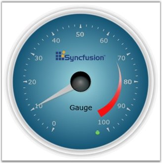
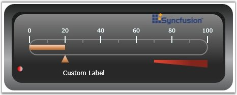

::: {style="DISPLAY: none"}
{#d2h_url_template}{#d2h_package_url style="WIDTH: 0px; DISPLAY: none; HEIGHT: 0px"}
:::

::::: {#nsbanner .d2h_main_nsbanner style="BORDER-BOTTOM: #999999 1px solid; POSITION: relative; PADDING-BOTTOM: 0px; BACKGROUND-COLOR: transparent; PADDING-LEFT: 0px; PADDING-RIGHT: 0px; DISPLAY: none; BORDER-TOP: #999999 1px solid; PADDING-TOP: 0px; LEFT: 0px"}
:::: {#TitleRow .d2h_main_titlerow style="PADDING-BOTTOM: 4px; BACKGROUND-COLOR: transparent; PADDING-LEFT: 22px; WIDTH: 100%; PADDING-RIGHT: 10px; DISPLAY: none; PADDING-TOP: 4px"}
::: {#ienav .d2h_main_ienav style="DISPLAY: none"}
{#D2HPrevious .D2HPreviousEnabled}  {#D2HNext .D2HNextEnabled}
:::
::::
:::::

::::: {#nstext .d2h_main_nstext style="PADDING-BOTTOM: 10px; BACKGROUND-COLOR: transparent; PADDING-LEFT: 22px; PADDING-RIGHT: 10px; HEIGHT: 100%; OVERFLOW: auto; PADDING-TOP: 5px" hasuserbackground="true" valign="bottom"}
::: {#d2h_breadcrumbs .d2h_breadcrumbs}
[Essential Studio User Guide Documentation](ms-xhelp:///?Id=12457748-09e3-4d74-a240-8e049cedf030){.d2h_breadcrumbsNormal}[ \> ]{.d2h_breadcrumbsLinkSeparator}[User Interface Edition](ms-xhelp:///?Id=c29296b7-531c-413b-a0ec-488ca1f7f669){.d2h_breadcrumbsNormal}[ \> ]{.d2h_breadcrumbsLinkSeparator}[Essential Silverlight](ms-xhelp:///?Id=66221bd1-ba2e-43c2-94a7-618f50e01d24){.d2h_breadcrumbsNormal}[ \> ]{.d2h_breadcrumbsLinkSeparator}[Essential Gauge]{.d2h_breadcrumbsContentsOnly}[ \> ]{.d2h_breadcrumbsLinkSeparator}[Overview](ms-xhelp:///?Id=e2ef73b1-7036-47e6-8463-65cb77cd8c66){.d2h_breadcrumbsNormal}
:::

## Introduction to Essential Gauge Silverlight {#introduction-to-essential-gauge-silverlight style="tab-stops: 0pt"}

Essential Gauge Silverlight is data visualization tool that can be used when the the user want to display several data points or data ranges in a concise, precise and compact area. The data shown by the control can be quickly understood by the user. Syncfusion Silverlight library enables the users to configure the Silverlight Gauge using XAML and also through C# codes. The Gauge control comes with sophisticated customization support.

 

Essential Gauge Silverlight is intended to those developers who want to use gauges in their Silverlight applications. Essential Gauge is a very useful control to indicate the current value from a range of values. We have two forms of Essential Gauge.

[]{style="FONT-FAMILY: 'Trebuchet MS','sans-serif'; COLOR: #15428b; FONT-SIZE: 9pt"} 

[·      ]{style="FONT-FAMILY: Symbol"}**Circular gauge** can be used for representing a range of values in Circular form. It can be used to create sophisticated dashboards, clocks, industrial equipments, medical equipments and many more.

 

[·      ]{style="FONT-FAMILY: Symbol"}**Linear Gauge** can be used for displaying a range of values graphically along a linear scale. It can be very well described as the linear form of Circular Gauge.

 

[·      ]{style="FONT-FAMILY: Symbol"}**Digital Gauge**-Essential Gauge Silverlight is used to display any value in the segment display manner. The data given in the control is clearly depicted as it will be similar to alpha numeric representation.

[]{style="FONT-FAMILY: 'Trebuchet MS','sans-serif'; COLOR: #15428b; FONT-SIZE: 9pt"} 

[]{style="FONT-FAMILY: 'Trebuchet MS','sans-serif'; COLOR: #15428b; FONT-SIZE: 9pt"} 

The following image shows an example of a circular gauge.

[]{style="FONT-FAMILY: 'Trebuchet MS','sans-serif'; COLOR: #15428b; FONT-SIZE: 9pt"} 

Figure 1: Circular Gauge as Speedometer

***[]{style="FONT-FAMILY: 'Trebuchet MS','sans-serif'; COLOR: #15428b; FONT-SIZE: 9pt"}*** 

The following image shows an example of a linear gauge.

[]{style="FONT-FAMILY: 'Trebuchet MS','sans-serif'; COLOR: #15428b; FONT-SIZE: 9pt"} 

Figure 2: Linear Gauge

***[]{style="FONT-FAMILY: 'Trebuchet MS','sans-serif'; COLOR: #15428b; FONT-SIZE: 9pt"}*** 

Real World Scenarios

[]{style="FONT-FAMILY: 'Trebuchet MS','sans-serif'; COLOR: #15428b; FONT-SIZE: 9pt"} 

**Circular gauges** are mainly used to depict clocks, speedometers, and other round-faced meters with any number of hands and insets. These are mainly used in car dashboards.

 

**Linear gauges** are used to depict the following:

[·      ]{style="FONT-FAMILY: Symbol"}Thermometer

[·      ]{style="FONT-FAMILY: Symbol"}Equalizer

[]{style="FONT-FAMILY: 'Trebuchet MS','sans-serif'; COLOR: #15428b; FONT-SIZE: 9pt"} 

Key Features

[]{style="FONT-FAMILY: 'Trebuchet MS','sans-serif'; COLOR: #15428b; FONT-SIZE: 9pt"} 

**Circular Gauge** control ships with the following feature set.

[]{style="FONT-FAMILY: 'Trebuchet MS','sans-serif'; COLOR: #15428b; FONT-SIZE: 9pt"} 

[·      ]{style="FONT-FAMILY: Symbol"}Circular Gauge with customizable radius.

[·      ]{style="FONT-FAMILY: Symbol"}Stunning Gauge is created by customizing the appearance of the gauge by using variety of properties.

[·      ]{style="FONT-FAMILY: Symbol"}Multiple Scale support with full-fledged customization.

[·      ]{style="FONT-FAMILY: Symbol"}Multi Pointer support with build needle and pointer styles.

[·      ]{style="FONT-FAMILY: Symbol"}State Indicator support.

[·      ]{style="FONT-FAMILY: Symbol"}Range support with various positioning options.

[·      ]{style="FONT-FAMILY: Symbol"}Custom Images and Custom Labels support.

[]{style="FONT-FAMILY: 'Trebuchet MS','sans-serif'; COLOR: #15428b; FONT-SIZE: 9pt"} 

**Linear Gauge** control ships with the following feature set.

[]{style="FONT-FAMILY: 'Trebuchet MS','sans-serif'; COLOR: #15428b; FONT-SIZE: 9pt"} 

[·      ]{style="FONT-FAMILY: Symbol"}Stunning Gauge is created by customizing the appearance of the gauge by using variety of properties.

[·      ]{style="FONT-FAMILY: Symbol"}Multiple Scale support with full-fledged customization.

[·      ]{style="FONT-FAMILY: Symbol"}Multi Pointer support with build needle and pointer styles.

[·      ]{style="FONT-FAMILY: Symbol"}State Indicator support.

[·      ]{style="FONT-FAMILY: Symbol"}Range support with various positioning options.

[·      ]{style="FONT-FAMILY: Symbol"}Custom Images and Custom Labels support.

**[]{style="FONT-FAMILY: 'Trebuchet MS','sans-serif'; COLOR: #15428b; FONT-SIZE: 9pt"}** 

User Guide Organization

**[]{style="FONT-FAMILY: 'Trebuchet MS','sans-serif'; COLOR: #15428b"}** 

The product comes with numerous samples as well as an extensive documentation to guide you. This User Guide provides detailed information on the features and functionalities of the Essential Gauge for Silverlight. It is organized into the following sections:

[]{style="FONT-FAMILY: 'Trebuchet MS','sans-serif'; COLOR: #15428b; FONT-SIZE: 9pt"} 

[·      ]{style="FONT-FAMILY: Symbol"}**Overview-**This section gives a brief introduction to the product and its key features.

[·      ]{style="FONT-FAMILY: Symbol"}**Installation and Deployment-**This section elaborates on the install location of the samples, license etc.

[·      ]{style="FONT-FAMILY: Symbol"}**What\'s New-**This section lists the new features implemented for every release.

[·      ]{style="FONT-FAMILY: Symbol"}**Getting Started-**This section guides you on getting started with Silverlight application, controls etc.

[·      ]{style="FONT-FAMILY: Symbol"}**Concepts and Features-**The features of Gauge control are illustrated with use case scenarios, code examples and screen shots under this section.

[]{style="FONT-FAMILY: 'Trebuchet MS','sans-serif'; COLOR: #15428b; FONT-SIZE: 9pt"} 

Document Conventions[ ]{style="FONT-SIZE: 9pt"}

**[]{style="FONT-FAMILY: 'Trebuchet MS','sans-serif'; COLOR: #15428b; FONT-SIZE: 9pt"}** 

The conventions below will help you to quickly identify the important sections of information, while using the content:

 

::: {align="center"}
  ------------------------ ----------------------------------------- ---------------------------------------------------------------------------------
  Convention               Icon                                      Description
  Note                     ***Note:***   Represents important information.
  Example                  **Example:**                              Represents an example.
  Tip                      ****          Represents useful hints, that will help you in using the controls and features.
  Additional information   ****          Represents additional information on the corresponding topic.
  ------------------------ ----------------------------------------- ---------------------------------------------------------------------------------
:::

 

[]{#p2} 

 

[]{#related-topics}
:::::
