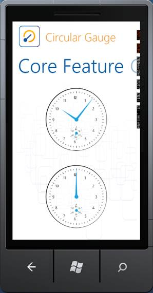
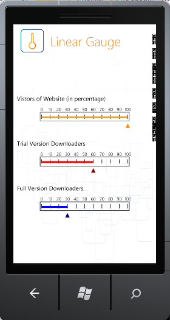

::: {style="DISPLAY: none"}
{#d2h_url_template}{#d2h_package_url style="WIDTH: 0px; DISPLAY: none; HEIGHT: 0px"}
:::

::::: {#nsbanner .d2h_main_nsbanner style="BORDER-BOTTOM: #999999 1px solid; POSITION: relative; PADDING-BOTTOM: 0px; BACKGROUND-COLOR: transparent; PADDING-LEFT: 0px; PADDING-RIGHT: 0px; DISPLAY: none; BORDER-TOP: #999999 1px solid; PADDING-TOP: 0px; LEFT: 0px"}
:::: {#TitleRow .d2h_main_titlerow style="PADDING-BOTTOM: 4px; BACKGROUND-COLOR: transparent; PADDING-LEFT: 22px; WIDTH: 100%; PADDING-RIGHT: 10px; DISPLAY: none; PADDING-TOP: 4px"}
::: {#ienav .d2h_main_ienav style="DISPLAY: none"}
{#D2HPrevious .D2HPreviousEnabled}  {#D2HNext .D2HNextEnabled}
:::
::::
:::::

::::: {#nstext .d2h_main_nstext style="PADDING-BOTTOM: 10px; BACKGROUND-COLOR: transparent; PADDING-LEFT: 22px; PADDING-RIGHT: 10px; HEIGHT: 100%; OVERFLOW: auto; PADDING-TOP: 5px" hasuserbackground="true" valign="bottom"}
::: {#d2h_breadcrumbs .d2h_breadcrumbs}
[Essential Studio User Guide Documentation](ms-xhelp:///?Id=12457748-09e3-4d74-a240-8e049cedf030){.d2h_breadcrumbsNormal}[ \> ]{.d2h_breadcrumbsLinkSeparator}[User Interface Edition](ms-xhelp:///?Id=c29296b7-531c-413b-a0ec-488ca1f7f669){.d2h_breadcrumbsNormal}[ \> ]{.d2h_breadcrumbsLinkSeparator}[Essential Windows Phone](ms-xhelp:///?Id=5ea1999c-4eff-4775-b84e-407dc825f555){.d2h_breadcrumbsNormal}[ \> ]{.d2h_breadcrumbsLinkSeparator}[Essential Gauge]{.d2h_breadcrumbsContentsOnly}[ \> ]{.d2h_breadcrumbsLinkSeparator}[Overview](ms-xhelp:///?Id=5fce8a4d-6e96-41fc-a1e4-32e0129ce8a3){.d2h_breadcrumbsNormal}
:::

## Introduction to Essential Gauge Windows Phone {#introduction-to-essential-gauge-windows-phone style="tab-stops: 0pt"}

**[]{style="FONT-FAMILY: 'Trebuchet MS','sans-serif'; COLOR: #15428b; FONT-SIZE: 9pt"}** 

Essential Gauge for Windows Phone is a data visualization tool that can be used when you want to display several data points or data ranges so that the data presented is concise, precise and compact as well (in terms of area) . This way, data shown by the control can be quickly understood by the user. The Syncfusion Windows Phone library enables the users to configure the Windows Phone Gauge using XAML and also through C# codes. The Gauge control comes with sophisticated customization support.

 

Essential Gauge supports Mango edition of the Windows Phone operating system. Windows Phone 7.5 (codenamed Mango) provides support for more than five hundred features compared to the Windows Phone 7.0 version. Some of the major features include multitasking and Silverlight 4 support. Essential Studio controls for Windows Phone now support Mango edition, enabling you to utilize these advanced features.

 

Essential Gauge Windows Phone is intended for developers who want to use gauges in their Windows Phone applications. Essential Gauge is a very useful control to indicate a current value from a range of values.

We have four forms of Essential Gauge:

[]{style="FONT-FAMILY: 'Trebuchet MS','sans-serif'; COLOR: #15428b; FONT-SIZE: 9pt"} 

[·      ]{style="FONT-FAMILY: Symbol"}**Circular gauge** can be used for representing a range of values in Circular form. It can be used to create sophisticated dashboards, clocks, industrial equipments, medical equipments and many more.

 

[·      ]{style="FONT-FAMILY: Symbol"}**Linear Gauge** can be used for displaying a range of values graphically along a linear scale. It can be very well described as the linear form of Circular Gauge.

 

[·      ]{style="FONT-FAMILY: Symbol"}**Digital Gauge** can be used to display any value in the segment display manner. The data given in the control is clearly depicted as it will be similar to alpha numeric representation.

 

[·      ]{style="FONT-FAMILY: Symbol"}**Rolling Gauge** can be used to display values in segments. The data given in the control is displayed with rolling effects

 

[]{style="FONT-FAMILY: 'Trebuchet MS','sans-serif'; COLOR: #15428b; FONT-SIZE: 9pt"} 

Appearance and Structure of the Control

 

The following image shows an example of a circular gauge.

[]{style="FONT-FAMILY: 'Trebuchet MS','sans-serif'; COLOR: #15428b; FONT-SIZE: 9pt"} 

Figure 1: Circular Gauge

 

The following image shows an example of a linear gauge.

[]{style="FONT-FAMILY: 'Trebuchet MS','sans-serif'; COLOR: #15428b; FONT-SIZE: 9pt"} 

Figure 2: Linear Gauge

***[]{style="FONT-FAMILY: 'Trebuchet MS','sans-serif'; COLOR: #15428b; FONT-SIZE: 9pt"}*** 

Use Case Scenarios

**Circular gauges** are mainly used to represent clocks, speedometers, and other round-faced meters with any number of hands and insets. These are mainly used in car dashboards.

 

**Linear gauges** are used to represent the following:

[·      ]{style="FONT-FAMILY: Symbol"}Thermometer

[·      ]{style="FONT-FAMILY: Symbol"}Equalizer

[]{style="FONT-FAMILY: 'Trebuchet MS','sans-serif'; COLOR: #15428b; FONT-SIZE: 9pt"} 

**Digital gauges** are used to represent the:

[·      ]{style="FONT-FAMILY: Symbol"}Digital Clock

[·      ]{style="FONT-FAMILY: Symbol"}Stop Watch

 

**Rolling gauges** are used for representing countdown schedulers.

[]{style="FONT-FAMILY: 'Trebuchet MS','sans-serif'; COLOR: #15428b; FONT-SIZE: 9pt"} 

Key Features

[]{style="FONT-FAMILY: 'Trebuchet MS','sans-serif'; COLOR: #15428b; FONT-SIZE: 9pt"} 

The **Circular Gauge** control comes with the following feature set:

[]{style="FONT-FAMILY: 'Trebuchet MS','sans-serif'; COLOR: #15428b; FONT-SIZE: 9pt"} 

[·      ]{style="FONT-FAMILY: Symbol"}Circular Gauge with customizable radius.

[·      ]{style="FONT-FAMILY: Symbol"}Stunning Gauge is created by customizing the appearance of the gauge by using variety of properties.

[·      ]{style="FONT-FAMILY: Symbol"}Multiple Scale support with full-fledged customization.

[·      ]{style="FONT-FAMILY: Symbol"}Multi Pointer support with build needle and pointer styles.

[·      ]{style="FONT-FAMILY: Symbol"}State Indicator support.

[·      ]{style="FONT-FAMILY: Symbol"}Range support with various positioning options.

[·      ]{style="FONT-FAMILY: Symbol"}Custom Images and Custom Labels support.

[]{style="FONT-FAMILY: 'Trebuchet MS','sans-serif'; COLOR: #15428b; FONT-SIZE: 9pt"} 

The **Linear Gauge** control comes with the following feature set:

[]{style="FONT-FAMILY: 'Trebuchet MS','sans-serif'; COLOR: #15428b; FONT-SIZE: 9pt"} 

[·      ]{style="FONT-FAMILY: Symbol"}Stunning Gauge is created by customizing the appearance of the gauge by using variety of properties.

[·      ]{style="FONT-FAMILY: Symbol"}Multiple Scale support with full-fledged customization.

[·      ]{style="FONT-FAMILY: Symbol"}Multi Pointer support with build needle and pointer styles.

[·      ]{style="FONT-FAMILY: Symbol"}State Indicator support.

[·      ]{style="FONT-FAMILY: Symbol"}Range support with various positioning options.

[·      ]{style="FONT-FAMILY: Symbol"}Custom Images and Custom Labels support.

**[]{style="FONT-FAMILY: 'Trebuchet MS','sans-serif'; COLOR: #15428b; FONT-SIZE: 9pt"}** 

The **Digital Gauge** control comes with the following feature set:

**[]{style="FONT-FAMILY: 'Trebuchet MS','sans-serif'; COLOR: #15428b; FONT-SIZE: 9pt"}** 

[·      ]{style="FONT-FAMILY: Symbol"}Supports Alpha Numeric Charecters.

[·      ]{style="FONT-FAMILY: Symbol"}Completely customizable

**[]{style="FONT-FAMILY: 'Trebuchet MS','sans-serif'; COLOR: #15428b; FONT-SIZE: 9pt"}** 

The **Rolling Gauge** control comes with the following feature set:

**[]{style="FONT-FAMILY: 'Trebuchet MS','sans-serif'; COLOR: #15428b; FONT-SIZE: 9pt"}** 

[·      ]{style="FONT-FAMILY: Symbol"}Supports Clockwise and Anti-clockwise Rolling.

[·      ]{style="FONT-FAMILY: Symbol"}Completely customizable

**[]{style="FONT-FAMILY: 'Trebuchet MS','sans-serif'; COLOR: #15428b; FONT-SIZE: 9pt"}** 

 

User Guide Organization

**[]{style="FONT-FAMILY: 'Trebuchet MS','sans-serif'; COLOR: #15428b"}** 

The product comes with numerous samples as well as an extensive documentation to guide you. This User Guide provides detailed information about the features and functionalities of the Essential Gauge for Windows Phone. It is organized into the following sections:

[]{style="FONT-FAMILY: 'Trebuchet MS','sans-serif'; COLOR: #15428b; FONT-SIZE: 9pt"} 

[·      ]{style="FONT-FAMILY: Symbol"}**Overview-**This section gives a brief introduction to the product and its key features.

[·      ]{style="FONT-FAMILY: Symbol"}**Installation and Deployment-**This section elaborates on the install location of the samples, license etc.

[·      ]{style="FONT-FAMILY: Symbol"}**What\'s New-**This section lists the new features implemented for every release.

[·      ]{style="FONT-FAMILY: Symbol"}**Getting Started-**This section guides you on getting started with Windows Phone application, controls etc.

[·      ]{style="FONT-FAMILY: Symbol"}**Concepts and Features-**The features of Gauge control are illustrated with use case scenarios, code examples and screen shots under this section.

[]{style="FONT-FAMILY: 'Trebuchet MS','sans-serif'; COLOR: #15428b; FONT-SIZE: 9pt"} 

Document Conventions[ ]{style="FONT-SIZE: 9pt"}

**[]{style="FONT-FAMILY: 'Trebuchet MS','sans-serif'; COLOR: #15428b; FONT-SIZE: 9pt"}** 

The conventions below will help you to quickly identify the important sections of information, while using the content:

 

::: {align="center"}
+------------------------+-------------------------------------------------------------------------------------------------------------------------------------------------------------------------------------------------------------------------------------------------------------+---------------------------------------------------------------------------------+
| Convention             | Icon                                                                                                                                                                                                                                                        | Description                                                                     |
+------------------------+-------------------------------------------------------------------------------------------------------------------------------------------------------------------------------------------------------------------------------------------------------------+---------------------------------------------------------------------------------+
| Note                   | ::: {style="BORDER-BOTTOM: windowtext 1pt solid; BORDER-LEFT: medium none; PADDING-BOTTOM: 1pt; MARGIN-TOP: 9pt; PADDING-LEFT: 0pt; PADDING-RIGHT: 0pt; MARGIN-BOTTOM: 9pt; BORDER-TOP: windowtext 1pt solid; BORDER-RIGHT: medium none; PADDING-TOP: 1pt"} | Represents important information.                                               |
|                        | Note:                                                                                                                                                                                                                           |                                                                                 |
|                        | :::                                                                                                                                                                                                                                                         |                                                                                 |
+------------------------+-------------------------------------------------------------------------------------------------------------------------------------------------------------------------------------------------------------------------------------------------------------+---------------------------------------------------------------------------------+
| Example                | Example:                                                                                                                                                                                                                                                    | Represents an example.                                                          |
+------------------------+-------------------------------------------------------------------------------------------------------------------------------------------------------------------------------------------------------------------------------------------------------------+---------------------------------------------------------------------------------+
| Tip                    |                                                                                                                                                                                                                                 | Represents useful hints, that will help you in using the controls and features. |
+------------------------+-------------------------------------------------------------------------------------------------------------------------------------------------------------------------------------------------------------------------------------------------------------+---------------------------------------------------------------------------------+
| Additional information |                                                                                                                                                                                                                                 | Represents additional information on the corresponding topic.                   |
+------------------------+-------------------------------------------------------------------------------------------------------------------------------------------------------------------------------------------------------------------------------------------------------------+---------------------------------------------------------------------------------+
:::

 

[]{#related-topics}
:::::
