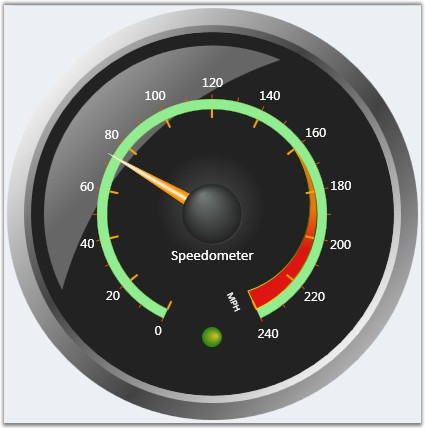
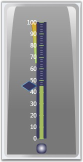
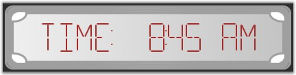

::: {style="DISPLAY: none"}
{#d2h_url_template}{#d2h_package_url style="WIDTH: 0px; DISPLAY: none; HEIGHT: 0px"}
:::

::::: {#nsbanner .d2h_main_nsbanner style="BORDER-BOTTOM: #999999 1px solid; POSITION: relative; PADDING-BOTTOM: 0px; BACKGROUND-COLOR: transparent; PADDING-LEFT: 0px; PADDING-RIGHT: 0px; DISPLAY: none; BORDER-TOP: #999999 1px solid; PADDING-TOP: 0px; LEFT: 0px"}
:::: {#TitleRow .d2h_main_titlerow style="PADDING-BOTTOM: 4px; BACKGROUND-COLOR: transparent; PADDING-LEFT: 22px; WIDTH: 100%; PADDING-RIGHT: 10px; DISPLAY: none; PADDING-TOP: 4px"}
::: {#ienav .d2h_main_ienav style="DISPLAY: none"}
{#D2HPrevious .D2HPreviousEnabled}  {#D2HNext .D2HNextEnabled}
:::
::::
:::::

::::: {#nstext .d2h_main_nstext style="PADDING-BOTTOM: 10px; BACKGROUND-COLOR: transparent; PADDING-LEFT: 22px; PADDING-RIGHT: 10px; HEIGHT: 100%; OVERFLOW: auto; PADDING-TOP: 5px" hasuserbackground="true" valign="bottom"}
::: {#d2h_breadcrumbs .d2h_breadcrumbs}
[Essential Studio User Guide Documentation](ms-xhelp:///?Id=12457748-09e3-4d74-a240-8e049cedf030){.d2h_breadcrumbsNormal}[ \> ]{.d2h_breadcrumbsLinkSeparator}[User Interface Edition](ms-xhelp:///?Id=c29296b7-531c-413b-a0ec-488ca1f7f669){.d2h_breadcrumbsNormal}[ \> ]{.d2h_breadcrumbsLinkSeparator}[Essential WPF](ms-xhelp:///?Id=7f4f82c5-151c-4262-94d0-75c4626c77bc){.d2h_breadcrumbsNormal}[ \> ]{.d2h_breadcrumbsLinkSeparator}[Essential Gauge]{.d2h_breadcrumbsContentsOnly}[ \> ]{.d2h_breadcrumbsLinkSeparator}[Overview](ms-xhelp:///?Id=bfc82684-47b8-48a5-bd56-fbef4b2e2ede){.d2h_breadcrumbsNormal}
:::

## Introduction to Essential Gauge WPF {#introduction-to-essential-gauge-wpf style="tab-stops: 0pt"}

Essential Gauge WPF is data visualization tool that can be used when the user want to display several data points or data ranges in a concise, precise and compact area. The data shown by the control can be quickly understood by the user. Syncfusion WPF library enables the users to configure the WPF Gauge using XAML and also through C# codes. The Gauge control comes with sophisticated customization support.

[]{style="FONT-FAMILY: 'Trebuchet MS','sans-serif'; COLOR: #15428b; FONT-SIZE: 9pt"} 

Essential Gauge WPF is intended to the developers who want to use gauges in their WPF applications. It is a very useful control to indicate the current value from a range of values. We have three forms of Essential Gauge.

[]{style="FONT-FAMILY: 'Trebuchet MS','sans-serif'; COLOR: #15428b; FONT-SIZE: 9pt"} 

[·      ]{style="FONT-FAMILY: Symbol"}**Circular gauge** can be used for representing a range of values in Circular form. It can be used to create sophisticated dashboards, clocks, industrial equipments, medical equipments and many more.

[·      ]{style="FONT-FAMILY: Symbol"}**Linear Gauge** can be used for displaying a range of values graphically along a linear scale. It can be very well described as the linear form of Circular Gauge.

[·      ]{style="FONT-FAMILY: Symbol"}**Digital Gauge** can be used for displaying a range of values that uses character in combination with numbers.

[]{style="FONT-FAMILY: 'Trebuchet MS','sans-serif'; COLOR: #15428b; FONT-SIZE: 9pt"} 

Real World Scenarios

The following are few examples of real world scenarios for using Essential Gauges.

[]{style="FONT-FAMILY: 'Trebuchet MS','sans-serif'; COLOR: #15428b; FONT-SIZE: 9pt"} 

1\. Circular Gauge

Circular Gauge can be used in many different ways in an application. The best and familiar example of a Circular Gauge is a Speedometer. The speedometer can be designed to be placed in a racing game application, denoting the speed of a vehicle.

[]{style="FONT-FAMILY: 'Trebuchet MS','sans-serif'; COLOR: #15428b; FONT-SIZE: 9pt"} 

Figure 1: Speedometer

[]{style="FONT-FAMILY: 'Trebuchet MS','sans-serif'; COLOR: #15428b; FONT-SIZE: 9pt"} 

[]{style="FONT-FAMILY: 'Trebuchet MS','sans-serif'; COLOR: #15428b; FONT-SIZE: 9pt"} 

The image above illustrates the design of a simple Speedometer. Circular Gauge can even accommodate multiple scales and multiple pointers at the same time, and hence by using Circular Gauge, a more complex Speedometer can also be designed.

[]{style="FONT-FAMILY: 'Trebuchet MS','sans-serif'; COLOR: #15428b; FONT-SIZE: 9pt"} 

2\. Linear Gauge

Linear Gauge can be imagined as a linear form of Circular Gauge. There are various applications in which Linear Gauge can be used. One such real world application of Linear Gauge is Volume control which is shown below.

[]{style="FONT-FAMILY: 'Trebuchet MS','sans-serif'; COLOR: #15428b; FONT-SIZE: 9pt"} 

Figure 2:Volume Control

[]{style="FONT-FAMILY: 'Trebuchet MS','sans-serif'; COLOR: #15428b; FONT-SIZE: 9pt"} 

3\. Digital Gauge

Digital Gauges are used to display alpha-numeric values in a virtual digital display. Depending on the requirements, it can be used in many ways. Digital Gauge can be used to display the current time in a virtual digital clock. The digital clock preceded by a text, which reads \"TIME: 8:45 AM\" is shown below.

[]{style="FONT-FAMILY: 'Trebuchet MS','sans-serif'; COLOR: #15428b; FONT-SIZE: 9pt"} 

Figure 3: Digital Clock

 

4\. Rolling Gauge

 

Key Features

The following are the key features of Essential Gauge WPF.

[]{style="FONT-FAMILY: 'Trebuchet MS','sans-serif'; COLOR: #15428b; FONT-SIZE: 9pt"} 

[·      ]{style="FONT-FAMILY: Symbol"}**Easy Customization---**The look and feel of a gauge is completely customizable. Each part of the gauge, such as pointers, pointer caps, scales, ticks, labels, and state indicators, can be customized to the user requirement.

[·      ]{style="FONT-FAMILY: Symbol"}**Multi Scale**---Essential Gauge can be customized to display multiple scales and multiple pointers within a single gauge. All pointers as well as their respective scales can be customized at run-time using the appropriate properties of the Essential Gauge.

[·      ]{style="FONT-FAMILY: Symbol"}**Gauge Brushes**---Gauge brushes allows the user to customize the display of a gauge with various colors.

[·      ]{style="FONT-FAMILY: Symbol"}**Segment Customization**---The segments of Digital Gauge can be customized in terms of its segment width, spacing between segments and skewing options of segments along the x and y-axis.

[·      ]{style="FONT-FAMILY: Symbol"}**Orientation---**Linear Gauge comes with orientation support. The gauge can now be placed either in vertical or horizontal directions.

[·      ]{style="FONT-FAMILY: Symbol"}**Logarithmic Scales---**The linear and circular gauges can be made to display logarithmic values of a given base by setting the IsLogarithmic property to True. By default, it displays log values by calculating them to the base 10. For other base values, the base can be set by using the LogBase property.

[·      ]{style="FONT-FAMILY: Symbol"}**Label Format---**The linear and circular gauges support various formatting options for labels so that they can be displayed in any desirable format.

[·      ]{style="FONT-FAMILY: Symbol"}**Formula Support**---This feature allows the user to display linear and circular gauge scales (labels) based on different formulae.

[]{style="FONT-FAMILY: 'Trebuchet MS','sans-serif'; COLOR: #15428b; FONT-SIZE: 9pt"} 

User Guide Organization

The product comes with numerous samples as well as an extensive documentation to guide you. This User Guide provides detailed information on the features and functionalities of the Essential Gauge for WPF. It is organized into the following sections.

[]{style="FONT-FAMILY: 'Trebuchet MS','sans-serif'; COLOR: #15428b; FONT-SIZE: 9pt"} 

[·      ]{style="FONT-FAMILY: Symbol"}**Overview**---This section gives a brief introduction to the product and its key features.

[·      ]{style="FONT-FAMILY: Symbol"}**Installation and Deployment---**This section elaborates on the install location of the samples, license, and so on.

[·      ]{style="FONT-FAMILY: Symbol"}**What\'s new**---This section lists the new features added for current release.

[·      ]{style="FONT-FAMILY: Symbol"}**Getting Started**---This section guides you on getting started with WPF application, controls, and so on.

[·      ]{style="FONT-FAMILY: Symbol"}**Gauge WPF Controls**---The features of individual controls are illustrated with use case scenarios, code examples and screen shots under this section.

[]{style="FONT-FAMILY: 'Trebuchet MS','sans-serif'; COLOR: #15428b; FONT-SIZE: 9pt"} 

Document Conventions

The conventions below will help you to quickly identify the important sections of information, while using the content.

[]{style="FONT-FAMILY: 'Trebuchet MS','sans-serif'; COLOR: #15428b; FONT-SIZE: 9pt"} 

Table 1: Document Conventions

::: {align="center"}
+------------------------+-------------------------------------+---------------------------------------------------------------------------------+
| Convention             | Icon                                | Description                                                                     |
+------------------------+-------------------------------------+---------------------------------------------------------------------------------+
| Note                   |                                     | Represents important information.                                               |
|                        |                                     |                                                                                 |
|                        | *Note:* |                                                                                 |
+------------------------+-------------------------------------+---------------------------------------------------------------------------------+
| Example                | Example                             | Represents an example.                                                          |
+------------------------+-------------------------------------+---------------------------------------------------------------------------------+
| Tip                    |         | Represents useful hints, that will help you in using the controls and features. |
+------------------------+-------------------------------------+---------------------------------------------------------------------------------+
| Additional Information |         | Represents additional information on the corresponding topic.                   |
+------------------------+-------------------------------------+---------------------------------------------------------------------------------+
:::

 

[]{#p2} 

[]{#related-topics}
:::::
