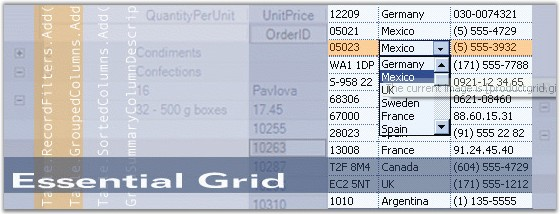

::: {style="DISPLAY: none"}
{#d2h_url_template}{#d2h_package_url style="WIDTH: 0px; DISPLAY: none; HEIGHT: 0px"}
:::

::::: {#nsbanner .d2h_main_nsbanner style="BORDER-BOTTOM: #999999 1px solid; POSITION: relative; PADDING-BOTTOM: 0px; BACKGROUND-COLOR: transparent; PADDING-LEFT: 0px; PADDING-RIGHT: 0px; DISPLAY: none; BORDER-TOP: #999999 1px solid; PADDING-TOP: 0px; LEFT: 0px"}
:::: {#TitleRow .d2h_main_titlerow style="PADDING-BOTTOM: 4px; BACKGROUND-COLOR: transparent; PADDING-LEFT: 22px; WIDTH: 100%; PADDING-RIGHT: 10px; DISPLAY: none; PADDING-TOP: 4px"}
::: {#ienav .d2h_main_ienav style="DISPLAY: none"}
{#D2HPrevious .D2HPreviousEnabled}  {#D2HNext .D2HNextEnabled}
:::
::::
:::::

::::: {#nstext .d2h_main_nstext style="PADDING-BOTTOM: 10px; BACKGROUND-COLOR: transparent; PADDING-LEFT: 22px; PADDING-RIGHT: 10px; HEIGHT: 100%; OVERFLOW: auto; PADDING-TOP: 5px" hasuserbackground="true" valign="bottom"}
::: {#d2h_breadcrumbs .d2h_breadcrumbs}
[Essential Studio User Guide Documentation](ms-xhelp:///?Id=12457748-09e3-4d74-a240-8e049cedf030){.d2h_breadcrumbsNormal}[ \> ]{.d2h_breadcrumbsLinkSeparator}[User Interface Edition](ms-xhelp:///?Id=c29296b7-531c-413b-a0ec-488ca1f7f669){.d2h_breadcrumbsNormal}[ \> ]{.d2h_breadcrumbsLinkSeparator}[Essential Windows](ms-xhelp:///?Id=e60759d8-47a4-4570-9d7a-16a68d63f2ea){.d2h_breadcrumbsNormal}[ \> ]{.d2h_breadcrumbsLinkSeparator}[Essential Grid]{.d2h_breadcrumbsContentsOnly}[ \> ]{.d2h_breadcrumbsLinkSeparator}[Overview](ms-xhelp:///?Id=7cd84c1e-bfd5-4143-b453-c3eb5a09e350){.d2h_breadcrumbsNormal}
:::

## Introduction to Essential Grid {#introduction-to-essential-grid style="tab-stops: 0pt"}

[]{style="FONT-FAMILY: 'Trebuchet MS','sans-serif'; COLOR: #15428b; FONT-SIZE: 9pt"} 

Essential Grid is a powerful grid control that is implemented by using a unique styles architecture. It offers Microsoft Excel-like grid functionality and high performance grouping support for both flat and hierarchical data sources. It is a 100% Native .NET UI library that provides several packages for building modern Windows applications by using the Microsoft .NET framework. The Grid Grouping control is a powerful databound grid control that supports multi-column sorting, filtering, Outlook style grouping, summaries, expression fields, conditional formats and unbound fields.

 

Essential Grid controls are useful for those users who want to build a Windows application which can be used an any .NET environment including C#, VB.NET and C++. It is beneficial to those users who want to create true nested grids with hierarchical data, and also display multiple, unrelated tables in one grid.

[]{style="FONT-FAMILY: 'Trebuchet MS','sans-serif'; COLOR: #15428b; FONT-SIZE: 9pt"} 

Figure 1: Essential Grid

[]{style="FONT-FAMILY: 'Trebuchet MS','sans-serif'; COLOR: #15428b; FONT-SIZE: 9pt"} 

Key Features

[]{style="FONT-FAMILY: 'Trebuchet MS','sans-serif'; COLOR: #15428b; FONT-SIZE: 9pt"} 

[·      ]{style="FONT-FAMILY: Symbol"}Multi-level Undo/Redo, shared scrollbar support, data/view separation, floating cells, more than 18 cell types, and unmatched extensibility are unique features of the Essential Grid.

[·      ]{style="FONT-FAMILY: Symbol"}Grid cell can have specialized controls such as a Text Box, Check Box or Combo Box.

[·      ]{style="FONT-FAMILY: Symbol"}Grid supports data binding techniques such as ADO.NET, Virtual mode, bound and unbound mode, and so on.

[·      ]{style="FONT-FAMILY: Symbol"}Essential Grid supports Office features like dynamic splitters and undo/redo. It can have a tabbed workbook format; also supports IntelliMouse Scrolling similar to MS Excel.

[·      ]{style="FONT-FAMILY: Symbol"}Grid supports functionalities like OLE drag-and-drop, resizing of rows and columns through property settings, and special event handling. It allows extremely detailed customization down to the cell level.

Grid Grouping control has rich design time support. The grouping grid supports variety of data sources which are used to automatically populate the grid with data. It has full ADO+ support, and also allows any component that implements the IList, IBindingList, ITypedList or IListSource interface.

[·      ]{style="FONT-FAMILY: Symbol"}Grid data can be arranged based on matching field values to form groups. Essential Grid supports nested grouping by hierarchically combining the groups in different levels. The number of levels of grouping is unlimited.

[·      ]{style="FONT-FAMILY: Symbol"}Grid supports data presentation techniques like sorting, grouping, filtering, and so on.

[]{style="FONT-FAMILY: 'Trebuchet MS','sans-serif'; COLOR: #15428b; FONT-SIZE: 9pt"} 

The product comes with numerous samples as well as an extensive documentation to guide you. This User Guide provides detailed information on the features and functionalities of the Grid, Grid Data Bound Grid, Grid Grouping, Grid List, Grid Record Navigation and Grid Aware Text Box controls. It is organized into the following sections:

[]{style="FONT-FAMILY: 'Trebuchet MS','sans-serif'; COLOR: #15428b; FONT-SIZE: 9pt"} 

[·      ]{style="FONT-FAMILY: Symbol"}**Overview**-This section gives a brief introduction to our product and its key features.

[·      ]{style="FONT-FAMILY: Symbol"}**Installation and Deployment**-This section elaborates on the install location of the samples, license, and so on.

[·      ]{style="FONT-FAMILY: Symbol"}**What\'s New**-This section lists the new features implemented for every release.

[·      ]{style="FONT-FAMILY: Symbol"}**Getting Started**-This section guides you on getting started with Grid controls.

[·      ]{style="FONT-FAMILY: Symbol"}**Grid Controls**-The features of the Grid, Grid Data Bound Grid, Grid Grouping, Grid List, Grid Record Navigation and Grid Aware Text Box controls are illustrated with use case scenarios, code examples and screen shots under this section.

[·      ]{style="FONT-FAMILY: Symbol"}**Frequently Asked Questions**-This section discusses specific solutions for very specific tasks.

[]{style="FONT-FAMILY: 'Trebuchet MS','sans-serif'; COLOR: #15428b; FONT-SIZE: 9pt"} 

Document Conventions

**[]{style="FONT-FAMILY: 'Trebuchet MS','sans-serif'; COLOR: #15428b; FONT-SIZE: 9pt"}** 

The conventions listed below will help you to quickly identify the important sections of information, while using the content:

[]{style="FONT-FAMILY: 'Trebuchet MS','sans-serif'; COLOR: #15428b; FONT-SIZE: 9pt"} 

::: {align="center"}
  ------------------------ ----------------------------------------- ---------------------------------------------------------------------------
  Convention               ICON                                      Description
  Note                     ***Note:***   Represents important information
  Example                  Example                                   Represents an example
  Tip                                    Represents useful hints that will help you in using the controls/features
  Additional Information                 Represents additional information on the topic
  ------------------------ ----------------------------------------- ---------------------------------------------------------------------------
:::

 

[]{#p2} 

 

[]{#related-topics}
:::::
