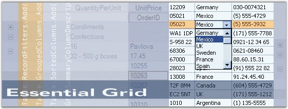

::: {style="DISPLAY: none"}
{#d2h_url_template}{#d2h_package_url style="WIDTH: 0px; DISPLAY: none; HEIGHT: 0px"}
:::

::::: {#nsbanner .d2h_main_nsbanner style="BORDER-BOTTOM: #999999 1px solid; POSITION: relative; PADDING-BOTTOM: 0px; BACKGROUND-COLOR: transparent; PADDING-LEFT: 0px; PADDING-RIGHT: 0px; DISPLAY: none; BORDER-TOP: #999999 1px solid; PADDING-TOP: 0px; LEFT: 0px"}
:::: {#TitleRow .d2h_main_titlerow style="PADDING-BOTTOM: 4px; BACKGROUND-COLOR: transparent; PADDING-LEFT: 22px; WIDTH: 100%; PADDING-RIGHT: 10px; DISPLAY: none; PADDING-TOP: 4px"}
::: {#ienav .d2h_main_ienav style="DISPLAY: none"}
{#D2HPrevious .D2HPreviousEnabled}  {#D2HNext .D2HNextEnabled}
:::
::::
:::::

::::: {#nstext .d2h_main_nstext style="PADDING-BOTTOM: 10px; BACKGROUND-COLOR: transparent; PADDING-LEFT: 22px; PADDING-RIGHT: 10px; HEIGHT: 100%; OVERFLOW: auto; PADDING-TOP: 5px" hasuserbackground="true" valign="bottom"}
::: {#d2h_breadcrumbs .d2h_breadcrumbs}
[Essential Studio User Guide Documentation](ms-xhelp:///?Id=12457748-09e3-4d74-a240-8e049cedf030){.d2h_breadcrumbsNormal}[ \> ]{.d2h_breadcrumbsLinkSeparator}[User Interface Edition](ms-xhelp:///?Id=c29296b7-531c-413b-a0ec-488ca1f7f669){.d2h_breadcrumbsNormal}[ \> ]{.d2h_breadcrumbsLinkSeparator}[Essential ASP.NET](ms-xhelp:///?Id=25c35330-c127-4dad-9a92-ed79dc7261a6){.d2h_breadcrumbsNormal}[ \> ]{.d2h_breadcrumbsLinkSeparator}[Essential Grid]{.d2h_breadcrumbsContentsOnly}[ \> ]{.d2h_breadcrumbsLinkSeparator}[Overview](ms-xhelp:///?Id=9d7d041e-80a4-45be-8f19-ebcfe7e74646){.d2h_breadcrumbsNormal}
:::

## Introduction to Essential Grid for ASP.NET {#introduction-to-essential-grid-for-asp.net style="tab-stops: 0pt"}

[]{style="FONT-FAMILY: 'Trebuchet MS','sans-serif'; COLOR: #15428b; FONT-SIZE: 9pt"} 

Essential Grouping Grid for ASP.NET is a feature-rich Web control providing extensive appearance customization options with support for grouped records and nested hierarchical data. The API and functionality are very close to that of our Grouping Grid control for Windows Forms.

 

Grouping Grid finds its main application in typical market update applications (for example, Stock Market). It can be used in any spreadsheet applications such as loan calculators and tax form applications. It can also be used in any webmail client for displaying the email messages in a tabular form.

[]{style="FONT-FAMILY: 'Trebuchet MS','sans-serif'; COLOR: #15428b; FONT-SIZE: 9pt"} 

[]{style="FONT-FAMILY: 'Trebuchet MS','sans-serif'; COLOR: #15428b; FONT-SIZE: 9pt"} 

Figure 1: Essential Grid

[]{style="FONT-FAMILY: 'Trebuchet MS','sans-serif'; COLOR: red; FONT-SIZE: 9pt"} 

Key Features

**[]{style="FONT-FAMILY: 'Trebuchet MS','sans-serif'; COLOR: #15428b; FONT-SIZE: 9pt"}** 

Important features of Grid Grouping control are listed below.

[]{style="FONT-FAMILY: 'Trebuchet MS','sans-serif'; COLOR: #15428b; FONT-SIZE: 9pt"} 

[·      ]{style="FONT-FAMILY: Symbol"}Codeless binding by using DataSource controls in both .NET FW 2.0 and .NET FW 3.5.

[·      ]{style="FONT-FAMILY: Symbol"}Data binding to Business objects, nullable objects, anonymous LINQ types, binding through Web services or page methods.

[·      ]{style="FONT-FAMILY: Symbol"}Bind directly with the Database using the PassThroughGrouping class.

[·      ]{style="FONT-FAMILY: Symbol"}Rich client-side functionality, drag columns/rows, resize, hide/show columns, scrolling.

[·      ]{style="FONT-FAMILY: Symbol"}Grouping, Sorting, Filtering, Hierarchies, Summaries, all come built-in in the Grid engine.

[·      ]{style="FONT-FAMILY: Symbol"}Full Templates support, with complete Data binding. Display data like Card-View templates.

[·      ]{style="FONT-FAMILY: Symbol"}Conditional Formatting

[·      ]{style="FONT-FAMILY: Symbol"}Expression field\'s support lets you easily add columns whose values are computed from values in other columns. For example, declare the \'\'SharesValue\'\' column to be based on the \'\'SharePrice\'\' and \'\'ShareCount\'\' columns.

[·      ]{style="FONT-FAMILY: Symbol"}Horizontal and vertical scrolling, and ability to Freeze columns and rows alike.

[·      ]{style="FONT-FAMILY: Symbol"}Supports various column types.

[·      ]{style="FONT-FAMILY: Symbol"}Support to export to Excel/Word.

[·      ]{style="FONT-FAMILY: Symbol"}AutoPostBack on row click for server-side processing.

[·      ]{style="FONT-FAMILY: Symbol"}On-demand paging with GridPager. Use the GridPager with any other Paging control.

[·      ]{style="FONT-FAMILY: Symbol"}Printing support for grid.

[]{style="FONT-FAMILY: 'Trebuchet MS','sans-serif'; COLOR: #15428b; FONT-SIZE: 9pt"} 

User Guide Structure

[]{style="FONT-FAMILY: 'Trebuchet MS','sans-serif'; COLOR: #15428b; FONT-SIZE: 9pt"} 

The product comes with numerous samples as well as an extensive documentation to guide you. This User Guide provides detailed information on the features and functionalities of Essential Grid. It is organized into the following sections:

[]{style="FONT-FAMILY: 'Trebuchet MS','sans-serif'; COLOR: #15428b; FONT-SIZE: 9pt"} 

[·      ]{style="FONT-FAMILY: Symbol"}**Overview**-This section gives a brief introduction to our product and its key features.

[·      ]{style="FONT-FAMILY: Symbol"}**Installation and Deployment**-This section elaborates on the install location of the samples, license, and so on.

[·      ]{style="FONT-FAMILY: Symbol"}**Getting Started**-This section guides you on getting started with ASP.NET application, controls, and so on.

[·      ]{style="FONT-FAMILY: Symbol"}**Concepts and Features**-The features of individual controls are illustrated with use case scenarios, code examples and screen shots under this section.

[·      ]{style="FONT-FAMILY: Symbol"}**Frequently Asked Questions**-This section illustrates the solutions for various task-based queries about Grid Grouping control.

[]{style="FONT-FAMILY: 'Trebuchet MS','sans-serif'; COLOR: #15428b; FONT-SIZE: 9pt"} 

Document Conventions

[]{style="FONT-FAMILY: 'Trebuchet MS','sans-serif'; COLOR: #15428b; FONT-SIZE: 9pt"} 

The following conventions will help you to quickly identify the important sections of information while using the content.

[]{style="FONT-FAMILY: 'Trebuchet MS','sans-serif'; COLOR: #15428b; FONT-SIZE: 9pt"} 

::: {align="center"}
  ------------------------ ----------------------------------------- ---------------------------------------------------------------------------
  Convention               Icon                                      Description of the Icon
  Note                     ***Note:***   Represents important information
  Example                  **Example**                               Represents an example
  Tip                                    Represents useful hints that will help you in using the controls/features
  Additional Information                 Represents additional information on the topic
  ------------------------ ----------------------------------------- ---------------------------------------------------------------------------
:::

 

[]{#p2} 

[]{#related-topics}
:::::
