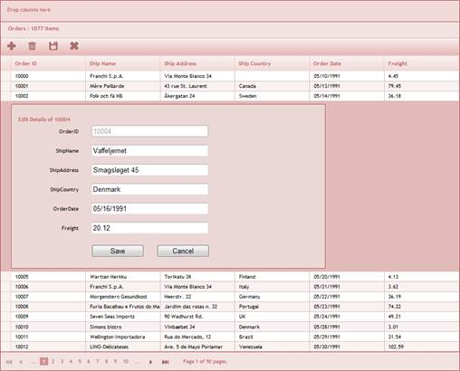

::: {style="DISPLAY: none"}
{#d2h_url_template}{#d2h_package_url style="WIDTH: 0px; DISPLAY: none; HEIGHT: 0px"}
:::

::::: {#nsbanner .d2h_main_nsbanner style="BORDER-BOTTOM: #999999 1px solid; POSITION: relative; PADDING-BOTTOM: 0px; BACKGROUND-COLOR: transparent; PADDING-LEFT: 0px; PADDING-RIGHT: 0px; DISPLAY: none; BORDER-TOP: #999999 1px solid; PADDING-TOP: 0px; LEFT: 0px"}
:::: {#TitleRow .d2h_main_titlerow style="PADDING-BOTTOM: 4px; BACKGROUND-COLOR: transparent; PADDING-LEFT: 22px; WIDTH: 100%; PADDING-RIGHT: 10px; DISPLAY: none; PADDING-TOP: 4px"}
::: {#ienav .d2h_main_ienav style="DISPLAY: none"}
{#D2HPrevious .D2HPreviousEnabled}  {#D2HNext .D2HNextEnabled}
:::
::::
:::::

:::: {#nstext .d2h_main_nstext style="PADDING-BOTTOM: 10px; BACKGROUND-COLOR: transparent; PADDING-LEFT: 22px; PADDING-RIGHT: 10px; HEIGHT: 100%; OVERFLOW: auto; PADDING-TOP: 5px" hasuserbackground="true" valign="bottom"}
::: {#d2h_breadcrumbs .d2h_breadcrumbs}
[Essential Studio User Guide Documentation](ms-xhelp:///?Id=12457748-09e3-4d74-a240-8e049cedf030){.d2h_breadcrumbsNormal}[ \> ]{.d2h_breadcrumbsLinkSeparator}[User Interface Edition](ms-xhelp:///?Id=c29296b7-531c-413b-a0ec-488ca1f7f669){.d2h_breadcrumbsNormal}[ \> ]{.d2h_breadcrumbsLinkSeparator}[Essential ASP.NET MVC](ms-xhelp:///?Id=4b14e7d1-65c4-4f67-b1aa-2c37709905a5){.d2h_breadcrumbsNormal}[ \> ]{.d2h_breadcrumbsLinkSeparator}[Essential Grid]{.d2h_breadcrumbsContentsOnly}[ \> ]{.d2h_breadcrumbsLinkSeparator}[Overview](ms-xhelp:///?Id=5fa7be52-b8e1-4612-b2db-a9fc9574e729){.d2h_breadcrumbsNormal}
:::

## Introduction to Essential Grid for ASP.NET MVC {#introduction-to-essential-grid-for-asp.net-mvc style="tab-stops: 0pt"}

 

Essential Grid for ASP.NET MVC is a feature-rich control that provides extensive appearance customization options with support for grouped records. With Essential Grid for ASP.NET MVC, you can create a grid with a highly customizable look and feel. This grid is very useful for generating complex grid-based reports with rich formatting. It supports paging, sorting, grouping, filtering, and editing features. It also supports a JSON mode in which you can handle all the operations like paging and sorting. The performance of these operations in the JSON mode will be much faster than if the grid were to handle them. Essential Grid generates clean HTML in compliance with XHTML 1.0. It supports any kind of IEnumerable data source. It uses LINQ data retrieval techniques for handling data sources, and offers high performance.

 

Real World Scenarios

Grid editing[---]{style="FONT-FAMILY: 'Times New Roman','serif'"}Essential Grid provides rich server APIs for inserting new data, updating the existing data, and deleting data from the specified data source.

 

[]{style="COLOR: black"} 

Figure 1: Essential Grid for ASP.NET MVC

[]{style="COLOR: black"} 

Developers can make use of Essential Grid to generate complex grid-based reports with rich formatting.

 

At its core, the grid functions as a very efficient display engine for tabular data that can be customized down to the cell level. It does not make any assumptions on the structure of the data (many grid controls implemented as straight data-bound controls make such explicit assumptions). This leads to a very flexible design that can be easily adapted to a variety of tasks including the display of completely unstructured data and the display of structured data from a database.

 

The display system also hosts a powerful and complete styles architecture. Settings can be specified at the cell level or at higher levels using parent styles that are referred to as base styles. Base styles can affect groups of cells. Cell level settings override any higher level settings and enable easy customization right down to that level.

 

Key Features

Some important features of Grid for MVC are listed below.

[·      ]{style="FONT-FAMILY: Symbol"}Highly customizable look and feel---Fill the Grid control with data from any data source and render it as an image in a browser.

[·      ]{style="FONT-FAMILY: Symbol"}Data sources---Bind the Grid control with any data source. For example, all IEnumerable data sources.

[·      ]{style="FONT-FAMILY: Symbol"}Navigation---Offers complete navigational support for navigating between the grid cells, rows, and pages.

[·      ]{style="FONT-FAMILY: Symbol"}Sorting and grouping---Supports *n* levels of sorting and grouping.

[·      ]{style="FONT-FAMILY: Symbol"}Filtering---Offers Excel-like filtering for filter data.

[·      ]{style="FONT-FAMILY: Symbol"}Editing---Offers three editing modes for inserting, editing, and deleting records in a grid.

[·      ]{style="FONT-FAMILY: Symbol"}Conditional formatting---Provides an option to format grid cells based on a certain condition.

[·      ]{style="FONT-FAMILY: Symbol"}Drag-and-drop records---Exposes flexible client-side events to drag-and-drop grid records over other HTML elements on the page.

[·      ]{style="FONT-FAMILY: Symbol"}Summary support---Offers options for specifying summary rows and columns.

[·      ]{style="FONT-FAMILY: Symbol"}Column formatting---Columns can be formatted directly from view.

[·      ]{style="FONT-FAMILY: Symbol"}JSON mode---Offers support for JSON mode. You can handle operations and send the data in JSON mode to view data which is displayed in ASP.NET 4.0 templates.

[·      ]{style="FONT-FAMILY: Symbol"}Unbound columns---Offers option for specifying unbound columns.

[·      ]{style="FONT-FAMILY: Symbol"}Drag-and-drop support---Allows you to drag any column and drop it at any position in the grid, allowing columns to be repositioned at the required place.

[·      ]{style="FONT-FAMILY: Symbol"}Resize rows and columns---Grid provides option for resizing the rows and columns.

[·      ]{style="FONT-FAMILY: Symbol"}Hide rows and columns---The grid provides support to hide or unhide a range of rows and columns.

[·      ]{style="FONT-FAMILY: Symbol"}Selection modes---Essential Grid offers different kinds of selections such as row only, column only, cell only for the selection of a particular row, or an entire grid selection.

[·      ]{style="FONT-FAMILY: Symbol"}Complete AJAX support---Enables faster output.

[·      ]{style="FONT-FAMILY: Symbol"}Complete XHTML compliance---Provides the best results on all browsers.

[]{#related-topics}
::::
