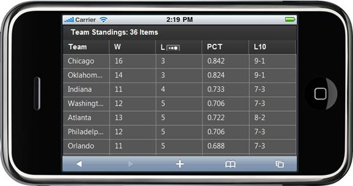

::: {style="DISPLAY: none"}
{#d2h_url_template}{#d2h_package_url style="WIDTH: 0px; DISPLAY: none; HEIGHT: 0px"}
:::

::::: {#nsbanner .d2h_main_nsbanner style="BORDER-BOTTOM: #999999 1px solid; POSITION: relative; PADDING-BOTTOM: 0px; BACKGROUND-COLOR: transparent; PADDING-LEFT: 0px; PADDING-RIGHT: 0px; DISPLAY: none; BORDER-TOP: #999999 1px solid; PADDING-TOP: 0px; LEFT: 0px"}
:::: {#TitleRow .d2h_main_titlerow style="PADDING-BOTTOM: 4px; BACKGROUND-COLOR: transparent; PADDING-LEFT: 22px; WIDTH: 100%; PADDING-RIGHT: 10px; DISPLAY: none; PADDING-TOP: 4px"}
::: {#ienav .d2h_main_ienav style="DISPLAY: none"}
{#D2HPrevious .D2HPreviousEnabled}  {#D2HNext .D2HNextEnabled}
:::
::::
:::::

:::: {#nstext .d2h_main_nstext style="PADDING-BOTTOM: 10px; BACKGROUND-COLOR: transparent; PADDING-LEFT: 22px; PADDING-RIGHT: 10px; HEIGHT: 100%; OVERFLOW: auto; PADDING-TOP: 5px" hasuserbackground="true" valign="bottom"}
::: {#d2h_breadcrumbs .d2h_breadcrumbs}
[Essential Studio User Guide Documentation](ms-xhelp:///?Id=12457748-09e3-4d74-a240-8e049cedf030){.d2h_breadcrumbsNormal}[ \> ]{.d2h_breadcrumbsLinkSeparator}[User Interface Edition](ms-xhelp:///?Id=c29296b7-531c-413b-a0ec-488ca1f7f669){.d2h_breadcrumbsNormal}[ \> ]{.d2h_breadcrumbsLinkSeparator}[Essential Mobile MVC](ms-xhelp:///?Id=74df42e3-5434-4590-9be6-3ae2f911cbbc){.d2h_breadcrumbsNormal}[ \> ]{.d2h_breadcrumbsLinkSeparator}[Essential Grid]{.d2h_breadcrumbsContentsOnly}[ \> ]{.d2h_breadcrumbsLinkSeparator}[Overview](ms-xhelp:///?Id=6b0ec897-c25c-433c-bde8-5e513740bd92){.d2h_breadcrumbsNormal}
:::

## Introduction to Essential Grid for ASP.NET MVC Mobile {#introduction-to-essential-grid-for-asp.net-mvc-mobile style="tab-stops: 0pt"}

Essential Mobile Grid for ASP.NET MVC is a feature-rich control that provides extensive support for generating complex grid-based reports with rich formatting. With Essential Mobile Grid for ASP.NET MVC, you can create a grid with a highly customizable look and feel. Essential Grid for Mobile MVC supports sorting and paging through swipe-up and swipe-down actions, conditional formatting, and query cell actions. It also supports a JSON mode in which you can handle all the operations. The performance of these operations in the JSON mode will be much faster when compared to the server mode. Essential Mobile Grid generates clean HTML in compliance with XHTML 1.0. It supports any kind of IEnumerable data source. It uses LINQ data retrieval techniques for handling data sources, and offers high performance.

 

Real World Scenarios

Developers can make use of Essential Grid to generate complex grid-based reports with rich formatting. For example, it is used to show team standings in the following screenshot.

[]{style="FONT-SIZE: 12pt"}

Figure 1: Essential Mobile Grid for ASP.NET MVC

At its core, the grid functions as a very efficient display engine for tabular data that can be customized down to the cell level. It does not make any assumptions on the structure of the data (many grid controls implemented as straight data-bound controls make such explicit assumptions). This leads to a very flexible design that can be easily adapted to a variety of tasks including the display of completely unstructured data and the display of structured data from a database.

The display system also hosts powerful and complete styles architecture. Settings can be specified at the cell level or at higher levels using parent styles that are referred to as base styles. Base styles can affect groups of cells. Cell level settings override any higher level settings and enable easy customization right down to that level.

[]{#related-topics}
::::
