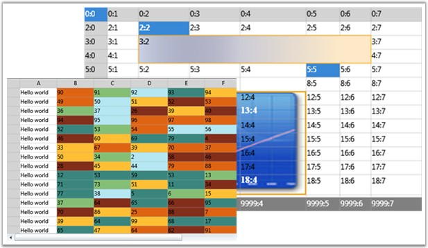
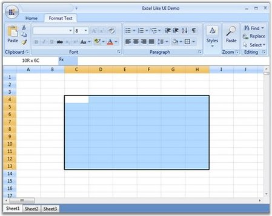
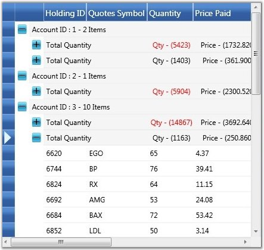
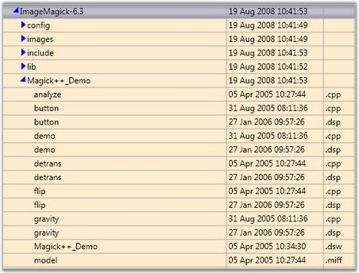

::: {style="DISPLAY: none"}
{#d2h_url_template}{#d2h_package_url style="WIDTH: 0px; DISPLAY: none; HEIGHT: 0px"}
:::

::::: {#nsbanner .d2h_main_nsbanner style="BORDER-BOTTOM: #999999 1px solid; POSITION: relative; PADDING-BOTTOM: 0px; BACKGROUND-COLOR: transparent; PADDING-LEFT: 0px; PADDING-RIGHT: 0px; DISPLAY: none; BORDER-TOP: #999999 1px solid; PADDING-TOP: 0px; LEFT: 0px"}
:::: {#TitleRow .d2h_main_titlerow style="PADDING-BOTTOM: 4px; BACKGROUND-COLOR: transparent; PADDING-LEFT: 22px; WIDTH: 100%; PADDING-RIGHT: 10px; DISPLAY: none; PADDING-TOP: 4px"}
::: {#ienav .d2h_main_ienav style="DISPLAY: none"}
{#D2HPrevious .D2HPreviousEnabled}  {#D2HNext .D2HNextEnabled}
:::
::::
:::::

::::: {#nstext .d2h_main_nstext style="PADDING-BOTTOM: 10px; BACKGROUND-COLOR: transparent; PADDING-LEFT: 22px; PADDING-RIGHT: 10px; HEIGHT: 100%; OVERFLOW: auto; PADDING-TOP: 5px" hasuserbackground="true" valign="bottom"}
::: {#d2h_breadcrumbs .d2h_breadcrumbs}
[Essential Studio User Guide Documentation](ms-xhelp:///?Id=12457748-09e3-4d74-a240-8e049cedf030){.d2h_breadcrumbsNormal}[ \> ]{.d2h_breadcrumbsLinkSeparator}[User Interface Edition](ms-xhelp:///?Id=c29296b7-531c-413b-a0ec-488ca1f7f669){.d2h_breadcrumbsNormal}[ \> ]{.d2h_breadcrumbsLinkSeparator}[Essential Silverlight](ms-xhelp:///?Id=66221bd1-ba2e-43c2-94a7-618f50e01d24){.d2h_breadcrumbsNormal}[ \> ]{.d2h_breadcrumbsLinkSeparator}[Essential Grid]{.d2h_breadcrumbsContentsOnly}[ \> ]{.d2h_breadcrumbsLinkSeparator}[Overview](ms-xhelp:///?Id=8be5102f-6576-4191-bf4c-0eb2b2764379){.d2h_breadcrumbsNormal}
:::

## Introduction to Essential Grid Silverlight {#introduction-to-essential-grid-silverlight style="tab-stops: 0pt"}

The grid at its core functions as a very efficient display engine for tabular data that can be customized down to the cell level. It does not make any assumptions on the structure of the data (many grid controls implemented as straight data bound controls make such explicit assumptions). This leads to a very flexible design that can be easily adapted to a variety of tasks including the display of completely unstructured data and the display of structured data from a database.

[]{style="FONT-FAMILY: 'Trebuchet MS','sans-serif'; COLOR: #15428b; FONT-SIZE: 9pt"} 

The display system also hosts powerful and complete styles architecture. Settings can be specified at the cell level or at higher levels using parent styles that are referred to as base styles. Base styles can affect groups of cells. Cell level settings override any higher level settings and enable easy customization right down to that level.

[]{style="FONT-FAMILY: 'Trebuchet MS','sans-serif'; COLOR: #15428b; FONT-SIZE: 9pt"} 

With this version, our core focus has been on the underlying architecture for displaying cells with virtualized cell editors in a manner that enables good performance characteristics. The core display system also supports several building block features such as nested grids, virtual mode and support for a virtually unlimited number of rows and columns.

[]{style="FONT-FAMILY: 'Trebuchet MS','sans-serif'; COLOR: #15428b; FONT-SIZE: 9pt"} 

Figure 1: Essential Grid Silverlight

[]{style="FONT-FAMILY: 'Trebuchet MS','sans-serif'; COLOR: #15428b; FONT-SIZE: 9pt"} 

Real World Scenarios

**[]{style="FONT-FAMILY: 'Trebuchet MS','sans-serif'; COLOR: #15428b"}** 

Essential Grid Silverlight finds its application in various fields such as finance, banking, software, etc. Some of the important areas are:

[]{style="FONT-FAMILY: 'Trebuchet MS','sans-serif'; COLOR: #15428b; FONT-SIZE: 9pt"} 

[·      ]{style="FONT-FAMILY: Symbol"}**Excel Like UI** - Rich feature set of Essential Grid allows the users to build feature-rich applications. Below image illustrates an example - Excel Like UI.

[]{style="FONT-FAMILY: 'Trebuchet MS','sans-serif'; COLOR: #15428b; FONT-SIZE: 9pt"} 

***[]{style="FONT-FAMILY: 'Trebuchet MS','sans-serif'; COLOR: #15428b; FONT-SIZE: 9pt"}*** 

Figure 2: Excel-like UI

***[]{style="FONT-FAMILY: 'Trebuchet MS','sans-serif'; COLOR: #15428b; FONT-SIZE: 9pt"}*** 

[·      ]{style="FONT-FAMILY: Symbol"}**Stock Portfolio -** Using Essential Grid Control in high performance applications is very much beneficial as it can display large amount of real time data, which tends to change periodically, without any performance hits. Below is an illustration of Stock Portfolio using essential grid.

[]{style="FONT-FAMILY: 'Trebuchet MS','sans-serif'; COLOR: #15428b; FONT-SIZE: 9pt"} 

[]{style="FONT-FAMILY: 'Trebuchet MS','sans-serif'; COLOR: #15428b; FONT-SIZE: 9pt"} 

Figure 3: Stock Portfolio

[]{style="FONT-FAMILY: 'Trebuchet MS','sans-serif'; COLOR: #15428b; FONT-SIZE: 9pt"} 

[·      ]{style="FONT-FAMILY: Symbol"}**File Explorer -** The Grid Tree control can be used for file explorer-type applications where the child items should be loaded on demand when the user opens the corresponding parent item.

[]{style="FONT-FAMILY: 'Trebuchet MS','sans-serif'; COLOR: #15428b; FONT-SIZE: 9pt"} 

[]{style="FONT-FAMILY: 'Trebuchet MS','sans-serif'; COLOR: #15428b; FONT-SIZE: 9pt"} 

Figure 4: File Explorer

[]{style="FONT-FAMILY: 'Trebuchet MS','sans-serif'; COLOR: #15428b; FONT-SIZE: 9pt"} 

Key Features

[]{style="FONT-FAMILY: 'Trebuchet MS','sans-serif'; COLOR: #15428b; FONT-SIZE: 9pt"} 

The following are the key features of Essential Grid Silverlight:

[]{style="FONT-FAMILY: 'Trebuchet MS','sans-serif'; COLOR: #15428b; FONT-SIZE: 9pt"} 

[·      ]{style="FONT-FAMILY: Symbol"}**Easy APIs to add/delete/move row and columns** - You can easily add, delete and move rows and columns throughout the grid control using its well-defined APIs.

[·      ]{style="FONT-FAMILY: Symbol"}**Clipboard Support** - Grid provides excellent clipboard support that allows the users to copy/paste grid cells into text or any format.

[·      ]{style="FONT-FAMILY: Symbol"}**Frozen Row and Column Footers** - Grid allows the user to freeze grid columns to the left and also allows to freeze rows to the top of the grid.

[·      ]{style="FONT-FAMILY: Symbol"}**Resize Rows and Columns** - Grid provides option for resizing the rows and columns.

[·      ]{style="FONT-FAMILY: Symbol"}**Hide Rows and Columns** - The grid provides support to hide or unhide a range of rows and columns.

[·      ]{style="FONT-FAMILY: Symbol"}**Keyboard Interface** - Essential Grid provides extensive support for keyboard handling. The following are some of them:

[]{style="FONT-FAMILY: 'Trebuchet MS','sans-serif'; COLOR: #15428b; FONT-SIZE: 9pt"} 

[·      ]{style="FONT-FAMILY: Symbol"}Arrow keys-move current cell

[·      ]{style="FONT-FAMILY: Symbol"}PageUp/PageDown key-scroll grid by page

[·      ]{style="FONT-FAMILY: Symbol"}F2-activate/deactivate cell

[·      ]{style="FONT-FAMILY: Symbol"}F4+ALT-Drop-Down/Close-Up cell

[·      ]{style="FONT-FAMILY: Symbol"}CTRL + Arrow keys-move to first/last, row/column

[·      ]{style="FONT-FAMILY: Symbol"}SHIFT + Arrow keys-select cell

[·      ]{style="FONT-FAMILY: Symbol"}DELETE key-delete cell

[·      ]{style="FONT-FAMILY: Symbol"}CTRL+X, CTRL+V, CTRL+C, INSERT key and DELETE key support common clipboard operations

[]{style="FONT-FAMILY: 'Trebuchet MS','sans-serif'; COLOR: #15428b; FONT-SIZE: 9pt"} 

All keyboard operations can be customized.

[]{style="FONT-FAMILY: 'Trebuchet MS','sans-serif'; COLOR: #15428b; FONT-SIZE: 9pt"} 

[·      ]{style="FONT-FAMILY: Symbol"}**Selection Modes** - Essential Grid offers different kinds of selection modes such as RowOnly, ColumnOnly and CellOnly for the selection of a particular row, column and a cell respectively.

[·      ]{style="FONT-FAMILY: Symbol"}**Drag-Drop Support** - Essential Grid allows you to drag any column and drop it at any position in the grid. This allows repositioning of columns at the required place.

[·      ]{style="FONT-FAMILY: Symbol"}**Virtual Mode** - Essential Grid Silverlight supports a virtual mode, which lets you dynamically provide data to the grid from an external data source through an event. This means that the grid does not store any data in its internal data structure.

[]{style="FONT-FAMILY: 'Trebuchet MS','sans-serif'; COLOR: #15428b; FONT-SIZE: 9pt"} 

User Guide Structure

**[]{style="FONT-FAMILY: 'Trebuchet MS','sans-serif'; COLOR: #15428b"}** 

The product comes with numerous samples as well as an extensive documentation to guide you. This User Guide provides detailed information on the features and functionalities of the Essential Grid Silverlight. It is organized into the following sections:

[]{style="FONT-FAMILY: 'Trebuchet MS','sans-serif'; COLOR: #15428b; FONT-SIZE: 9pt"} 

[·      ]{style="FONT-FAMILY: Symbol"}**Overview**-This section gives a brief introduction to the product and its key features.

[·      ]{style="FONT-FAMILY: Symbol"}**Installation and Deployment**-This section elaborates on the install location of the samples, license, and so on.

[·      ]{style="FONT-FAMILY: Symbol"}**What\'s New**-This section lists the new features implemented for every release.

[·      ]{style="FONT-FAMILY: Symbol"}**Getting Started**-This section guides you on getting started with the Silverlight application, controls, and so on.

[·      ]{style="FONT-FAMILY: Symbol"}**Concepts and Features**-The features of individual controls are illustrated with use case scenarios, code examples and screen shots under this section.

[]{style="FONT-FAMILY: 'Trebuchet MS','sans-serif'; COLOR: #15428b; FONT-SIZE: 9pt"} 

Document Conventions[ ]{style="FONT-SIZE: 9pt"}

[]{style="FONT-FAMILY: 'Trebuchet MS','sans-serif'; COLOR: #15428b; FONT-SIZE: 9pt"} 

The conventions below will help you to quickly identify the important sections of information, while using the content:

[]{style="FONT-FAMILY: 'Trebuchet MS','sans-serif'; COLOR: #15428b; FONT-SIZE: 9pt"} 

::: {align="center"}
+------------------------+-------------------------------------------------------------------------------------------------------------------------------------------------------------------------------------------------------------------------------------------------------------+---------------------------------------------------------------------------------+
| Convention             | Icon                                                                                                                                                                                                                                                        | Description of the Icon                                                         |
+------------------------+-------------------------------------------------------------------------------------------------------------------------------------------------------------------------------------------------------------------------------------------------------------+---------------------------------------------------------------------------------+
| Note                   |                                                                                                                                                                                                                                                             | Represents important information.                                               |
|                        |                                                                                                                                                                                                                                                             |                                                                                 |
|                        | ::: {style="BORDER-BOTTOM: windowtext 1pt solid; BORDER-LEFT: medium none; PADDING-BOTTOM: 1pt; MARGIN-TOP: 9pt; PADDING-LEFT: 0pt; PADDING-RIGHT: 0pt; MARGIN-BOTTOM: 9pt; BORDER-TOP: windowtext 1pt solid; BORDER-RIGHT: medium none; PADDING-TOP: 1pt"} |                                                                                 |
|                        |  Note:                                                                                                                                                                                                                          |                                                                                 |
|                        | :::                                                                                                                                                                                                                                                         |                                                                                 |
+------------------------+-------------------------------------------------------------------------------------------------------------------------------------------------------------------------------------------------------------------------------------------------------------+---------------------------------------------------------------------------------+
| Example                | **Example:**                                                                                                                                                                                                                                                | Represents an example.                                                          |
+------------------------+-------------------------------------------------------------------------------------------------------------------------------------------------------------------------------------------------------------------------------------------------------------+---------------------------------------------------------------------------------+
| Tip                    |                                                                                                                                                                                                                                 | Represents useful hints, that will help you in using the controls and features. |
+------------------------+-------------------------------------------------------------------------------------------------------------------------------------------------------------------------------------------------------------------------------------------------------------+---------------------------------------------------------------------------------+
| Additional information |                                                                                                                                                                                                                                 | Represents additional information on the corresponding topic.                   |
+------------------------+-------------------------------------------------------------------------------------------------------------------------------------------------------------------------------------------------------------------------------------------------------------+---------------------------------------------------------------------------------+
:::

[]{#p2} 

 

[]{#related-topics}
:::::
