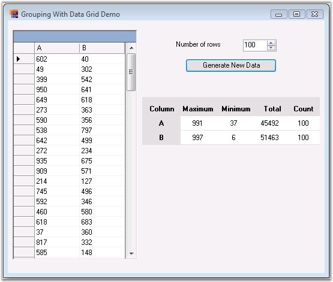

::: {style="DISPLAY: none"}
{#d2h_url_template}{#d2h_package_url style="WIDTH: 0px; DISPLAY: none; HEIGHT: 0px"}
:::

::::: {#nsbanner .d2h_main_nsbanner style="BORDER-BOTTOM: #999999 1px solid; POSITION: relative; PADDING-BOTTOM: 0px; BACKGROUND-COLOR: transparent; PADDING-LEFT: 0px; PADDING-RIGHT: 0px; DISPLAY: none; BORDER-TOP: #999999 1px solid; PADDING-TOP: 0px; LEFT: 0px"}
:::: {#TitleRow .d2h_main_titlerow style="PADDING-BOTTOM: 4px; BACKGROUND-COLOR: transparent; PADDING-LEFT: 22px; WIDTH: 100%; PADDING-RIGHT: 10px; DISPLAY: none; PADDING-TOP: 4px"}
::: {#ienav .d2h_main_ienav style="DISPLAY: none"}
{#D2HPrevious .D2HPreviousEnabled}  {#D2HNext .D2HNextEnabled}
:::
::::
:::::

::::: {#nstext .d2h_main_nstext style="PADDING-BOTTOM: 10px; BACKGROUND-COLOR: transparent; PADDING-LEFT: 22px; PADDING-RIGHT: 10px; HEIGHT: 100%; OVERFLOW: auto; PADDING-TOP: 5px" hasuserbackground="true" valign="bottom"}
::: {#d2h_breadcrumbs .d2h_breadcrumbs}
[Essential Studio User Guide Documentation](ms-xhelp:///?Id=12457748-09e3-4d74-a240-8e049cedf030){.d2h_breadcrumbsNormal}[ \> ]{.d2h_breadcrumbsLinkSeparator}[Reporting Edition](ms-xhelp:///?Id=027aa5b6-6676-4f93-ad23-c20e8c45792e){.d2h_breadcrumbsNormal}[ \> ]{.d2h_breadcrumbsLinkSeparator}[Essential Grouping](ms-xhelp:///?Id=37faf36d-c8f0-4c7d-90e1-39deecb620a6){.d2h_breadcrumbsNormal}[ \> ]{.d2h_breadcrumbsLinkSeparator}[Overview](ms-xhelp:///?Id=4c4518cb-625d-4e39-b2b3-86703eaeb52f){.d2h_breadcrumbsNormal}
:::

## Introduction to Essential Grouping {#introduction-to-essential-grouping style="tab-stops: 0pt"}

[]{style="FONT-FAMILY: 'Trebuchet MS','sans-serif'; COLOR: black; FONT-SIZE: 9pt"} 

Essential Grouping is a 100% Native .NET library that provides you with support for managing and manipulating tabular information without dependencies on any particular UI component. Our grouping framework can be used in any .NET environment, including C#, VB.NET, and managed C++.

 

Syncfusion Essential Grouping is a data technology that allows you to easily access, manipulate, and display your data in a variety of configurations. Your data source can be any IList object whose items have public properties. You can easily sort the items on one or several of these public properties. You can display and retrieve items based on the grouping that is produced through these sorts, you can include caption information and / or summary information on these groups; you can impose filters on the items, retrieving only items that specify your filter conditions and you can also add expression properties to display calculated values depending upon other properties in the item.

[]{style="FONT-FAMILY: 'Trebuchet MS','sans-serif'; COLOR: #15428b; FONT-SIZE: 9pt"} 

Figure 1: Grouping in Data Grid

[]{style="FONT-FAMILY: 'Trebuchet MS','sans-serif'; COLOR: black; FONT-SIZE: 9pt"} 

Key Features

[]{style="FONT-FAMILY: 'Trebuchet MS','sans-serif'; COLOR: black; FONT-SIZE: 9pt"} 

Some of the key features of Essential Grouping are listed below:

[]{style="FONT-FAMILY: 'Trebuchet MS','sans-serif'; COLOR: #15428b; FONT-SIZE: 9pt"} 

[·      ]{style="FONT-FAMILY: Symbol"}Grouping supports data presentation techniques like sorting, grouping, adding caption and summary information for the groups.

[·      ]{style="FONT-FAMILY: Symbol"}Grouping also supports nested tables and hierarchies in the form of related tables.

[·      ]{style="FONT-FAMILY: Symbol"}The grouping technology uses balanced binary trees as the core data structure instead of arrays. Binary trees have this advantage whereby parent branches can cache information about their children. This allows position information and summary information to be cached in parent branches facilitating quick inserts of new records honoring any sort of criteria that is applied. Inserting, removing, and moving of records takes \\ only Log2(n) operations. With linear lookup structures such as an ArrayList, each of these operations would take O(n) operations.

[·      ]{style="FONT-FAMILY: Symbol"}Expressions can be any well-formed algebraic combination of property (column) names enclosed with brackets (\[\]), numerical constants and literals, and the algebraic and logical operators.

[·      ]{style="FONT-FAMILY: Symbol"}Grouping is a recursive process whereby a data source may be grouped several times. This leads to the recursive situation of groups having sub-groups and so on.

[]{style="FONT-FAMILY: 'Trebuchet MS','sans-serif'; COLOR: #15428b; FONT-SIZE: 9pt"} 

User Guide Organization

[]{style="FONT-FAMILY: 'Trebuchet MS','sans-serif'; COLOR: #15428b; FONT-SIZE: 9pt"} 

The product comes with numerous samples as well as an extensive documentation to guide you. This User Guide provides detailed information on the features and functionalities of Essential Grouping. It is organized into the following sections:

[]{style="FONT-FAMILY: 'Trebuchet MS','sans-serif'; COLOR: #15428b; FONT-SIZE: 9pt"} 

[·      ]{style="FONT-FAMILY: Symbol"}**Overview**-This section gives a brief introduction to our product and its key features.

[·      ]{style="FONT-FAMILY: Symbol"}**Installation and Deployment**-This section elaborates on the install location of the samples, license etc.

[·      ]{style="FONT-FAMILY: Symbol"}**Getting Started**-This section guides you on getting started with various platform application, controls etc.

[·      ]{style="FONT-FAMILY: Symbol"}**Concepts and Features**-The features of Essential Grouping is illustrated with use case scenarios, code examples and screen shots under this section.

[·      ]{style="FONT-FAMILY: Symbol"}**Frequently Asked Questions**-This section illustrates the solutions for various task-based queries about Grouping.

**[]{style="FONT-FAMILY: 'Trebuchet MS','sans-serif'; COLOR: #15428b"}** 

Document Conventions

**[]{style="FONT-FAMILY: 'Trebuchet MS','sans-serif'; COLOR: #15428b; FONT-SIZE: 9pt"}** 

The conventions listed below will help you to quickly identify the important sections of information, while using the content:

[]{style="FONT-FAMILY: 'Trebuchet MS','sans-serif'; COLOR: #15428b; FONT-SIZE: 9pt"} 

Table 1: Document Conventions

::: {align="center"}
  ------------------------ ----------------------------------------- ---------------------------------------------------------------------------
  Convention               Icon                                      Description
  Note                     ***Note:***   Represents important information
  Example                  **Example**                               Represents an example
  Tip                                    Represents useful hints that will help you in using the controls/features
  Additional Information                 Represents additional information on the topic
  ------------------------ ----------------------------------------- ---------------------------------------------------------------------------
:::

 

 

 

[]{#related-topics}
:::::
