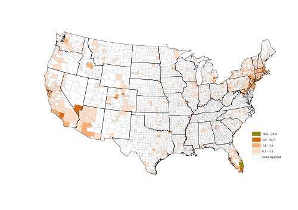

::: {style="DISPLAY: none"}
{#d2h_url_template}{#d2h_package_url style="WIDTH: 0px; DISPLAY: none; HEIGHT: 0px"}
:::

::::: {#nsbanner .d2h_main_nsbanner style="BORDER-BOTTOM: #999999 1px solid; POSITION: relative; PADDING-BOTTOM: 0px; BACKGROUND-COLOR: transparent; PADDING-LEFT: 0px; PADDING-RIGHT: 0px; DISPLAY: none; BORDER-TOP: #999999 1px solid; PADDING-TOP: 0px; LEFT: 0px"}
:::: {#TitleRow .d2h_main_titlerow style="PADDING-BOTTOM: 4px; BACKGROUND-COLOR: transparent; PADDING-LEFT: 22px; WIDTH: 100%; PADDING-RIGHT: 10px; DISPLAY: none; PADDING-TOP: 4px"}
::: {#ienav .d2h_main_ienav style="DISPLAY: none"}
{#D2HPrevious .D2HPreviousEnabled}  {#D2HNext .D2HNextEnabled}
:::
::::
:::::

:::: {#nstext .d2h_main_nstext style="PADDING-BOTTOM: 10px; BACKGROUND-COLOR: transparent; PADDING-LEFT: 22px; PADDING-RIGHT: 10px; HEIGHT: 100%; OVERFLOW: auto; PADDING-TOP: 5px" hasuserbackground="true" valign="bottom"}
::: {#d2h_breadcrumbs .d2h_breadcrumbs}
[Essential Studio User Guide Documentation](ms-xhelp:///?Id=12457748-09e3-4d74-a240-8e049cedf030){.d2h_breadcrumbsNormal}[ \> ]{.d2h_breadcrumbsLinkSeparator}[User Interface Edition](ms-xhelp:///?Id=c29296b7-531c-413b-a0ec-488ca1f7f669){.d2h_breadcrumbsNormal}[ \> ]{.d2h_breadcrumbsLinkSeparator}[Essential WPF](ms-xhelp:///?Id=7f4f82c5-151c-4262-94d0-75c4626c77bc){.d2h_breadcrumbsNormal}[ \> ]{.d2h_breadcrumbsLinkSeparator}[Essential Maps]{.d2h_breadcrumbsContentsOnly}[ \> ]{.d2h_breadcrumbsLinkSeparator}[Overview](ms-xhelp:///?Id=2d3315cd-a9b6-4b71-a45e-b53f794976f1){.d2h_breadcrumbsNormal}
:::

## Introduction to Essential Maps {#introduction-to-essential-maps style="tab-stops: 0pt"}

Essential Maps is a graphical Representation of the Geographical data. It is used to represent the statistical data of a particular geographical area on the Earth. Using Pan and Zoom, the Maps can be navigated. Inbuilt Navigation control makes it easy to navigate through the map.

Essential Maps is a control for the developers who develop geographical projects.

IT Scenario

Essential Map is used to represent a geographical area with some statistical data. For example, the population density of a country

.

Figure 1: Map Control Showing Population Statistics

Key Features:

The following are the key features

[·      ]{style="FONT-FAMILY: Symbol"}Supports Shape Files

[·      ]{style="FONT-FAMILY: Symbol"}Zooming and Panning

[·      ]{style="FONT-FAMILY: Symbol"}ColorPalette Support

[·      ]{style="FONT-FAMILY: Symbol"}Layer Support

[·      ]{style="FONT-FAMILY: Symbol"}Navigation Control

[·      ]{style="FONT-FAMILY: Symbol"}Events

[·      ]{style="FONT-FAMILY: Symbol"}Commands

[·      ]{style="FONT-FAMILY: Symbol"}Tooltips

 

[]{#related-topics}
::::
