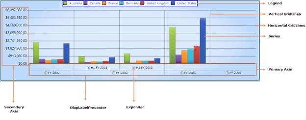

::: {style="DISPLAY: none"}
{#d2h_url_template}{#d2h_package_url style="WIDTH: 0px; DISPLAY: none; HEIGHT: 0px"}
:::

::::: {#nsbanner .d2h_main_nsbanner style="BORDER-BOTTOM: #999999 1px solid; POSITION: relative; PADDING-BOTTOM: 0px; BACKGROUND-COLOR: transparent; PADDING-LEFT: 0px; PADDING-RIGHT: 0px; DISPLAY: none; BORDER-TOP: #999999 1px solid; PADDING-TOP: 0px; LEFT: 0px"}
:::: {#TitleRow .d2h_main_titlerow style="PADDING-BOTTOM: 4px; BACKGROUND-COLOR: transparent; PADDING-LEFT: 22px; WIDTH: 100%; PADDING-RIGHT: 10px; DISPLAY: none; PADDING-TOP: 4px"}
::: {#ienav .d2h_main_ienav style="DISPLAY: none"}
{#D2HPrevious .D2HPreviousEnabled}  {#D2HNext .D2HNextEnabled}
:::
::::
:::::

::::: {#nstext .d2h_main_nstext style="PADDING-BOTTOM: 10px; BACKGROUND-COLOR: transparent; PADDING-LEFT: 22px; PADDING-RIGHT: 10px; HEIGHT: 100%; OVERFLOW: auto; PADDING-TOP: 5px" hasuserbackground="true" valign="bottom"}
::: {#d2h_breadcrumbs .d2h_breadcrumbs}
[Essential Studio User Guide Documentation](ms-xhelp:///?Id=12457748-09e3-4d74-a240-8e049cedf030){.d2h_breadcrumbsNormal}[ \> ]{.d2h_breadcrumbsLinkSeparator}[Business Intelligence Edition](ms-xhelp:///?Id=fdf33dd8-62b2-47b9-ad7b-fc50e590bca5){.d2h_breadcrumbsNormal}[ \> ]{.d2h_breadcrumbsLinkSeparator}[Essential BI Silverlight](ms-xhelp:///?Id=c006b39c-6aa2-4637-b7de-3e7b6cb3f9f9){.d2h_breadcrumbsNormal}[ \> ]{.d2h_breadcrumbsLinkSeparator}[Essential BI Chart]{.d2h_breadcrumbsContentsOnly}[ \> ]{.d2h_breadcrumbsLinkSeparator}[Overview](ms-xhelp:///?Id=d73529dc-6605-4a14-89e6-9d8f97afb39c){.d2h_breadcrumbsNormal}
:::

## Introduction to Essential OLAP Chart Silverlight {#introduction-to-essential-olap-chart-silverlight style="tab-stops: 0pt"}

[]{style="FONT-FAMILY: 'Calibri','sans-serif'"} 

Essential OLAP Chart is a tool, which is used to represent Multidimensional Data.

The main functionality of the OLAP Chart is as follows:

[·      ]{style="FONT-FAMILY: Symbol"}Summarizes a large amount of information and represents it in a graph format.

[·      ]{style="FONT-FAMILY: Symbol"}Automatically displays the retrieved OLAP data by data binding to an OlapDataManager.

[·      ]{style="FONT-FAMILY: Symbol"}Renders the results of an OLAP query in a cross tab UI.

[·      ]{style="FONT-FAMILY: Symbol"}Provides drill down and drill up functionality.

[]{style="FONT-FAMILY: 'Calibri','sans-serif'"} 

[]{style="FONT-FAMILY: 'Calibri','sans-serif'"} 

 

Figure 1: OLAP Chart Control

Key Features

The important features of the OLAP Chart controls are as follows:

[]{style="FONT-FAMILY: 'Trebuchet MS','sans-serif'; COLOR: #15428b; FONT-SIZE: 9pt"} 

[·      ]{style="FONT-FAMILY: Symbol"}Provides multi-level drill up/down.

[·      ]{style="FONT-FAMILY: Symbol"}Supports appearance customization.

[·      ]{style="FONT-FAMILY: Symbol"}Supports series customization.

[·      ]{style="FONT-FAMILY: Symbol"}Supports binding of IList data to the data source.

[]{#_Installation}**[]{style="FONT-FAMILY: 'Trebuchet MS','sans-serif'; COLOR: #15428b; FONT-SIZE: 9pt"}** 

User Guide Organization

[]{#_Introduction_to_Essential}The product comes with numerous samples as well as an extensive documentation to guide you. This User Guide provides detailed information on the features and functionalities of the OLAP Chart control. It is organized into the following sections:

 

[·      ]{style="FONT-FAMILY: Symbol"}Overview - This section gives a brief introduction to our product and its key features.

[·      ]{style="FONT-FAMILY: Symbol"}Deployment - This section elaborates on the install location of the samples, license, and so on.

[·      ]{style="FONT-FAMILY: Symbol"}What\'s New - This section lists the new features implemented for every release.

[·      ]{style="FONT-FAMILY: Symbol"}Getting Started - This section guides you on getting started with BI application, OLAP Chart control, and so on.

[·      ]{style="FONT-FAMILY: Symbol"}Concepts and Features - The features of OLAP Chart control are illustrated with use case scenarios, code examples and screen shots under this section.

 

Document Conventions

**[]{style="FONT-FAMILY: 'Trebuchet MS','sans-serif'; COLOR: #15428b; FONT-SIZE: 9pt"}** 

The following conventions will help you to quickly identify the important sections of information while using the content.

 

Table 1: Document Conventions

::: {align="center"}
  ------------------------ ------------------------------------------------------------------------------------------------- ---------------------------------------------------------------------------
  Convention               Icon                                                                                              Description
  Note                     ***Note:***                                                           Represents important information
  Example                  **Example**                                                                                       Represents an example
  Tip                                 Represents useful hints that will help you in using the controls/features
  Additional Information      Represents additional information on the topic
  ------------------------ ------------------------------------------------------------------------------------------------- ---------------------------------------------------------------------------
:::

[]{#related-topics}
:::::
