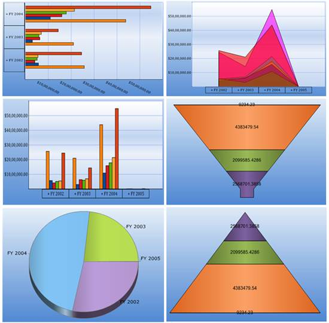

::: {style="DISPLAY: none"}
{#d2h_url_template}{#d2h_package_url style="WIDTH: 0px; DISPLAY: none; HEIGHT: 0px"}
:::

::::: {#nsbanner .d2h_main_nsbanner style="BORDER-BOTTOM: #999999 1px solid; POSITION: relative; PADDING-BOTTOM: 0px; BACKGROUND-COLOR: transparent; PADDING-LEFT: 0px; PADDING-RIGHT: 0px; DISPLAY: none; BORDER-TOP: #999999 1px solid; PADDING-TOP: 0px; LEFT: 0px"}
:::: {#TitleRow .d2h_main_titlerow style="PADDING-BOTTOM: 4px; BACKGROUND-COLOR: transparent; PADDING-LEFT: 22px; WIDTH: 100%; PADDING-RIGHT: 10px; DISPLAY: none; PADDING-TOP: 4px"}
::: {#ienav .d2h_main_ienav style="DISPLAY: none"}
{#D2HPrevious .D2HPreviousEnabled}  {#D2HNext .D2HNextEnabled}
:::
::::
:::::

::::: {#nstext .d2h_main_nstext style="PADDING-BOTTOM: 10px; BACKGROUND-COLOR: transparent; PADDING-LEFT: 22px; PADDING-RIGHT: 10px; HEIGHT: 100%; OVERFLOW: auto; PADDING-TOP: 5px" hasuserbackground="true" valign="bottom"}
::: {#d2h_breadcrumbs .d2h_breadcrumbs}
[Essential Studio User Guide Documentation](ms-xhelp:///?Id=12457748-09e3-4d74-a240-8e049cedf030){.d2h_breadcrumbsNormal}[ \> ]{.d2h_breadcrumbsLinkSeparator}[Business Intelligence Edition](ms-xhelp:///?Id=fdf33dd8-62b2-47b9-ad7b-fc50e590bca5){.d2h_breadcrumbsNormal}[ \> ]{.d2h_breadcrumbsLinkSeparator}[Essential BI ASP.NET](ms-xhelp:///?Id=99c6694e-59c3-4c59-abb5-ce9ce9a948bc){.d2h_breadcrumbsNormal}[ \> ]{.d2h_breadcrumbsLinkSeparator}[Essential BI Chart]{.d2h_breadcrumbsContentsOnly}[ \> ]{.d2h_breadcrumbsLinkSeparator}[Overview](ms-xhelp:///?Id=a7adb650-aa5b-4e6e-99d8-67399a4a2886){.d2h_breadcrumbsNormal}
:::

## Introduction to Essential OLAP Chart Web {#introduction-to-essential-olap-chart-web style="tab-stops: 0pt"}

Essential OLAP Chart for ASP.NET extends the chart control to help visualize Business Intelligence data buried in OLAP cubes. This interactive control uses SQL Server Analysis Services (SSAS) to retrieve and drill down multi-dimensional data and display the same. The OLAP Chart comes with rich presentation capabilities and is highly configurable.

OLAP Chart for web benefits users who want to display complex data in a diagrammatical representation for easy understanding of data.

 

Figure 1: OLAP Chart Types

 

Key Features

The important features of OLAP Chart controls are listed below:

[]{style="COLOR: black"} 

[·      ]{style="FONT-FAMILY: Symbol"}[[Label]{.UGHyperlink}](ms-xhelp:///?Id=189414e8-3e9f-45ee-8740-dcb0936fd21c)[ ]{.UGHyperlink}[*-* ]{.MsoHyperlink}Chart axis label is used to describe the category of values along the axis. 

 

[·      ]{style="FONT-FAMILY: Symbol"}[[Series]{.UGHyperlink}](ms-xhelp:///?Id=becdfa46-f1bf-4b7b-9d54-87c6f185b693)[ ]{.UGHyperlink}**-**   It is a collection of series items, which contains the actual data points displaying on the chart.

 

[·      ]{style="FONT-FAMILY: Symbol"}[[Legend]{.UGHyperlink}](ms-xhelp:///?Id=369f84c1-be25-48c9-beb7-8035edac4c59)[ ]{.UGHyperlink}***-*** Legend is a color code to help the user differentiate and has the names beside them that are got from Series1, Series2, and so on.  

 

[·      ]{style="FONT-FAMILY: Symbol"}[[Chart Types]{.UGHyperlink}](ms-xhelp:///?Id=11a8b8a5-faa3-4a18-ac73-7d73435f1963)[ ]{.MsoHyperlink}- The feature supports different types of charts such as line chart, step line chart, spline chart,  rotated spline chart, bar chart, stacked bar chart, stacked bar 100 chart, column chart, stacked column chart, stacked column 100 chart, area chart, spline area chart, stacking area chart, step area chart, pyramid chart, funnel chart and pie chart.

 

[·      ]{style="FONT-FAMILY: Symbol"}**Drill-Down Support -** Clicking on an item moves you to a level of greater detail. This feature is known as drill-down, which is supported in the *O*LAP chart.

 

[·      ]{style="FONT-FAMILY: Symbol"}**Relational Data Binding** - Supports binding of IList, DataTable  type data sources

                                                                                                               

[·      ]{style="FONT-FAMILY: Symbol"}[[Exporting]{.UGHyperlink}](ms-xhelp:///?Id=2394b447-8cde-44a1-935b-351fb00f1582)[ ]{.MsoHyperlink}**-** Essential Chart for Web offers capabilities to export a chart into various formats. The formats include Word, PDF and image.

 

[·      ]{style="FONT-FAMILY: Symbol"}[[Print and Print Preview]{.UGHyperlink}](ms-xhelp:///?Id=38980516-1ff8-4406-acbe-7ded3d34d138) ***-*** This feature enables the user to set a printer to be used, and it allows the user to define the chart. It also provides an overview of the document, showing how the document appears when printed.

 

[·      ]{style="FONT-FAMILY: Symbol"}[[ToolTip]{.UGHyperlink}](ms-xhelp:///?Id=14a4ecf7-e0a0-4d54-9897-d239919fb650) **-** When the user moves the cursor over an item, without clicking it, a tooltip may appear displaying the data point values of the respective chart series.

 

[·      ]{style="FONT-FAMILY: Symbol"}[[Zooming and scrolling]{.UGHyperlink}](ms-xhelp:///?Id=c787df7c-ba39-4111-b39e-69b2729e74e4)[ ]{.UGHyperlink}**-** Zooming and Scrolling feature enables the user to zoom into an area of the chart so the data is viewed clearly.

 

[·      ]{style="FONT-FAMILY: Symbol"}[[3D]{.UGHyperlink}](ms-xhelp:///?Id=b89c82e7-1263-4214-bb06-0d5238edbcea)[ ]{.UGHyperlink}**-** Three dimensional view of the chart is supported.

 

[·      ]{style="FONT-FAMILY: Symbol"}[[Chart Style Dialog box]{.UGHyperlink}](ms-xhelp:///?Id=f87f08e1-8291-426c-8261-95f843231a4e)[ ]{.UGHyperlink}**-** The appearance of the chart can be changed using the *Style* dialog box, in order to improve the look and feel of the chart control.

[]{style="COLOR: black"} 

User Guide Organization

[]{#_Introduction_to_Essential}The product comes with numerous samples as well as an extensive documentation to guide you. This user guide gives detailed information on features and functionalities of the OLAP Chart control. It is organized into the following sections:

[·      ]{style="FONT-FAMILY: Symbol"}Overview - This section gives a brief introduction to our product and its key features.

[·      ]{style="FONT-FAMILY: Symbol"}Deployment - This section elaborates on the install location of the samples, license, and so on.

[·      ]{style="FONT-FAMILY: Symbol"}What\'s New - This section lists the new features implemented for every release.

[·      ]{style="FONT-FAMILY: Symbol"}Getting Started - This section guides you on getting started with the BI application, OLAP Chart control, and so on.

[·      ]{style="FONT-FAMILY: Symbol"}Concepts and Features - The features of OLAP Chart control are illustrated with use case scenarios, code examples and screen shots under this section.

 

Document Conventions

[]{style="COLOR: #15428b; FONT-SIZE: 12pt"} 

The following conventions will help you to quickly identify the important sections of information while using the content.

Table 1: Document Conventions

 

::: {align="center"}
  Convention               Icon                                                                                                          Description
  ------------------------ ------------------------------------------------------------------------------------------------------------- ---------------------------------------------------------------------------
  Note                     {border="0"}***Note:***                                                           Represents important information
  Example                  **Example**                                                                                                   Represents an example
  Tip                      {border="0"}           Represents useful hints that will help you in using the controls/features
  Additional Information   {border="0"}   Represents additional information on the topic
:::

[]{#related-topics}
:::::
