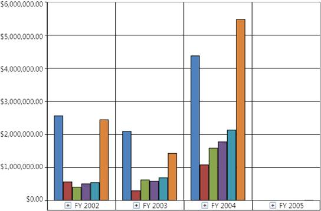

::: {style="DISPLAY: none"}
{#d2h_url_template}{#d2h_package_url style="WIDTH: 0px; DISPLAY: none; HEIGHT: 0px"}
:::

::::: {#nsbanner .d2h_main_nsbanner style="BORDER-BOTTOM: #999999 1px solid; POSITION: relative; PADDING-BOTTOM: 0px; BACKGROUND-COLOR: transparent; PADDING-LEFT: 0px; PADDING-RIGHT: 0px; DISPLAY: none; BORDER-TOP: #999999 1px solid; PADDING-TOP: 0px; LEFT: 0px"}
:::: {#TitleRow .d2h_main_titlerow style="PADDING-BOTTOM: 4px; BACKGROUND-COLOR: transparent; PADDING-LEFT: 22px; WIDTH: 100%; PADDING-RIGHT: 10px; DISPLAY: none; PADDING-TOP: 4px"}
::: {#ienav .d2h_main_ienav style="DISPLAY: none"}
{#D2HPrevious .D2HPreviousEnabled}  {#D2HNext .D2HNextEnabled}
:::
::::
:::::

::::: {#nstext .d2h_main_nstext style="PADDING-BOTTOM: 10px; BACKGROUND-COLOR: transparent; PADDING-LEFT: 22px; PADDING-RIGHT: 10px; HEIGHT: 100%; OVERFLOW: auto; PADDING-TOP: 5px" hasuserbackground="true" valign="bottom"}
::: {#d2h_breadcrumbs .d2h_breadcrumbs}
[Essential Studio User Guide Documentation](ms-xhelp:///?Id=12457748-09e3-4d74-a240-8e049cedf030){.d2h_breadcrumbsNormal}[ \> ]{.d2h_breadcrumbsLinkSeparator}[Business Intelligence Edition](ms-xhelp:///?Id=fdf33dd8-62b2-47b9-ad7b-fc50e590bca5){.d2h_breadcrumbsNormal}[ \> ]{.d2h_breadcrumbsLinkSeparator}[Essential BI WPF](ms-xhelp:///?Id=41e3d586-d922-4a01-8272-679fe4ae7343){.d2h_breadcrumbsNormal}[ \> ]{.d2h_breadcrumbsLinkSeparator}[Essential BI Chart]{.d2h_breadcrumbsContentsOnly}[ \> ]{.d2h_breadcrumbsLinkSeparator}[Essential OLAP Chart for WPF](ms-xhelp:///?Id=4d89e52f-a14a-4da7-a710-b908bfbede08){.d2h_breadcrumbsNormal}[ \> ]{.d2h_breadcrumbsLinkSeparator}[Overview](ms-xhelp:///?Id=c0aeec70-7a56-44cc-a630-bea8ef617668){.d2h_breadcrumbsNormal}
:::

### Introduction to Essential OLAP Chart WPF {#introduction-to-essential-olap-chart-wpf style="tab-stops: 0pt"}

 

Essential OLAP Chart control allows you to efficiently visualize the multidimensional data from the OLAP data source, with the help of a report, which is bound to it.

 

 

Figure 1: OlapChart Control[]{style="FONT-FAMILY: 'Calibri','sans-serif'; FONT-SIZE: 11pt"}

[]{style="FONT-FAMILY: 'Calibri','sans-serif'; FONT-SIZE: 11pt"} 

Key Features

 

The important features of OLAP Chart controls are as follows:

 

[·      ]{style="FONT-FAMILY: Symbol"}Provides multi-level drill down support -- Enables you to visualize a multi-level data in the chart. You can drill down/up the hierarchies natively.

[·      ]{style="FONT-FAMILY: Symbol"}Provides KPI support -- Allows you to visualize the KPI Status, Trend, Goal, and value in different chart types.

[·      ]{style="FONT-FAMILY: Symbol"}Enables you to customize the area, axis, series, legends, and chart types easily.

[·      ]{style="FONT-FAMILY: Symbol"}Provides exporting support -- Allows you to export the OlapChart into various formats such as Pdf, Excel, Word, and Image formats.

[·      ]{style="FONT-FAMILY: Symbol"}Provides printing support -- Allows you to customize and print either in color mode or in black and white.

[·      ]{style="FONT-FAMILY: Symbol"}Provides zooming and scrolling support -- Allows you to zoom and scroll across the chart.

[·      ]{style="FONT-FAMILY: Symbol"}Provides ToolTip support -- Allows you to visualize the data point related values in a form of ToolTip.

[·      ]{style="FONT-FAMILY: Symbol"}Provides theme support -- Allows you to customize the OlapChart with the 6 in-built business themes.

 

**User Guide Organization**

 

[]{#_Introduction_to_Essential}The product comes with numerous samples as well as an extensive documentation to guide you. This User Guide provides detailed information on the features and functionalities of the OLAP Chart control. It is organized into the following sections:

 

[·      ]{style="FONT-FAMILY: Symbol"}Overview - This section gives a brief introduction to our product and its key features.

[·      ]{style="FONT-FAMILY: Symbol"}Deployment - This section elaborates on the install location of the samples, license, and so on.

[·      ]{style="FONT-FAMILY: Symbol"}What\'s New - This section lists the new features implemented for every release.

[·      ]{style="FONT-FAMILY: Symbol"}Getting Started - This section guides you on getting started with BI application, OLAP Chart control, and so on.

[·      ]{style="FONT-FAMILY: Symbol"}Concepts and Features - The features of OLAP Chart control are illustrated with use case scenarios, code examples and screen shots under this section.

 

Document Conventions

 

The following conventions will help you to quickly identify the important sections of information while using the content.

 

::: {align="center"}
+------------------------+-------------------------------------------------------------------------------------------------------------------------------------------------------------------------------------------------------------------------------------------------------------+---------------------------------------------------------------------------+
| Convention             | Icon                                                                                                                                                                                                                                                        | Description                                                               |
+------------------------+-------------------------------------------------------------------------------------------------------------------------------------------------------------------------------------------------------------------------------------------------------------+---------------------------------------------------------------------------+
| Note                   | ::: {style="BORDER-BOTTOM: windowtext 1pt solid; BORDER-LEFT: medium none; PADDING-BOTTOM: 1pt; MARGIN-TOP: 9pt; PADDING-LEFT: 0pt; PADDING-RIGHT: 0pt; MARGIN-BOTTOM: 9pt; BORDER-TOP: windowtext 1pt solid; BORDER-RIGHT: medium none; PADDING-TOP: 1pt"} | Represents important information                                          |
|                        |                                                                                                                                                                                                                                                             |                                                                           |
|                        |                                                                                                                                                                                                                                                             |                                                                           |
|                        | Note:                                                                                                                                                                                                                           |                                                                           |
|                        | :::                                                                                                                                                                                                                                                         |                                                                           |
+------------------------+-------------------------------------------------------------------------------------------------------------------------------------------------------------------------------------------------------------------------------------------------------------+---------------------------------------------------------------------------+
| Example                | **Example**                                                                                                                                                                                                                                                 | Represents an example                                                     |
+------------------------+-------------------------------------------------------------------------------------------------------------------------------------------------------------------------------------------------------------------------------------------------------------+---------------------------------------------------------------------------+
| Tip                    |                                                                                                                                                                                                                                 | Represents useful hints that will help you in using the controls/features |
+------------------------+-------------------------------------------------------------------------------------------------------------------------------------------------------------------------------------------------------------------------------------------------------------+---------------------------------------------------------------------------+
| Additional Information |                                                                                                                                                                                                                                 | Represents additional information on the topic                            |
+------------------------+-------------------------------------------------------------------------------------------------------------------------------------------------------------------------------------------------------------------------------------------------------------+---------------------------------------------------------------------------+
:::

[]{#_Prerequisites_and_Compatibility}[]{style="FONT-FAMILY: 'Calibri','sans-serif'; FONT-SIZE: 11pt"} 

[]{#related-topics}
:::::
