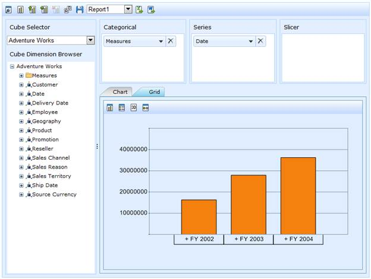

::: {style="DISPLAY: none"}
{#d2h_url_template}{#d2h_package_url style="WIDTH: 0px; DISPLAY: none; HEIGHT: 0px"}
:::

::::: {#nsbanner .d2h_main_nsbanner style="BORDER-BOTTOM: #999999 1px solid; POSITION: relative; PADDING-BOTTOM: 0px; BACKGROUND-COLOR: transparent; PADDING-LEFT: 0px; PADDING-RIGHT: 0px; DISPLAY: none; BORDER-TOP: #999999 1px solid; PADDING-TOP: 0px; LEFT: 0px"}
:::: {#TitleRow .d2h_main_titlerow style="PADDING-BOTTOM: 4px; BACKGROUND-COLOR: transparent; PADDING-LEFT: 22px; WIDTH: 100%; PADDING-RIGHT: 10px; DISPLAY: none; PADDING-TOP: 4px"}
::: {#ienav .d2h_main_ienav style="DISPLAY: none"}
{#D2HPrevious .D2HPreviousEnabled}  {#D2HNext .D2HNextEnabled}
:::
::::
:::::

::::: {#nstext .d2h_main_nstext style="PADDING-BOTTOM: 10px; BACKGROUND-COLOR: transparent; PADDING-LEFT: 22px; PADDING-RIGHT: 10px; HEIGHT: 100%; OVERFLOW: auto; PADDING-TOP: 5px" hasuserbackground="true" valign="bottom"}
::: {#d2h_breadcrumbs .d2h_breadcrumbs}
[Essential Studio User Guide Documentation](ms-xhelp:///?Id=12457748-09e3-4d74-a240-8e049cedf030){.d2h_breadcrumbsNormal}[ \> ]{.d2h_breadcrumbsLinkSeparator}[Business Intelligence Edition](ms-xhelp:///?Id=fdf33dd8-62b2-47b9-ad7b-fc50e590bca5){.d2h_breadcrumbsNormal}[ \> ]{.d2h_breadcrumbsLinkSeparator}[Essential BI ASP.NET](ms-xhelp:///?Id=99c6694e-59c3-4c59-abb5-ce9ce9a948bc){.d2h_breadcrumbsNormal}[ \> ]{.d2h_breadcrumbsLinkSeparator}[Essential BI Client]{.d2h_breadcrumbsContentsOnly}[ \> ]{.d2h_breadcrumbsLinkSeparator}[Overview](ms-xhelp:///?Id=de7b1e78-4fb1-4c05-80f5-2e938a2d4c42){.d2h_breadcrumbsNormal}
:::

## Introduction to Essential OLAP Client Web {#introduction-to-essential-olap-client-web style="tab-stops: 0pt"}

 

Essential OLAP Client control is a visualization tool that allows you to slice and dice the OLAP data and visualize the result in graphical and tabular format (i.e.) in chart and grid. And also you can maintain the state of OLAP Client for later use by saving the state in a XML file called report set.

OLAP Client is composed of the following components:

[·      ]{style="FONT-FAMILY: Symbol"}**Cube Selector**: Comprises of multiple cubes obtained from the data source.

[·      ]{style="FONT-FAMILY: Symbol"}**Cube dimension browser**: Tree-View structure that comprises dimension and measure belonging to current cube into independent logical groups.

[·      ]{style="FONT-FAMILY: Symbol"}**Axis element builder**: Collection of axes namely categorical, series and slicer.

[·      ]{style="FONT-FAMILY: Symbol"}**Elements Editor**: The Tree-view control displays the member element of current dimension as well as holds a collection of measures.

[·      ]{style="FONT-FAMILY: Symbol"}**Toolbar**: Contains the relevant buttons for report, chart and grid control operation.

[·      ]{style="FONT-FAMILY: Symbol"}**Chart**: A chart is a graphical representation of data, in which the data is represented by symbols such as bars in bar chart, lines in line chart, or slices in pie chart.

[·      ]{style="FONT-FAMILY: Symbol"}**Grid**: A grid is a tabular representation of data, arranged in the form of rows and columns, categorized accordingly.

 

Figure 1: OLAP Client

Key Features

The important features of OLAP Client controls are listed below:

[·      ]{style="FONT-FAMILY: Symbol"}[[Slice and dice]{.UGHyperlink}](ms-xhelp:///?Id=79d4d141-72e2-4106-9cd6-d6bf0144626a) - You can slice and dice the cube data. The data is arranged in a tree-like format, placed under cube dimension browser and the slice and dice operation is carried under the **Axis Element Builder.**

[·      ]{style="FONT-FAMILY: Symbol"}[[Saving]{.UGHyperlink}](ms-xhelp:///?Id=0e1ce6f6-d8fd-42fb-81e0-e174ea5516a7)[ ]{.UGHyperlink}**and** [[re-loading]{.UGHyperlink}](ms-xhelp:///?Id=0e1ce6f6-d8fd-42fb-81e0-e174ea5516a7)[ ]{.UGHyperlink}**current session** - You can save your current session in an XML file format and reload it whenever needed.

[·      ]{style="FONT-FAMILY: Symbol"}**Drill down/up support** - The Grid and Chart controls let you drill down/up the hierarchies natively.

[·      ]{style="FONT-FAMILY: Symbol"}[[Exporting]{.UGHyperlink}](ms-xhelp:///?Id=ea929c26-cdd7-42b2-9664-5408683ac98c) - You can also export the Grid and Chart to MS-Excel and Word formats.

 

User Guide Organization

[]{#_Introduction_to_Essential}The product comes with numerous samples as well as an extensive documentation to guide you. This User Guide provides detailed information on the features and functionalities of OLAP Client control. It is organized into the following sections:

[·      ]{style="FONT-FAMILY: Symbol"}Overview - This section gives a brief introduction to our product and its key features.

[·      ]{style="FONT-FAMILY: Symbol"}Deployment - This section elaborates on the install location of the samples, license, and so on.

[·      ]{style="FONT-FAMILY: Symbol"}What\'s New - This section lists the new features implemented for every release.

[·      ]{style="FONT-FAMILY: Symbol"}Getting Started - This section guides you on getting started with BI application, OLAP Client control, and so on.

[·      ]{style="FONT-FAMILY: Symbol"}Concepts and Features - The features of OLAP Client control are illustrated with use case scenarios, code examples and screen shots under this section.

 

Document Conventions

The following conventions will help you to quickly identify the important sections of information while using the content.

Table 1: Document Conventions

 

::: {align="center"}
  ------------------------ ------------------------------------------------------------------------------------------------------------- ---------------------------------------------------------------------------
  Convention               Icon                                                                                                          Description
  Note                     {border="0"}***Note:***                                                           Represents important information
  Example                  **Example**                                                                                                   Represents an example
  Tip                      {border="0"}           Represents useful hints that will help you in using the controls/features
  Additional Information   {border="0"}   Represents additional information on the topic
  ------------------------ ------------------------------------------------------------------------------------------------------------- ---------------------------------------------------------------------------
:::

[]{#_Prerequisites_and_Compatibility} 

[]{#related-topics}
:::::
