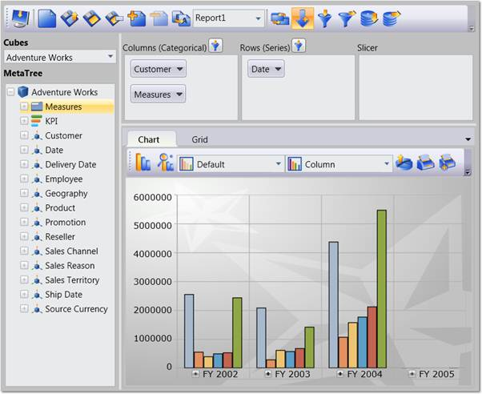

::: {style="DISPLAY: none"}
{#d2h_url_template} {#d2h_package_url style="WIDTH: 0px; DISPLAY: none; HEIGHT: 0px"}
:::

::::: {#nsbanner .d2h_main_nsbanner style="BORDER-BOTTOM: #999999 1px solid; POSITION: relative; PADDING-BOTTOM: 0px; BACKGROUND-COLOR: transparent; PADDING-LEFT: 0px; PADDING-RIGHT: 0px; DISPLAY: none; BORDER-TOP: #999999 1px solid; PADDING-TOP: 0px; LEFT: 0px"}
:::: {#TitleRow .d2h_main_titlerow style="PADDING-BOTTOM: 4px; BACKGROUND-COLOR: transparent; PADDING-LEFT: 22px; WIDTH: 100%; PADDING-RIGHT: 10px; DISPLAY: none; PADDING-TOP: 4px"}
::: {#ienav .d2h_main_ienav style="DISPLAY: none"}
{#D2HPrevious .D2HPreviousEnabled}  {#D2HNext .D2HNextEnabled}
:::
::::
:::::

::::: {#nstext .d2h_main_nstext style="PADDING-BOTTOM: 10px; BACKGROUND-COLOR: transparent; PADDING-LEFT: 22px; PADDING-RIGHT: 10px; HEIGHT: 100%; OVERFLOW: auto; PADDING-TOP: 5px" hasuserbackground="true" valign="bottom"}
::: {#d2h_breadcrumbs .d2h_breadcrumbs}
[Essential Studio User Guide Documentation](ms-xhelp:///?Id=12457748-09e3-4d74-a240-8e049cedf030){.d2h_breadcrumbsNormal} [ \> ]{.d2h_breadcrumbsLinkSeparator} [Business Intelligence Edition](ms-xhelp:///?Id=fdf33dd8-62b2-47b9-ad7b-fc50e590bca5){.d2h_breadcrumbsNormal} [ \> ]{.d2h_breadcrumbsLinkSeparator} [Essential BI WPF](ms-xhelp:///?Id=41e3d586-d922-4a01-8272-679fe4ae7343){.d2h_breadcrumbsNormal} [ \> ]{.d2h_breadcrumbsLinkSeparator} [Essential BI Client]{.d2h_breadcrumbsContentsOnly} [ \> ]{.d2h_breadcrumbsLinkSeparator} [Overview](ms-xhelp:///?Id=2f1592d1-cd71-4c35-8552-505199fffdbf){.d2h_breadcrumbsNormal}
:::

## Introduction to Essential OLAP Client WPF {#introduction-to-essential-olap-client-wpf style="tab-stops: 0pt"}

 

Essential OLAP Client control lets you efficiently browse and analyze the multidimensional data from the OLAP data source. It lists all the Cubes, Dimensions, Measures and KPIs that are available in the data source, and lets you to slice and dice the cube. You can also create the report from the data source using OLAP Client and store it for later use. It also previews the report in the Grid and Chart while creating.

 

OLAP Client is composed of following components:

[·      ]{style="FONT-FAMILY: Symbol"} **Cube Selector:** Comprises multiple cubes obtained from data source.

[·      ]{style="FONT-FAMILY: Symbol"} **Cube dimension browser:** Tree-View structure that comprises dimensions and measures belonging to the current cube into independent logical groups.

[·      ]{style="FONT-FAMILY: Symbol"} **Axis element builder:** Contains the different elements of an axis.

[·      ]{style="FONT-FAMILY: Symbol"} **Member Editor:** Tree-view control that displays the member element of current dimension.

[·      ]{style="FONT-FAMILY: Symbol"} **Measure Editor:** Comprises a collection of measures.

[·      ]{style="FONT-FAMILY: Symbol"} **Toolbar:** Contains the relevant button for report, filter and sorting.

[·      ]{style="FONT-FAMILY: Symbol"} **Chart:** A chart is a graphical representation of [[data]{.UGHyperlink}](http://en.wikipedia.org/wiki/Data "Data"), in which \"the data is represented by [[symbols]{.UGHyperlink}](http://en.wikipedia.org/wiki/Symbol "Symbol"), such as bars in a [[bar chart]{.UGHyperlink}](http://en.wikipedia.org/wiki/Bar_chart "Bar chart"), lines in a [[line chart]{.UGHyperlink}](http://en.wikipedia.org/wiki/Line_chart "Line chart"), or slices in a [[pie chart]{.UGHyperlink}](http://en.wikipedia.org/wiki/Pie_chart "Pie chart")\".

[·      ]{style="FONT-FAMILY: Symbol"} **Grid:** A grid is a tabular representation of data, arranged in the form of rows and columns and categorized accordingly.

{border="0"}

Figure 1: OLAP Client WPF Control

Key Features

The Important features of OLAP Client controls are listed below.

 

[Slice and Dice]{.UGHyperlink} [[]{style="FONT-FAMILY: 'Calibri','sans-serif'; COLOR: blue"}]{.underline} **[ ]{style="FONT-FAMILY: 'Calibri','sans-serif'; COLOR: black"}** [- ]{style="FONT-FAMILY: 'Calibri','sans-serif'; COLOR: black"}You can slice and dice the Cube Data Base.

[Saving]{.UGHyperlink} **[]{style="FONT-FAMILY: 'Calibri','sans-serif'; COLOR: black"}the current session** - You can save your current session in an XML file or in a Stream for future use and reload it whenever needed.

**Pivot Toggling** - You can easily toggle the pivot if required by the click of button.

[Filter]{.UGHyperlink} **[]{style="FONT-FAMILY: 'Calibri','sans-serif'; COLOR: black"}** and**[]{style="FONT-FAMILY: 'Calibri','sans-serif'; COLOR: black"}**[Sorting]{.UGHyperlink}[ - ]{style="FONT-FAMILY: 'Calibri','sans-serif'; COLOR: black"}You can specify filters and sorting criteria by using the dialog boxes provided.

[Export]{.UGHyperlink} **[]{style="FONT-FAMILY: 'Calibri','sans-serif'; COLOR: black"}support** - You can also export the[]{style="FONT-FAMILY: 'Calibri','sans-serif'; COLOR: black"}[OlapGrid]{.UGHyperlink}[]{style="FONT-FAMILY: 'Calibri','sans-serif'; COLOR: black"}and [OlapChart]{.UGHyperlink}[]{style="FONT-FAMILY: 'Calibri','sans-serif'; COLOR: black"}to MS-Excel and other supported image formats. 

[]{style="FONT-FAMILY: 'Calibri','sans-serif'; COLOR: black; FONT-SIZE: 12pt"} 

User Guide Organization

[]{#_Introduction_to_Essential} 

The product comes with numerous samples as well as an extensive documentation to guide you. This User Guide provides detailed information on the features and functionalities of OLAP Client control. It is organized into the following sections:

 

[·      ]{style="FONT-FAMILY: Symbol"}Overview - This section gives a brief introduction to our product and its key features.

[·      ]{style="FONT-FAMILY: Symbol"}Deployment - This section elaborates on the install location of the samples, license, and so on.

[·      ]{style="FONT-FAMILY: Symbol"}What\'s New - This section lists the new features implemented for every release.

[·      ]{style="FONT-FAMILY: Symbol"}Getting Started - This section guides you on getting started with the BI application, OLAP Client control, and so on.

[·      ]{style="FONT-FAMILY: Symbol"}Concepts and Features - The features of OLAP Client control are illustrated with use case scenarios, code examples and screen shots under this section.

 

Document Conventions

 

The following conventions will help you to quickly identify the important sections of information while using the content.

[]{style="FONT-FAMILY: 'Trebuchet MS','sans-serif'; COLOR: #15428b; FONT-SIZE: 9pt"} 

[]{style="FONT-FAMILY: 'Trebuchet MS','sans-serif'; COLOR: #15428b; FONT-SIZE: 9pt"} 

::: {align="center"}
+------------------------+-------------------------------------------------------------------------------------------------------------------------------------------------------------------------------------------------------------------------------------------------------------+---------------------------------------------------------------------------+
| Convention             | Icon                                                                                                                                                                                                                                                        | Description                                                               |
+------------------------+-------------------------------------------------------------------------------------------------------------------------------------------------------------------------------------------------------------------------------------------------------------+---------------------------------------------------------------------------+
| Note                   | ::: {style="BORDER-BOTTOM: windowtext 1pt solid; BORDER-LEFT: medium none; PADDING-BOTTOM: 1pt; MARGIN-TOP: 9pt; PADDING-LEFT: 0pt; PADDING-RIGHT: 0pt; MARGIN-BOTTOM: 9pt; BORDER-TOP: windowtext 1pt solid; BORDER-RIGHT: medium none; PADDING-TOP: 1pt"} | Represents important information                                          |
|                        | {border="0"}Note:                                                                                                                                                                                                               |                                                                           |
|                        | :::                                                                                                                                                                                                                                                         |                                                                           |
+------------------------+-------------------------------------------------------------------------------------------------------------------------------------------------------------------------------------------------------------------------------------------------------------+---------------------------------------------------------------------------+
| Example                | Example                                                                                                                                                                                                                                                     | Represents an example                                                     |
+------------------------+-------------------------------------------------------------------------------------------------------------------------------------------------------------------------------------------------------------------------------------------------------------+---------------------------------------------------------------------------+
| Tip                    | {border="0"}                                                                                                                                                                                                                    | Represents useful hints that will help you in using the controls/features |
+------------------------+-------------------------------------------------------------------------------------------------------------------------------------------------------------------------------------------------------------------------------------------------------------+---------------------------------------------------------------------------+
| Additional Information | {border="0"}                                                                                                                                                                                                                    | Represents additional information on the topic                            |
+------------------------+-------------------------------------------------------------------------------------------------------------------------------------------------------------------------------------------------------------------------------------------------------------+---------------------------------------------------------------------------+
:::

[]{#related-topics}
:::::
