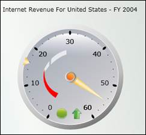

::: {style="DISPLAY: none"}
{#d2h_url_template}{#d2h_package_url style="WIDTH: 0px; DISPLAY: none; HEIGHT: 0px"}
:::

::::: {#nsbanner .d2h_main_nsbanner style="BORDER-BOTTOM: #999999 1px solid; POSITION: relative; PADDING-BOTTOM: 0px; BACKGROUND-COLOR: transparent; PADDING-LEFT: 0px; PADDING-RIGHT: 0px; DISPLAY: none; BORDER-TOP: #999999 1px solid; PADDING-TOP: 0px; LEFT: 0px"}
:::: {#TitleRow .d2h_main_titlerow style="PADDING-BOTTOM: 4px; BACKGROUND-COLOR: transparent; PADDING-LEFT: 22px; WIDTH: 100%; PADDING-RIGHT: 10px; DISPLAY: none; PADDING-TOP: 4px"}
::: {#ienav .d2h_main_ienav style="DISPLAY: none"}
{#D2HPrevious .D2HPreviousEnabled}  {#D2HNext .D2HNextEnabled}
:::
::::
:::::

::::: {#nstext .d2h_main_nstext style="PADDING-BOTTOM: 10px; BACKGROUND-COLOR: transparent; PADDING-LEFT: 22px; PADDING-RIGHT: 10px; HEIGHT: 100%; OVERFLOW: auto; PADDING-TOP: 5px" hasuserbackground="true" valign="bottom"}
::: {#d2h_breadcrumbs .d2h_breadcrumbs}
[Essential Studio User Guide Documentation](ms-xhelp:///?Id=12457748-09e3-4d74-a240-8e049cedf030){.d2h_breadcrumbsNormal}[ \> ]{.d2h_breadcrumbsLinkSeparator}[Business Intelligence Edition](ms-xhelp:///?Id=fdf33dd8-62b2-47b9-ad7b-fc50e590bca5){.d2h_breadcrumbsNormal}[ \> ]{.d2h_breadcrumbsLinkSeparator}[Essential BI Silverlight](ms-xhelp:///?Id=c006b39c-6aa2-4637-b7de-3e7b6cb3f9f9){.d2h_breadcrumbsNormal}[ \> ]{.d2h_breadcrumbsLinkSeparator}[Essential BI Gauge]{.d2h_breadcrumbsContentsOnly}[ \> ]{.d2h_breadcrumbsLinkSeparator}[Overview](ms-xhelp:///?Id=9859e226-bfe6-4e68-9732-fcb460eda92a){.d2h_breadcrumbsNormal}
:::

## Introduction to Essential OLAP Gauge for Silverlight {#introduction-to-essential-olap-gauge-for-silverlight style="tab-stops: 0pt"}

*Essential BI OLAP Gauge* for Silverlight is ideal for highlighting business critical *Key Performance Indicator* (KPI) information in executive dashboards and report cards. Gauges let you present values against goals in a very intuitive manner. Built-in data binding support allows you to easily bind a gauge to a KPI result from your OLAP database. The Gauge control comes with sophisticated customization support which provides endless possibility for control customization. It renders a value as a pointer against a circular scale. You can also easily build high quality dashboards and process controls.

[]{style="FONT-FAMILY: 'Calibri','sans-serif'"} 

 

Figure 1: OLAP Gauge Control

Key Features

The important features of *OLAP Gauge* control is listed below:

[·      ]{style="FONT-FAMILY: Symbol"}[[Multiple controls]{.UGHyperlink}](ms-xhelp:///?Id=d97acc1c-cbe2-4895-86bf-a3422226f286) - Support to display multiple OLAP Gauge controls.

[·      ]{style="FONT-FAMILY: Symbol"}[[Key Performance Indicator (KPI)]{.UGHyperlink}](ms-xhelp:///?Id=54aa070a-c1df-46e7-8b54-fcbc3d817d73) - Ability to display the KPI value information in the pointer tooltip.

[·      ]{style="FONT-FAMILY: Symbol"}[[Tooltip]{.UGHyperlink}](ms-xhelp:///?Id=6cb8bd89-6393-44e8-8604-572e13a9ca74) - Ability to display the goal information in marker tooltip and value information in pointer tooltip.

[·      ]{style="FONT-FAMILY: Symbol"}[[Layout customization]{.UGHyperlink}](ms-xhelp:///?Id=d97acc1c-cbe2-4895-86bf-a3422226f286) - Support to customize the layout while rendering multiple OLAP Gauge controls.

[·      ]{style="FONT-FAMILY: Symbol"}[[Frame-types]{.UGHyperlink}](ms-xhelp:///?Id=80df6460-7cf4-4628-b332-5b4fddb0d94c) - Various built-in frame types provide a rich appearance of gauge control.

[·      ]{style="FONT-FAMILY: Symbol"}[[Radius property]{.UGHyperlink}](ms-xhelp:///?Id=c48df22b-3ddb-4672-ad3e-68a5b8681420)[ ]{.UGHyperlink}- Support to customize the size by using radius property.

[·      ]{style="FONT-FAMILY: Symbol"}[[Themes]{.UGHyperlink}](ms-xhelp:///?Id=51959f58-a4af-4474-a14d-5445718cd416)[ ]{.UGHyperlink}- Supports different themes like Office 2007 Blue, Office 2007 Black, Office 2007 Silver, and so on, to customize the appearance of the gauge.

 

User Guide Organization

[]{#_Introduction_to_Essential}The product comes with numerous samples as well as an extensive documentation to guide you. This User Guide provides detailed information on the features and functionalities of OLAP Gauge control. It is organized into the following sections:

[]{style="FONT-FAMILY: 'Trebuchet MS','sans-serif'; COLOR: #15428b; FONT-SIZE: 9pt"} 

[·      ]{style="FONT-FAMILY: Symbol"}Overview - This section gives a brief introduction to our product and its key features.

[·      ]{style="FONT-FAMILY: Symbol"}Deployment - This section elaborates on the install location of the samples, license, and so on.

[·      ]{style="FONT-FAMILY: Symbol"}What\'s New - This section lists the new features implemented for every release.

[·      ]{style="FONT-FAMILY: Symbol"}Getting Started - This section guides you on getting started with the BI application, OLAP Gauge control, and so on.

[·      ]{style="FONT-FAMILY: Symbol"}Concepts and Features - The features of OLAP Gauge control are illustrated with use case scenarios, code examples and screen shots under this section.

 

Document Conventions

[]{style="FONT-FAMILY: 'Trebuchet MS','sans-serif'; COLOR: #15428b; FONT-SIZE: 9pt"} 

The following conventions will help you to quickly identify the important sections of information while using the content.

[]{style="FONT-FAMILY: 'Trebuchet MS','sans-serif'; COLOR: #15428b; FONT-SIZE: 9pt"} 

Table 1: Document Conventions

 

::: {align="center"}
  ------------------------ ------------------------------------------------------------------------------------------------------------- ---------------------------------------------------------------------------
  Convention               Icon                                                                                                          Description
  Note                     {border="0"}***Note:***                                                           Represents important information
  Example                  **Example**                                                                                                   Represents an example
  Tip                      {border="0"}           Represents useful hints that will help you in using the controls/features
  Additional Information   {border="0"}   Represents additional information on the topic
  ------------------------ ------------------------------------------------------------------------------------------------------------- ---------------------------------------------------------------------------
:::

[]{#related-topics}
:::::
