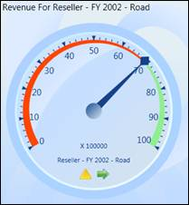

::: {style="DISPLAY: none"}
{#d2h_url_template} {#d2h_package_url style="WIDTH: 0px; DISPLAY: none; HEIGHT: 0px"}
:::

::::: {#nsbanner .d2h_main_nsbanner style="BORDER-BOTTOM: #999999 1px solid; POSITION: relative; PADDING-BOTTOM: 0px; BACKGROUND-COLOR: transparent; PADDING-LEFT: 0px; PADDING-RIGHT: 0px; DISPLAY: none; BORDER-TOP: #999999 1px solid; PADDING-TOP: 0px; LEFT: 0px"}
:::: {#TitleRow .d2h_main_titlerow style="PADDING-BOTTOM: 4px; BACKGROUND-COLOR: transparent; PADDING-LEFT: 22px; WIDTH: 100%; PADDING-RIGHT: 10px; DISPLAY: none; PADDING-TOP: 4px"}
::: {#ienav .d2h_main_ienav style="DISPLAY: none"}
{#D2HPrevious .D2HPreviousEnabled}  {#D2HNext .D2HNextEnabled}
:::
::::
:::::

::::: {#nstext .d2h_main_nstext style="PADDING-BOTTOM: 10px; BACKGROUND-COLOR: transparent; PADDING-LEFT: 22px; PADDING-RIGHT: 10px; HEIGHT: 100%; OVERFLOW: auto; PADDING-TOP: 5px" hasuserbackground="true" valign="bottom"}
::: {#d2h_breadcrumbs .d2h_breadcrumbs}
[Essential Studio User Guide Documentation](ms-xhelp:///?Id=12457748-09e3-4d74-a240-8e049cedf030){.d2h_breadcrumbsNormal} [ \> ]{.d2h_breadcrumbsLinkSeparator} [Business Intelligence Edition](ms-xhelp:///?Id=fdf33dd8-62b2-47b9-ad7b-fc50e590bca5){.d2h_breadcrumbsNormal} [ \> ]{.d2h_breadcrumbsLinkSeparator} [Essential BI WPF](ms-xhelp:///?Id=41e3d586-d922-4a01-8272-679fe4ae7343){.d2h_breadcrumbsNormal} [ \> ]{.d2h_breadcrumbsLinkSeparator} [Essential BI Gauge]{.d2h_breadcrumbsContentsOnly} [ \> ]{.d2h_breadcrumbsLinkSeparator} [Overview](ms-xhelp:///?Id=4f1747ee-bf9b-4dcd-b99f-af26af2ccdb7){.d2h_breadcrumbsNormal}
:::

## Introduction to Essential OLAP Gauge for WPF {#introduction-to-essential-olap-gauge-for-wpf style="tab-stops: 0pt"}

Essential BI OLAP Gauge for WPF is ideal for highlighting business critical Key Performance Indicator (KPI) information in executive dashboards and report cards. Gauges let you present values against goals in a very intuitive manner. Built-in data binding support allows you to easily bind a gauge to a KPI result from your OLAP database. The Gauge control comes with sophisticated customization support, which provides endless possibility for control customization. It renders a value as a pointer against a circular scale. You can also easily build high quality dashboards and process controls.

[]{style="FONT-FAMILY: 'Trebuchet MS','sans-serif'; COLOR: #15428b; FONT-SIZE: 9pt"} 

Figure 1: OLAP Gauge Control

***[]{style="FONT-FAMILY: 'Cambria','serif'; COLOR: black"}***  

Key Features

The important features of OLAP Gauge control are listed below:

[·      ]{style="FONT-FAMILY: Symbol"}Support to display multiple OLAP Gauge controls.

[·      ]{style="FONT-FAMILY: Symbol"}Ability to display the KPI value information in the pointer tooltip.

[·      ]{style="FONT-FAMILY: Symbol"}Ability to display the goal information in marker tooltip.

[·      ]{style="FONT-FAMILY: Symbol"}Support to customize the layout while rendering multiple OLAP Gauge controls.

[·      ]{style="FONT-FAMILY: Symbol"}Various built-in frame types provide a rich appearance of gauge control.

[·      ]{style="FONT-FAMILY: Symbol"}Support to customize the size by using radius property.

[·      ]{style="FONT-FAMILY: Symbol"}It supports to bind a collection to the data source of the control.

[·      ]{style="FONT-FAMILY: Symbol"}It supports multiple gauge elements in single application and also filters the data dynamically.

[·      ]{style="FONT-FAMILY: Symbol"}Supports different themes like Office 2007 Blue, Office 2007 Black, Office 2007 Silver, and so on, to customize the appearance of the gauge

[·      ]{style="FONT-FAMILY: Symbol"}Support to show or hide gauge headers, gauge factors and gauge labels.

**[]{style="FONT-FAMILY: 'Trebuchet MS','sans-serif'; COLOR: #15428b; FONT-SIZE: 9pt"}**  

User Guide Organization

[]{#_Introduction_to_Essential}The product comes with numerous samples as well as an extensive documentation to guide you. This User Guide provides detailed information on the features and functionalities of OLAP Gauge control. It is organized into the following sections:

[]{style="FONT-FAMILY: 'Trebuchet MS','sans-serif'; COLOR: #15428b; FONT-SIZE: 9pt"} 

[·      ]{style="FONT-FAMILY: Symbol"}Overview - This section gives a brief introduction to our product and its key features.

[·      ]{style="FONT-FAMILY: Symbol"}Deployment - This section elaborates on the install location of the samples, license, and so on.

[·      ]{style="FONT-FAMILY: Symbol"}What\'s New - This section lists the new features implemented for every release.

[·      ]{style="FONT-FAMILY: Symbol"}Getting Started - This section guides you on getting started with the BI application, OLAP Gauge control, and so on.

[·      ]{style="FONT-FAMILY: Symbol"}Concepts and Features - The features of OLAP Gauge control are illustrated with use case scenarios, code examples and screen shots under this section.

**[]{style="FONT-FAMILY: 'Trebuchet MS','sans-serif'; COLOR: #15428b; FONT-SIZE: 9pt"}**  

Document Conventions

[]{style="FONT-FAMILY: 'Trebuchet MS','sans-serif'; COLOR: #15428b; FONT-SIZE: 9pt"} 

The following conventions will help you to quickly identify the important sections of information while using the content.

[]{style="FONT-FAMILY: 'Trebuchet MS','sans-serif'; COLOR: #15428b; FONT-SIZE: 9pt"} 

::: {align="center"}
+------------------------+-------------------------------------------------------------------------------------------------------------------------------------------------------------------------------------------------------------------------------------------------------------+---------------------------------------------------------------------------+
| Convention             | Icon                                                                                                                                                                                                                                                        | Description                                                               |
+------------------------+-------------------------------------------------------------------------------------------------------------------------------------------------------------------------------------------------------------------------------------------------------------+---------------------------------------------------------------------------+
| Note                   | ::: {style="BORDER-BOTTOM: windowtext 1pt solid; BORDER-LEFT: medium none; PADDING-BOTTOM: 1pt; MARGIN-TOP: 9pt; PADDING-LEFT: 0pt; PADDING-RIGHT: 0pt; MARGIN-BOTTOM: 9pt; BORDER-TOP: windowtext 1pt solid; BORDER-RIGHT: medium none; PADDING-TOP: 1pt"} | Represents important information                                          |
|                        | Note:                                                                                                                                                                                                                           |                                                                           |
|                        | :::                                                                                                                                                                                                                                                         |                                                                           |
+------------------------+-------------------------------------------------------------------------------------------------------------------------------------------------------------------------------------------------------------------------------------------------------------+---------------------------------------------------------------------------+
| Example                | **Example**                                                                                                                                                                                                                                                 | Represents an example                                                     |
+------------------------+-------------------------------------------------------------------------------------------------------------------------------------------------------------------------------------------------------------------------------------------------------------+---------------------------------------------------------------------------+
| Tip                    |                                                                                                                                                                      | Represents useful hints that will help you in using the controls/features |
+------------------------+-------------------------------------------------------------------------------------------------------------------------------------------------------------------------------------------------------------------------------------------------------------+---------------------------------------------------------------------------+
| Additional Information |                                                                                                                                                              | Represents additional information on the topic                            |
+------------------------+-------------------------------------------------------------------------------------------------------------------------------------------------------------------------------------------------------------------------------------------------------------+---------------------------------------------------------------------------+
:::

[]{#related-topics}
:::::
