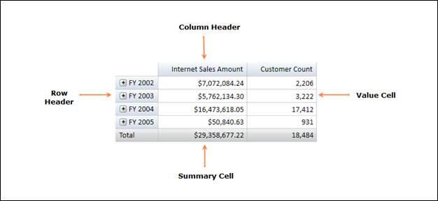

::: {style="DISPLAY: none"}
{#d2h_url_template} {#d2h_package_url style="WIDTH: 0px; DISPLAY: none; HEIGHT: 0px"}
:::

::::: {#nsbanner .d2h_main_nsbanner style="BORDER-BOTTOM: #999999 1px solid; POSITION: relative; PADDING-BOTTOM: 0px; BACKGROUND-COLOR: transparent; PADDING-LEFT: 0px; PADDING-RIGHT: 0px; DISPLAY: none; BORDER-TOP: #999999 1px solid; PADDING-TOP: 0px; LEFT: 0px"}
:::: {#TitleRow .d2h_main_titlerow style="PADDING-BOTTOM: 4px; BACKGROUND-COLOR: transparent; PADDING-LEFT: 22px; WIDTH: 100%; PADDING-RIGHT: 10px; DISPLAY: none; PADDING-TOP: 4px"}
::: {#ienav .d2h_main_ienav style="DISPLAY: none"}
{#D2HPrevious .D2HPreviousEnabled}  {#D2HNext .D2HNextEnabled}
:::
::::
:::::

::::: {#nstext .d2h_main_nstext style="PADDING-BOTTOM: 10px; BACKGROUND-COLOR: transparent; PADDING-LEFT: 22px; PADDING-RIGHT: 10px; HEIGHT: 100%; OVERFLOW: auto; PADDING-TOP: 5px" hasuserbackground="true" valign="bottom"}
::: {#d2h_breadcrumbs .d2h_breadcrumbs}
[Essential Studio User Guide Documentation](ms-xhelp:///?Id=12457748-09e3-4d74-a240-8e049cedf030){.d2h_breadcrumbsNormal} [ \> ]{.d2h_breadcrumbsLinkSeparator} [Business Intelligence Edition](ms-xhelp:///?Id=fdf33dd8-62b2-47b9-ad7b-fc50e590bca5){.d2h_breadcrumbsNormal} [ \> ]{.d2h_breadcrumbsLinkSeparator} [Essential BI WPF](ms-xhelp:///?Id=41e3d586-d922-4a01-8272-679fe4ae7343){.d2h_breadcrumbsNormal} [ \> ]{.d2h_breadcrumbsLinkSeparator} [Essential BI Grid]{.d2h_breadcrumbsContentsOnly} [ \> ]{.d2h_breadcrumbsLinkSeparator} [Overview](ms-xhelp:///?Id=66aef66e-0c86-475a-adbc-f0bc9f65d223){.d2h_breadcrumbsNormal}
:::

## Introduction to Essential OLAP Grid WPF {#introduction-to-essential-olap-grid-wpf style="tab-stops: 0pt"}

Essential OLAP Grid is a tool, which is used to represent Multidimensional Data.

The main functionality of the OLAP Grid is as follows:

[·      ]{style="FONT-FAMILY: Symbol"}Summarizes a large amount of information and represents it in a cross-tabulated form.

[·      ]{style="FONT-FAMILY: Symbol"}Automatically displays the retrieved OLAP data by data binding to an OlapDataManager.

[·      ]{style="FONT-FAMILY: Symbol"}Renders the results of an OLAP query in a cross tab UI.

[·      ]{style="FONT-FAMILY: Symbol"}Provides drill down and drill up functionality.

[]{style="FONT-SIZE: 11pt"} 

 

Figure 1: OLAP Grid Control

Key Features

The important features of **OLAP Grid** controls are listed below:

 

[·    ]{style="FONT-FAMILY: Symbol; COLOR: black; FONT-SIZE: 11pt"} [Drill-Up/Down]{.UGHyperlink} []{style="COLOR: black; FONT-SIZE: 11pt"}- Provides Multi-level drill up/down capability for both Column and Row Headers.[]{style="COLOR: black; FONT-SIZE: 11pt"}

[·      ]{style="FONT-FAMILY: Symbol"} [Layouts]{.UGHyperlink} [ - ]{style="COLOR: black; FONT-SIZE: 11pt"}Supports different grid layouts (Normal layout, Excel like layout, Excel like layout with member properties, Normal top summary and no summaries layout).

[·      ]{style="FONT-FAMILY: Symbol"} [Conditional Formatting]{.UGHyperlink} [ - ]{style="COLOR: black; FONT-SIZE: 11pt"}Conditionally Format Grid Cells

[·      ]{style="FONT-FAMILY: Symbol"} [Export]{.UGHyperlink} [ - ]{style="COLOR: black; FONT-SIZE: 11pt"}You can also export the Grid to MS-Excel and Word formats.

[]{style="COLOR: black; FONT-SIZE: 12pt"} 

User Guide Organization

[]{#_Introduction_to_Essential}The product comes with numerous samples as well as an extensive documentation to guide you. This User Guide provides detailed information on the features and functionalities of OLAP Grid control. It is organized into the following sections:

 

[·      ]{style="FONT-FAMILY: Symbol"}Overview - This section gives a brief introduction to our product and its key features.

[·      ]{style="FONT-FAMILY: Symbol"}Deployment - This section elaborates on the install location of the samples, license, and so on.

[·      ]{style="FONT-FAMILY: Symbol"}What\'s New - This section lists the new features implemented for every release.

[·      ]{style="FONT-FAMILY: Symbol"}Getting Started - This section guides you on getting started with the BI application, OLAP Grid control, and so on.

[·      ]{style="FONT-FAMILY: Symbol"}Concepts and Features - The features of OLAP Grid control are illustrated with use case scenarios, code examples and screen shots under this section.

 

Document Conventions[]{style="FONT-SIZE: 12pt"}

The following conventions will help you to quickly identify the important sections of information while using the content.

 

::: {align="center"}
+------------------------+--------------------------------------------------------------------+---------------------------------------------------------------------------+
| Convention             | Icon                                                               | Description                                                               |
+------------------------+--------------------------------------------------------------------+---------------------------------------------------------------------------+
| Note                   | []{.Note}                                                          | Represents important information                                          |
|                        |                                                                    |                                                                           |
|                        | [ {border="0"} ]{.Note} [Note:]{.Note} |                                                                           |
+------------------------+--------------------------------------------------------------------+---------------------------------------------------------------------------+
| Example                | Example                                                            | Represents an example                                                     |
+------------------------+--------------------------------------------------------------------+---------------------------------------------------------------------------+
| Tip                    | {border="0"}           | Represents useful hints that will help you in using the controls/features |
+------------------------+--------------------------------------------------------------------+---------------------------------------------------------------------------+
| Additional Information | {border="0"}   | Represents additional information on the topic                            |
+------------------------+--------------------------------------------------------------------+---------------------------------------------------------------------------+
:::

[]{#related-topics}
:::::
