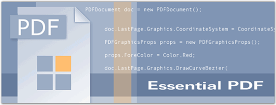

::: {style="DISPLAY: none"}
{#d2h_url_template}{#d2h_package_url style="WIDTH: 0px; DISPLAY: none; HEIGHT: 0px"}
:::

::::: {#nsbanner .d2h_main_nsbanner style="BORDER-BOTTOM: #999999 1px solid; POSITION: relative; PADDING-BOTTOM: 0px; BACKGROUND-COLOR: transparent; PADDING-LEFT: 0px; PADDING-RIGHT: 0px; DISPLAY: none; BORDER-TOP: #999999 1px solid; PADDING-TOP: 0px; LEFT: 0px"}
:::: {#TitleRow .d2h_main_titlerow style="PADDING-BOTTOM: 4px; BACKGROUND-COLOR: transparent; PADDING-LEFT: 22px; WIDTH: 100%; PADDING-RIGHT: 10px; DISPLAY: none; PADDING-TOP: 4px"}
::: {#ienav .d2h_main_ienav style="DISPLAY: none"}
{#D2HPrevious .D2HPreviousEnabled}  {#D2HNext .D2HNextEnabled}
:::
::::
:::::

::::: {#nstext .d2h_main_nstext style="PADDING-BOTTOM: 10px; BACKGROUND-COLOR: transparent; PADDING-LEFT: 22px; PADDING-RIGHT: 10px; HEIGHT: 100%; OVERFLOW: auto; PADDING-TOP: 5px" hasuserbackground="true" valign="bottom"}
::: {#d2h_breadcrumbs .d2h_breadcrumbs}
[Essential Studio User Guide Documentation](ms-xhelp:///?Id=12457748-09e3-4d74-a240-8e049cedf030){.d2h_breadcrumbsNormal}[ \> ]{.d2h_breadcrumbsLinkSeparator}[Reporting Edition](ms-xhelp:///?Id=027aa5b6-6676-4f93-ad23-c20e8c45792e){.d2h_breadcrumbsNormal}[ \> ]{.d2h_breadcrumbsLinkSeparator}[Essential Pdf](ms-xhelp:///?Id=22756092-3da5-4797-9514-dab0617c6902){.d2h_breadcrumbsNormal}[ \> ]{.d2h_breadcrumbsLinkSeparator}[Overview](ms-xhelp:///?Id=c037171e-af2f-433c-860d-2bd09b70af82){.d2h_breadcrumbsNormal}
:::

## Introduction to Essential PDF {#introduction-to-essential-pdf style="tab-stops: 0pt"}

[]{style="FONT-FAMILY: 'Trebuchet MS','sans-serif'; COLOR: #15428b; FONT-SIZE: 9pt"} 

Essential PDF is a .NET library with the capability to produce Adobe PDF files. It features a full-fledged object model for the easy creation of PDF files from any .NET language, providing complete control over the positioning of elements in a PDF document. It does not use any external libraries and is built from scratch in C#. It can be used on the server-side (ASP.NET or any other environment) or with Windows Forms / WPF applications. The usage is common for all the environments except for the part where the created document is saved to the disk or stream in case of Windows Forms / WPF applications, and streamed to the client browser in the case of ASP.NET applications.

 

 Essential PDF will be beneficial for users who want to create a PDF document with features such as, drawing text and images, inserting tables and shapes, security protection, conversion features and so on.

 

Real World Scenario

 

PDF is widely used in business, education and government, for the distribution of business letters, monthly reports, declarations or business reports. PDF can be used as the electronic data format between creators, designers, reviewers, printers and advertising companies.

 

Advantages of Essential PDF

 

Following are the advantages of using PDF in applications of different platforms:

 

[·      ]{style="FONT-FAMILY: Symbol"}There are no temporary documents saved on the server in an ASP.NET application.

[·      ]{style="FONT-FAMILY: Symbol"}The generated PDF document can also be protected using 40-Bit and 128-Bit encryption.

[·      ]{style="FONT-FAMILY: Symbol"}The PDF file that is created using Essential PDF can be viewed using **any version of Adobe Acrobat or the free version of Acrobat Viewer** from Adobe. Find more details on creating files with different versions in [PDF Version Compatibility]{style="COLOR: black"} topic.

[]{style="FONT-FAMILY: 'Trebuchet MS','sans-serif'; COLOR: #15428b; FONT-SIZE: 9pt"} 

Figure 1: Essential PDF

[]{style="FONT-FAMILY: 'Trebuchet MS','sans-serif'; COLOR: #15428b; FONT-SIZE: 9pt"} 

Key Features

[]{style="FONT-FAMILY: 'Trebuchet MS','sans-serif'; COLOR: #15428b; FONT-SIZE: 9pt"} 

Some of the key features of PDF are listed below:

[]{style="FONT-FAMILY: 'Trebuchet MS','sans-serif'; COLOR: #15428b; FONT-SIZE: 9pt"} 

[·      ]{style="FONT-FAMILY: Symbol"}Essential PDF can draw MultiPage text, formatted text etc., in pdf pages.

[·      ]{style="FONT-FAMILY: Symbol"}It supports predefined fonts, true type fonts and CJK fonts.

[·      ]{style="FONT-FAMILY: Symbol"}PDF can draw shapes such as rectangles, circles, arcs, ellipses and fill them with custom brushes.

[·      ]{style="FONT-FAMILY: Symbol"}Essential PDF can load Images to pdf documents from streams and files on disk. It can draw both scalar and vector images in the documents. Soft Mask Images and Watermarks can also be drawn in the pages.

[·      ]{style="FONT-FAMILY: Symbol"}ADO.NET tables can be imported into the pdf files; the rows and columns can be formatted. You can also insert graphic elements inside the table.

[·      ]{style="FONT-FAMILY: Symbol"}Auto Page Breaks for large tables can be enabled in the pdf documents.

[·      ]{style="FONT-FAMILY: Symbol"}Drawing Form Fields like buttons, text boxes, list boxes, check boxes, and so on, into the PDF document.

[·      ]{style="FONT-FAMILY: Symbol"}Drawing Header and Footer in a PDF document.

[·      ]{style="FONT-FAMILY: Symbol"}PDF documents are extremely secured by setting the Owner or User Password; allowing or disallowing permissions over a PDF document; 40 or 128 bit encryption is available.

[·      ]{style="FONT-FAMILY: Symbol"}Secure your PDF document with high protection. Essential PDF enables you to secure your document with the author signature. Also, create visible and invisible signatures in the document, providing an option to preserve content or add signatures of your interest respectively.

[·      ]{style="FONT-FAMILY: Symbol"}It has features like reading existing PDF acroforms and filling the acroform.

[·      ]{style="FONT-FAMILY: Symbol"}HTML web page pagination is available to render large web pages into PDF without any text truncation at page breaks. Also, you can render the web pages as streams to create PDF without any intermediate files on disk.

[]{style="FONT-FAMILY: 'Trebuchet MS','sans-serif'; COLOR: #15428b; FONT-SIZE: 9pt"} 

User Guide Organization

[]{style="FONT-FAMILY: 'Trebuchet MS','sans-serif'; COLOR: #15428b; FONT-SIZE: 9pt"} 

The product comes with numerous samples as well as an extensive documentation to guide you. This User Guide provides detailed information on the features and functionalities of Essential PDF. It is organized into the following sections:

[]{style="FONT-FAMILY: 'Trebuchet MS','sans-serif'; COLOR: #15428b; FONT-SIZE: 9pt"} 

[·      ]{style="FONT-FAMILY: Symbol"}**Overview**-This section gives a brief introduction to our product and its key features.

[·      ]{style="FONT-FAMILY: Symbol"}**Installation and Deployment**-This section elaborates on the install location of the samples, license etc.

[·      ]{style="FONT-FAMILY: Symbol"}**What\'s New**-This section lists the new features implemented for the current release.

[·      ]{style="FONT-FAMILY: Symbol"}**Getting Started**-This section guides you on getting started with various platform application, controls etc.

[·      ]{style="FONT-FAMILY: Symbol"}**Concepts and Features**-The features of the PDF is illustrated with use case scenarios, code examples and screen shots under this section.

[·      ]{style="FONT-FAMILY: Symbol"}**Frequently Asked Questions**-This section illustrates the solutions for various task-based queries about Essential PDF.

[]{style="FONT-FAMILY: 'Trebuchet MS','sans-serif'; COLOR: #15428b; FONT-SIZE: 9pt"} 

Document Conventions

**[]{style="FONT-FAMILY: 'Trebuchet MS','sans-serif'; COLOR: #15428b; FONT-SIZE: 9pt"}** 

The conventions listed below will help you to quickly identify the important sections of information, while using the content:

[]{style="FONT-FAMILY: 'Trebuchet MS','sans-serif'; COLOR: #15428b; FONT-SIZE: 9pt"} 

::: {align="center"}
  ---------------- ------------------------------------- ---------------------------------------------------------------------------
  Convention       Icon                                  Description
  Note             *Note:*   Represents important information
  Example          Example                               Represents an example
  Tip                        Represents useful hints that will help you in using the controls/features
  Important Note             Represents additional information on the topic
  ---------------- ------------------------------------- ---------------------------------------------------------------------------
:::

[]{#p2} 

[]{#related-topics}
:::::
