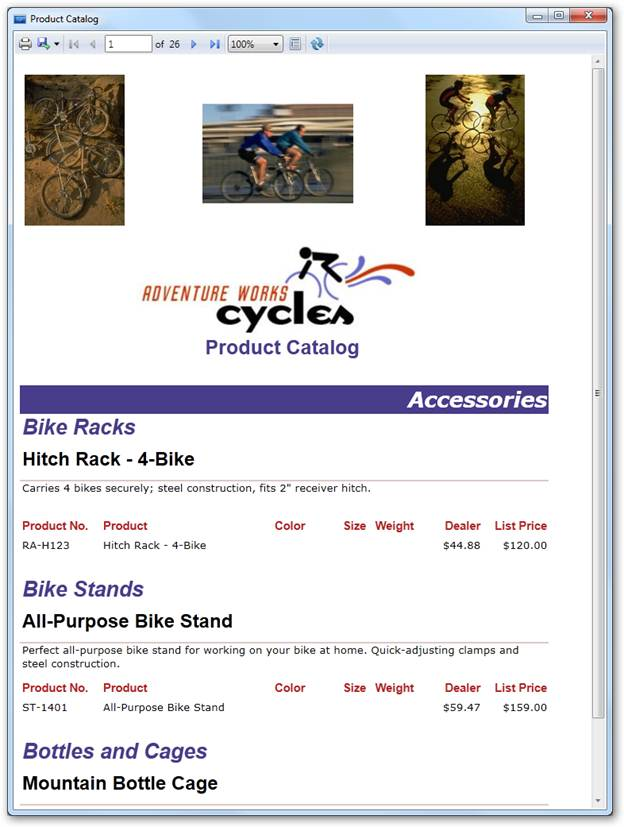

::: {style="DISPLAY: none"}
{#d2h_url_template}{#d2h_package_url style="WIDTH: 0px; DISPLAY: none; HEIGHT: 0px"}
:::

::::: {#nsbanner .d2h_main_nsbanner style="BORDER-BOTTOM: #999999 1px solid; POSITION: relative; PADDING-BOTTOM: 0px; BACKGROUND-COLOR: transparent; PADDING-LEFT: 0px; PADDING-RIGHT: 0px; DISPLAY: none; BORDER-TOP: #999999 1px solid; PADDING-TOP: 0px; LEFT: 0px"}
:::: {#TitleRow .d2h_main_titlerow style="PADDING-BOTTOM: 4px; BACKGROUND-COLOR: transparent; PADDING-LEFT: 22px; WIDTH: 100%; PADDING-RIGHT: 10px; DISPLAY: none; PADDING-TOP: 4px"}
::: {#ienav .d2h_main_ienav style="DISPLAY: none"}
{#D2HPrevious .D2HPreviousEnabled}  {#D2HNext .D2HNextEnabled}
:::
::::
:::::

:::: {#nstext .d2h_main_nstext style="PADDING-BOTTOM: 10px; BACKGROUND-COLOR: transparent; PADDING-LEFT: 22px; PADDING-RIGHT: 10px; HEIGHT: 100%; OVERFLOW: auto; PADDING-TOP: 5px" hasuserbackground="true" valign="bottom"}
::: {#d2h_breadcrumbs .d2h_breadcrumbs}
[Essential Studio User Guide Documentation](ms-xhelp:///?Id=12457748-09e3-4d74-a240-8e049cedf030){.d2h_breadcrumbsNormal}[ \> ]{.d2h_breadcrumbsLinkSeparator}[Reporting Edition](ms-xhelp:///?Id=027aa5b6-6676-4f93-ad23-c20e8c45792e){.d2h_breadcrumbsNormal}[ \> ]{.d2h_breadcrumbsLinkSeparator}[Essential Report Viewer](ms-xhelp:///?Id=35081cc7-4b81-4ef5-97d2-894ad584b907){.d2h_breadcrumbsNormal}[ \> ]{.d2h_breadcrumbsLinkSeparator}[Report Viewer WPF]{.d2h_breadcrumbsContentsOnly}[ \> ]{.d2h_breadcrumbsLinkSeparator}[Overview](ms-xhelp:///?Id=944478dd-2c05-46c1-836f-4b0fbcb6849e){.d2h_breadcrumbsNormal}
:::

## Introduction to Essential Report Viewer WPF {#introduction-to-essential-report-viewer-wpf style="tab-stops: 0pt"}

Essential Report Viewer is a rendering component for displaying reports defined in Microsoft's RDL format (2008 or 2008 R2) on both WPF and Silverlight applications. Using Report Viewer, you can display tabular, graphical or free-form reports, which make use of relational, multi-dimensional, XML and object data source.  It supports both Server and Client reports.

[]{style="FONT-FAMILY: 'Trebuchet MS','sans-serif'; COLOR: #15428b; FONT-SIZE: 9pt"} 

[ ]{style="BORDER-BOTTOM: black 1pt; BORDER-LEFT: black 1pt; PADDING-BOTTOM: 0pt; PADDING-LEFT: 0pt; LAYOUT-GRID-MODE: line; PADDING-RIGHT: 0pt; FONT-FAMILY: 'Times New Roman','serif'; BACKGROUND: black; COLOR: black; FONT-SIZE: 1pt; BORDER-TOP: black 1pt; BORDER-RIGHT: black 1pt; PADDING-TOP: 0pt"}

Figure 1: Report Viewer WPF[]{style="COLOR: #c00000"}

[]{#related-topics}
::::
