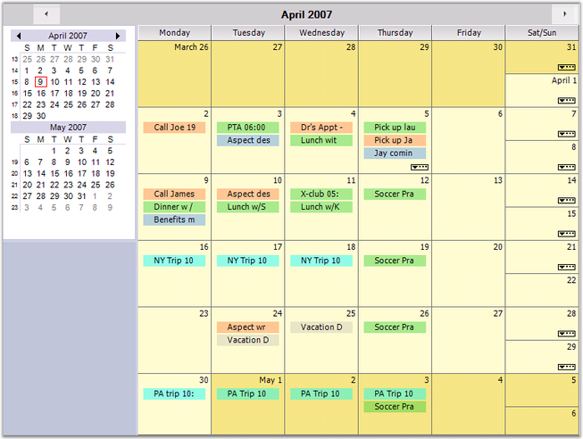

::: {style="DISPLAY: none"}
{#d2h_url_template}{#d2h_package_url style="WIDTH: 0px; DISPLAY: none; HEIGHT: 0px"}
:::

::::: {#nsbanner .d2h_main_nsbanner style="BORDER-BOTTOM: #999999 1px solid; POSITION: relative; PADDING-BOTTOM: 0px; BACKGROUND-COLOR: transparent; PADDING-LEFT: 0px; PADDING-RIGHT: 0px; DISPLAY: none; BORDER-TOP: #999999 1px solid; PADDING-TOP: 0px; LEFT: 0px"}
:::: {#TitleRow .d2h_main_titlerow style="PADDING-BOTTOM: 4px; BACKGROUND-COLOR: transparent; PADDING-LEFT: 22px; WIDTH: 100%; PADDING-RIGHT: 10px; DISPLAY: none; PADDING-TOP: 4px"}
::: {#ienav .d2h_main_ienav style="DISPLAY: none"}
{#D2HPrevious .D2HPreviousEnabled}  {#D2HNext .D2HNextEnabled}
:::
::::
:::::

::::: {#nstext .d2h_main_nstext style="PADDING-BOTTOM: 10px; BACKGROUND-COLOR: transparent; PADDING-LEFT: 22px; PADDING-RIGHT: 10px; HEIGHT: 100%; OVERFLOW: auto; PADDING-TOP: 5px" hasuserbackground="true" valign="bottom"}
::: {#d2h_breadcrumbs .d2h_breadcrumbs}
[Essential Studio User Guide Documentation](ms-xhelp:///?Id=12457748-09e3-4d74-a240-8e049cedf030){.d2h_breadcrumbsNormal}[ \> ]{.d2h_breadcrumbsLinkSeparator}[User Interface Edition](ms-xhelp:///?Id=c29296b7-531c-413b-a0ec-488ca1f7f669){.d2h_breadcrumbsNormal}[ \> ]{.d2h_breadcrumbsLinkSeparator}[Essential Windows](ms-xhelp:///?Id=e60759d8-47a4-4570-9d7a-16a68d63f2ea){.d2h_breadcrumbsNormal}[ \> ]{.d2h_breadcrumbsLinkSeparator}[Essential Schedule]{.d2h_breadcrumbsContentsOnly}[ \> ]{.d2h_breadcrumbsLinkSeparator}[Overview](ms-xhelp:///?Id=3543e52c-fcc3-4036-b2e6-f4734848399e){.d2h_breadcrumbsNormal}
:::

## Introduction to Essential Schedule {#introduction-to-essential-schedule style="tab-stops: 0pt"}

[]{#p1}Syncfusion Essential Schedule is a Windows Forms class library built around the functionality that is found in the Windows Forms Grid control. The control allows you to add scheduling support to your applications. The scheduling support includes creating new appointments, displaying these appointments in a variety of views, including Monthly, Daily, Weekly, Work Week and multiple days. In the daily formats, you can use the UI to drag appointments to another time slot and to extend appointments. A flexible navigation calendar lets you easily home in on the dates you would like to see in the Schedule control.

 

The data displayed in the Schedule control is provided through any object that implements the IScheduleDataProvider interface that is defined in the library. Included in the library is one concrete implementation based on the ArrayList that uses disk files to persist the data. With this implementation, you can easily have several schedule files that can either be treated as individual schedules or merged to be treated as a single schedule.

[]{style="FONT-FAMILY: 'Trebuchet MS','sans-serif'; COLOR: #15428b; FONT-SIZE: 9pt"} 

 

Figure 1: Schedule Control

[]{style="FONT-FAMILY: 'Trebuchet MS','sans-serif'; COLOR: #15428b; FONT-SIZE: 9pt"} 

The Scheduler control finds a wide variety of applications such as Time Tables, Calendars, Event Scheduling, Sequences, Activities, Project Management, Reservations, Resource Usage Planners, and so on.

[]{style="FONT-FAMILY: 'Trebuchet MS','sans-serif'; COLOR: #15428b; FONT-SIZE: 9pt"} 

Key Features

[]{style="FONT-FAMILY: 'Trebuchet MS','sans-serif'; COLOR: #15428b; FONT-SIZE: 9pt"} 

Some of the key features of the Schedule control are listed below:

[]{style="FONT-FAMILY: 'Trebuchet MS','sans-serif'; COLOR: #15428b; FONT-SIZE: 9pt"} 

[·      ]{style="FONT-FAMILY: Symbol"}**Caption Panel** displays a caption at the top of the Schedule control. There are also two button objects on this panel that will navigate the Schedule forward and backward. This panel is docked at the top of the ScheduleControl client area.

 

[·      ]{style="FONT-FAMILY: Symbol"}**Navigation Panel** can be placed additional controls and make them appear adjacent to the Schedule control. This can be optionally docked to the left or right side of the ScheduleControl. You can also hide this panel. The ScheduleControl.Calendar which is a NavigationCalendar object is docked at the top of this panel. There is also a Splitter docked under the Navigation Calendar that allows you to display more or fewer calendars in the NavigationCalendar. The default setting displays two such calendars.

 

 

[·      ]{style="FONT-FAMILY: Symbol"}**Navigation Calendar** is a GridControl-derived object that displays multiple calendars allowing you to select the dates displayed in the Schedule control. This calendar is docked at the top of the NavigationPanel. The number of calendars displayed in the Navigation Calendar is determined by its client height. Enlarging the height of the Navigation Calendar will display more calendars. There is a Splitter docked under the Navigation Calendar to facilitate such sizing.

 

[·      ]{style="FONT-FAMILY: Symbol"}**Schedule Grid** is a Grid control-derived object that displays the actual schedule content, i.e., the appointments for the various dates. The actual look of this Grid control is determined by the ScheduleViewType which is set by using the ScheduleControl.ScheduleType property.

You can have both timed and untimed (all-day) appointments using this Schedule control. The ScheduleControl is easily localized and can display customizable alerts.

[]{style="FONT-FAMILY: 'Trebuchet MS','sans-serif'; COLOR: #15428b; FONT-SIZE: 9pt"} 

The product comes with numerous samples as well as an extensive documentation to guide you. This User Guide provides detailed information on the features and functionalities of the Schedule control. It is organized into the following sections:

 

[·      ]{style="FONT-FAMILY: Symbol"}**Overview**-This section gives a brief introduction to our product and its key features.

 

[·      ]{style="FONT-FAMILY: Symbol"}**Installation and Deployment**-This section elaborates on the install location of the samples, license etc.

 

[·      ]{style="FONT-FAMILY: Symbol"}**Getting Started**-This section guides you on getting started with Windows application, controls etc.

 

[·      ]{style="FONT-FAMILY: Symbol"}**Concepts and Features**-The features of the Schedule control are illustrated with use case scenarios, code examples and screen shots under this section.

 

[·      ]{style="FONT-FAMILY: Symbol"}**Frequently Asked Questions**-This section discusses various frequently asked questions with their answers with examples and code snippets.

[]{style="FONT-FAMILY: 'Trebuchet MS','sans-serif'; COLOR: #15428b; FONT-SIZE: 9pt"} 

[]{style="FONT-FAMILY: 'Trebuchet MS','sans-serif'; COLOR: #15428b; FONT-SIZE: 9pt"} 

Document Conventions

**[]{style="FONT-FAMILY: 'Trebuchet MS','sans-serif'; COLOR: #15428b; FONT-SIZE: 9pt"}** 

The conventions listed below will help you to quickly identify the important sections of information, while using the content:

[]{style="FONT-FAMILY: 'Trebuchet MS','sans-serif'; COLOR: #15428b; FONT-SIZE: 9pt"} 

::: {align="center"}
  ---------------- ----------------------------------- ---------------------------------------------------------------------------
  Convention       ICON                                Description
  Note             Note:   Represents important information
  Example          Example                             Represents an example
  Tip                      Represents useful hints that will help you in using the controls/features
  Important Note           Represents additional information on the topic
  ---------------- ----------------------------------- ---------------------------------------------------------------------------
:::

 

[]{#p2} 

[]{style="FONT-SIZE: 3pt"} 

[]{#related-topics}
:::::
