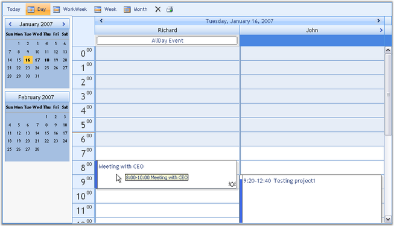

::: {style="DISPLAY: none"}
{#d2h_url_template}{#d2h_package_url style="WIDTH: 0px; DISPLAY: none; HEIGHT: 0px"}
:::

::::: {#nsbanner .d2h_main_nsbanner style="BORDER-BOTTOM: #999999 1px solid; POSITION: relative; PADDING-BOTTOM: 0px; BACKGROUND-COLOR: transparent; PADDING-LEFT: 0px; PADDING-RIGHT: 0px; DISPLAY: none; BORDER-TOP: #999999 1px solid; PADDING-TOP: 0px; LEFT: 0px"}
:::: {#TitleRow .d2h_main_titlerow style="PADDING-BOTTOM: 4px; BACKGROUND-COLOR: transparent; PADDING-LEFT: 22px; WIDTH: 100%; PADDING-RIGHT: 10px; DISPLAY: none; PADDING-TOP: 4px"}
::: {#ienav .d2h_main_ienav style="DISPLAY: none"}
{#D2HPrevious .D2HPreviousEnabled}  {#D2HNext .D2HNextEnabled}
:::
::::
:::::

::::: {#nstext .d2h_main_nstext style="PADDING-BOTTOM: 10px; BACKGROUND-COLOR: transparent; PADDING-LEFT: 22px; PADDING-RIGHT: 10px; HEIGHT: 100%; OVERFLOW: auto; PADDING-TOP: 5px" hasuserbackground="true" valign="bottom"}
::: {#d2h_breadcrumbs .d2h_breadcrumbs}
[Essential Studio User Guide Documentation](ms-xhelp:///?Id=12457748-09e3-4d74-a240-8e049cedf030){.d2h_breadcrumbsNormal}[ \> ]{.d2h_breadcrumbsLinkSeparator}[User Interface Edition](ms-xhelp:///?Id=c29296b7-531c-413b-a0ec-488ca1f7f669){.d2h_breadcrumbsNormal}[ \> ]{.d2h_breadcrumbsLinkSeparator}[Essential ASP.NET](ms-xhelp:///?Id=25c35330-c127-4dad-9a92-ed79dc7261a6){.d2h_breadcrumbsNormal}[ \> ]{.d2h_breadcrumbsLinkSeparator}[Essential Schedule]{.d2h_breadcrumbsContentsOnly}[ \> ]{.d2h_breadcrumbsLinkSeparator}[Overview](ms-xhelp:///?Id=21a1cf5e-e36e-4914-9aff-74ab204872dd){.d2h_breadcrumbsNormal}
:::

## Introduction to Essential Schedule for ASP.NET {#introduction-to-essential-schedule-for-asp.net style="tab-stops: 0pt"}

[[[]{style="TEXT-DECORATION: none"}]{style="COLOR: black; FONT-SIZE: 14pt"}]{.underline} 

[]{#p1}Essential Schedule is a 100% Native .NET library that provides scheduling functionality using the Microsoft .NET framework, so that it can be used in any .NET environment, including C#, VB.NET and managed C++. Essential Schedule uses the Syncfusion.Windows.Forms.Grid.GridControl as the basis for Schedule control.

 

The Schedule package includes the Schedule control that is used to implement a broad range of planning and scheduling activities for various resources. Schedule control efficiently allows you to organize and list out the various tasks for a day. The resources can be easily added and the tasks can be scheduled accordingly for the time specification. There are many properties that provide flexibility to control the scheduler interface. These properties allow developers to add advanced scheduling functionality to their applications. It can be used to manage various activities like events, meetings, deadlines, tasks, announcements, and so on. In this section, you will learn about the main properties of the Scheduler control and its layout.

 

The Schedule control finds a wide variety of applications such as Time Tables, Calendars, Event Scheduling, Sequences, Activities, Project Management, Reservations, Resource Usage Planners, and so on.

[]{style="FONT-FAMILY: 'Trebuchet MS','sans-serif'; COLOR: #15428b; FONT-SIZE: 9pt"} 

[]{style="FONT-SIZE: 12pt"} 

[]{style="FONT-SIZE: 12pt"}

***[]{style="FONT-FAMILY: 'Trebuchet MS','sans-serif'; COLOR: #15428b; FONT-SIZE: 9pt"}*** 

Figure 1: Schedule Control

[]{style="FONT-FAMILY: 'Trebuchet MS','sans-serif'; COLOR: #15428b; FONT-SIZE: 9pt"} 

Key Features

[]{style="FONT-FAMILY: 'Trebuchet MS','sans-serif'; COLOR: #15428b; FONT-SIZE: 9pt"} 

Important features of Schedule control are listed below.

[]{style="FONT-FAMILY: 'Trebuchet MS','sans-serif'; COLOR: #15428b; FONT-SIZE: 9pt"} 

[·      ]{style="FONT-FAMILY: Symbol"}It supports viewing of multiple resources and including multiple appointments.

[·      ]{style="FONT-FAMILY: Symbol"}Schedule control now includes the Office 2007 theme.

[·      ]{style="FONT-FAMILY: Symbol"}By using the Schedule events, you can control the behavior of the control.

[·      ]{style="FONT-FAMILY: Symbol"}The Schedule control now supports a loading indicator during callback.

[·      ]{style="FONT-FAMILY: Symbol"}Similar to the Microsoft Outlook calendar, the calendar in Schedule control allows for selecting multiple dates to view appointments.

[·      ]{style="FONT-FAMILY: Symbol"}Appointments can be added, edited, resized, dragged, blocked and recurred in the Schedule control.

[·      ]{style="FONT-FAMILY: Symbol"}Resources can be added and navigated in the Schedule control.

[·      ]{style="FONT-FAMILY: Symbol"}ViewStrip Toolbar provides options to view the today\'s date, full work week, weekdays and to delete the appointments.

[]{style="FONT-FAMILY: 'Trebuchet MS','sans-serif'; COLOR: #15428b; FONT-SIZE: 9pt"} 

The product comes with numerous samples as well as an extensive documentation to guide you. This User Guide provides detailed information on the features and functionalities of Schedule control. It is organized into the following sections:

[]{style="FONT-FAMILY: 'Trebuchet MS','sans-serif'; COLOR: #15428b; FONT-SIZE: 9pt"} 

[·      ]{style="FONT-FAMILY: Symbol"}**Overview**-This section gives a brief introduction to our product and its key features.

[·      ]{style="FONT-FAMILY: Symbol"}**Installation and Deployment**-This section elaborates on the install location of the samples, license, and so on.

[·      ]{style="FONT-FAMILY: Symbol"}**What\'s New**-This section lists the new features implemented for every release.

[·      ]{style="FONT-FAMILY: Symbol"}**Getting Started**-This section guides you on getting started with ASP.NET application, Schedule control, and so on.

[·      ]{style="FONT-FAMILY: Symbol"}**Concepts and Features**-The features of Schedule control are illustrated with use case scenarios, code examples and screen shots under this section.

[]{style="FONT-FAMILY: 'Trebuchet MS','sans-serif'; COLOR: #15428b; FONT-SIZE: 9pt"} 

Document Conventions

[]{style="FONT-FAMILY: 'Trebuchet MS','sans-serif'; COLOR: #15428b; FONT-SIZE: 9pt"} 

The following conventions will help you to quickly identify the important sections of information while using the content:

[]{style="FONT-FAMILY: 'Trebuchet MS','sans-serif'; COLOR: #15428b; FONT-SIZE: 9pt"} 

::: {align="center"}
+------------------------+-------------------------------------------------------------------------------------------------------------------------------------------------------------------------------------------------------------------------------------------------------------+---------------------------------------------------------------------------+
| Convention             | Icon                                                                                                                                                                                                                                                        | Description of the Icon                                                   |
+------------------------+-------------------------------------------------------------------------------------------------------------------------------------------------------------------------------------------------------------------------------------------------------------+---------------------------------------------------------------------------+
| Note                   | ::: {style="BORDER-BOTTOM: windowtext 1pt solid; BORDER-LEFT: medium none; PADDING-BOTTOM: 1pt; MARGIN-TOP: 9pt; PADDING-LEFT: 0pt; PADDING-RIGHT: 0pt; MARGIN-BOTTOM: 9pt; BORDER-TOP: windowtext 1pt solid; BORDER-RIGHT: medium none; PADDING-TOP: 1pt"} | Represents important information                                          |
|                        | Note:                                                                                                                                                                                                                           |                                                                           |
|                        | :::                                                                                                                                                                                                                                                         |                                                                           |
+------------------------+-------------------------------------------------------------------------------------------------------------------------------------------------------------------------------------------------------------------------------------------------------------+---------------------------------------------------------------------------+
| Example                | **Example**                                                                                                                                                                                                                                                 | Represents an example                                                     |
+------------------------+-------------------------------------------------------------------------------------------------------------------------------------------------------------------------------------------------------------------------------------------------------------+---------------------------------------------------------------------------+
| Tip                    | []{style="FONT-SIZE: 12pt"}[]{style="FONT-SIZE: 12pt"}                                                                                                                                                                          | Represents useful hints that will help you in using the controls/features |
+------------------------+-------------------------------------------------------------------------------------------------------------------------------------------------------------------------------------------------------------------------------------------------------------+---------------------------------------------------------------------------+
| Additional Information | []{style="FONT-SIZE: 12pt"}[]{style="FONT-SIZE: 12pt"}                                                                                                                                                                          | Represents additional information on the topic                            |
+------------------------+-------------------------------------------------------------------------------------------------------------------------------------------------------------------------------------------------------------------------------------------------------------+---------------------------------------------------------------------------+
:::

 

[]{#p2}[]{style="FONT-SIZE: 12pt"} 

[]{#related-topics}
:::::
