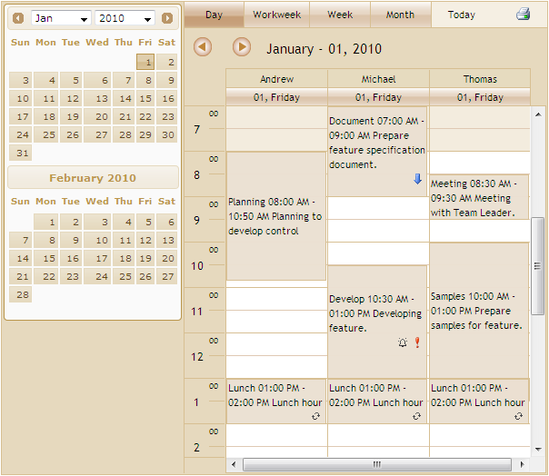

::: {style="DISPLAY: none"}
{#d2h_url_template}{#d2h_package_url style="WIDTH: 0px; DISPLAY: none; HEIGHT: 0px"}
:::

::::: {#nsbanner .d2h_main_nsbanner style="BORDER-BOTTOM: #999999 1px solid; POSITION: relative; PADDING-BOTTOM: 0px; BACKGROUND-COLOR: transparent; PADDING-LEFT: 0px; PADDING-RIGHT: 0px; DISPLAY: none; BORDER-TOP: #999999 1px solid; PADDING-TOP: 0px; LEFT: 0px"}
:::: {#TitleRow .d2h_main_titlerow style="PADDING-BOTTOM: 4px; BACKGROUND-COLOR: transparent; PADDING-LEFT: 22px; WIDTH: 100%; PADDING-RIGHT: 10px; DISPLAY: none; PADDING-TOP: 4px"}
::: {#ienav .d2h_main_ienav style="DISPLAY: none"}
{#D2HPrevious .D2HPreviousEnabled}  {#D2HNext .D2HNextEnabled}
:::
::::
:::::

:::: {#nstext .d2h_main_nstext style="PADDING-BOTTOM: 10px; BACKGROUND-COLOR: transparent; PADDING-LEFT: 22px; PADDING-RIGHT: 10px; HEIGHT: 100%; OVERFLOW: auto; PADDING-TOP: 5px" hasuserbackground="true" valign="bottom"}
::: {#d2h_breadcrumbs .d2h_breadcrumbs}
[Essential Studio User Guide Documentation](ms-xhelp:///?Id=12457748-09e3-4d74-a240-8e049cedf030){.d2h_breadcrumbsNormal}[ \> ]{.d2h_breadcrumbsLinkSeparator}[User Interface Edition](ms-xhelp:///?Id=c29296b7-531c-413b-a0ec-488ca1f7f669){.d2h_breadcrumbsNormal}[ \> ]{.d2h_breadcrumbsLinkSeparator}[Essential ASP.NET MVC](ms-xhelp:///?Id=4b14e7d1-65c4-4f67-b1aa-2c37709905a5){.d2h_breadcrumbsNormal}[ \> ]{.d2h_breadcrumbsLinkSeparator}[Essential Schedule]{.d2h_breadcrumbsContentsOnly}[ \> ]{.d2h_breadcrumbsLinkSeparator}[Overview](ms-xhelp:///?Id=c9eddb93-998b-4cc9-8a49-a1d87b2872fa){.d2h_breadcrumbsNormal}
:::

## Introduction to Essential Schedule for ASP.NET MVC {#introduction-to-essential-schedule-for-asp.net-mvc style="MARGIN-TOP: 0pt; tab-stops: 0pt"}

The Schedule control is used to implement a broad range of planning and scheduling activities for various resources. Schedule control efficiently allows you to organize and list out the various tasks for a day. The resources can be easily added and the tasks can be scheduled accordingly for the time specification. There are many properties that provide flexibility to control the scheduler interface. These properties allow developers to add advanced scheduling functionality to their applications. It can be used to manage various activities like events, meetings, deadlines, tasks, announcements, and so on. In this section, you will learn about the main properties of the Scheduler control and its layout.

 

The Schedule control finds wide variety of applications such as Time Tables, Calendars, Event Scheduling, Sequences, Activities, Project Management, Reservations, Resource Usage Planners, and so on.

[]{style="FONT-FAMILY: 'Calibri','sans-serif'; COLOR: black"} 

Figure 1: Essential Schedule

[]{style="FONT-FAMILY: 'Calibri','sans-serif'; FONT-SIZE: 11pt"} 

[]{style="FONT-FAMILY: 'Calibri','sans-serif'; FONT-SIZE: 11pt"} 

Key Features

Some important features of Schedule for MVC are listed below:

[·      ]{style="FONT-FAMILY: Symbol"}Appointments can be added, edited, deleted, resized, overlapped and dragged in the Schedule control

[·      ]{style="FONT-FAMILY: Symbol"}Essential Schedule offers Horizontal mode and Vertical mode to change the layout of the Schedule control

[·      ]{style="FONT-FAMILY: Symbol"}12 and 24 hour time modes support

[·      ]{style="FONT-FAMILY: Symbol"}14 built-in skins to choose from

[·      ]{style="FONT-FAMILY: Symbol"}View customization support

[·      ]{style="FONT-FAMILY: Symbol"}ViewStrip Toolbar to view the day, full work week, weekdays, months and current day

[·      ]{style="FONT-FAMILY: Symbol"}Support for all IEnumerable data sources using LINQ data retrieval technique for handling huge data sources

[·      ]{style="FONT-FAMILY: Symbol"}Support for mapping user-defined columns with predefined columns

[·      ]{style="FONT-FAMILY: Symbol"}Reminder option for appointments

[·      ]{style="FONT-FAMILY: Symbol"}Priority levels can be set for appointments to indicate the importance of appointments

[·      ]{style="FONT-FAMILY: Symbol"}Recurrence appointments support

[·      ]{style="FONT-FAMILY: Symbol"}Handles Rich Client-side events

[·      ]{style="FONT-FAMILY: Symbol"}Supports customizable Appointment window

[·      ]{style="FONT-FAMILY: Symbol"}Printing support for Schedule along with the ability to print individual appointments

[·      ]{style="FONT-FAMILY: Symbol"}Highly customizable Context-Menu for the Schedule control

[·      ]{style="FONT-FAMILY: Symbol"}[The Schedule control has provision for changing the time zone]{style="FONT-FAMILY: 'Calibri','sans-serif'"}

[·      ]{style="FONT-FAMILY: Symbol"}Calendar Navigation facilitates Integrated Calendar support for easy navigation between dates

[]{style="FONT-FAMILY: 'Calibri','sans-serif'"} 

[]{#related-topics}
::::
