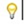

::: {style="DISPLAY: none"}
{#d2h_url_template}{#d2h_package_url style="WIDTH: 0px; DISPLAY: none; HEIGHT: 0px"}
:::

::::: {#nsbanner .d2h_main_nsbanner style="BORDER-BOTTOM: #999999 1px solid; POSITION: relative; PADDING-BOTTOM: 0px; BACKGROUND-COLOR: transparent; PADDING-LEFT: 0px; PADDING-RIGHT: 0px; DISPLAY: none; BORDER-TOP: #999999 1px solid; PADDING-TOP: 0px; LEFT: 0px"}
:::: {#TitleRow .d2h_main_titlerow style="PADDING-BOTTOM: 4px; BACKGROUND-COLOR: transparent; PADDING-LEFT: 22px; WIDTH: 100%; PADDING-RIGHT: 10px; DISPLAY: none; PADDING-TOP: 4px"}
::: {#ienav .d2h_main_ienav style="DISPLAY: none"}
{#D2HPrevious .D2HPreviousEnabled}  {#D2HNext .D2HNextEnabled}
:::
::::
:::::

:::::: {#nstext .d2h_main_nstext style="PADDING-BOTTOM: 10px; BACKGROUND-COLOR: transparent; PADDING-LEFT: 22px; PADDING-RIGHT: 10px; HEIGHT: 100%; OVERFLOW: auto; PADDING-TOP: 5px" hasuserbackground="true" valign="bottom"}
::: {#d2h_breadcrumbs .d2h_breadcrumbs}
[Essential Studio User Guide Documentation](ms-xhelp:///?Id=12457748-09e3-4d74-a240-8e049cedf030){.d2h_breadcrumbsNormal}[ \> ]{.d2h_breadcrumbsLinkSeparator}[User Interface Edition](ms-xhelp:///?Id=c29296b7-531c-413b-a0ec-488ca1f7f669){.d2h_breadcrumbsNormal}[ \> ]{.d2h_breadcrumbsLinkSeparator}[Essential WPF](ms-xhelp:///?Id=7f4f82c5-151c-4262-94d0-75c4626c77bc){.d2h_breadcrumbsNormal}[ \> ]{.d2h_breadcrumbsLinkSeparator}[Essential Schedule]{.d2h_breadcrumbsContentsOnly}[ \> ]{.d2h_breadcrumbsLinkSeparator}[Overview](ms-xhelp:///?Id=3afb05a5-fb1f-4e91-8bec-bd287ecbb02e){.d2h_breadcrumbsNormal}
:::

## Introduction to Essential Schedule WPF {#introduction-to-essential-schedule-wpf style="tab-stops: 0pt"}

Essential Schedule for WPF is used to provide Outlook-like scheduling. The Schedule control allows user to create and manage appointments. It includes features such as viewing daily/all day/spanned appointments, complete customization using custom Templates, efficient performance, Office 2010 Layout scheme, Data binding to different sources.

 

Key Features

The following are the Key features of Essential Schedule WPF

[·      ]{style="FONT-FAMILY: Symbol"}**Schedule Type** - Provides 5 different types of viewing the calendar,

[]{style="FONT-FAMILY: 'Trebuchet MS','sans-serif'; COLOR: #15428b; FONT-SIZE: 9pt"} 

[o  ]{style="FONT-FAMILY: 'Courier New'"}Day

[o  ]{style="FONT-FAMILY: 'Courier New'"}Week

[o  ]{style="FONT-FAMILY: 'Courier New'"}WorkWeek

[o  ]{style="FONT-FAMILY: 'Courier New'"}Month

[o  ]{style="FONT-FAMILY: 'Courier New'"}ScheduleView

**[]{style="FONT-FAMILY: 'Trebuchet MS','sans-serif'; COLOR: #15428b; FONT-SIZE: 9pt"}** 

[·      ]{style="FONT-FAMILY: Symbol"}**Time Interval** - Provides various time interval options to show in the time slots.

[·      ]{style="FONT-FAMILY: Symbol"}**Data Binding** - Bind to any **IEnumerable** source and generate appointments.

[·      ]{style="FONT-FAMILY: Symbol"}**Add / Edit / Delete Appointments** - **CUD** operations on appointments.

 

::: {style="BORDER-BOTTOM: windowtext 1pt solid; BORDER-LEFT: medium none; PADDING-BOTTOM: 1pt; MARGIN-TOP: 9pt; PADDING-LEFT: 0pt; PADDING-RIGHT: 0pt; MARGIN-BOTTOM: 9pt; BORDER-TOP: windowtext 1pt solid; BORDER-RIGHT: medium none; PADDING-TOP: 1pt"}
          []{style="FONT-FAMILY: 'Trebuchet MS','sans-serif'; COLOR: #15428b"}[***[Note]{style="LAYOUT-GRID-MODE: line"}***]{.NoteChar}[: ]{style="FONT-FAMILY: 'Trebuchet MS','sans-serif'; COLOR: #15428b"}These features can be turned off optionally.

 
:::

[·      ]{style="FONT-FAMILY: Symbol"}**Customizing templates** - Use Blend to easily customize each part of the Schedule control. Works fully with Blend designer.

[]{style="FONT-FAMILY: 'Trebuchet MS','sans-serif'; COLOR: #15428b; FONT-SIZE: 9pt"} 

[]{style="FONT-FAMILY: 'Trebuchet MS','sans-serif'; COLOR: #15428b; FONT-SIZE: 9pt"} 

Document Conventions[ ]{style="FONT-SIZE: 9pt"}

The conventions below will help you to quickly identify the important sections of information, while using the content:

[]{style="FONT-FAMILY: 'Trebuchet MS','sans-serif'; COLOR: #15428b; FONT-SIZE: 9pt"} 

Table 1: Document Conventions

::: {align="center"}
+------------------------+-------------------------------------------------------------------------------------------------------------------------------------------------------------------------------------------------------------------------------------------------------------+---------------------------------------------------------------------------------+
| Convention             | Icon                                                                                                                                                                                                                                                        | Description of the Icon                                                         |
+------------------------+-------------------------------------------------------------------------------------------------------------------------------------------------------------------------------------------------------------------------------------------------------------+---------------------------------------------------------------------------------+
| Note                   | ::: {style="BORDER-BOTTOM: windowtext 1pt solid; BORDER-LEFT: medium none; PADDING-BOTTOM: 1pt; MARGIN-TOP: 9pt; PADDING-LEFT: 0pt; PADDING-RIGHT: 0pt; MARGIN-BOTTOM: 9pt; BORDER-TOP: windowtext 1pt solid; BORDER-RIGHT: medium none; PADDING-TOP: 1pt"} | Represents important information.                                               |
|                        |  Note:                                                                                                                                                                                                                          |                                                                                 |
|                        | :::                                                                                                                                                                                                                                                         |                                                                                 |
+------------------------+-------------------------------------------------------------------------------------------------------------------------------------------------------------------------------------------------------------------------------------------------------------+---------------------------------------------------------------------------------+
| Example                | **Example:**                                                                                                                                                                                                                                                | Represents an example.                                                          |
+------------------------+-------------------------------------------------------------------------------------------------------------------------------------------------------------------------------------------------------------------------------------------------------------+---------------------------------------------------------------------------------+
| Tip                    | ::: {style="BORDER-BOTTOM: windowtext 1pt solid; BORDER-LEFT: medium none; PADDING-BOTTOM: 1pt; MARGIN-TOP: 9pt; PADDING-LEFT: 0pt; PADDING-RIGHT: 0pt; MARGIN-BOTTOM: 9pt; BORDER-TOP: windowtext 1pt solid; BORDER-RIGHT: medium none; PADDING-TOP: 1pt"} | Represents useful hints, that will help you in using the controls and features. |
|                        |                                                                                                                                                                                                                                 |                                                                                 |
|                        | :::                                                                                                                                                                                                                                                         |                                                                                 |
+------------------------+-------------------------------------------------------------------------------------------------------------------------------------------------------------------------------------------------------------------------------------------------------------+---------------------------------------------------------------------------------+
| Additional information |                                                                                                                                                                                                                                 | Represents additional information on the corresponding topic.                   |
+========================+=============================================================================================================================================================================================================================================================+=================================================================================+
:::

[]{#p2} 

[]{#related-topics}
::::::
