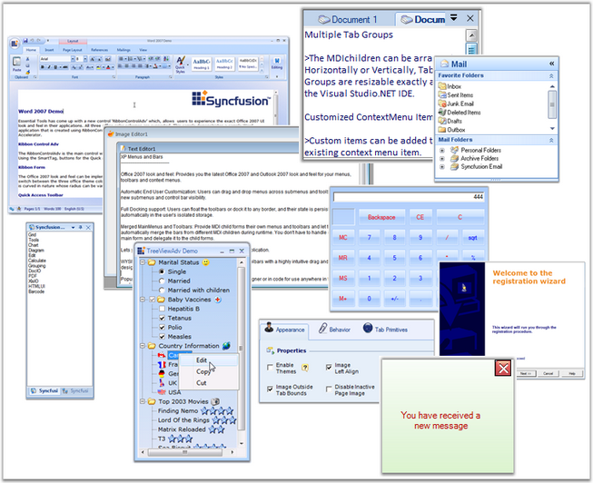

::: {style="DISPLAY: none"}
{#d2h_url_template}{#d2h_package_url style="WIDTH: 0px; DISPLAY: none; HEIGHT: 0px"}
:::

::::: {#nsbanner .d2h_main_nsbanner style="BORDER-BOTTOM: #999999 1px solid; POSITION: relative; PADDING-BOTTOM: 0px; BACKGROUND-COLOR: transparent; PADDING-LEFT: 0px; PADDING-RIGHT: 0px; DISPLAY: none; BORDER-TOP: #999999 1px solid; PADDING-TOP: 0px; LEFT: 0px"}
:::: {#TitleRow .d2h_main_titlerow style="PADDING-BOTTOM: 4px; BACKGROUND-COLOR: transparent; PADDING-LEFT: 22px; WIDTH: 100%; PADDING-RIGHT: 10px; DISPLAY: none; PADDING-TOP: 4px"}
::: {#ienav .d2h_main_ienav style="DISPLAY: none"}
{#D2HPrevious .D2HPreviousEnabled}  {#D2HNext .D2HNextEnabled}
:::
::::
:::::

::::: {#nstext .d2h_main_nstext style="PADDING-BOTTOM: 10px; BACKGROUND-COLOR: transparent; PADDING-LEFT: 22px; PADDING-RIGHT: 10px; HEIGHT: 100%; OVERFLOW: auto; PADDING-TOP: 5px" hasuserbackground="true" valign="bottom"}
::: {#d2h_breadcrumbs .d2h_breadcrumbs}
[Essential Studio User Guide Documentation](ms-xhelp:///?Id=12457748-09e3-4d74-a240-8e049cedf030){.d2h_breadcrumbsNormal}[ \> ]{.d2h_breadcrumbsLinkSeparator}[User Interface Edition](ms-xhelp:///?Id=c29296b7-531c-413b-a0ec-488ca1f7f669){.d2h_breadcrumbsNormal}[ \> ]{.d2h_breadcrumbsLinkSeparator}[Essential Windows](ms-xhelp:///?Id=e60759d8-47a4-4570-9d7a-16a68d63f2ea){.d2h_breadcrumbsNormal}[ \> ]{.d2h_breadcrumbsLinkSeparator}[Essential Tools]{.d2h_breadcrumbsContentsOnly}[ \> ]{.d2h_breadcrumbsLinkSeparator}[Overview](ms-xhelp:///?Id=3fb0b068-8080-4ab5-9fed-f771483eec7a){.d2h_breadcrumbsNormal}
:::

## Introduction to Essential Tools {#introduction-to-essential-tools style="tab-stops: 0pt"}

 

Essential Tools is a 100% Native **.NET** UI library that provides several packages for building modern Windows applications using the **Microsoft .NET framework**. Our control and framework packages can be used in any .NET environment, including **C#, VB.NET** and **managed C++**.

 

Essential Tools implements the latest Windows XP, Office XP, Office 2007 and Visual Studio .NET-style user interfaces. It offers complete compatibility with Windows Vista. In addition, it includes several utility controls. Powerful frameworks are provided to support Visual Studio .NET-style docking, customizable menus, MDI tabs and layout managers, as well as Excel-like workbook control, advanced scroll control, XP-style tab and task menu control, Outlook-style group bar and group view, calculator control, masked edit, auto-complete capabilities and many other useful controls

[]{style="COLOR: #15428b"} 

[]{style="COLOR: #15428b"} 

Figure 1: Essential Tools[]{style="COLOR: #15428b"}

[]{style="COLOR: #15428b"} 

**[]{style="COLOR: #15428b"}** 

**[]{style="COLOR: #15428b"}** 

Key Features

 

[·      ]{style="FONT-FAMILY: Symbol"}Docking manager renders various styles that adds standard look and feel to your application. The [Visual Styles]{style="COLOR: black"} includes VS2005, Office 2003, Office2007, Office2007 Outlook. It supports blue, silver and black themes in Office2007 visual style.

[·      ]{style="FONT-FAMILY: Symbol"}The docking manager has the ability to load and store dock state information into default storage medium, XML files and also in other storage medium such as database. See Dock State Persistence.

[·      ]{style="FONT-FAMILY: Symbol"}Editor control like Calculator control comes with complete designer support and implements all common arithmetic functions and supports keyboard input. It can be displayed in the Windows Standard or financial layout.

[·      ]{style="FONT-FAMILY: Symbol"}Layout Manger package enables various layouts like Border Layout, Card Layout, Flow Layout, Grid Layout and Grid Bag Layout.

[·      ]{style="FONT-FAMILY: Symbol"}XP Menus framework allows you to create elegant menus and menu items on the toolbar, which supports multi-level cascading menus as in Microsoft Office, capable of creating multiple menus on a single form. It had advanced features like adding separators in-between the bar items, Grouping the items etc., are supported.

[·      ]{style="FONT-FAMILY: Symbol"}Custom Colors can be applied for GroupBar control.

[·      ]{style="FONT-FAMILY: Symbol"}Controls under notification package can be completely customized using their display and appearance properties.

[·      ]{style="FONT-FAMILY: Symbol"}TabControlAdv provides an easy way to navigate through tabs. By setting TabPrimitives (previously, TabControlAdv\'s  NavigationControl property), users can traverse between tabs and pages easily which enables to go to the next or previous tab / page and first / last tab, close buttons can be added which closes the active tabpage when clicked and the dropdown with all the tabpages listed can be accessed by the user to select the tabpage to be traversed. NavigationControl offers more flexibility that allows you to change the button\'s image, show / hide certain buttons and also cancel the navigation and use it as an Add or Remove TabPages through code.

[·      ]{style="FONT-FAMILY: Symbol"}TabbedMDI supports wide range of Tab Styles and Window Styles. Windows in the TabbedMDI framework can be arranged in four different styles such as horizontal, vertical, cascade and inside the client area of the parent form. It also provides advanced features to set the styles for the DropDown Menus and Context Menus.

[·      ]{style="FONT-FAMILY: Symbol"}TreeViewAdv control is available with enhanced performance by reducing the loading time of the nodes by displaying the nodes only on demand by the user. This provides the user to delay the loading of nodes in Trees, until the user initiates the nodes to expand.

[·      ]{style="FONT-FAMILY: Symbol"}TreeNodeAdv has now provided option to enable multiline text for each node by using the **Multiline[ ]{style="COLOR: black; FONT-SIZE: 8pt"}**property which is available for individual nodes. This can be set through NodeCollection Editor and it has to be set for individual nodes. This feature is available for both TreeView and MultiColumnTreeView controls.

[·      ]{style="FONT-FAMILY: Symbol"}The Wizard control allows the user to add/remove the pages at design-time very easily by using verbs or by WizardControl Page Collection editor. You can also easily add images, title and description for the wizard control.

[·      ]{style="FONT-FAMILY: Symbol"}The RibbonControlAdv comes with the Office MenuButton with desired image. The visibility of this OfficeMenuButton can also be toggled during runtime. This OfficeMenuButton can have SuperToolTips associated with it.

[·      ]{style="FONT-FAMILY: Symbol"}SuperToolTip control enables the user to give tooltip information using this control. The SuperToolTip can have three segments, Header, body and Footer to display the content. The SuperToolTip control supports high level customization of its appearance through the properties available for colors, Images and Text.

[]{style="COLOR: #15428b"} 

The product comes with numerous samples as well as an extensive documentation to guide you. This User Guide provides detailed information on the features and functionalities of the Tools controls. It is organized into the following sections:

[]{style="COLOR: #15428b"} 

[·      ]{style="FONT-FAMILY: Symbol"}**Overview**-This section gives a brief introduction to our product and its key features.

[·      ]{style="FONT-FAMILY: Symbol"}**Installation and Deployment**-This section elaborates on the install location of the samples, license etc.

[·      ]{style="FONT-FAMILY: Symbol"}**What\'s New**-This section lists the new features implemented for every release.

[·      ]{style="FONT-FAMILY: Symbol"}**Getting Started**-This section guides you on getting started with Windows application, controls etc.

[·      ]{style="FONT-FAMILY: Symbol"}**Tools Controls**-The features of individual controls are illustrated with use case scenarios, code examples and screen shots under this section.

[]{style="COLOR: #15428b"} 

Document Conventions

**[]{style="COLOR: #15428b"}** 

The conventions listed below will help you to quickly identify the important sections of information, while using the content:

[]{style="COLOR: #15428b"} 

Table 1: Document Conventions

::: {align="center"}
  ---------------- ------------------------------------- ---------------------------------------------------------------------------
  Convention       ICON                                  Description
  Note             *Note:*   Represents important information
  Example          Example                               Represents an example
  Tip                        Represents useful hints that will help you in using the controls/features
  Important Note             Represents additional information on the topic
  ---------------- ------------------------------------- ---------------------------------------------------------------------------
:::

[]{#related-topics}
:::::
