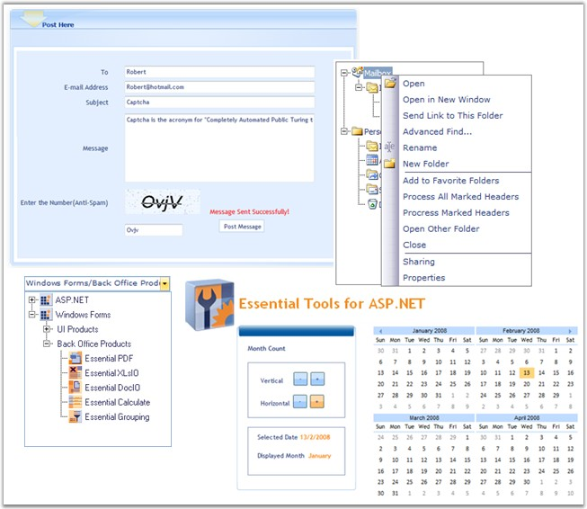

::: {style="DISPLAY: none"}
{#d2h_url_template}{#d2h_package_url style="WIDTH: 0px; DISPLAY: none; HEIGHT: 0px"}
:::

::::: {#nsbanner .d2h_main_nsbanner style="BORDER-BOTTOM: #999999 1px solid; POSITION: relative; PADDING-BOTTOM: 0px; BACKGROUND-COLOR: transparent; PADDING-LEFT: 0px; PADDING-RIGHT: 0px; DISPLAY: none; BORDER-TOP: #999999 1px solid; PADDING-TOP: 0px; LEFT: 0px"}
:::: {#TitleRow .d2h_main_titlerow style="PADDING-BOTTOM: 4px; BACKGROUND-COLOR: transparent; PADDING-LEFT: 22px; WIDTH: 100%; PADDING-RIGHT: 10px; DISPLAY: none; PADDING-TOP: 4px"}
::: {#ienav .d2h_main_ienav style="DISPLAY: none"}
{#D2HPrevious .D2HPreviousEnabled}  {#D2HNext .D2HNextEnabled}
:::
::::
:::::

::::: {#nstext .d2h_main_nstext style="PADDING-BOTTOM: 10px; BACKGROUND-COLOR: transparent; PADDING-LEFT: 22px; PADDING-RIGHT: 10px; HEIGHT: 100%; OVERFLOW: auto; PADDING-TOP: 5px" hasuserbackground="true" valign="bottom"}
::: {#d2h_breadcrumbs .d2h_breadcrumbs}
[Essential Studio User Guide Documentation](ms-xhelp:///?Id=12457748-09e3-4d74-a240-8e049cedf030){.d2h_breadcrumbsNormal}[ \> ]{.d2h_breadcrumbsLinkSeparator}[User Interface Edition](ms-xhelp:///?Id=c29296b7-531c-413b-a0ec-488ca1f7f669){.d2h_breadcrumbsNormal}[ \> ]{.d2h_breadcrumbsLinkSeparator}[Essential ASP.NET](ms-xhelp:///?Id=25c35330-c127-4dad-9a92-ed79dc7261a6){.d2h_breadcrumbsNormal}[ \> ]{.d2h_breadcrumbsLinkSeparator}[Essential Tools]{.d2h_breadcrumbsContentsOnly}[ \> ]{.d2h_breadcrumbsLinkSeparator}[Overview](ms-xhelp:///?Id=c3279a40-efd2-4d70-bfdc-70cdc0f5dc54){.d2h_breadcrumbsNormal}
:::

## Introduction to Essential Tools for ASP.NET {#introduction-to-essential-tools-for-asp.net style="tab-stops: 0pt"}

[]{style="FONT-FAMILY: 'Trebuchet MS','sans-serif'; COLOR: #15428b; FONT-SIZE: 9pt"} 

Essential Tools for ASP.NET is a collection of professional user interface components that are used to create interactive web applications. The controls expose a rich server-side as well as client-side object model. There is also rich design time support with Wizards to help you populate the controls fast. Most of the controls include AutoFormat support which lets you customize the look and feel on the controls with just a few clicks in the designer.

 

All controls are compatible with our CallbackPanel and CallbackMultiplexer controls that let you AJAXify a portion or portions of your page. They are also compatible with the ASP.NET AJAX UpdatePanel.

 

Essential Tools is an extensive collection of twenty nine professional user interface components that is used to create robust and high performance Web application interfaces by using Editors Package (which includes the DateTime Text Box, MaskedEdit Text Box, Currency Text Box, etc.), Menus Package, AutoComplete control, Rotator control, Callback Panel (AJAX Support), Splitter control, and much more.

[]{style="FONT-FAMILY: 'Trebuchet MS','sans-serif'; COLOR: #15428b; FONT-SIZE: 9pt"} 

***[]{style="FONT-FAMILY: 'Trebuchet MS','sans-serif'; COLOR: #15428b; FONT-SIZE: 9pt"}*** 

Figure 1: Essential Tools for ASP.NET

[]{style="FONT-FAMILY: 'Trebuchet MS','sans-serif'; COLOR: black"} 

Key Features

[]{style="FONT-FAMILY: 'Trebuchet MS','sans-serif'; COLOR: black"} 

Important features of Tools Web controls are listed below:

[]{style="FONT-FAMILY: 'Trebuchet MS','sans-serif'; COLOR: #15428b; FONT-SIZE: 9pt"} 

[·      ]{style="FONT-FAMILY: Symbol"}Snap control enables dynamic positioning of ASP.NET content in Web pages with options for moving, docking, floating, and expand and collapse operations with complete support for rich transition effects.

[·      ]{style="FONT-FAMILY: Symbol"}Menu control provides professional-looking built-in skins and a customizable application programming interface (API).

[·      ]{style="FONT-FAMILY: Symbol"}User-friendly, tabbed interfaces can be used to create professional Web pages by using the TabStrip and Multipage controls.

[·      ]{style="FONT-FAMILY: Symbol"}TreeView control provides AJAX support and built-in styles.

[·      ]{style="FONT-FAMILY: Symbol"}Toolbar control provides comprehensive design-time support with rich features including, different toolbar layouts, draggable toolbars, support for image and text, and drop-down menus.

[·      ]{style="FONT-FAMILY: Symbol"}Splitter control includes the Splitter Bar and Sliding Panes that enable users to divide the Web page into distinct areas and resize the panes.

[·      ]{style="FONT-FAMILY: Symbol"}Groupbar control lets you implement Outlook Bar or Windows Task Bar-like functionality. It serves as a container that can host a collection of controls where every such control represents a standard command.

[·      ]{style="FONT-FAMILY: Symbol"}Layout controls are used to design various layouts in web pages.

[·      ]{style="FONT-FAMILY: Symbol"}JQuery UI Server controls support popular AutoFormat styles.

[·      ]{style="FONT-FAMILY: Symbol"}XHTML Compliance for all controls.

[]{style="FONT-FAMILY: 'Trebuchet MS','sans-serif'; COLOR: #15428b; FONT-SIZE: 9pt"} 

 

User Guide Structure

[]{style="FONT-FAMILY: 'Trebuchet MS','sans-serif'; COLOR: #15428b; FONT-SIZE: 9pt"} 

The product comes with numerous samples as well as an extensive documentation to guide you. This User Guide provides detailed information on the features and functionalities of Tools Web controls. It is organized into the following sections:

[]{style="FONT-FAMILY: 'Trebuchet MS','sans-serif'; COLOR: #15428b; FONT-SIZE: 9pt"} 

[·      ]{style="FONT-FAMILY: Symbol"}**Overview**-This section gives a brief introduction to our product and its key features.

[·      ]{style="FONT-FAMILY: Symbol"}**Installation and Deployment**-This section elaborates on the install location of the samples, license, and so on.

[·      ]{style="FONT-FAMILY: Symbol"}**Getting Started**-This section guides you on getting started with ASP.NET application, Tools Web controls, and so on.

[·      ]{style="FONT-FAMILY: Symbol"}**Controls and Components**-The features of individual Tools Web controls are illustrated with use case scenarios, code examples and screen shots under this section.

[]{style="FONT-FAMILY: 'Trebuchet MS','sans-serif'; COLOR: #15428b; FONT-SIZE: 9pt"} 

Document Conventions

[]{style="FONT-FAMILY: 'Trebuchet MS','sans-serif'; COLOR: #15428b; FONT-SIZE: 9pt"} 

The following conventions will help you to quickly identify the important sections of information while using the content.

[]{style="FONT-FAMILY: 'Trebuchet MS','sans-serif'; COLOR: #15428b; FONT-SIZE: 9pt"} 

::: {align="center"}
+------------------------+-------------------------------------------------------------------------------------------------------------------------------------------------------------------------------------------------------------------------------------------------------------+---------------------------------------------------------------------------+
| Convention             | Icon                                                                                                                                                                                                                                                        | Description of the Icon                                                   |
+------------------------+-------------------------------------------------------------------------------------------------------------------------------------------------------------------------------------------------------------------------------------------------------------+---------------------------------------------------------------------------+
| Note                   | ::: {style="BORDER-BOTTOM: windowtext 1pt solid; BORDER-LEFT: medium none; PADDING-BOTTOM: 1pt; MARGIN-TOP: 9pt; PADDING-LEFT: 0pt; PADDING-RIGHT: 0pt; MARGIN-BOTTOM: 9pt; BORDER-TOP: windowtext 1pt solid; BORDER-RIGHT: medium none; PADDING-TOP: 1pt"} | Represents important information                                          |
|                        | Note:                                                                                                                                                                                                                           |                                                                           |
|                        | :::                                                                                                                                                                                                                                                         |                                                                           |
+------------------------+-------------------------------------------------------------------------------------------------------------------------------------------------------------------------------------------------------------------------------------------------------------+---------------------------------------------------------------------------+
| Example                | **Example**                                                                                                                                                                                                                                                 | Represents an example                                                     |
+------------------------+-------------------------------------------------------------------------------------------------------------------------------------------------------------------------------------------------------------------------------------------------------------+---------------------------------------------------------------------------+
| Tip                    |                                                                                                                                                                                                                                 | Represents useful hints that will help you in using the controls/features |
+------------------------+-------------------------------------------------------------------------------------------------------------------------------------------------------------------------------------------------------------------------------------------------------------+---------------------------------------------------------------------------+
| Additional Information |                                                                                                                                                                                                                                 | Represents additional information on the topic                            |
+------------------------+-------------------------------------------------------------------------------------------------------------------------------------------------------------------------------------------------------------------------------------------------------------+---------------------------------------------------------------------------+
:::

 

[]{#related-topics}
:::::
