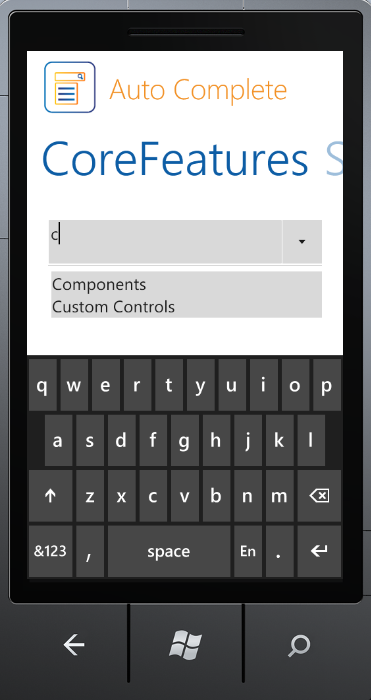

::: {style="DISPLAY: none"}
{#d2h_url_template}{#d2h_package_url style="WIDTH: 0px; DISPLAY: none; HEIGHT: 0px"}
:::

::::: {#nsbanner .d2h_main_nsbanner style="BORDER-BOTTOM: #999999 1px solid; POSITION: relative; PADDING-BOTTOM: 0px; BACKGROUND-COLOR: transparent; PADDING-LEFT: 0px; PADDING-RIGHT: 0px; DISPLAY: none; BORDER-TOP: #999999 1px solid; PADDING-TOP: 0px; LEFT: 0px"}
:::: {#TitleRow .d2h_main_titlerow style="PADDING-BOTTOM: 4px; BACKGROUND-COLOR: transparent; PADDING-LEFT: 22px; WIDTH: 100%; PADDING-RIGHT: 10px; DISPLAY: none; PADDING-TOP: 4px"}
::: {#ienav .d2h_main_ienav style="DISPLAY: none"}
{#D2HPrevious .D2HPreviousEnabled}  {#D2HNext .D2HNextEnabled}
:::
::::
:::::

::::: {#nstext .d2h_main_nstext style="PADDING-BOTTOM: 10px; BACKGROUND-COLOR: transparent; PADDING-LEFT: 22px; PADDING-RIGHT: 10px; HEIGHT: 100%; OVERFLOW: auto; PADDING-TOP: 5px" hasuserbackground="true" valign="bottom"}
::: {#d2h_breadcrumbs .d2h_breadcrumbs}
[Essential Studio User Guide Documentation](ms-xhelp:///?Id=12457748-09e3-4d74-a240-8e049cedf030){.d2h_breadcrumbsNormal}[ \> ]{.d2h_breadcrumbsLinkSeparator}[User Interface Edition](ms-xhelp:///?Id=c29296b7-531c-413b-a0ec-488ca1f7f669){.d2h_breadcrumbsNormal}[ \> ]{.d2h_breadcrumbsLinkSeparator}[Essential Windows Phone](ms-xhelp:///?Id=5ea1999c-4eff-4775-b84e-407dc825f555){.d2h_breadcrumbsNormal}[ \> ]{.d2h_breadcrumbsLinkSeparator}[Essential Tools]{.d2h_breadcrumbsContentsOnly}[ \> ]{.d2h_breadcrumbsLinkSeparator}[Overview](ms-xhelp:///?Id=fcd7324d-c844-4fc7-ad62-4326f5a15a23){.d2h_breadcrumbsNormal}
:::

## Introduction to Essential Tools Phone {#introduction-to-essential-tools-phone style="tab-stops: 0pt"}

 

Essential Tools for Windows Phone is a set of new user interface components for the Microsoft\'s Windows Phone framework. In some cases, they extend the functionality provided by the standard framework controls. It is intended for those users who look for additional functionalities such as auto-completion. The package consists of a comprehensive set of components that are required for building modern Phone applications including Button Controls, Numeric Updown, Domain Updown, Auto Complete and much more.

Essential Tools supports Mango edition of the Windows Phone operating system. Windows Phone 7.5 (codenamed Mango) provides support for more than five hundred features compared to the Windows Phone 7.0 version. Some of the major features include multitasking and Silverlight 4 support. Essential Studio controls for Windows Phone now support Mango edition, enabling you to utilize these advanced features.

 

 

 

Figure 1: AutoComplete Control

***                                               ***

Real World Scenarios

 

The following is a real time application of Windows Phone tools:

 

[·      ]{style="FONT-FAMILY: Symbol"}AutoComplete can be used in the Data Form for getting items easily by means of filtering in the control.

 

Key Features

 

Some of the key features available in Essential Tools for Windows Phone are:

 

[·      ]{style="FONT-FAMILY: Symbol"}**AutoComplete** control provides live drop-down hints to the users as they type the keywords. It helps the user to select an entry from the list instead of entering the whole text. The following are some of the feature of this control:

[o  ]{style="FONT-FAMILY: 'Courier New'"}Allows enabling or disabling the appending of text from history, depending on the entered text.   

[o  ]{style="FONT-FAMILY: 'Courier New'"}Allowsspecifying the visibility of the drop-down button.

[o  ]{style="FONT-FAMILY: 'Courier New'"}Allows get or set the maximum height for the drop down.

 

 

User Guide Organization

 

The product comes with numerous samples as well as an extensive documentation to guide you. This user guide provides detailed information on the features and functionalities of the Essential Tools for Windows Phone. It is organized into the following sections:

[·      ]{style="FONT-FAMILY: Symbol"}**Overview** - This section gives a brief introduction to the product and its key features.

[·      ]{style="FONT-FAMILY: Symbol"}**Installation and Deployment** - This section elaborates on the install location of the samples, license etc.

[·      ]{style="FONT-FAMILY: Symbol"}**Concepts and Features -** The features of individual controls are illustrated with use case scenarios, code examples and screenshots in this section.

 

Document Conventions

 

The conventions listed in the following tabel will help you to quickly identify the important sections of information in the User Guide:

 

::: {align="center"}
  ------------------------ ----------------------------------------- ---------------------------------------------------------------------------------
  Convention               Icon                                      Description
  Note                     ***Note:***   Represents important information.
  Example                  **Example:**                              Represents an example.
  Tip                                    Represents useful hints, that will help you in using the controls and features.
  Additional information                 Represents additional information on the corresponding topic.
  ------------------------ ----------------------------------------- ---------------------------------------------------------------------------------
:::

[]{style="COLOR: red"} 

[]{style="COLOR: red"} 

[]{#related-topics}
:::::
