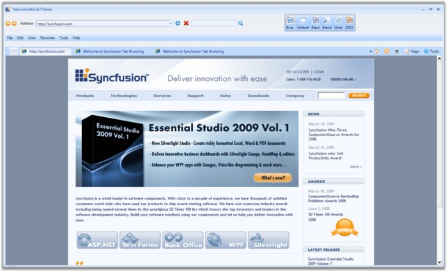
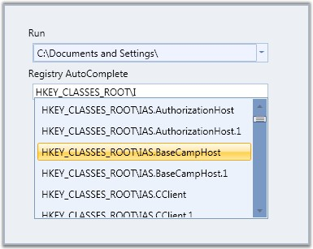
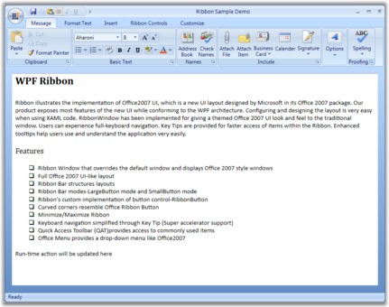
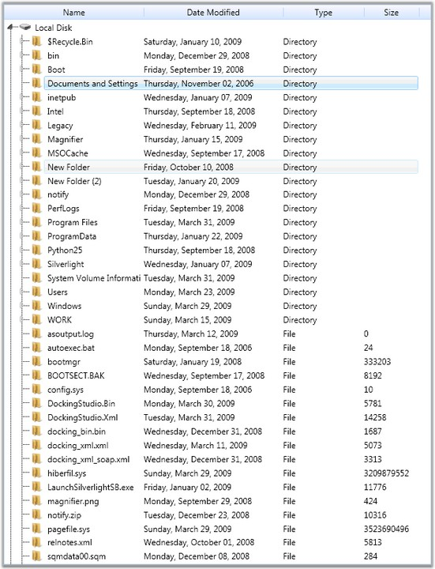
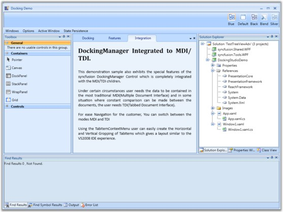

::: {style="DISPLAY: none"}
{#d2h_url_template}{#d2h_package_url style="WIDTH: 0px; DISPLAY: none; HEIGHT: 0px"}
:::

::::: {#nsbanner .d2h_main_nsbanner style="BORDER-BOTTOM: #999999 1px solid; POSITION: relative; PADDING-BOTTOM: 0px; BACKGROUND-COLOR: transparent; PADDING-LEFT: 0px; PADDING-RIGHT: 0px; DISPLAY: none; BORDER-TOP: #999999 1px solid; PADDING-TOP: 0px; LEFT: 0px"}
:::: {#TitleRow .d2h_main_titlerow style="PADDING-BOTTOM: 4px; BACKGROUND-COLOR: transparent; PADDING-LEFT: 22px; WIDTH: 100%; PADDING-RIGHT: 10px; DISPLAY: none; PADDING-TOP: 4px"}
::: {#ienav .d2h_main_ienav style="DISPLAY: none"}
{#D2HPrevious .D2HPreviousEnabled}  {#D2HNext .D2HNextEnabled}
:::
::::
:::::

::::: {#nstext .d2h_main_nstext style="PADDING-BOTTOM: 10px; BACKGROUND-COLOR: transparent; PADDING-LEFT: 22px; PADDING-RIGHT: 10px; HEIGHT: 100%; OVERFLOW: auto; PADDING-TOP: 5px" hasuserbackground="true" valign="bottom"}
::: {#d2h_breadcrumbs .d2h_breadcrumbs}
[Essential Studio User Guide Documentation](ms-xhelp:///?Id=12457748-09e3-4d74-a240-8e049cedf030){.d2h_breadcrumbsNormal}[ \> ]{.d2h_breadcrumbsLinkSeparator}[User Interface Edition](ms-xhelp:///?Id=c29296b7-531c-413b-a0ec-488ca1f7f669){.d2h_breadcrumbsNormal}[ \> ]{.d2h_breadcrumbsLinkSeparator}[Essential WPF](ms-xhelp:///?Id=7f4f82c5-151c-4262-94d0-75c4626c77bc){.d2h_breadcrumbsNormal}[ \> ]{.d2h_breadcrumbsLinkSeparator}[Essential Tools]{.d2h_breadcrumbsContentsOnly}[ \> ]{.d2h_breadcrumbsLinkSeparator}[Overview](ms-xhelp:///?Id=bfa5f8d5-b368-498a-867f-64d4e9f0077c){.d2h_breadcrumbsNormal}
:::

## Introduction to Essential Tools WPF {#introduction-to-essential-tools-wpf style="tab-stops: 0pt"}

Essential Tools for WPF is a set of new user interface components for the Microsoft\'s Windows Presentation Foundation framework. In some cases, they extend the functionality provided by the standard framework controls. It is intended for those users who look for additional functionalities such as auto-completion and new components such as group bar in addition to the existing WPF framework. The package consists of a comprehensive set of components that are required for building modern windows applications including Docking, Ribbon, Tabs, TreeView, Editors and much more.

 

Real World Scenarios

Some of the real world scenarios of Tools WPF controls are illustrated in the below images.

 

Figure 1: TabControlExt in Internet Explorer

***[]{style="FONT-FAMILY: 'Trebuchet MS','sans-serif'; COLOR: #15428b; FONT-SIZE: 9pt"}*** 

Figure 2: AutoComplete Control

***[]{style="FONT-FAMILY: 'Trebuchet MS','sans-serif'; COLOR: #15428b; FONT-SIZE: 9pt"}*** 

Figure 3: Ribbon control in Outlook 2007

***[]{style="FONT-FAMILY: 'Trebuchet MS','sans-serif'; COLOR: #15428b; FONT-SIZE: 9pt"}*** 

Figure 4: TreeViewAdv control in Windows Explorer

 

Figure 5: Docking Manager in Visual Studio

[]{style="FONT-FAMILY: 'Trebuchet MS','sans-serif'; COLOR: #15428b; FONT-SIZE: 9pt"} 

Key Features

[]{style="FONT-FAMILY: 'Trebuchet MS','sans-serif'; COLOR: #15428b; FONT-SIZE: 9pt"} 

The following are the key features of Essential Tools for WPF:

[·      ]{style="FONT-FAMILY: Symbol"}**TreeViewAdv** control allows you to display hierarchical data in a tree structure. It has items that can be expanded and collapsed. Some of it\'s features are as follows:

[o  ]{style="FONT-FAMILY: 'Courier New'"}Provides support to add any number of items to the control.

[o  ]{style="FONT-FAMILY: 'Courier New'"}Developed using UI Virtualization; enabling enhanced performance.

[o  ]{style="FONT-FAMILY: 'Courier New'"}Data binding support.

[·      ]{style="FONT-FAMILY: Symbol"}**GroupBar** control allows you to implement list-type controls in the UI, similar to the Microsoft Outlook Bar. It has a container to host controls within it. Some of it\'s features are as follows:

[o  ]{style="FONT-FAMILY: 'Courier New'"}Vertical and Horizontal layouts and orientation of GroupBar items.

[o  ]{style="FONT-FAMILY: 'Courier New'"}Alignment and Orientation of GroupView Items.

[o  ]{style="FONT-FAMILY: 'Courier New'"}It supports expansion of multiple tabs.

[o  ]{style="FONT-FAMILY: 'Courier New'"}ToolTip support for GroupView items

[·      ]{style="FONT-FAMILY: Symbol"}**DockingManager** implements an architecture that allows child controls to be docked to any part of the window as in Microsoft Visual Studio. Some of it\'s features are as follows:

[o  ]{style="FONT-FAMILY: 'Courier New'"}Integrated MDI / TDI logic with the DockingManager.

[o  ]{style="FONT-FAMILY: 'Courier New'"}Various in-built window switchers available for navigating in between the windows.

[o  ]{style="FONT-FAMILY: 'Courier New'"}In-built context menu support such as Tab list context menu and tab item context menu support.

[·      ]{style="FONT-FAMILY: Symbol"}**AutoComplete** control provides live drop-down hints to users as they type in the keywords. It guides the users to select an item from the list of the text instead of entering the whole text.

[·      ]{style="FONT-FAMILY: Symbol"}By using **TabControlExt**, an application can define multiple pages for the same area of a window. Some of it\'s features are as follows:

[o  ]{style="FONT-FAMILY: 'Courier New'"}Support to add Header Images

[o  ]{style="FONT-FAMILY: 'Courier New'"}Supports visual customization

[o  ]{style="FONT-FAMILY: 'Courier New'"}Facilitation of different layout types for enhanced usage

[]{style="FONT-FAMILY: 'Trebuchet MS','sans-serif'; COLOR: #15428b; FONT-SIZE: 9pt"} 

User Guide Organization

The product comes with numerous samples as well as an extensive documentation to guide you. This User Guide provides detailed information on the features and functionalities of the Essential Tools for WPF. It is organized into the following sections:

[]{style="FONT-FAMILY: 'Trebuchet MS','sans-serif'; COLOR: #15428b; FONT-SIZE: 9pt"} 

[·      ]{style="FONT-FAMILY: Symbol"}**Overview**---This section gives a brief introduction to the product and its key features.

[·      ]{style="FONT-FAMILY: Symbol"}**Installation and Deployment**---This section elaborates on the install location of the samples, license etc.

[·      ]{style="FONT-FAMILY: Symbol"}**What\'s New**---This section lists the new features implemented for every release.

[·      ]{style="FONT-FAMILY: Symbol"}**Getting Started**---This section guides you on getting started with WPF application, controls etc.

[·      ]{style="FONT-FAMILY: Symbol"}**Concepts and Features**---The features of individual controls are illustrated with use case scenarios, code examples and screen shots under this section.

[]{style="FONT-FAMILY: 'Trebuchet MS','sans-serif'; COLOR: #15428b; FONT-SIZE: 9pt"} 

Document Conventions[ ]{style="FONT-SIZE: 9pt"}

The conventions below will help you to quickly identify the important sections of information, while using the content:

 

::: {align="center"}
  -------------------------------------------------- ---------------------------------------------------------------------------------- -----------------------------------------------------------------------------------------------------------
  Convention                                         Icon                                                                               Description of the Icon
  [Note]{style="FONT-SIZE: 9pt"}                       Note:                                                [Represents important information.]{style="FONT-SIZE: 9pt"}
  [Example]{style="FONT-SIZE: 9pt"}                  [Example:]{style="FONT-SIZE: 9pt"}                                                 [Represents an example.]{style="FONT-SIZE: 9pt"}
  [Tip]{style="FONT-SIZE: 9pt"}                      []{style="FONT-SIZE: 9pt"}[]{style="FONT-SIZE: 9pt"}   [Represents useful hints, that will help you in using the controls and features.]{style="FONT-SIZE: 9pt"}
  [Additional information]{style="FONT-SIZE: 9pt"}   []{style="FONT-SIZE: 9pt"}[]{style="FONT-SIZE: 9pt"}   [Represents additional information on the corresponding topic.]{style="FONT-SIZE: 9pt"}
  -------------------------------------------------- ---------------------------------------------------------------------------------- -----------------------------------------------------------------------------------------------------------
:::

[]{style="FONT-FAMILY: 'Trebuchet MS','sans-serif'; COLOR: red; FONT-SIZE: 9pt"} 

 

[]{#related-topics}
:::::
