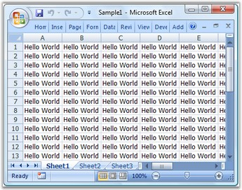

::: {style="DISPLAY: none"}
{#d2h_url_template}{#d2h_package_url style="WIDTH: 0px; DISPLAY: none; HEIGHT: 0px"}
:::

::::: {#nsbanner .d2h_main_nsbanner style="BORDER-BOTTOM: #999999 1px solid; POSITION: relative; PADDING-BOTTOM: 0px; BACKGROUND-COLOR: transparent; PADDING-LEFT: 0px; PADDING-RIGHT: 0px; DISPLAY: none; BORDER-TOP: #999999 1px solid; PADDING-TOP: 0px; LEFT: 0px"}
:::: {#TitleRow .d2h_main_titlerow style="PADDING-BOTTOM: 4px; BACKGROUND-COLOR: transparent; PADDING-LEFT: 22px; WIDTH: 100%; PADDING-RIGHT: 10px; DISPLAY: none; PADDING-TOP: 4px"}
::: {#ienav .d2h_main_ienav style="DISPLAY: none"}
{#D2HPrevious .D2HPreviousEnabled}  {#D2HNext .D2HNextEnabled}
:::
::::
:::::

::::: {#nstext .d2h_main_nstext style="PADDING-BOTTOM: 10px; BACKGROUND-COLOR: transparent; PADDING-LEFT: 22px; PADDING-RIGHT: 10px; HEIGHT: 100%; OVERFLOW: auto; PADDING-TOP: 5px" hasuserbackground="true" valign="bottom"}
::: {#d2h_breadcrumbs .d2h_breadcrumbs}
[Essential Studio User Guide Documentation](ms-xhelp:///?Id=12457748-09e3-4d74-a240-8e049cedf030){.d2h_breadcrumbsNormal}[ \> ]{.d2h_breadcrumbsLinkSeparator}[Reporting Edition](ms-xhelp:///?Id=027aa5b6-6676-4f93-ad23-c20e8c45792e){.d2h_breadcrumbsNormal}[ \> ]{.d2h_breadcrumbsLinkSeparator}[Essential XlsIO](ms-xhelp:///?Id=b01a1b50-1d7d-40c0-bc83-af67e57c9005){.d2h_breadcrumbsNormal}[ \> ]{.d2h_breadcrumbsLinkSeparator}[Overview](ms-xhelp:///?Id=bf585262-493a-41b9-a346-f63b5e75614f){.d2h_breadcrumbsNormal}
:::

## Introduction to Essential XlsIO {#introduction-to-essential-xlsio style="tab-stops: 0pt"}

Essential XlsIO is a 100% native .NET library that generates fully functional **Microsoft Excel Spreadsheets** in **native Excel** format without depending on Microsoft Excel. Essential XlsIO is a perfect solution for the users who need to read and write Microsoft Excel files. It does not require MS Excel to be installed in the Report generation machine or server.

 

Essential XlsIO library can be used in any .NET environment including C#, VB.NET and managed C++. It is a Non-UI component that can be used in **ASP.NET**, **Windows** **Forms, WPF** and **Silverlight** applications, without any change in the API. The usage is common for all the environments, except for the part where the created spreadsheet is saved to disk or stream in the case of a Windows Forms/WPF application and streamed to the client browser in the case of Web applications; there are no temporary Excel files created on the server in an ASP.NET application. Essential XlsIO comes with support for working with formulas in the cells and provides data and worksheet manipulation support. It is known for its high performance for generating Excel files with large number of rows and columns. It is possible to create and modify Excel charts inside a workbook and also has options to secure its contents.

 

XlsIO can read and write Excel files that are compatible with Excel 97 to Excel 2010. The same Excel file created by using XlsIO can be opened by the following versions of MS Excel. There is no need to create separate files for different versions of Excel.

 

[·      ]{style="FONT-FAMILY: Symbol"}Excel 97 (.xls)

[·      ]{style="FONT-FAMILY: Symbol"}Excel 2000 (.xls)

[·      ]{style="FONT-FAMILY: Symbol"}Excel 2002 (.xls)

[·      ]{style="FONT-FAMILY: Symbol"}Excel 2003 (.xls)

[·      ]{style="FONT-FAMILY: Symbol"}SpreadsheetML (.xlsx)

[·      ]{style="FONT-FAMILY: Symbol"}CSV (.csv)

[·      ]{style="FONT-FAMILY: Symbol"}Excel 2007 (.xlsx)

[·      ]{style="FONT-FAMILY: Symbol"}Excel 2010 (.xlsx)

 

The following image shows a sample worksheet.

 

[]{style="FONT-FAMILY: 'Trebuchet MS','sans-serif'; COLOR: #15428b; FONT-SIZE: 9pt"}

Figure 1: Sample Worksheet

***[]{style="FONT-FAMILY: 'Trebuchet MS','sans-serif'; COLOR: #15428b; FONT-SIZE: 9pt"}*** 

Use Case Scenario

[]{style="FONT-FAMILY: 'Trebuchet MS','sans-serif'; COLOR: #15428b; FONT-SIZE: 9pt"} 

[·      ]{style="FONT-FAMILY: Symbol"}Desktop Application-A sales tracking application generating a report on sales figures for the past year.

[·      ]{style="FONT-FAMILY: Symbol"}Web Application-A banking website allowing users to download monthly statements in MS Excel format.

 

Key Features

 

[·      ]{style="FONT-FAMILY: Symbol"}Essential XlsIO provides various formatting options like setting fonts, alignment of content, number formatting, border settings and color-fill settings. It also supports various styles for cells and conditional formatting options.

[·      ]{style="FONT-FAMILY: Symbol"}It supports range manipulations like copying a range, moving a range, and so on, and Find and Replace option as part of editing the document.

[·      ]{style="FONT-FAMILY: Symbol"}Various components like chart, pictures and tables can be inserted into the document. It also provides support for insertion of controls like text boxes, check boxes and combo boxes, headers and footers, and links.

[·      ]{style="FONT-FAMILY: Symbol"}It provides support for page setup options like margin setup, orientation, paper size and page breaks. It also supports several print settings.

[·      ]{style="FONT-FAMILY: Symbol"}It provides extensive support for using formulae in cells and calculations based on formula function library and calculation engine.

[·      ]{style="FONT-FAMILY: Symbol"}It provides support for data validation and import/export of data. It also provides data filter and template markers for efficient data-handling.

[·      ]{style="FONT-FAMILY: Symbol"}Comments can be inserted to any cell in the Excel document by using Essential XlsIO review support.

[·      ]{style="FONT-FAMILY: Symbol"}Three levels of protection are provided by Essential XlsIO-workbook-level protection, worksheet-level protection and cell-level protection. It also provides encryption and decryption methodology to ensure security of the document.

[·      ]{style="FONT-FAMILY: Symbol"}Several customizing options like freezing pane, split pane, zooming and macros are supported.

[·      ]{style="FONT-FAMILY: Symbol"}It provides support for viewing and modifying the properties of the document like Title, Company, Author, Manager, Keywords, and so on.

[·      ]{style="FONT-FAMILY: Symbol"}Several add-ins for Microsoft Excel are provided.

 

User Guide Organization

 

The product comes with numerous samples as well as an extensive documentation to guide you. This User Guide provides detailed information on the features and functionalities of the Essential Chart for MVC. It is organized into the following sections:

 

[·      ]{style="FONT-FAMILY: Symbol"}**Overview**-This section gives a brief introduction to our product and its key features.

[·      ]{style="FONT-FAMILY: Symbol"}**Installation and[ ]{style="COLOR: red"}Deployment**-This section elaborates on the install location of the samples, license, and so on.

[·      ]{style="FONT-FAMILY: Symbol"}**Getting Started**-This section guides you on getting started with ASP.NET MVC application, controls, and so on.

[·      ]{style="FONT-FAMILY: Symbol"}**Concepts and Features**-The features of individual controls are illustrated with use case scenarios, code examples and screen shots under this section.

[·      ]{style="FONT-FAMILY: Symbol"}**Frequently Asked Questions-**This section covers the task-based questions and expert solutions.

[]{style="FONT-FAMILY: 'Trebuchet MS','sans-serif'; COLOR: #15428b; FONT-SIZE: 9pt"} 

Document Conventions[ ]{style="FONT-SIZE: 9pt"}

 

The conventions below will help you to quickly identify the important sections of information, while using the content:

 

::: {align="center"}
+------------------------+-------------------------------------------------------------------------------------------------------------------------------------------------------------------------------------------------------------------------------------------------------------+---------------------------------------------------------------------------------+
| Convention             | Icon                                                                                                                                                                                                                                                        | Description of the Icon                                                         |
+------------------------+-------------------------------------------------------------------------------------------------------------------------------------------------------------------------------------------------------------------------------------------------------------+---------------------------------------------------------------------------------+
|           Note         | ::: {style="BORDER-BOTTOM: windowtext 1pt solid; BORDER-LEFT: medium none; PADDING-BOTTOM: 1pt; MARGIN-TOP: 9pt; PADDING-LEFT: 0pt; PADDING-RIGHT: 0pt; MARGIN-BOTTOM: 9pt; BORDER-TOP: windowtext 1pt solid; BORDER-RIGHT: medium none; PADDING-TOP: 1pt"} | Represents important information, to be noted.                                  |
|                        | Note:                                                                                                                                                                                                                           |                                                                                 |
|                        | :::                                                                                                                                                                                                                                                         |                                                                                 |
+------------------------+-------------------------------------------------------------------------------------------------------------------------------------------------------------------------------------------------------------------------------------------------------------+---------------------------------------------------------------------------------+
| Example                | **Example:**                                                                                                                                                                                                                                                | Represents an example.                                                          |
+------------------------+-------------------------------------------------------------------------------------------------------------------------------------------------------------------------------------------------------------------------------------------------------------+---------------------------------------------------------------------------------+
| Tip                    |                                                                                                                                                                                                                                 | Represents useful hints, that will help you in using the controls and features. |
+------------------------+-------------------------------------------------------------------------------------------------------------------------------------------------------------------------------------------------------------------------------------------------------------+---------------------------------------------------------------------------------+
| Additional information |                                                                                                                                                                                                                                 | Represents additional information on the corresponding topic.                   |
+------------------------+-------------------------------------------------------------------------------------------------------------------------------------------------------------------------------------------------------------------------------------------------------------+---------------------------------------------------------------------------------+
:::

 

[]{#p2}[]{style="FONT-FAMILY: 'Trebuchet MS','sans-serif'; COLOR: #15428b; FONT-SIZE: 9pt"} 

[]{#related-topics}
:::::
