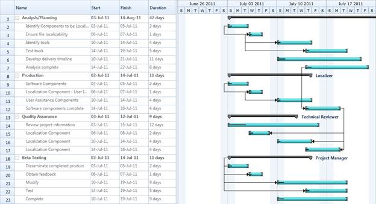

::: {style="DISPLAY: none"}
{#d2h_url_template}{#d2h_package_url style="WIDTH: 0px; DISPLAY: none; HEIGHT: 0px"}
:::

::::: {#nsbanner .d2h_main_nsbanner style="BORDER-BOTTOM: #999999 1px solid; POSITION: relative; PADDING-BOTTOM: 0px; BACKGROUND-COLOR: transparent; PADDING-LEFT: 0px; PADDING-RIGHT: 0px; DISPLAY: none; BORDER-TOP: #999999 1px solid; PADDING-TOP: 0px; LEFT: 0px"}
:::: {#TitleRow .d2h_main_titlerow style="PADDING-BOTTOM: 4px; BACKGROUND-COLOR: transparent; PADDING-LEFT: 22px; WIDTH: 100%; PADDING-RIGHT: 10px; DISPLAY: none; PADDING-TOP: 4px"}
::: {#ienav .d2h_main_ienav style="DISPLAY: none"}
{#D2HPrevious .D2HPreviousEnabled}  {#D2HNext .D2HNextEnabled}
:::
::::
:::::

:::: {#nstext .d2h_main_nstext style="PADDING-BOTTOM: 10px; BACKGROUND-COLOR: transparent; PADDING-LEFT: 22px; PADDING-RIGHT: 10px; HEIGHT: 100%; OVERFLOW: auto; PADDING-TOP: 5px" hasuserbackground="true" valign="bottom"}
::: {#d2h_breadcrumbs .d2h_breadcrumbs}
[Essential Studio User Guide Documentation](ms-xhelp:///?Id=12457748-09e3-4d74-a240-8e049cedf030){.d2h_breadcrumbsNormal}[ \> ]{.d2h_breadcrumbsLinkSeparator}[User Interface Edition](ms-xhelp:///?Id=c29296b7-531c-413b-a0ec-488ca1f7f669){.d2h_breadcrumbsNormal}[ \> ]{.d2h_breadcrumbsLinkSeparator}[Essential WPF](ms-xhelp:///?Id=7f4f82c5-151c-4262-94d0-75c4626c77bc){.d2h_breadcrumbsNormal}[ \> ]{.d2h_breadcrumbsLinkSeparator}[Essential Gantt]{.d2h_breadcrumbsContentsOnly}[ \> ]{.d2h_breadcrumbsLinkSeparator}[Overview](ms-xhelp:///?Id=569066a7-1af9-4c11-9e2f-5902394085ea){.d2h_breadcrumbsNormal}
:::

## Introduction to GanttControl {#introduction-to-ganttcontrol style="tab-stops: 0pt"}

Essential Gantt for WPF is a MS Project-like Project Viewer with inbuilt grid, schedule and resource assignment constraints. It is designed to assist project managers in developing plans, assigning resources to the task, tracking task progress and so on. Some of the key features of Gantt control are: drag support for increasing and  decreasing the Start and Finish Date of the Task , Drag and Drop support for  the task within a row and automatic data synchronization between Grid and Chart. This also supports to import and export the Task Details as XML file.

**[]{style="FONT-SIZE: 11pt"}** 

Real World Scenario

Research scholars, IT Companies or any organisaztion that following work breakdown structure can use Gantt control to schedule and track their tasks/ activities. This helps tracking the progress of an assignment. By tracking the progress one can change or reschedule the plan to achive the goal.

 

Figure 1: GanttControl

 

[]{#related-topics}
::::
