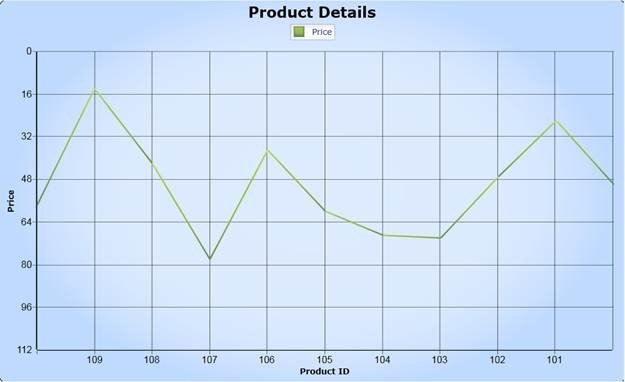

::: {style="DISPLAY: none"}
{#d2h_url_template}{#d2h_package_url style="WIDTH: 0px; DISPLAY: none; HEIGHT: 0px"}
:::

:::: {.d2h_secondary_topic style="PADDING-BOTTOM: 10pt; MARGIN: 0pt; PADDING-LEFT: 0pt; PADDING-RIGHT: 0pt; PADDING-TOP: 0pt"}
#### Inverted Axis Support {#inverted-axis-support style="tab-stops: 0pt"}

Essential Chart provides support for inverting the values on the axis. Data on an inverted axis is plotted in the opposite direction - Top to Bottom for Y-axis and Right to Left for X-axis. To enable this behavior, set the IsInversed property of ChartAxis control to True.

Use Case Scenarios

Inversed Axis support helps to reverse the label of the chart axis by showing it in reverse order. This feature is similar as the Arabic Culture which supports Right-To-Left reading.

**[]{style="COLOR: #15428b"}** 

Adding IsInversed to an Application

Essential Chart Silverlight provides support to reverse the labels of the chart axis. You can initialize the IsInversed property of the ChartAxis control to True, in order to arrange the axis of the labels in reverse order. The following code snippet illustrates how to initialize the IsInversed property in both XAML and C#.

**[]{style="COLOR: #15428b"}** 

+------------------------------------------------------------------------------------------------------------------------------------------------------------------------------------------------------------------------------------------------------------------------------------------------------------------------------------------------------------------------------------------------------------------------------------------------------------------------------------------------------------------------------------------------------------------------------------------------------------------------------------------------------------------------------------------------------------------------------------------------------------------------------------------------------------------------------------------------------------------------------------------------------------------------------+
| [\[XAML\]]{style="FONT-FAMILY: 'Courier New'"}                                                                                                                                                                                                                                                                                                                                                                                                                                                                                                                                                                                                                                                                                                                                                                                                                                                                               |
|                                                                                                                                                                                                                                                                                                                                                                                                                                                                                                                                                                                                                                                                                                                                                                                                                                                                                                                              |
| [\<]{style="FONT-FAMILY: 'Courier New'; COLOR: blue"}[sync]{style="FONT-FAMILY: 'Courier New'; COLOR: #a31515"}[:]{style="FONT-FAMILY: 'Courier New'; COLOR: blue"}[ChartArea.]{style="FONT-FAMILY: 'Courier New'; COLOR: #a31515"}[SecondaryAxis ]{style="FONT-FAMILY: 'Courier New'; COLOR: #c00000"}[\>]{style="FONT-FAMILY: 'Courier New'; COLOR: blue"}[                    ]{style="FONT-FAMILY: 'Courier New'; COLOR: #a31515"}[\<]{style="FONT-FAMILY: 'Courier New'; COLOR: blue"}[sync]{style="FONT-FAMILY: 'Courier New'; COLOR: #a31515"}[:]{style="FONT-FAMILY: 'Courier New'; COLOR: blue"}[ChartAxis]{style="FONT-FAMILY: 'Courier New'; COLOR: #a31515"}[ IsInversed]{style="FONT-FAMILY: 'Courier New'; COLOR: red"}[=\"True\" \>]{style="FONT-FAMILY: 'Courier New'; COLOR: blue"}[                        ]{style="FONT-FAMILY: 'Courier New'; COLOR: #a31515"}**[]{style="FONT-FAMILY: 'Courier New'"}** |
|                                                                                                                                                                                                                                                                                                                                                                                                                                                                                                                                                                                                                                                                                                                                                                                                                                                                                                                              |
| [                    ]{style="FONT-FAMILY: 'Courier New'; COLOR: #a31515"}[\</]{style="FONT-FAMILY: 'Courier New'; COLOR: blue"}[sync]{style="FONT-FAMILY: 'Courier New'; COLOR: #a31515"}[:]{style="FONT-FAMILY: 'Courier New'; COLOR: blue"}[ChartAxis]{style="FONT-FAMILY: 'Courier New'; COLOR: #a31515"}[\>]{style="FONT-FAMILY: 'Courier New'; COLOR: blue"}[                ]{style="FONT-FAMILY: 'Courier New'; COLOR: #a31515"}[\</]{style="FONT-FAMILY: 'Courier New'; COLOR: blue"}[sync]{style="FONT-FAMILY: 'Courier New'; COLOR: #a31515"}[:]{style="FONT-FAMILY: 'Courier New'; COLOR: blue"}[ChartArea.]{style="FONT-FAMILY: 'Courier New'; COLOR: #a31515"}[SecondaryAxis ]{style="FONT-FAMILY: 'Courier New'; COLOR: #c00000"}[\>]{style="FONT-FAMILY: 'Courier New'; COLOR: blue"}                                                                                                                        |
+------------------------------------------------------------------------------------------------------------------------------------------------------------------------------------------------------------------------------------------------------------------------------------------------------------------------------------------------------------------------------------------------------------------------------------------------------------------------------------------------------------------------------------------------------------------------------------------------------------------------------------------------------------------------------------------------------------------------------------------------------------------------------------------------------------------------------------------------------------------------------------------------------------------------------+

**[]{style="COLOR: #c00000"}** 

+-------------------------------------------------------------------------------------------+
| [\[C#\]]{style="FONT-FAMILY: 'Courier New'"}                                              |
|                                                                                           |
| []{style="FONT-FAMILY: 'Courier New'"}                                                    |
|                                                                                           |
| [Chart1.Areas\[0\].SecondaryAxis.IsInversed = true;]{style="FONT-FAMILY: 'Courier New'"}  |
+-------------------------------------------------------------------------------------------+

**[]{style="COLOR: #c00000"}** 

 

Properties

 

::: {align="center"}
  ------------- ------------------------------- ---------------------- ----------- -----------------
  Property      Description                     Type                   Data Type   Reference links
  IsInversed    Enables to inverse the Chart.   Dependency Property    Bool        Not Applicable
  ------------- ------------------------------- ---------------------- ----------- -----------------
:::

 

**[]{style="FONT-FAMILY: 'Calibri','sans-serif'; COLOR: black"}** 

{border="0"}

Figure 86: IsInversed

 

Sample Link

\<\<EssentialStudioInstalledLocation\>\>\\Syncfusion\\EssentialStudio\\8.4.0.7\\Silverlight\\Syncfusion.Chart.Silverlight.Samples\\Samples\\Axes\\ InversedAxis.xaml"

[]{#related-topics}
::::
