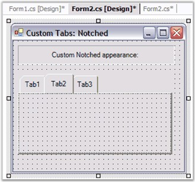
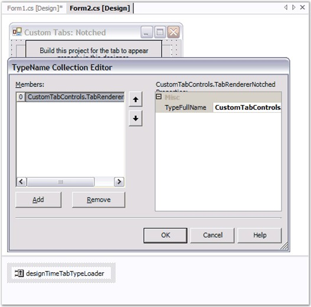
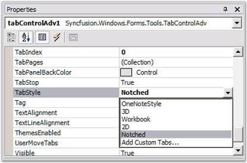

::: {style="DISPLAY: none"}
{#d2h_url_template}{#d2h_package_url style="WIDTH: 0px; DISPLAY: none; HEIGHT: 0px"}
:::

:::: {.d2h_secondary_topic style="PADDING-BOTTOM: 10pt; MARGIN: 0pt; PADDING-LEFT: 0pt; PADDING-RIGHT: 0pt; PADDING-TOP: 0pt"}
#### ITabRenderer {#itabrenderer style="MARGIN-LEFT: 18pt; tab-stops: 18.0pt"}

[]{style="COLOR: #15428b"} 

ITabRenderer interface (or derive from TabRendererBase, a base implementation of ITabRenderer), could be implemented to gain more control over the display of tabs.

 

The **Renderer** property returns the current Syncfusion.Windows.Forms.Tools.ITabRenderer used by the TabControl to render the TabPanel.

[]{style="COLOR: #15428b"} 

{border="0"}

[]{style="COLOR: #15428b"} 

Figure 1052: Custom Tabs with Designer Support

[]{style="COLOR: #15428b"} 

::: {style="BORDER-BOTTOM: windowtext 1pt solid; BORDER-LEFT: medium none; PADDING-BOTTOM: 1pt; MARGIN: 9pt 0pt 9pt 18pt; PADDING-LEFT: 0pt; PADDING-RIGHT: 0pt; BORDER-TOP: windowtext 1pt solid; BORDER-RIGHT: medium none; PADDING-TOP: 1pt"}
{border="0"} Note: Refer to CustomTabControl sample which demonstrates this feature.
:::

[]{style="COLOR: #15428b"} 

Once you have a Custom **ITabRenderer** implementation, you can, if necessary, make it available to the TabControlAdv at design-time. To do so,

[]{style="COLOR: #15428b"} 

1.   First select the **Add Custom Tabs** entry in the drop-down list that pops-up from the **TabStyle** property editor. This will insert a new **DesignTimeTabTypeLoader** component into your forms designer.

[]{style="COLOR: #15428b"} 

{border="0"}

[]{style="COLOR: #15428b"} 

Figure 1053: Add Custom Tabs using the DesignTimeTabTypeLoader

[]{style="COLOR: #15428b"} 

2.   Insert the fully qualified type name of your Custom TabRenderer class (for example: Syncfusion.Samples.Tools.TabRendererNotched) to the DesignTimeTabTypeLoader\'s **TypesToLoadList**. This will try to load your class into the DesignTimeTabTypeLoader\'s TypesToLoadList, assuming the type is in the same project as the designer or the assembly in which this type resides is referenced. You will now find an entry in the **TabControlAdv.TabStyle** editor list corresponding to your Custom TabRenderer.

[]{style="COLOR: #15428b"} 

{border="0"}

[                                                                              ]{style="COLOR: #15428b"}

Figure 1054: Custom TabStyle in Designer

[]{style="COLOR: #15428b"} 

See Also

[]{style="COLOR: #15428b"} 

[[TabStyles]{.UGHyperlink}](../../../../../../../../Documents%20and%20Settings/sylviap/Desktop/Tools%20-%20Part%202.docx#_TabStyles)[]{.UGHyperlink}

 

 

 

 

More:

[ ]{#related-topics}

[{border="0" align="absMiddle"}TabAlignment](ms-xhelp:///?Id=383f7dbc-df49-4804-a871-a57472406c9a){style="TEXT-DECORATION: none"}
::::
