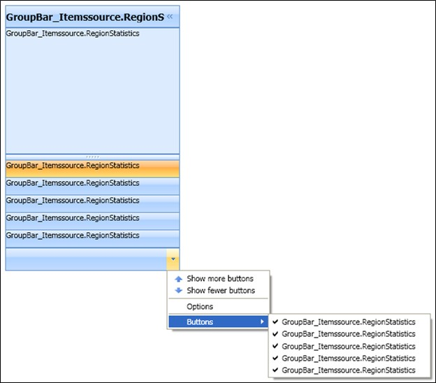
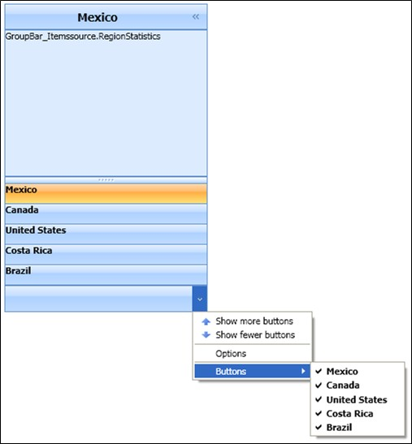
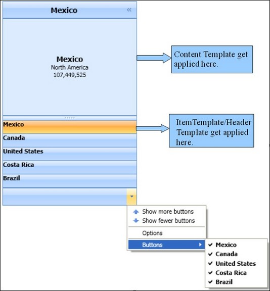
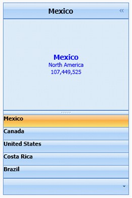
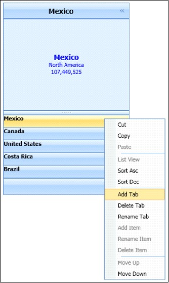
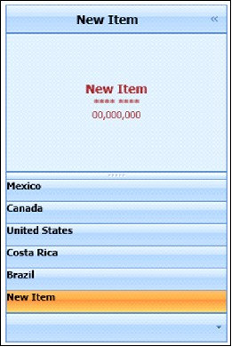

::: {style="DISPLAY: none"}
{#d2h_url_template}{#d2h_package_url style="WIDTH: 0px; DISPLAY: none; HEIGHT: 0px"}
:::

::::::::: {.d2h_secondary_topic style="PADDING-BOTTOM: 10pt; MARGIN: 0pt; PADDING-LEFT: 0pt; PADDING-RIGHT: 0pt; PADDING-TOP: 0pt"}
#### Itemssource Support/GroupBar Control {#itemssource-supportgroupbar-control style="tab-stops: 0pt"}

[]{style="FONT-FAMILY: 'Trebuchet MS','sans-serif'; COLOR: #15428b; FONT-SIZE: 9pt"} 

Items in a GroupBar can also be added by binding a collection of business object through Itemssource property. The following is an example of the business object, which is used for Itemssource binding.

**[]{style="FONT-FAMILY: 'Calibri','sans-serif'; FONT-SIZE: 12pt"}** 

+------------------------------------------------------------------------------------------------------------------+
| []{style="COLOR: blue"}                                                                                          |
|                                                                                                                  |
| [public]{style="COLOR: blue"} [class]{style="COLOR: blue"} [RegionStatistics]{style="COLOR: #2b91af"}            |
|                                                                                                                  |
| [{]{style="COLOR: black"}                                                                                        |
|                                                                                                                  |
| [       ]{style="COLOR: black"}[public]{style="COLOR: blue"} [string]{style="COLOR: blue"} Population{get; set;} |
|                                                                                                                  |
| [       ]{style="COLOR: black"}[public]{style="COLOR: blue"} [string]{style="COLOR: blue"} Name{get; set;}       |
|                                                                                                                  |
| [       ]{style="COLOR: black"}[public]{style="COLOR: blue"} [string]{style="COLOR: blue"} Location{get; set;}   |
|                                                                                                                  |
| []{style="COLOR: black"}                                                                                         |
|                                                                                                                  |
| [}]{style="COLOR: black"}                                                                                        |
+------------------------------------------------------------------------------------------------------------------+

[]{style="FONT-FAMILY: 'Calibri','sans-serif'; FONT-SIZE: 12pt"} 

[]{style="FONT-FAMILY: 'Calibri','sans-serif'; FONT-SIZE: 12pt"} 

Adding Items to the ObservableCollection

**[]{style="FONT-FAMILY: 'Trebuchet MS','sans-serif'; COLOR: #15428b; FONT-SIZE: 9pt"}** 

Add items to the ObservableCollection, by using the following code.

[]{style="FONT-FAMILY: 'Trebuchet MS','sans-serif'; COLOR: #15428b; FONT-SIZE: 9pt"} 

+-----------------------------------------------------------------------------------------------------------------------------------------------------------------------------------------------------------------------------------------------------------------------------+
| [private]{style="COLOR: blue"} [void]{style="COLOR: blue"} Window1_Loaded([object]{style="COLOR: blue"} sender, [RoutedEventArgs]{style="COLOR: #2b91af"} e)                                                                                                                |
|                                                                                                                                                                                                                                                                             |
|         {                                                                                                                                                                                                                                                                   |
|                                                                                                                                                                                                                                                                             |
|             SampleList = [new]{style="COLOR: blue"} [ObservableCollection]{style="COLOR: #2b91af"}\<[RegionStatistics]{style="COLOR: #2b91af"}\>();                                                                                                                         |
|                                                                                                                                                                                                                                                                             |
|             SampleList.Add([new]{style="COLOR: blue"} [RegionStatistics]{style="COLOR: #2b91af"}() { Name = [\"Mexico\"]{style="COLOR: #a31515"}, Population = [\"107,449,525\"]{style="COLOR: #a31515"}, Location=[\"North America\"]{style="COLOR: #a31515"} });          |
|                                                                                                                                                                                                                                                                             |
|             SampleList.Add([new]{style="COLOR: blue"} [RegionStatistics]{style="COLOR: #2b91af"}() { Name = [\"Canada\"]{style="COLOR: #a31515"}, Population = [\"33,098,932\"]{style="COLOR: #a31515"}, Location = [\"North America\"]{style="COLOR: #a31515"} });         |
|                                                                                                                                                                                                                                                                             |
|             SampleList.Add([new]{style="COLOR: blue"} [RegionStatistics]{style="COLOR: #2b91af"}() { Name = [\"United States\"]{style="COLOR: #a31515"}, Population = [\"304,228,357\"]{style="COLOR: #a31515"}, Location = [\"North America\"]{style="COLOR: #a31515"} }); |
|                                                                                                                                                                                                                                                                             |
|             SampleList.Add([new]{style="COLOR: blue"} [RegionStatistics]{style="COLOR: #2b91af"}() { Name = [\"Costa Rica\"]{style="COLOR: #a31515"}, Population = [\"04,075,261\"]{style="COLOR: #a31515"}, Location = [\"Central America\"]{style="COLOR: #a31515"} });   |
|                                                                                                                                                                                                                                                                             |
|             SampleList.Add([new]{style="COLOR: blue"} [RegionStatistics]{style="COLOR: #2b91af"}() { Name = [\"Brazil\"]{style="COLOR: #a31515"}, Population = [\"188,078,287\"]{style="COLOR: #a31515"}, Location = [\"South America\"]{style="COLOR: #a31515"} });        |
|                                                                                                                                                                                                                                                                             |
|             gri.DataContext = [this]{style="COLOR: blue"};                                                                                                                                                                                                                  |
|                                                                                                                                                                                                                                                                             |
|         }                                                                                                                                                                                                                                                                   |
+-----------------------------------------------------------------------------------------------------------------------------------------------------------------------------------------------------------------------------------------------------------------------------+

[]{style="FONT-FAMILY: 'Calibri','sans-serif'; FONT-SIZE: 12pt"} 

Binding Itemssource Property

**[]{style="FONT-FAMILY: 'Trebuchet MS','sans-serif'; COLOR: #15428b; FONT-SIZE: 9pt"}** 

 Set the **Itemssource** property, by using the following code.

[]{style="FONT-FAMILY: 'Trebuchet MS','sans-serif'; COLOR: #15428b; FONT-SIZE: 9pt"} 

+------------------------------------------------------------------------------------------------------------------------------------------------------------------------------------------------------------------------------------------------------------------------------------------------------------------------------------------+
| **[\[XAML\]]{style="FONT-FAMILY: 'Calibri','sans-serif'; FONT-SIZE: 12pt"}**                                                                                                                                                                                                                                                             |
|                                                                                                                                                                                                                                                                                                                                          |
| []{style="FONT-FAMILY: 'Calibri','sans-serif'; FONT-SIZE: 12pt"}                                                                                                                                                                                                                                                                         |
|                                                                                                                                                                                                                                                                                                                                          |
| [\<]{style="COLOR: blue"}[sync]{style="COLOR: #a31515"}[:]{style="COLOR: blue"}[GroupBar]{style="COLOR: #a31515"}[ Name]{style="COLOR: red"}[=\"gBar\"]{style="COLOR: blue"}[ ItemsSource]{style="COLOR: red"}[=\"{]{style="COLOR: blue"}[Binding]{style="COLOR: #a31515"}[ SampleList]{style="COLOR: red"}[}\"/\>]{style="COLOR: blue"} |
|                                                                                                                                                                                                                                                                                                                                          |
| []{style="COLOR: blue"}                                                                                                                                                                                                                                                                                                                  |
+------------------------------------------------------------------------------------------------------------------------------------------------------------------------------------------------------------------------------------------------------------------------------------------------------------------------------------------+

[]{style="FONT-FAMILY: 'Calibri','sans-serif'; FONT-SIZE: 12pt"} 

**[]{style="FONT-FAMILY: 'Trebuchet MS','sans-serif'; COLOR: #15428b; FONT-SIZE: 9pt"}** 

[]{style="FONT-FAMILY: 'Trebuchet MS','sans-serif'; COLOR: #15428b; FONT-SIZE: 9pt"} 

+------------------------------------------------------------------------------------------------------------------------------------+
| **[\[C#\]]{style="COLOR: black"}**                                                                                                 |
|                                                                                                                                    |
| []{style="COLOR: blue"}                                                                                                            |
|                                                                                                                                    |
| [Binding]{style="COLOR: #2b91af"} bind = [new]{style="COLOR: blue"} [Binding]{style="COLOR: #2b91af"}();                           |
|                                                                                                                                    |
|           bind.Source = [this]{style="COLOR: blue"};                                                                               |
|                                                                                                                                    |
|           bind.Path = [new]{style="COLOR: blue"} [PropertyPath]{style="COLOR: #2b91af"}([\"SampleList\"]{style="COLOR: #a31515"}); |
|                                                                                                                                    |
|           gBar.SetBinding(GroupBar.ItemssourceProperty, bind);                                                                     |
+------------------------------------------------------------------------------------------------------------------------------------+

[]{style="FONT-FAMILY: 'Times New Roman','serif'; FONT-SIZE: 12pt"} 

[]{style="FONT-FAMILY: 'Trebuchet MS','sans-serif'; COLOR: #15428b; FONT-SIZE: 9pt"} 

[]{style="FONT-FAMILY: 'Trebuchet MS','sans-serif'; COLOR: #15428b; FONT-SIZE: 9pt"} 

{border="0"}

Figure 514: ItemSource bound GroupBar

[]{style="FONT-FAMILY: 'Calibri','sans-serif'"} 

**[]{style="FONT-FAMILY: 'Calibri','sans-serif'; FONT-SIZE: 14pt"}** 

Using ItemTemplate

[]{style="FONT-FAMILY: 'Trebuchet MS','sans-serif'; COLOR: #15428b; FONT-SIZE: 9pt"} 

Apply the **ItemTemplate** to GroupBar, by using the following code.

[]{style="FONT-FAMILY: 'Trebuchet MS','sans-serif'; COLOR: #15428b; FONT-SIZE: 9pt"} 

[]{style="FONT-FAMILY: 'Trebuchet MS','sans-serif'; COLOR: #15428b; FONT-SIZE: 9pt"} 

+----------------------------------------------------------------------------------------------------------------------------------------------------------------------------------------------------------------------------------------------------------------------------------------------------------------------------+
| **[\[XAML\]]{style="COLOR: black"}[   ]{style="COLOR: blue"}**[    ]{style="COLOR: blue"}                                                                                                                                                                                                                                  |
|                                                                                                                                                                                                                                                                                                                            |
| [ \<]{style="COLOR: blue"}[sync]{style="COLOR: #a31515"}[:]{style="COLOR: blue"}[GroupBar.ItemTemplate]{style="COLOR: #a31515"}[\>]{style="COLOR: blue"}                                                                                                                                                                   |
|                                                                                                                                                                                                                                                                                                                            |
| [                ]{style="COLOR: #a31515"}[\<]{style="COLOR: blue"}[DataTemplate]{style="COLOR: #a31515"}[\>]{style="COLOR: blue"}                                                                                                                                                                                         |
|                                                                                                                                                                                                                                                                                                                            |
| [                    ]{style="COLOR: #a31515"}[\<]{style="COLOR: blue"}[TextBlock]{style="COLOR: #a31515"}[ Text]{style="COLOR: red"}[=\"{]{style="COLOR: blue"}[Binding]{style="COLOR: #a31515"}[ Name]{style="COLOR: red"}[}\"]{style="COLOR: blue"}[ FontWeight]{style="COLOR: red"}[=\"Bold\"/\>]{style="COLOR: blue"} |
|                                                                                                                                                                                                                                                                                                                            |
| [                ]{style="COLOR: #a31515"}[\</]{style="COLOR: blue"}[DataTemplate]{style="COLOR: #a31515"}[\>]{style="COLOR: blue"}                                                                                                                                                                                        |
|                                                                                                                                                                                                                                                                                                                            |
| [            ]{style="COLOR: #a31515"}[\</]{style="COLOR: blue"}[sync]{style="COLOR: #a31515"}[:]{style="COLOR: blue"}[GroupBar.ItemTemplate]{style="COLOR: #a31515"}[\>]{style="COLOR: blue"}                                                                                                                             |
+----------------------------------------------------------------------------------------------------------------------------------------------------------------------------------------------------------------------------------------------------------------------------------------------------------------------------+

[]{style="FONT-FAMILY: 'Trebuchet MS','sans-serif'; COLOR: #15428b; FONT-SIZE: 9pt"} 

[]{style="FONT-FAMILY: 'Calibri','sans-serif'; FONT-SIZE: 12pt"} 

{border="0"}

Figure 515: GroupBar with ItemTemplate Applied

**[]{style="FONT-FAMILY: 'Calibri','sans-serif'; FONT-SIZE: 12pt"}** 

**[]{style="FONT-FAMILY: 'Calibri','sans-serif'; FONT-SIZE: 12pt"}** 

Using ItemContainer Style

[]{style="FONT-FAMILY: 'Trebuchet MS','sans-serif'; COLOR: #15428b; FONT-SIZE: 9pt"} 

The above image shows that the GroupBar is bounded with the ObservableCollection SampleList. Write the HeaderTemplate and ContentTemplate for the ItemContainer, by using the following code.

 

The Item Container Style should be declared as follows.

[]{style="FONT-FAMILY: 'Trebuchet MS','sans-serif'; COLOR: #15428b; FONT-SIZE: 9pt"} 

+--------------------------------------------------------------------------------------------------------------------------------------------------------------------------------------------------------------------------------------------------------------------------------------------------------------------------------------------------------------------------------------------------------------------------------------------------------------------------------------------------------------------------------------------------------------------------------------+
| [\<]{style="FONT-FAMILY: 'Courier New'; COLOR: blue; FONT-SIZE: 9pt"}[sync]{style="COLOR: maroon; FONT-SIZE: 9pt"}[:]{style="COLOR: blue; FONT-SIZE: 9pt"}[GroupBar.ItemContainerStyle]{style="COLOR: maroon; FONT-SIZE: 9pt"}[\>]{style="COLOR: blue; FONT-SIZE: 9pt"}                                                                                                                                                                                                                                                                                                              |
|                                                                                                                                                                                                                                                                                                                                                                                                                                                                                                                                                                                      |
| [\<]{style="COLOR: blue; FONT-SIZE: 9pt"}[Style]{style="COLOR: maroon; FONT-SIZE: 9pt"}[ ]{style="COLOR: black; FONT-SIZE: 9pt"}[TargetType]{style="COLOR: red; FONT-SIZE: 9pt"}[=\"{]{style="COLOR: blue; FONT-SIZE: 9pt"}[x]{style="COLOR: maroon; FONT-SIZE: 9pt"}[:]{style="COLOR: black; FONT-SIZE: 9pt"}[Type]{style="COLOR: maroon; FONT-SIZE: 9pt"}[ ]{style="COLOR: black; FONT-SIZE: 9pt"}[sync]{style="COLOR: red; FONT-SIZE: 9pt"}[:]{style="COLOR: blue; FONT-SIZE: 9pt"}[GroupBarItem]{style="COLOR: red; FONT-SIZE: 9pt"}[}\"\>]{style="COLOR: blue; FONT-SIZE: 9pt"} |
|                                                                                                                                                                                                                                                                                                                                                                                                                                                                                                                                                                                      |
| []{style="COLOR: black; FONT-SIZE: 9pt"}                                                                                                                                                                                                                                                                                                                                                                                                                                                                                                                                             |
|                                                                                                                                                                                                                                                                                                                                                                                                                                                                                                                                                                                      |
| [\</]{style="COLOR: blue; FONT-SIZE: 9pt"}[Style]{style="COLOR: maroon; FONT-SIZE: 9pt"}[\>]{style="COLOR: blue; FONT-SIZE: 9pt"}                                                                                                                                                                                                                                                                                                                                                                                                                                                    |
|                                                                                                                                                                                                                                                                                                                                                                                                                                                                                                                                                                                      |
| [\</]{style="COLOR: blue; FONT-SIZE: 9pt"}[sync:GroupBar.ItemContainerStyle]{style="COLOR: maroon; FONT-SIZE: 9pt"}[\>]{style="FONT-FAMILY: 'Courier New'; COLOR: blue; FONT-SIZE: 9pt"}                                                                                                                                                                                                                                                                                                                                                                                             |
|                                                                                                                                                                                                                                                                                                                                                                                                                                                                                                                                                                                      |
| []{style="FONT-FAMILY: 'Courier New'; COLOR: black; FONT-SIZE: 9pt"}                                                                                                                                                                                                                                                                                                                                                                                                                                                                                                                 |
+--------------------------------------------------------------------------------------------------------------------------------------------------------------------------------------------------------------------------------------------------------------------------------------------------------------------------------------------------------------------------------------------------------------------------------------------------------------------------------------------------------------------------------------------------------------------------------------+

 

Apply **Header Template** to the **Header Template** property of the Item, by using the following code.

[]{style="COLOR: black"} 

+------------------------------------------------------------------------------------------------------------------------------------------------------------------------------------------------------------------------------------------------------------------------------------------------------------------------------------------------------------------+
| [\<]{style="COLOR: blue"}[Setter]{style="COLOR: #a31515"}[ Property]{style="COLOR: red"}[=\"Header\"]{style="COLOR: blue"}[ [Value]{style="BACKGROUND: yellow"}]{style="COLOR: red"}[=\"{]{style="BACKGROUND: yellow; COLOR: blue"}[Binding]{style="BACKGROUND: yellow; COLOR: #a31515"}[}\"]{style="BACKGROUND: yellow; COLOR: blue"}[/\>]{style="COLOR: blue"} |
|                                                                                                                                                                                                                                                                                                                                                                  |
| [                        \<]{style="COLOR: blue"}[Setter]{style="COLOR: #a31515"}[ Property]{style="COLOR: red"}[=\"HeaderTemplate\"\>]{style="COLOR: blue"}                                                                                                                                                                                                     |
|                                                                                                                                                                                                                                                                                                                                                                  |
| [                            \<]{style="COLOR: blue"}[Setter.Value]{style="COLOR: #a31515"}[\>]{style="COLOR: blue"}                                                                                                                                                                                                                                             |
|                                                                                                                                                                                                                                                                                                                                                                  |
| [                               \<]{style="COLOR: blue"}[DataTemplate]{style="COLOR: #a31515"}[\>]{style="COLOR: blue"}                                                                                                                                                                                                                                          |
|                                                                                                                                                                                                                                                                                                                                                                  |
| [                                     \<]{style="COLOR: blue"}[TextBlock]{style="COLOR: #a31515"}[ Text]{style="COLOR: red"}[=\"{]{style="COLOR: blue"}[Binding]{style="COLOR: #a31515"}[ Name]{style="COLOR: red"}[}\"]{style="COLOR: blue"}[ FontWeight]{style="COLOR: red"}[=\"Bold\"/\>]{style="COLOR: blue"}                                                |
|                                                                                                                                                                                                                                                                                                                                                                  |
| [                                \</]{style="COLOR: blue"}[DataTemplate]{style="COLOR: #a31515"}[\>]{style="COLOR: blue"}                                                                                                                                                                                                                                        |
|                                                                                                                                                                                                                                                                                                                                                                  |
| [                           ]{style="COLOR: blue"}[ ]{style="COLOR: #a31515"}[\</]{style="COLOR: blue"}[Setter.Value]{style="COLOR: #a31515"}[\>]{style="COLOR: blue"}                                                                                                                                                                                           |
|                                                                                                                                                                                                                                                                                                                                                                  |
| [                         \</]{style="COLOR: blue"}[Setter]{style="COLOR: #a31515"}[\>]{style="COLOR: blue"}                                                                                                                                                                                                                                                     |
+------------------------------------------------------------------------------------------------------------------------------------------------------------------------------------------------------------------------------------------------------------------------------------------------------------------------------------------------------------------+

[]{style="COLOR: blue"} 

[]{style="COLOR: blue"} 

Apply **Content Template** to **Content Template** property of the item, by using the following code.

[]{style="FONT-FAMILY: 'Trebuchet MS','sans-serif'; COLOR: #15428b; FONT-SIZE: 9pt"} 

+--------------------------------------------------------------------------------------------------------------------------------------------------------------------------------------------------------------------------------------------------------------------------------------------------------------------------------------------------------------------------------------------------------------------------------------------------------------------------------------------------------------------------------+
| [ ]{style="COLOR: #a31515"}[\<]{style="COLOR: blue"}[Setter]{style="COLOR: #a31515"}[ Property]{style="COLOR: red"}[=\"Content\"]{style="COLOR: blue"}[ [Value]{style="BACKGROUND: yellow"}]{style="COLOR: red"}[=\"{]{style="BACKGROUND: yellow; COLOR: blue"}[Binding]{style="BACKGROUND: yellow; COLOR: #a31515"}[}\"]{style="BACKGROUND: yellow; COLOR: blue"}[/\>]{style="COLOR: blue"}                                                                                                                                   |
|                                                                                                                                                                                                                                                                                                                                                                                                                                                                                                                                |
| [                        ]{style="COLOR: #a31515"}[\<]{style="COLOR: blue"}[Setter]{style="COLOR: #a31515"}[ Property]{style="COLOR: red"}[=\"ContentTemplate\"\>]{style="COLOR: blue"}                                                                                                                                                                                                                                                                                                                                        |
|                                                                                                                                                                                                                                                                                                                                                                                                                                                                                                                                |
| [                            ]{style="COLOR: #a31515"}[\<]{style="COLOR: blue"}[Setter.Value]{style="COLOR: #a31515"}[\>]{style="COLOR: blue"}                                                                                                                                                                                                                                                                                                                                                                                 |
|                                                                                                                                                                                                                                                                                                                                                                                                                                                                                                                                |
| [                                ]{style="COLOR: #a31515"}[\<]{style="COLOR: blue"}[DataTemplate]{style="COLOR: #a31515"}[\>]{style="COLOR: blue"}                                                                                                                                                                                                                                                                                                                                                                             |
|                                                                                                                                                                                                                                                                                                                                                                                                                                                                                                                                |
| [                                    ]{style="COLOR: #a31515"}[\<]{style="COLOR: blue"}[StackPanel]{style="COLOR: #a31515"}[ Height]{style="COLOR: red"}[=\"50\"\>]{style="COLOR: blue"}                                                                                                                                                                                                                                                                                                                                       |
|                                                                                                                                                                                                                                                                                                                                                                                                                                                                                                                                |
| [                     ]{style="COLOR: #a31515"}[\<]{style="COLOR: blue"}[TextBlock]{style="COLOR: #a31515"}[ Text]{style="COLOR: red"}[=\"{]{style="COLOR: blue"}[Binding]{style="COLOR: #a31515"}[ Name]{style="COLOR: red"}[}\"]{style="COLOR: blue"}[ FontWeight]{style="COLOR: red"}[=\"Bold\"]{style="COLOR: blue"}[ Margin]{style="COLOR: red"}[=\"1\"]{style="COLOR: blue"}[ HorizontalAlignment]{style="COLOR: red"}[=\"Center\"]{style="COLOR: blue"}[ FontSize]{style="COLOR: red"}[=\"14\"/\>]{style="COLOR: blue"} |
|                                                                                                                                                                                                                                                                                                                                                                                                                                                                                                                                |
| [                                        ]{style="COLOR: #a31515"}[\<]{style="COLOR: blue"}[TextBlock]{style="COLOR: #a31515"}[ Text]{style="COLOR: red"}[=\"{]{style="COLOR: blue"}[Binding]{style="COLOR: #a31515"}[ Location]{style="COLOR: red"}[}\"]{style="COLOR: blue"}[ HorizontalAlignment]{style="COLOR: red"}[=\"Center\"/\>]{style="COLOR: blue"}                                                                                                                                                                  |
|                                                                                                                                                                                                                                                                                                                                                                                                                                                                                                                                |
| [                                        ]{style="COLOR: #a31515"}[\<]{style="COLOR: blue"}[TextBlock]{style="COLOR: #a31515"}[ Text]{style="COLOR: red"}[=\"{]{style="COLOR: blue"}[Binding]{style="COLOR: #a31515"}[ Population]{style="COLOR: red"}[}\"]{style="COLOR: blue"}[ HorizontalAlignment]{style="COLOR: red"}[=\"Center\"/\>]{style="COLOR: blue"}                                                                                                                                                                |
|                                                                                                                                                                                                                                                                                                                                                                                                                                                                                                                                |
| [                                    ]{style="COLOR: #a31515"}[\</]{style="COLOR: blue"}[StackPanel]{style="COLOR: #a31515"}[\>]{style="COLOR: blue"}                                                                                                                                                                                                                                                                                                                                                                          |
|                                                                                                                                                                                                                                                                                                                                                                                                                                                                                                                                |
| [                                ]{style="COLOR: #a31515"}[\</]{style="COLOR: blue"}[DataTemplate]{style="COLOR: #a31515"}[\>]{style="COLOR: blue"}                                                                                                                                                                                                                                                                                                                                                                            |
|                                                                                                                                                                                                                                                                                                                                                                                                                                                                                                                                |
| [                            ]{style="COLOR: #a31515"}[\</]{style="COLOR: blue"}[Setter.Value]{style="COLOR: #a31515"}[\>]{style="COLOR: blue"}                                                                                                                                                                                                                                                                                                                                                                                |
|                                                                                                                                                                                                                                                                                                                                                                                                                                                                                                                                |
| [                        ]{style="COLOR: #a31515"}[\</]{style="COLOR: blue"}[Setter]{style="COLOR: #a31515"}[\>]{style="COLOR: blue"}                                                                                                                                                                                                                                                                                                                                                                                          |
+--------------------------------------------------------------------------------------------------------------------------------------------------------------------------------------------------------------------------------------------------------------------------------------------------------------------------------------------------------------------------------------------------------------------------------------------------------------------------------------------------------------------------------+

[]{style="FONT-FAMILY: 'Trebuchet MS','sans-serif'; COLOR: #15428b; FONT-SIZE: 9pt"} 

[]{style="COLOR: blue"} 

[]{style="COLOR: blue"} 

[]{style="FONT-FAMILY: 'Times New Roman','serif'; FONT-SIZE: 12pt"} 

{border="0"}

Figure 516: GroupBar with ItemContainer Style applied

***[]{style="FONT-SIZE: 9pt"}*** 

**[]{style="FONT-FAMILY: 'Calibri','sans-serif'; FONT-SIZE: 12pt"}** 

Using Template Selector

 

Template can be applied according to the logic set by the user using Template Selector.

The following code illustrates this.

[]{style="FONT-FAMILY: 'Trebuchet MS','sans-serif'; COLOR: #15428b; FONT-SIZE: 9pt"} 

::: {style="BORDER-BOTTOM: windowtext 1pt solid; BORDER-LEFT: medium none; PADDING-BOTTOM: 1pt; MARGIN-TOP: 9pt; PADDING-LEFT: 0pt; PADDING-RIGHT: 0pt; MARGIN-BOTTOM: 9pt; BORDER-TOP: windowtext 1pt solid; BORDER-RIGHT: medium none; PADDING-TOP: 1pt"}
          {border="0"}Note:Data Template has been written for North America Statistics data.
:::

[]{style="FONT-FAMILY: 'Trebuchet MS','sans-serif'; COLOR: #15428b; FONT-SIZE: 9pt"} 

+----------------------------------------------------------------------------------------------------------------------------------------------------------------------------------------------------------------------------------------------------------------------------------------------------------------------------------------------------------------------------------------------------------------------------------------------------------------------------------------------------------------------------------------------------------------+
| [\<]{style="COLOR: blue"}[DataTemplate]{style="COLOR: #a31515"}[ x]{style="COLOR: red"}[:]{style="COLOR: blue"}[Key]{style="COLOR: red"}[=\"North\"\>]{style="COLOR: blue"}                                                                                                                                                                                                                                                                                                                                                                                    |
|                                                                                                                                                                                                                                                                                                                                                                                                                                                                                                                                                                |
| [         \<]{style="COLOR: blue"}[StackPanel]{style="COLOR: #a31515"}[ Height]{style="COLOR: red"}[=\"50\"\>]{style="COLOR: blue"}                                                                                                                                                                                                                                                                                                                                                                                                                            |
|                                                                                                                                                                                                                                                                                                                                                                                                                                                                                                                                                                |
| [              \<]{style="COLOR: blue"}[TextBlock]{style="COLOR: #a31515"}[ Text]{style="COLOR: red"}[=\"{]{style="COLOR: blue"}[Binding]{style="COLOR: #a31515"}[ Name]{style="COLOR: red"}[}\"]{style="COLOR: blue"}[ FontWeight]{style="COLOR: red"}[=\"Bold\"]{style="COLOR: blue"}[ Margin]{style="COLOR: red"}[=\"1\"]{style="COLOR: blue"}[ HorizontalAlignment]{style="COLOR: red"}[=\"Center\"]{style="COLOR: blue"}[ FontSize]{style="COLOR: red"}[=\"14\"]{style="COLOR: blue"}[ Foreground]{style="COLOR: red"}[=\"Blue\"/\>]{style="COLOR: blue"} |
|                                                                                                                                                                                                                                                                                                                                                                                                                                                                                                                                                                |
| [              \<]{style="COLOR: blue"}[TextBlock]{style="COLOR: #a31515"}[ Text]{style="COLOR: red"}[=\"{]{style="COLOR: blue"}[Binding]{style="COLOR: #a31515"}[ Location]{style="COLOR: red"}[}\"]{style="COLOR: blue"}[ HorizontalAlignment]{style="COLOR: red"}[=\"Center\"]{style="COLOR: blue"}[ Foreground]{style="COLOR: red"}[=\"Blue\"/\>]{style="COLOR: blue"}                                                                                                                                                                                     |
|                                                                                                                                                                                                                                                                                                                                                                                                                                                                                                                                                                |
| [              \<]{style="COLOR: blue"}[TextBlock]{style="COLOR: #a31515"}[ Text]{style="COLOR: red"}[=\"{]{style="COLOR: blue"}[Binding]{style="COLOR: #a31515"}[ Population]{style="COLOR: red"}[}\"]{style="COLOR: blue"}[ HorizontalAlignment]{style="COLOR: red"}[=\"Center\"]{style="COLOR: blue"}[ Foreground]{style="COLOR: red"}[=\"Blue\"/\>]{style="COLOR: blue"}                                                                                                                                                                                   |
|                                                                                                                                                                                                                                                                                                                                                                                                                                                                                                                                                                |
| [         \</]{style="COLOR: blue"}[StackPanel]{style="COLOR: #a31515"}[\>]{style="COLOR: blue"}                                                                                                                                                                                                                                                                                                                                                                                                                                                               |
|                                                                                                                                                                                                                                                                                                                                                                                                                                                                                                                                                                |
| [ ]{style="COLOR: #a31515"}[\</]{style="COLOR: blue"}[DataTemplate]{style="COLOR: #a31515"}[\>]{style="COLOR: blue"}                                                                                                                                                                                                                                                                                                                                                                                                                                           |
+----------------------------------------------------------------------------------------------------------------------------------------------------------------------------------------------------------------------------------------------------------------------------------------------------------------------------------------------------------------------------------------------------------------------------------------------------------------------------------------------------------------------------------------------------------------+

[]{style="FONT-FAMILY: 'Trebuchet MS','sans-serif'; COLOR: #15428b; FONT-SIZE: 9pt"} 

[]{style="FONT-FAMILY: 'Trebuchet MS','sans-serif'; COLOR: #15428b; FONT-SIZE: 9pt"} 

::: {style="BORDER-BOTTOM: windowtext 1pt solid; BORDER-LEFT: medium none; PADDING-BOTTOM: 1pt; MARGIN-TOP: 9pt; PADDING-LEFT: 0pt; PADDING-RIGHT: 0pt; MARGIN-BOTTOM: 9pt; BORDER-TOP: windowtext 1pt solid; BORDER-RIGHT: medium none; PADDING-TOP: 1pt"}
          {border="0"}Note: Data Template has been written for South America Statistics data.
:::

[]{style="FONT-FAMILY: 'Trebuchet MS','sans-serif'; COLOR: #15428b; FONT-SIZE: 9pt"} 

+-------------------------------------------------------------------------------------------------------------------------------------------------------------------------------------------------------------------------------------------------------------------------------------------------------------------------------------------------------------------------------------------------------------------------------------------------------------------------------------------------------------------------------------------------------------+
| [\<]{style="COLOR: blue"}[DataTemplate]{style="COLOR: #a31515"}[ x]{style="COLOR: red"}[:]{style="COLOR: blue"}[Key]{style="COLOR: red"}[=\"South\"\>]{style="COLOR: blue"}                                                                                                                                                                                                                                                                                                                                                                                 |
|                                                                                                                                                                                                                                                                                                                                                                                                                                                                                                                                                             |
| [        \<]{style="COLOR: blue"}[StackPanel]{style="COLOR: #a31515"}[ Height]{style="COLOR: red"}[=\"50\"\>]{style="COLOR: blue"}                                                                                                                                                                                                                                                                                                                                                                                                                          |
|                                                                                                                                                                                                                                                                                                                                                                                                                                                                                                                                                             |
| [            \<]{style="COLOR: blue"}[TextBlock]{style="COLOR: #a31515"}[ Text]{style="COLOR: red"}[=\"{]{style="COLOR: blue"}[Binding]{style="COLOR: #a31515"}[ Name]{style="COLOR: red"}[}\"]{style="COLOR: blue"}[ FontWeight]{style="COLOR: red"}[=\"Bold\"]{style="COLOR: blue"}[ Margin]{style="COLOR: red"}[=\"1\"]{style="COLOR: blue"}[ HorizontalAlignment]{style="COLOR: red"}[=\"Center\"]{style="COLOR: blue"}[ FontSize]{style="COLOR: red"}[=\"14\"]{style="COLOR: blue"}[ Foreground]{style="COLOR: red"}[=\"Red\"/\>]{style="COLOR: blue"} |
|                                                                                                                                                                                                                                                                                                                                                                                                                                                                                                                                                             |
| [            \<]{style="COLOR: blue"}[TextBlock]{style="COLOR: #a31515"}[ Text]{style="COLOR: red"}[=\"{]{style="COLOR: blue"}[Binding]{style="COLOR: #a31515"}[ Location]{style="COLOR: red"}[}\"]{style="COLOR: blue"}[ HorizontalAlignment]{style="COLOR: red"}[=\"Center\"]{style="COLOR: blue"}[ Foreground]{style="COLOR: red"}[=\"Red\"/\>]{style="COLOR: blue"}                                                                                                                                                                                     |
|                                                                                                                                                                                                                                                                                                                                                                                                                                                                                                                                                             |
| [            \<]{style="COLOR: blue"}[TextBlock]{style="COLOR: #a31515"}[ Text]{style="COLOR: red"}[=\"{]{style="COLOR: blue"}[Binding]{style="COLOR: #a31515"}[ Population]{style="COLOR: red"}[}\"]{style="COLOR: blue"}[ HorizontalAlignment]{style="COLOR: red"}[=\"Center\"]{style="COLOR: blue"}[ Foreground]{style="COLOR: red"}[=\"Red\"/\>]{style="COLOR: blue"}                                                                                                                                                                                   |
|                                                                                                                                                                                                                                                                                                                                                                                                                                                                                                                                                             |
| [        ]{style="COLOR: #a31515"}[\</]{style="COLOR: blue"}[StackPanel]{style="COLOR: #a31515"}[\>]{style="COLOR: blue"}                                                                                                                                                                                                                                                                                                                                                                                                                                   |
|                                                                                                                                                                                                                                                                                                                                                                                                                                                                                                                                                             |
| [\</]{style="COLOR: blue"}[DataTemplate]{style="COLOR: #a31515"}[\>]{style="COLOR: blue"}                                                                                                                                                                                                                                                                                                                                                                                                                                                                   |
|                                                                                                                                                                                                                                                                                                                                                                                                                                                                                                                                                             |
| []{style="COLOR: blue"}                                                                                                                                                                                                                                                                                                                                                                                                                                                                                                                                     |
+-------------------------------------------------------------------------------------------------------------------------------------------------------------------------------------------------------------------------------------------------------------------------------------------------------------------------------------------------------------------------------------------------------------------------------------------------------------------------------------------------------------------------------------------------------------+

[]{style="FONT-FAMILY: 'Trebuchet MS','sans-serif'; COLOR: #15428b; FONT-SIZE: 9pt"} 

::: {style="BORDER-BOTTOM: windowtext 1pt solid; BORDER-LEFT: medium none; PADDING-BOTTOM: 1pt; MARGIN-TOP: 9pt; PADDING-LEFT: 0pt; PADDING-RIGHT: 0pt; MARGIN-BOTTOM: 9pt; BORDER-TOP: windowtext 1pt solid; BORDER-RIGHT: medium none; PADDING-TOP: 1pt"}
{border="0"}Note:Data Template has been written for Other Statistics data.
:::

[]{style="FONT-FAMILY: 'Trebuchet MS','sans-serif'; COLOR: #15428b; FONT-SIZE: 9pt"} 

+-----------------------------------------------------------------------------------------------------------------------------------------------------------------------------------------------------------------------------------------------------------------------------------------------------------------------------------------------------------------------------------------------------------------------------------------------------------------------------------------------------------------------------------------------------------+
| [\<]{style="COLOR: blue"}[DataTemplate]{style="COLOR: #a31515"}[ x]{style="COLOR: red"}[:]{style="COLOR: blue"}[Key]{style="COLOR: red"}[=\"Other\"\>]{style="COLOR: blue"}                                                                                                                                                                                                                                                                                                                                                                               |
|                                                                                                                                                                                                                                                                                                                                                                                                                                                                                                                                                           |
| [    \<]{style="COLOR: blue"}[StackPanel]{style="COLOR: #a31515"}[ Height]{style="COLOR: red"}[=\"50\"\>]{style="COLOR: blue"}                                                                                                                                                                                                                                                                                                                                                                                                                            |
|                                                                                                                                                                                                                                                                                                                                                                                                                                                                                                                                                           |
| [        \<]{style="COLOR: blue"}[TextBlock]{style="COLOR: #a31515"}[ Text]{style="COLOR: red"}[=\"{]{style="COLOR: blue"}[Binding]{style="COLOR: #a31515"}[ Name]{style="COLOR: red"}[}\"]{style="COLOR: blue"}[ FontWeight]{style="COLOR: red"}[=\"Bold\"]{style="COLOR: blue"}[ Margin]{style="COLOR: red"}[=\"1\"]{style="COLOR: blue"}[ HorizontalAlignment]{style="COLOR: red"}[=\"Center\"]{style="COLOR: blue"}[ FontSize]{style="COLOR: red"}[=\"14\"]{style="COLOR: blue"}[ Foreground]{style="COLOR: red"}[=\"Brown\"/\>]{style="COLOR: blue"} |
|                                                                                                                                                                                                                                                                                                                                                                                                                                                                                                                                                           |
| [        \<]{style="COLOR: blue"}[TextBlock]{style="COLOR: #a31515"}[ Text]{style="COLOR: red"}[=\"{]{style="COLOR: blue"}[Binding]{style="COLOR: #a31515"}[ Location]{style="COLOR: red"}[}\"]{style="COLOR: blue"}[ HorizontalAlignment]{style="COLOR: red"}[=\"Center\"]{style="COLOR: blue"}[ Foreground]{style="COLOR: red"}[=\"Brown\"/\>]{style="COLOR: blue"}                                                                                                                                                                                     |
|                                                                                                                                                                                                                                                                                                                                                                                                                                                                                                                                                           |
| [        \<]{style="COLOR: blue"}[TextBlock]{style="COLOR: #a31515"}[ Text]{style="COLOR: red"}[=\"{]{style="COLOR: blue"}[Binding]{style="COLOR: #a31515"}[ Population]{style="COLOR: red"}[}\"]{style="COLOR: blue"}[ HorizontalAlignment]{style="COLOR: red"}[=\"Center\"]{style="COLOR: blue"}[ Foreground]{style="COLOR: red"}[=\"Brown\"/\>]{style="COLOR: blue"}                                                                                                                                                                                   |
|                                                                                                                                                                                                                                                                                                                                                                                                                                                                                                                                                           |
| [      \</]{style="COLOR: blue"}[StackPanel]{style="COLOR: #a31515"}[\>]{style="COLOR: blue"}                                                                                                                                                                                                                                                                                                                                                                                                                                                             |
|                                                                                                                                                                                                                                                                                                                                                                                                                                                                                                                                                           |
| [\</]{style="COLOR: blue"}[DataTemplate]{style="COLOR: #a31515"}[\>]{style="COLOR: blue"}                                                                                                                                                                                                                                                                                                                                                                                                                                                                 |
+-----------------------------------------------------------------------------------------------------------------------------------------------------------------------------------------------------------------------------------------------------------------------------------------------------------------------------------------------------------------------------------------------------------------------------------------------------------------------------------------------------------------------------------------------------------+

[]{style="FONT-SIZE: 12pt"} 

[]{style="FONT-FAMILY: 'Calibri','sans-serif'; FONT-SIZE: 12pt"} 

::: {style="BORDER-BOTTOM: windowtext 1pt solid; BORDER-LEFT: medium none; PADDING-BOTTOM: 1pt; MARGIN-TOP: 9pt; PADDING-LEFT: 0pt; PADDING-RIGHT: 0pt; MARGIN-BOTTOM: 9pt; BORDER-TOP: windowtext 1pt solid; BORDER-RIGHT: medium none; PADDING-TOP: 1pt"}
[{border="0"}]{style="FONT-FAMILY: 'Calibri','sans-serif'; FONT-SIZE: 12pt"}Note: Following is the data template selector logic set by the user.
:::

[]{style="FONT-FAMILY: 'Trebuchet MS','sans-serif'; COLOR: #15428b; FONT-SIZE: 9pt"} 

+-----------------------------------------------------------------------------------------------------------------------------------------------------------------------------------------------------------------------+
| [///]{style="COLOR: gray"}[ ]{style="COLOR: green"}[\<summary\>]{style="COLOR: gray"}                                                                                                                                 |
|                                                                                                                                                                                                                       |
|     [///]{style="COLOR: gray"}[ Logic for Template Selector]{style="COLOR: green"}                                                                                                                                    |
|                                                                                                                                                                                                                       |
|     [///]{style="COLOR: gray"}[ ]{style="COLOR: green"}[\</summary\>]{style="COLOR: gray"}                                                                                                                            |
|                                                                                                                                                                                                                       |
|     [public]{style="COLOR: blue"} [class]{style="COLOR: blue"} [SampleTemplateSelector]{style="COLOR: #2b91af"} : [DataTemplateSelector]{style="COLOR: #2b91af"}                                                      |
|                                                                                                                                                                                                                       |
|     {                                                                                                                                                                                                                 |
|                                                                                                                                                                                                                       |
|         [public]{style="COLOR: blue"} [override]{style="COLOR: blue"} [DataTemplate]{style="COLOR: #2b91af"} SelectTemplate([object]{style="COLOR: blue"} item, [DependencyObject]{style="COLOR: #2b91af"} container) |
|                                                                                                                                                                                                                       |
|         {                                                                                                                                                                                                             |
|                                                                                                                                                                                                                       |
|             [Window]{style="COLOR: #2b91af"} win = [Application]{style="COLOR: #2b91af"}.Current.MainWindow;                                                                                                          |
|                                                                                                                                                                                                                       |
|                                                                                                                                                                                                                       |
|                                                                                                                                                                                                                       |
|             [if]{style="COLOR: blue"} ((([RegionStatistics]{style="COLOR: #2b91af"})item).Location == [\"North America\"]{style="COLOR: #a31515"})                                                                    |
|                                                                                                                                                                                                                       |
|             {                                                                                                                                                                                                         |
|                                                                                                                                                                                                                       |
|                 [return]{style="COLOR: blue"} win.Resources\[[\"North\"]{style="COLOR: #a31515"}\] [as]{style="COLOR: blue"} [DataTemplate]{style="COLOR: #2b91af"};                                                  |
|                                                                                                                                                                                                                       |
|             }                                                                                                                                                                                                         |
|                                                                                                                                                                                                                       |
|             [else]{style="COLOR: blue"} [if]{style="COLOR: blue"} ((([RegionStatistics]{style="COLOR: #2b91af"})item).Location == [\"South America\"]{style="COLOR: #a31515"})                                        |
|                                                                                                                                                                                                                       |
|             {                                                                                                                                                                                                         |
|                                                                                                                                                                                                                       |
|                 [return]{style="COLOR: blue"} win.Resources\[[\"South\"]{style="COLOR: #a31515"}\] [as]{style="COLOR: blue"} [DataTemplate]{style="COLOR: #2b91af"};                                                  |
|                                                                                                                                                                                                                       |
|             }                                                                                                                                                                                                         |
|                                                                                                                                                                                                                       |
|             [else]{style="COLOR: blue"}                                                                                                                                                                               |
|                                                                                                                                                                                                                       |
|             {                                                                                                                                                                                                         |
|                                                                                                                                                                                                                       |
|                 [return]{style="COLOR: blue"} win.Resources\[[\"Other\"]{style="COLOR: #a31515"}\] [as]{style="COLOR: blue"} [DataTemplate]{style="COLOR: #2b91af"};                                                  |
|                                                                                                                                                                                                                       |
|             }                                                                                                                                                                                                         |
|                                                                                                                                                                                                                       |
|         }                                                                                                                                                                                                             |
|                                                                                                                                                                                                                       |
|     }                                                                                                                                                                                                                 |
+-----------------------------------------------------------------------------------------------------------------------------------------------------------------------------------------------------------------------+

[]{style="FONT-FAMILY: 'Calibri','sans-serif'; FONT-SIZE: 12pt"} 

[]{style="FONT-FAMILY: 'Calibri','sans-serif'; FONT-SIZE: 12pt"} 

::: {style="BORDER-BOTTOM: windowtext 1pt solid; BORDER-LEFT: medium none; PADDING-BOTTOM: 1pt; MARGIN-TOP: 9pt; PADDING-LEFT: 0pt; PADDING-RIGHT: 0pt; MARGIN-BOTTOM: 9pt; BORDER-TOP: windowtext 1pt solid; BORDER-RIGHT: medium none; PADDING-TOP: 1pt"}
[{border="0"}]{style="FONT-FAMILY: 'Calibri','sans-serif'; FONT-SIZE: 12pt"}Note: The ContentTemplate Selector can be applied as follows.
:::

[]{style="FONT-FAMILY: 'Trebuchet MS','sans-serif'; COLOR: #15428b; FONT-SIZE: 9pt"} 

+------------------------------------------------------------------------------------------------------------------------------------------------------------------------------------------------------------------------------------------------------------------------------------------------------------------------------------------------------------------------------------------------------------------------------------------------------------------------------------------------------------------------------------------+
| [\<]{style="COLOR: blue"}[sync]{style="COLOR: #a31515"}[:]{style="COLOR: blue"}[GroupBar.ItemContainerStyle]{style="COLOR: #a31515"}[\>]{style="COLOR: blue"}                                                                                                                                                                                                                                                                                                                                                                            |
|                                                                                                                                                                                                                                                                                                                                                                                                                                                                                                                                          |
| [                    ]{style="COLOR: #a31515"}[\<]{style="COLOR: blue"}[Style]{style="COLOR: #a31515"}[ TargetType]{style="COLOR: red"}[=\"{]{style="COLOR: blue"}[x]{style="COLOR: #a31515"}[:]{style="COLOR: blue"}[Type]{style="COLOR: #a31515"}[ sync]{style="COLOR: red"}[:]{style="COLOR: blue"}[GroupBarItem]{style="COLOR: red"}[}\"\>]{style="COLOR: blue"}                                                                                                                                                                     |
|                                                                                                                                                                                                                                                                                                                                                                                                                                                                                                                                          |
| [                        ]{style="COLOR: #a31515"}[\<]{style="COLOR: blue"}[Setter]{style="COLOR: #a31515"}[ Property]{style="COLOR: red"}[=\"Header\"]{style="COLOR: blue"}[ Value]{style="COLOR: red"}[=\"{]{style="COLOR: blue"}[Binding]{style="COLOR: #a31515"}[}\"/\>]{style="COLOR: blue"}                                                                                                                                                                                                                                        |
|                                                                                                                                                                                                                                                                                                                                                                                                                                                                                                                                          |
| [                        ]{style="COLOR: #a31515"}[\<]{style="COLOR: blue"}[Setter]{style="COLOR: #a31515"}[ Property]{style="COLOR: red"}[=\"HeaderTemplate\"\>]{style="COLOR: blue"}                                                                                                                                                                                                                                                                                                                                                   |
|                                                                                                                                                                                                                                                                                                                                                                                                                                                                                                                                          |
| [                            ]{style="COLOR: #a31515"}[\<]{style="COLOR: blue"}[Setter.Value]{style="COLOR: #a31515"}[\>]{style="COLOR: blue"}                                                                                                                                                                                                                                                                                                                                                                                           |
|                                                                                                                                                                                                                                                                                                                                                                                                                                                                                                                                          |
| [                                ]{style="COLOR: #a31515"}[\<]{style="COLOR: blue"}[DataTemplate]{style="COLOR: #a31515"}[\>]{style="COLOR: blue"}                                                                                                                                                                                                                                                                                                                                                                                       |
|                                                                                                                                                                                                                                                                                                                                                                                                                                                                                                                                          |
| [                                    ]{style="COLOR: #a31515"}[\<]{style="COLOR: blue"}[TextBlock]{style="COLOR: #a31515"}[ Text]{style="COLOR: red"}[=\"{]{style="COLOR: blue"}[Binding]{style="COLOR: #a31515"}[ Name]{style="COLOR: red"}[}\"]{style="COLOR: blue"}[ FontWeight]{style="COLOR: red"}[=\"Bold\"/\>]{style="COLOR: blue"}                                                                                                                                                                                               |
|                                                                                                                                                                                                                                                                                                                                                                                                                                                                                                                                          |
| [                                ]{style="COLOR: #a31515"}[\</]{style="COLOR: blue"}[DataTemplate]{style="COLOR: #a31515"}[\>]{style="COLOR: blue"}                                                                                                                                                                                                                                                                                                                                                                                      |
|                                                                                                                                                                                                                                                                                                                                                                                                                                                                                                                                          |
| [                            ]{style="COLOR: #a31515"}[\</]{style="COLOR: blue"}[Setter.Value]{style="COLOR: #a31515"}[\>]{style="COLOR: blue"}                                                                                                                                                                                                                                                                                                                                                                                          |
|                                                                                                                                                                                                                                                                                                                                                                                                                                                                                                                                          |
| [                        ]{style="COLOR: #a31515"}[\</]{style="COLOR: blue"}[Setter]{style="COLOR: #a31515"}[\>]{style="COLOR: blue"}                                                                                                                                                                                                                                                                                                                                                                                                    |
|                                                                                                                                                                                                                                                                                                                                                                                                                                                                                                                                          |
| [                        ]{style="COLOR: #a31515"}[\<]{style="COLOR: blue"}[Setter]{style="COLOR: #a31515"}[ Property]{style="COLOR: red"}[=\"Content\"]{style="COLOR: blue"}[ Value]{style="COLOR: red"}[=\"{]{style="COLOR: blue"}[Binding]{style="COLOR: #a31515"}[}\"/\>]{style="COLOR: blue"}                                                                                                                                                                                                                                       |
|                                                                                                                                                                                                                                                                                                                                                                                                                                                                                                                                          |
| [                    ]{style="COLOR: #a31515"}[\<]{style="BACKGROUND: yellow; COLOR: blue"}[Setter]{style="BACKGROUND: yellow; COLOR: #a31515"}[ Property]{style="BACKGROUND: yellow; COLOR: red"}[=\"ContentTemplateSelector\"]{style="BACKGROUND: yellow; COLOR: blue"}[ Value]{style="BACKGROUND: yellow; COLOR: red"}[=\"{]{style="BACKGROUND: yellow; COLOR: blue"}[StaticResource]{style="BACKGROUND: yellow; COLOR: #a31515"}[ Selector]{style="BACKGROUND: yellow; COLOR: red"}[}\"/\>]{style="BACKGROUND: yellow; COLOR: blue"} |
|                                                                                                                                                                                                                                                                                                                                                                                                                                                                                                                                          |
| [\</]{style="COLOR: blue"}[Style]{style="COLOR: #a31515"}[\>]{style="COLOR: blue"}                                                                                                                                                                                                                                                                                                                                                                                                                                                       |
+------------------------------------------------------------------------------------------------------------------------------------------------------------------------------------------------------------------------------------------------------------------------------------------------------------------------------------------------------------------------------------------------------------------------------------------------------------------------------------------------------------------------------------------+

[]{style="FONT-SIZE: 12pt"} 

[]{style="FONT-FAMILY: 'Calibri','sans-serif'; FONT-SIZE: 12pt"} 

[]{style="FONT-SIZE: 12pt"} 

{border="0"}

Figure 517: GroupBar with Content Template Selector Applied

**[]{style="FONT-FAMILY: 'Trebuchet MS','sans-serif'; COLOR: #15428b; FONT-SIZE: 9pt"}** 

Events associated with GroupBar ContextMenu

[]{style="FONT-FAMILY: 'Trebuchet MS','sans-serif'; COLOR: #15428b; FONT-SIZE: 9pt"} 

When **Itemssource** is in use, **Add Tab**, **Delete Tab**, **Rename Tab**, etc Commands in **Context menu** cannot be used. To enable this user can use the following event associated with the context menu.

[]{style="FONT-FAMILY: 'Trebuchet MS','sans-serif'; COLOR: #15428b; FONT-SIZE: 9pt"} 

**ContextMenuItemClick -** The Event is called when any of the **ContextMenu** items clicked. It contains the following property.

 

**MenuItem** --Gets the **MenuItem**. Users can perform the require command in this menu.

 

            Add a new tab when **Itemssource** in use, by using the following code.

 

+----------------------------------------------------------------------------------------------------------------------------------------------------------------------------------------------------------------------------------------------------------------------------------------+
| **[\[C#\]]{style="FONT-FAMILY: 'Calibri','sans-serif'; FONT-SIZE: 12pt"}**                                                                                                                                                                                                             |
|                                                                                                                                                                                                                                                                                        |
|                                                                                                                                                                                                                                                                                        |
|                                                                                                                                                                                                                                                                                        |
| gBar.ContextMenuItemClick += [new]{style="COLOR: blue"} [GroupBarContextMenuItemEventHandler]{style="COLOR: #2b91af"}(gBar_ContextMenuItemClick);                                                                                                                                      |
|                                                                                                                                                                                                                                                                                        |
| []{style="FONT-SIZE: 12pt"}                                                                                                                                                                                                                                                            |
|                                                                                                                                                                                                                                                                                        |
| [private]{style="COLOR: blue"} [void]{style="COLOR: blue"} gBar_ContextMenuItemClick([object]{style="COLOR: blue"} sender, [GroupBarContextMenuItemEventArgs]{style="COLOR: #2b91af"} e)                                                                                               |
|                                                                                                                                                                                                                                                                                        |
|         {                                                                                                                                                                                                                                                                              |
|                                                                                                                                                                                                                                                                                        |
|            [if]{style="COLOR: blue"} (e.MenuItem.ToString() == [\"Add Tab\"]{style="COLOR: #a31515"})                                                                                                                                                                                  |
|                                                                                                                                                                                                                                                                                        |
|              {                                                                                                                                                                                                                                                                         |
|                                                                                                                                                                                                                                                                                        |
|       SampleList.Add([new]{style="COLOR: blue"} [RegionStatistics]{style="COLOR: #2b91af"}() { Name = [\"New Item\"]{style="COLOR: #a31515"}, Population =                    [\"00,000,000\"]{style="COLOR: #a31515"}, Location = [\"\*\*\*\* \*\*\*\*\"]{style="COLOR: #a31515"} }); |
|                                                                                                                                                                                                                                                                                        |
|                 [e.Handled = [true]{style="COLOR: blue"};]{style="BACKGROUND: yellow"}                                                                                                                                                                                                 |
|                                                                                                                                                                                                                                                                                        |
|        }                                                                                                                                                                                                                                                                               |
|                                                                                                                                                                                                                                                                                        |
| }                                                                                                                                                                                                                                                                                      |
+----------------------------------------------------------------------------------------------------------------------------------------------------------------------------------------------------------------------------------------------------------------------------------------+

[]{style="FONT-FAMILY: 'Calibri','sans-serif'; FONT-SIZE: 12pt"} 

::: {style="BORDER-BOTTOM: windowtext 1pt solid; BORDER-LEFT: medium none; PADDING-BOTTOM: 1pt; MARGIN-TOP: 9pt; PADDING-LEFT: 0pt; PADDING-RIGHT: 0pt; MARGIN-BOTTOM: 9pt; BORDER-TOP: windowtext 1pt solid; BORDER-RIGHT: medium none; PADDING-TOP: 1pt"}
[{border="0"}]{style="FONT-FAMILY: 'Calibri','sans-serif'; FONT-SIZE: 12pt"}Note: Set the Handled property of GroupBarContextMenuItemEventArgs to true to avoid the in-built logic to execute[.]{style="COLOR: black"}
:::

 

{border="0"}

Figure 518: Add New Tab Command Executing

***[]{style="FONT-FAMILY: 'Trebuchet MS','sans-serif'; COLOR: #15428b; FONT-SIZE: 9pt"}*** 

{border="0"}

Figure 519: New Tab added while ItemsSource in Use

[]{#related-topics}
:::::::::
