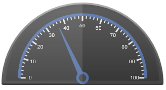
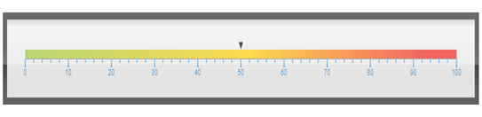

::: {style="DISPLAY: none"}
{#d2h_url_template}{#d2h_package_url style="WIDTH: 0px; DISPLAY: none; HEIGHT: 0px"}
:::

::::: {#nsbanner .d2h_main_nsbanner style="BORDER-BOTTOM: #999999 1px solid; POSITION: relative; PADDING-BOTTOM: 0px; BACKGROUND-COLOR: transparent; PADDING-LEFT: 0px; PADDING-RIGHT: 0px; DISPLAY: none; BORDER-TOP: #999999 1px solid; PADDING-TOP: 0px; LEFT: 0px"}
:::: {#TitleRow .d2h_main_titlerow style="PADDING-BOTTOM: 4px; BACKGROUND-COLOR: transparent; PADDING-LEFT: 22px; WIDTH: 100%; PADDING-RIGHT: 10px; DISPLAY: none; PADDING-TOP: 4px"}
::: {#ienav .d2h_main_ienav style="DISPLAY: none"}
{#D2HPrevious .D2HPreviousEnabled}  {#D2HNext .D2HNextEnabled}
:::
::::
:::::

:::: {#nstext .d2h_main_nstext style="PADDING-BOTTOM: 10px; BACKGROUND-COLOR: transparent; PADDING-LEFT: 22px; PADDING-RIGHT: 10px; HEIGHT: 100%; OVERFLOW: auto; PADDING-TOP: 5px" hasuserbackground="true" valign="bottom"}
::: {#d2h_breadcrumbs .d2h_breadcrumbs}
[Essential Studio User Guide Documentation](ms-xhelp:///?Id=12457748-09e3-4d74-a240-8e049cedf030){.d2h_breadcrumbsNormal}[ \> ]{.d2h_breadcrumbsLinkSeparator}[User Interface Edition](ms-xhelp:///?Id=c29296b7-531c-413b-a0ec-488ca1f7f669){.d2h_breadcrumbsNormal}[ \> ]{.d2h_breadcrumbsLinkSeparator}[Essential Mobile MVC](ms-xhelp:///?Id=74df42e3-5434-4590-9be6-3ae2f911cbbc){.d2h_breadcrumbsNormal}[ \> ]{.d2h_breadcrumbsLinkSeparator}[Essential Gauge]{.d2h_breadcrumbsContentsOnly}[ \> ]{.d2h_breadcrumbsLinkSeparator}[Overview](ms-xhelp:///?Id=c4dd3819-6b75-4d5a-a282-5e678529c43d){.d2h_breadcrumbsNormal}
:::

## IT Scenarios {#it-scenarios style="LINE-HEIGHT: 115%; tab-stops: 0pt"}

Few examples of the Essential Gauge applications are given below:[]{style="FONT-SIZE: 20pt"}

Circular Gauge

Circular Gauge can be used in many different ways in an application. The best and familiar example of a circular gauge application is a speedometer. The speedometer is designed to be placed in a racing game application to denote the speed of a vehicle.

Figure 1 Speedometer[]{style="FONT-FAMILY: 'Times New Roman','serif'; FONT-SIZE: 12pt"}

Circular Gauge can accommodate multiple scales and multiple pointers at the same time. A more complex speedometer can also be designed by using the Circular Gauge.[]{style="FONT-SIZE: 16pt"}

Linear Gauge

Linear Gauge can be imagined as a linear form of Circular Gauge. There are various applications in which the Linear Gauge can be used. One such real world application of the Linear Gauge is Volume control as shown in the following screenshot:

Figure 2 Linear Gauge[]{style="FONT-FAMILY: 'Times New Roman','serif'; FONT-SIZE: 12pt"}

Digital Gauge

Digital Gauges are used to display alpha-numeric values in a virtual digital display. It can be used in many ways depending on the requirements. Digital Gauge can be used to display the current time in a virtual digital clock. The digital clock preceded by a text, reads \"11:27:20 pm\" as shown in the following figure:

Figure 3 Digital Gauge[]{style="FONT-FAMILY: 'Times New Roman','serif'; FONT-SIZE: 12pt"}

Rolling Gauge

Rolling Gauge is used to display values in segments with rolling effect. One real world example of the Rolling Gauge is in Speedometer to display the number of kilometers travelled. 

Figure 4 Rolling Gauge[]{style="FONT-FAMILY: 'Times New Roman','serif'; FONT-SIZE: 12pt"}

          []{style="COLOR: #c00000"}

[]{#related-topics}
::::
