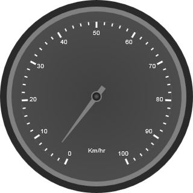
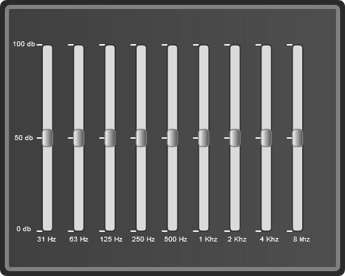

::: {style="DISPLAY: none"}
{#d2h_url_template} {#d2h_package_url style="WIDTH: 0px; DISPLAY: none; HEIGHT: 0px"}
:::

::::: {#nsbanner .d2h_main_nsbanner style="BORDER-BOTTOM: #999999 1px solid; POSITION: relative; PADDING-BOTTOM: 0px; BACKGROUND-COLOR: transparent; PADDING-LEFT: 0px; PADDING-RIGHT: 0px; DISPLAY: none; BORDER-TOP: #999999 1px solid; PADDING-TOP: 0px; LEFT: 0px"}
:::: {#TitleRow .d2h_main_titlerow style="PADDING-BOTTOM: 4px; BACKGROUND-COLOR: transparent; PADDING-LEFT: 22px; WIDTH: 100%; PADDING-RIGHT: 10px; DISPLAY: none; PADDING-TOP: 4px"}
::: {#ienav .d2h_main_ienav style="DISPLAY: none"}
{#D2HPrevious .D2HPreviousEnabled}  {#D2HNext .D2HNextEnabled}
:::
::::
:::::

:::: {#nstext .d2h_main_nstext style="PADDING-BOTTOM: 10px; BACKGROUND-COLOR: transparent; PADDING-LEFT: 22px; PADDING-RIGHT: 10px; HEIGHT: 100%; OVERFLOW: auto; PADDING-TOP: 5px" hasuserbackground="true" valign="bottom"}
::: {#d2h_breadcrumbs .d2h_breadcrumbs}
[Essential Studio User Guide Documentation](ms-xhelp:///?Id=12457748-09e3-4d74-a240-8e049cedf030){.d2h_breadcrumbsNormal} [ \> ]{.d2h_breadcrumbsLinkSeparator} [User Interface Edition](ms-xhelp:///?Id=c29296b7-531c-413b-a0ec-488ca1f7f669){.d2h_breadcrumbsNormal} [ \> ]{.d2h_breadcrumbsLinkSeparator} [Essential ASP.NET](ms-xhelp:///?Id=25c35330-c127-4dad-9a92-ed79dc7261a6){.d2h_breadcrumbsNormal} [ \> ]{.d2h_breadcrumbsLinkSeparator} [Essential Gauge]{.d2h_breadcrumbsContentsOnly} [ \> ]{.d2h_breadcrumbsLinkSeparator} [Overview](ms-xhelp:///?Id=56de71da-0699-46e9-b7ac-82ebc8097411){.d2h_breadcrumbsNormal}
:::

## IT Scenarios {#it-scenarios style="tab-stops: 0pt"}

Essential Gauge for ASP.NET can be used to create sophisticated dashboards, clocks, industrial equipment, medical equipment etc. It evaluates the values of the scales and presents it on a scale. You can build high quality dashboards, process controls, gadgets and clocks quickly, using this product. 

The following are few examples of IT scenarios for using Essential Gauges:

1.   **Circular Gauge**

The circular gauge can be used in various ways within an application.\
The most well-known example of a circular gauge is a speedometer, which denotes the speed of a vehicle.

 

[]{style="FONT-FAMILY: 'Trebuchet MS','sans-serif'; FONT-SIZE: 9pt"} 

2.   **Linear Gauge**

There are various applications in which Linear Gauge can be used. One such real world application of Linear Gauge is the graphic Equalizer which is shown below:

 

 

**[]{style="FONT-FAMILY: 'Trebuchet MS','sans-serif'; FONT-SIZE: 9pt"}**  

Key Features of Essential Gauge for ASP.NET

**[]{style="FONT-FAMILY: 'Trebuchet MS','sans-serif'; FONT-SIZE: 9pt"}**  

The important features of Gauge Web control for circular and linear gauges are listed below:

[·      ]{style="FONT-FAMILY: Symbol"}Choice of multiple Scales and Pointers for a single gauge

[·      ]{style="FONT-FAMILY: Symbol"}Multiple-range support

[·      ]{style="FONT-FAMILY: Symbol"}Labels and tick support

[·      ]{style="FONT-FAMILY: Symbol"}14 built-in skins

[·      ]{style="FONT-FAMILY: Symbol"}Clockwise and Anticlockwise support

[·      ]{style="FONT-FAMILY: Symbol"}Complete view customization support

[·      ]{style="FONT-FAMILY: Symbol"}Variable (vertical or horizontal) orientation (for Linear Gauge only)

**[List of Controls:]{style="FONT-FAMILY: 'Arial','sans-serif'"}**

[The following are the list of Essential Gauge Web controls:]{style="FONT-FAMILY: 'Arial','sans-serif'"}

[·      ]{style="FONT-FAMILY: Symbol"}Circular Gauge

[·      ]{style="FONT-FAMILY: Symbol"}Linear Gauge

[]{#related-topics}
::::
