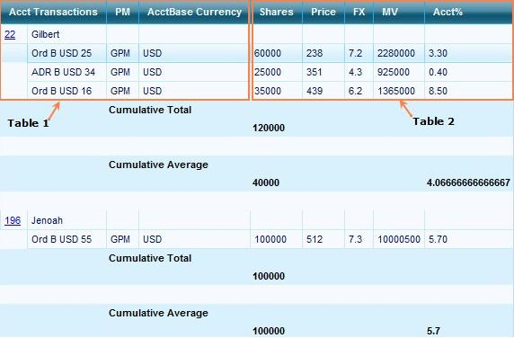

::: {style="DISPLAY: none"}
{#d2h_url_template}{#d2h_package_url style="WIDTH: 0px; DISPLAY: none; HEIGHT: 0px"}
:::

::::: {#nsbanner .d2h_main_nsbanner style="BORDER-BOTTOM: #999999 1px solid; POSITION: relative; PADDING-BOTTOM: 0px; BACKGROUND-COLOR: transparent; PADDING-LEFT: 0px; PADDING-RIGHT: 0px; DISPLAY: none; BORDER-TOP: #999999 1px solid; PADDING-TOP: 0px; LEFT: 0px"}
:::: {#TitleRow .d2h_main_titlerow style="PADDING-BOTTOM: 4px; BACKGROUND-COLOR: transparent; PADDING-LEFT: 22px; WIDTH: 100%; PADDING-RIGHT: 10px; DISPLAY: none; PADDING-TOP: 4px"}
::: {#ienav .d2h_main_ienav style="DISPLAY: none"}
{#D2HPrevious .D2HPreviousEnabled}  {#D2HNext .D2HNextEnabled}
:::
::::
:::::

:::: {#nstext .d2h_main_nstext style="PADDING-BOTTOM: 10px; BACKGROUND-COLOR: transparent; PADDING-LEFT: 22px; PADDING-RIGHT: 10px; HEIGHT: 100%; OVERFLOW: auto; PADDING-TOP: 5px" hasuserbackground="true" valign="bottom"}
::: {#d2h_breadcrumbs .d2h_breadcrumbs}
[Essential Studio User Guide Documentation](ms-xhelp:///?Id=12457748-09e3-4d74-a240-8e049cedf030){.d2h_breadcrumbsNormal}[ \> ]{.d2h_breadcrumbsLinkSeparator}[User Interface Edition](ms-xhelp:///?Id=c29296b7-531c-413b-a0ec-488ca1f7f669){.d2h_breadcrumbsNormal}[ \> ]{.d2h_breadcrumbsLinkSeparator}[Essential ASP.NET](ms-xhelp:///?Id=25c35330-c127-4dad-9a92-ed79dc7261a6){.d2h_breadcrumbsNormal}[ \> ]{.d2h_breadcrumbsLinkSeparator}[Essential Grid]{.d2h_breadcrumbsContentsOnly}[ \> ]{.d2h_breadcrumbsLinkSeparator}[Concepts and Features](ms-xhelp:///?Id=9e489974-524d-457c-9881-e458b1321685){.d2h_breadcrumbsNormal}[ \> ]{.d2h_breadcrumbsLinkSeparator}[Nested Relationship](ms-xhelp:///?Id=b9f71f14-2850-40d8-8438-293a0b032fc5){.d2h_breadcrumbsNormal}
:::

### Joined Tables {#joined-tables style="tab-stops: 0pt"}

 

[]{style="COLOR: black"} 

[·      ]{style="FONT-FAMILY: Symbol"}Tables are merged via ForeignKeyReference relation types and the resultant table is grouped.

[·      ]{style="FONT-FAMILY: Symbol"}Summary descriptors are added to calculate the total and average shares for the different accounts.

[·      ]{style="FONT-FAMILY: Symbol"}Frozen headers and scrollbar functionality of the grid can be toggled accordingly.

[·      ]{style="FONT-FAMILY: Symbol"}Hyperlink control is added to the Item template, and data are retrieved relative to the \'AccountID\' and it is connected to the URL.

[·      ]{style="FONT-FAMILY: Symbol"}We can customize the RelationDescriptor to display child columns in parent. This can be done by setting the**[ ]{style="COLOR: #4e84c4"}**RelationKind as "ForeignKeyReference" which will force the grid to render child columns next to parent columns instead of hierarchy view.

[·      ]{style="FONT-FAMILY: Symbol"}Relationkey is added to define relation between the datasources.

[]{style="FONT-FAMILY: 'Calibri','sans-serif'; FONT-SIZE: 11pt"} 

Example

**** 

+--------------------------------------------------------------------------------------------------------------------------------------------------------------------------------------------------------------------------------------------+
| **[\[C#\]]{style="FONT-FAMILY: 'Courier New'"}**                                                                                                                                                                                           |
|                                                                                                                                                                                                                                            |
| []{style="FONT-FAMILY: 'Courier New'"}                                                                                                                                                                                                     |
|                                                                                                                                                                                                                                            |
| []{style="FONT-FAMILY: 'Courier New'"}                                                                                                                                                                                                     |
|                                                                                                                                                                                                                                            |
| [// 1st DataSource (Displayed at LeftSide)]{style="FONT-FAMILY: 'Courier New'; COLOR: green"}[]{style="FONT-FAMILY: 'Courier New'"}                                                                                                        |
|                                                                                                                                                                                                                                            |
| [Parent1 = GetParent();]{style="FONT-FAMILY: 'Courier New'"}                                                                                                                                                                               |
|                                                                                                                                                                                                                                            |
| [// 2nd DataSource (Displayed at RightSide)]{style="FONT-FAMILY: 'Courier New'; COLOR: green"}[]{style="FONT-FAMILY: 'Courier New'"}                                                                                                       |
|                                                                                                                                                                                                                                            |
| [Child = GetChild();]{style="FONT-FAMILY: 'Courier New'"}                                                                                                                                                                                  |
|                                                                                                                                                                                                                                            |
| [//Adding relation to parent table]{style="FONT-FAMILY: 'Courier New'; COLOR: green"}[]{style="FONT-FAMILY: 'Courier New'"}                                                                                                                |
|                                                                                                                                                                                                                                            |
| [GridRelationDescriptor]{style="FONT-FAMILY: 'Courier New'; COLOR: #2b91af"}[ ChildTableRelationDescriptor = [new]{style="COLOR: blue"} [GridRelationDescriptor]{style="COLOR: #2b91af"}();]{style="FONT-FAMILY: 'Courier New'"}           |
|                                                                                                                                                                                                                                            |
| [ChildTableRelationDescriptor.ChildTableName = [\"Orders\"]{style="COLOR: #a31515"};]{style="FONT-FAMILY: 'Courier New'"}                                                                                                                  |
|                                                                                                                                                                                                                                            |
| [ChildTableRelationDescriptor.ChildTableDescriptor.AllowNew = [false]{style="COLOR: blue"};]{style="FONT-FAMILY: 'Courier New'"}                                                                                                           |
|                                                                                                                                                                                                                                            |
| [//Mentioning RelationKind as "ForeignKeyReference" will force the grid to render child columns next to parent columns. Instead of Hierarchy View]{style="FONT-FAMILY: 'Courier New'; COLOR: green"}[]{style="FONT-FAMILY: 'Courier New'"} |
|                                                                                                                                                                                                                                            |
| [ChildTableRelationDescriptor.RelationKind = [RelationKind]{style="COLOR: #2b91af"}.ForeignKeyReference;]{style="FONT-FAMILY: 'Courier New'"}                                                                                              |
|                                                                                                                                                                                                                                            |
| [// Key need to be added to define relation of two datasource]{style="FONT-FAMILY: 'Courier New'; COLOR: green"}[]{style="FONT-FAMILY: 'Courier New'"}                                                                                     |
|                                                                                                                                                                                                                                            |
| [ChildTableRelationDescriptor.RelationKeys.Add([\"Customer ID\"]{style="COLOR: #a31515"}, [\"Customer ID\"]{style="COLOR: #a31515"});]{style="FONT-FAMILY: 'Courier New'"}                                                                 |
|                                                                                                                                                                                                                                            |
| [GridGroupingControl1.TableDescriptor.Relations.Add(ChildTableRelationDescriptor);]{style="FONT-FAMILY: 'Courier New'"}                                                                                                                    |
|                                                                                                                                                                                                                                            |
| [//Register DataTable with SourceListSet,, so that RelationDescriptor can resolve the name ]{style="FONT-FAMILY: 'Courier New'; COLOR: green"}[]{style="FONT-FAMILY: 'Courier New'"}                                                       |
|                                                                                                                                                                                                                                            |
| [this]{style="FONT-FAMILY: 'Courier New'; COLOR: blue"}[.GridGroupingControl1.Engine.SourceListSet.Add([\"Customers\"]{style="COLOR: #a31515"}, Parent1);]{style="FONT-FAMILY: 'Courier New'"}                                             |
|                                                                                                                                                                                                                                            |
| [this]{style="FONT-FAMILY: 'Courier New'; COLOR: blue"}[.GridGroupingControl1.Engine.SourceListSet.Add([\"Orders\"]{style="COLOR: #a31515"}, Child);]{style="FONT-FAMILY: 'Courier New'"}                                                  |
|                                                                                                                                                                                                                                            |
| [this]{style="FONT-FAMILY: 'Courier New'; COLOR: blue"}[.GridGroupingControl1.DataSource = Parent1;]{style="FONT-FAMILY: 'Courier New'"}                                                                                                   |
|                                                                                                                                                                                                                                            |
| [this]{style="FONT-FAMILY: 'Courier New'; COLOR: blue"}[.GridGroupingControl1.DataBind();]{style="FONT-FAMILY: 'Courier New'"}                                                                                                             |
|                                                                                                                                                                                                                                            |
| []{style="FONT-FAMILY: 'Courier New'"}                                                                                                                                                                                                     |
|                                                                                                                                                                                                                                            |
| []{style="FONT-FAMILY: 'Courier New'"}                                                                                                                                                                                                     |
+--------------------------------------------------------------------------------------------------------------------------------------------------------------------------------------------------------------------------------------------+

[]{style="COLOR: #c00000"} 

**** 

**** 

**** 

+--------------------------------------------------------------------------------------------------------------------------------------------------------------------------------------------------------------------------------------------+
| **[\[VB\]]{style="FONT-FAMILY: 'Courier New'"}**                                                                                                                                                                                           |
|                                                                                                                                                                                                                                            |
| []{style="FONT-FAMILY: 'Courier New'"}                                                                                                                                                                                                     |
|                                                                                                                                                                                                                                            |
| [\' 1st DataSource (Displayed at LeftSide)]{style="FONT-FAMILY: 'Courier New'; COLOR: green"}[]{style="FONT-FAMILY: 'Courier New'"}                                                                                                        |
|                                                                                                                                                                                                                                            |
| [Parent1 = GetParent()]{style="FONT-FAMILY: 'Courier New'"}                                                                                                                                                                                |
|                                                                                                                                                                                                                                            |
| [\' 2nd DataSource (Displayed at RightSide)]{style="FONT-FAMILY: 'Courier New'; COLOR: green"}[]{style="FONT-FAMILY: 'Courier New'"}                                                                                                       |
|                                                                                                                                                                                                                                            |
| [Child = GetChild()]{style="FONT-FAMILY: 'Courier New'"}                                                                                                                                                                                   |
|                                                                                                                                                                                                                                            |
| [\'Adding relation to parent table]{style="FONT-FAMILY: 'Courier New'; COLOR: green"}[]{style="FONT-FAMILY: 'Courier New'"}                                                                                                                |
|                                                                                                                                                                                                                                            |
| [Dim]{style="FONT-FAMILY: 'Courier New'; COLOR: blue"}[ ChildTableRelationDescriptor [As]{style="COLOR: blue"} GridRelationDescriptor = [New]{style="COLOR: blue"} GridRelationDescriptor()]{style="FONT-FAMILY: 'Courier New'"}           |
|                                                                                                                                                                                                                                            |
| [ChildTableRelationDescriptor.ChildTableName = \"Orders\"]{style="FONT-FAMILY: 'Courier New'"}                                                                                                                                             |
|                                                                                                                                                                                                                                            |
| [ChildTableRelationDescriptor.ChildTableDescriptor.AllowNew = [False]{style="COLOR: blue"}]{style="FONT-FAMILY: 'Courier New'"}                                                                                                            |
|                                                                                                                                                                                                                                            |
| [\'Mentioning RelationKind as "ForeignKeyReference" will force the grid to render child columns next to parent columns. Instead of Hierarchy View]{style="FONT-FAMILY: 'Courier New'; COLOR: green"}[]{style="FONT-FAMILY: 'Courier New'"} |
|                                                                                                                                                                                                                                            |
| [ChildTableRelationDescriptor.RelationKind = RelationKind.ForeignKeyReference]{style="FONT-FAMILY: 'Courier New'"}                                                                                                                         |
|                                                                                                                                                                                                                                            |
| [\' Key need to be added to define relation of two datasource]{style="FONT-FAMILY: 'Courier New'; COLOR: green"}[]{style="FONT-FAMILY: 'Courier New'"}                                                                                     |
|                                                                                                                                                                                                                                            |
| [ChildTableRelationDescriptor.RelationKeys.Add(\"Customer ID\", \"Customer ID\")]{style="FONT-FAMILY: 'Courier New'"}                                                                                                                      |
|                                                                                                                                                                                                                                            |
| [GridGroupingControl1.TableDescriptor.Relations.Add(ChildTableRelationDescriptor)]{style="FONT-FAMILY: 'Courier New'"}                                                                                                                     |
|                                                                                                                                                                                                                                            |
| [\'Register DataTable with SourceListSet,, so that RelationDescriptor can resolve the name ]{style="FONT-FAMILY: 'Courier New'; COLOR: green"}[]{style="FONT-FAMILY: 'Courier New'"}                                                       |
|                                                                                                                                                                                                                                            |
| [Me]{style="FONT-FAMILY: 'Courier New'; COLOR: blue"}[.GridGroupingControl1.Engine.SourceListSet.Add(\"Customers\", Parent1)]{style="FONT-FAMILY: 'Courier New'"}                                                                          |
|                                                                                                                                                                                                                                            |
| [Me]{style="FONT-FAMILY: 'Courier New'; COLOR: blue"}[.GridGroupingControl1.Engine.SourceListSet.Add(\"Orders\", Child)]{style="FONT-FAMILY: 'Courier New'"}                                                                               |
|                                                                                                                                                                                                                                            |
| [Me]{style="FONT-FAMILY: 'Courier New'; COLOR: blue"}[.GridGroupingControl1.DataSource = Parent1]{style="FONT-FAMILY: 'Courier New'"}                                                                                                      |
|                                                                                                                                                                                                                                            |
| [Me]{style="FONT-FAMILY: 'Courier New'; COLOR: blue"}[.GridGroupingControl1.DataBind()]{style="FONT-FAMILY: 'Courier New'"}                                                                                                                |
|                                                                                                                                                                                                                                            |
| []{style="FONT-FAMILY: 'Courier New'"}                                                                                                                                                                                                     |
+--------------------------------------------------------------------------------------------------------------------------------------------------------------------------------------------------------------------------------------------+

[]{style="COLOR: #c00000"} 

[]{style="COLOR: black"} 

{border="0"}

Figure 71: Joined Tables

[]{style="COLOR: black"} 

[]{style="FONT-FAMILY: 'Trebuchet MS','sans-serif'; COLOR: #15428b; FONT-SIZE: 9pt"} 

[]{#related-topics}
::::
