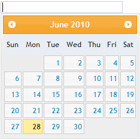

::: {style="DISPLAY: none"}
{#d2h_url_template}{#d2h_package_url style="WIDTH: 0px; DISPLAY: none; HEIGHT: 0px"}
:::

::: {.d2h_secondary_topic style="PADDING-BOTTOM: 10pt; MARGIN: 0pt; PADDING-LEFT: 0pt; PADDING-RIGHT: 0pt; PADDING-TOP: 0pt"}
##### jQuery theme {#jquery-theme style="tab-stops: 0pt"}

Besides the Syncfusion themes, Date Picker also supports all the default jQuery themes.

 

Properties

 

+------------------+----------------------------------+-----------------------------+------------------------------------------------------------------------------------------------------+-------------+
| Name             | Description                      | Type of the property        | Value it accepts                                                                                     | Dependency  |
+------------------+----------------------------------+-----------------------------+------------------------------------------------------------------------------------------------------+-------------+
| jQueryAutoFormat | Used to define the jQuery themes | enum                        | [jQuerySkins]{style="COLOR: #2b91af"}[.Smoothness,]{style="COLOR: black"}                            | NA          |
|                  |                                  |                             |                                                                                                      |             |
|                  |                                  | []{style="COLOR: #2b91af"}  | [jQuerySkins]{style="COLOR: #2b91af"}[.UILightness,]{style="COLOR: black"}                           |             |
|                  |                                  |                             |                                                                                                      |             |
|                  |                                  |                             | [jQuerySkins]{style="COLOR: #2b91af"}[.UIDarkness,]{style="COLOR: black"}                            |             |
|                  |                                  |                             |                                                                                                      |             |
|                  |                                  |                             | [jQuerySkins]{style="COLOR: #2b91af"}[.UIStart,]{style="COLOR: black"}                               |             |
|                  |                                  |                             |                                                                                                      |             |
|                  |                                  |                             | [jQuerySkins]{style="COLOR: #2b91af"}[.Redmond,]{style="COLOR: black"}                               |             |
|                  |                                  |                             |                                                                                                      |             |
|                  |                                  |                             | [jQuerySkins]{style="COLOR: #2b91af"}[.Cupertino,]{style="COLOR: black"}                             |             |
|                  |                                  |                             |                                                                                                      |             |
|                  |                                  |                             | [jQuerySkins]{style="COLOR: #2b91af"}[.SouthStreet,]{style="COLOR: black"}                           |             |
|                  |                                  |                             |                                                                                                      |             |
|                  |                                  |                             | [jQuerySkins]{style="COLOR: #2b91af"}[.Blitzer,]{style="COLOR: black"}                               |             |
|                  |                                  |                             |                                                                                                      |             |
|                  |                                  |                             | [jQuerySkins]{style="COLOR: #2b91af"}[.Humanity,]{style="COLOR: black"}                              |             |
|                  |                                  |                             |                                                                                                      |             |
|                  |                                  |                             | [jQuerySkins]{style="COLOR: #2b91af"}[.HotSneaks,]{style="COLOR: black"}                             |             |
|                  |                                  |                             |                                                                                                      |             |
|                  |                                  |                             | [jQuerySkins]{style="COLOR: #2b91af"}[.ExciteBike,]{style="COLOR: black"}                            |             |
|                  |                                  |                             |                                                                                                      |             |
|                  |                                  |                             | [jQuerySkins]{style="COLOR: #2b91af"}[.Vader,]{style="COLOR: black"}                                 |             |
|                  |                                  |                             |                                                                                                      |             |
|                  |                                  |                             | [jQuerySkins]{style="COLOR: #2b91af"}[.DotLuv,]{style="COLOR: black"}                                |             |
|                  |                                  |                             |                                                                                                      |             |
|                  |                                  |                             | [jQuerySkins]{style="COLOR: #2b91af"}[.MintChoc,]{style="COLOR: black"}                              |             |
|                  |                                  |                             |                                                                                                      |             |
|                  |                                  |                             | [jQuerySkins]{style="COLOR: #2b91af"}[.BlackTie,]{style="COLOR: black"}                              |             |
|                  |                                  |                             |                                                                                                      |             |
|                  |                                  |                             | [jQuerySkins]{style="COLOR: #2b91af"}[.Trontastic,]{style="COLOR: black"}                            |             |
|                  |                                  |                             |                                                                                                      |             |
|                  |                                  |                             | [jQuerySkins]{style="COLOR: #2b91af"}[.SwankyPurse,]{style="COLOR: black"}[]{style="COLOR: #2b91af"} |             |
+------------------+----------------------------------+-----------------------------+------------------------------------------------------------------------------------------------------+-------------+

**[]{style="FONT-FAMILY: 'Calibri','sans-serif'; FONT-SIZE: 12pt"}** 

Using Builder

The following section explains the setting of jQuery themes for the date picker using builder.

1.   In **View**, invoke the date picker helper followed by the the **jQueryAutoFormat** method with desired theme as argument.

**[]{style="FONT-FAMILY: 'Calibri','sans-serif'"}** 

+--------------------------------------------------------------------------------------------------------------------------------------------------------------------------------------------------------------------------------+
| **[\[ASPXView\[aspx\]]{style="FONT-FAMILY: 'Courier New'"}**                                                                                                                                                                   |
|                                                                                                                                                                                                                                |
| **[]{style="FONT-FAMILY: 'Courier New'"}**                                                                                                                                                                                     |
|                                                                                                                                                                                                                                |
| [\<%]{style="FONT-FAMILY: 'Courier New'; BACKGROUND: yellow"}[=]{style="FONT-FAMILY: 'Courier New'; COLOR: blue"}[Html.Syncfusion().DatePicker([\"myDatPicker\"]{style="COLOR: #a31515"})]{style="FONT-FAMILY: 'Courier New'"} |
|                                                                                                                                                                                                                                |
| **[.jQueryAutoFormat([jQuerySkins]{style="COLOR: #2b91af"}.UILightness)]{style="FONT-FAMILY: 'Courier New'"}**[%\>]{style="FONT-FAMILY: 'Courier New'; BACKGROUND: yellow"}                                                    |
|                                                                                                                                                                                                                                |
| []{style="FONT-FAMILY: 'Courier New'; BACKGROUND: yellow"}                                                                                                                                                                     |
+--------------------------------------------------------------------------------------------------------------------------------------------------------------------------------------------------------------------------------+

[]{style="FONT-FAMILY: Consolas; BACKGROUND: yellow; FONT-SIZE: 9.5pt"} 

**[]{style="FONT-FAMILY: 'Calibri','sans-serif'"}** 

+--------------------------------------------------------------------------------------------------------------------------------------------------------------------------------------------------------------------------------+
| **[View\[cshtml\]]{style="FONT-FAMILY: 'Courier New'"}**                                                                                                                                                                       |
|                                                                                                                                                                                                                                |
| **[]{style="FONT-FAMILY: 'Courier New'"}**                                                                                                                                                                                     |
|                                                                                                                                                                                                                                |
| [\@{]{style="FONT-FAMILY: 'Courier New'; BACKGROUND: yellow"}[ ]{style="FONT-FAMILY: 'Courier New'; COLOR: blue"}[Html.Syncfusion().DatePicker([\"myDatPicker\"]{style="COLOR: #a31515"})]{style="FONT-FAMILY: 'Courier New'"} |
|                                                                                                                                                                                                                                |
| **[.jQueryAutoFormat([jQuerySkins]{style="COLOR: #2b91af"}.UILightness).]{style="FONT-FAMILY: 'Courier New'"}**[Render();]{style="FONT-FAMILY: 'Courier New'"}[}]{style="FONT-FAMILY: 'Courier New'; BACKGROUND: yellow"}      |
+--------------------------------------------------------------------------------------------------------------------------------------------------------------------------------------------------------------------------------+

[]{style="FONT-FAMILY: Consolas; BACKGROUND: yellow; FONT-SIZE: 9.5pt"} 

2.   Build and run the application.

**[]{style="FONT-FAMILY: 'Calibri','sans-serif'; FONT-SIZE: 12pt"}** 

Using Properties Model

The following section explains the setting of jQuery themes for the date picker using the Properties model.

1.   In the **Controller**, create an instance of the DatePickerModel, set the **jQueryAutoFormat** property and pass the instance through **view specific data** to **View** as given below.**

*[[[]{style="TEXT-DECORATION: none"}]{style="FONT-FAMILY: 'Calibri','sans-serif'"}]{.underline}* 

*[[[]{style="TEXT-DECORATION: none"}]{style="FONT-FAMILY: 'Calibri','sans-serif'"}]{.underline}* 

+-------------------------------------------------------------------------------------------------------------------------------------------------------------------------------+
| **[\[Controller\]]{style="FONT-FAMILY: 'Courier New'"}**                                                                                                                      |
|                                                                                                                                                                               |
| **[]{style="FONT-FAMILY: 'Courier New'"}**                                                                                                                                    |
|                                                                                                                                                                               |
| [public]{style="FONT-FAMILY: 'Courier New'; COLOR: blue"}[ [ActionResult]{style="COLOR: #2b91af"} Index()]{style="FONT-FAMILY: 'Courier New'"}                                |
|                                                                                                                                                                               |
| [        {]{style="FONT-FAMILY: 'Courier New'"}                                                                                                                               |
|                                                                                                                                                                               |
| [            [//create an instance of DatePickerModel]{style="COLOR: green"}]{style="FONT-FAMILY: 'Courier New'"}                                                             |
|                                                                                                                                                                               |
| [            [DatePickerModel]{style="COLOR: #2b91af"} myModel = [new]{style="COLOR: blue"} [DatePickerModel]{style="COLOR: #2b91af"}();]{style="FONT-FAMILY: 'Courier New'"} |
|                                                                                                                                                                               |
| [            **myModel.jQueryAutoFormat = [jQuerySkins]{style="COLOR: #2b91af"}.UILightness;**]{style="FONT-FAMILY: 'Courier New'"}                                           |
|                                                                                                                                                                               |
| []{style="FONT-FAMILY: 'Courier New'"}                                                                                                                                        |
|                                                                                                                                                                               |
| [            [//pass the instance through view data to the view]{style="COLOR: green"}]{style="FONT-FAMILY: 'Courier New'"}                                                   |
|                                                                                                                                                                               |
| [            ViewData\[[\"myDatePicker\"]{style="COLOR: #a31515"}\] = myModel;]{style="FONT-FAMILY: 'Courier New'"}                                                           |
|                                                                                                                                                                               |
| [            [return]{style="COLOR: blue"} View();]{style="FONT-FAMILY: 'Courier New'"}                                                                                       |
|                                                                                                                                                                               |
| [        }]{style="FONT-FAMILY: 'Courier New'"}                                                                                                                               |
|                                                                                                                                                                               |
| []{style="FONT-FAMILY: 'Courier New'; BACKGROUND: yellow"}                                                                                                                    |
+-------------------------------------------------------------------------------------------------------------------------------------------------------------------------------+

[]{style="FONT-FAMILY: Consolas; FONT-SIZE: 9.5pt"} 

2.   In **View**, invoke the date picker helper with the view data key as the Control ID.

 

+-------------------------------------------------------------------------------------------------------------------------------------------------------------------------------------------------------------------------------------------------------------------+
| **[View\[aspx\]]{style="FONT-FAMILY: 'Courier New'"}**                                                                                                                                                                                                            |
|                                                                                                                                                                                                                                                                   |
| **[]{style="FONT-FAMILY: 'Courier New'"}**                                                                                                                                                                                                                        |
|                                                                                                                                                                                                                                                                   |
| [\<%]{style="FONT-FAMILY: 'Courier New'; BACKGROUND: yellow"}[=]{style="FONT-FAMILY: 'Courier New'; COLOR: blue"}[Html.Syncfusion().DatePicker([\"myDatePicker\"]{style="COLOR: #a31515"}) [%\>]{style="BACKGROUND: yellow"}]{style="FONT-FAMILY: 'Courier New'"} |
+-------------------------------------------------------------------------------------------------------------------------------------------------------------------------------------------------------------------------------------------------------------------+

 

 

+------------------------------------------------------------------------------------------------------------------------------------------------------------------------------------------------------------------------+
| **[View\[aspx\]]{style="FONT-FAMILY: 'Courier New'"}**                                                                                                                                                                 |
|                                                                                                                                                                                                                        |
| **[]{style="FONT-FAMILY: 'Courier New'"}**                                                                                                                                                                             |
|                                                                                                                                                                                                                        |
| [\@{]{style="FONT-FAMILY: 'Courier New'; BACKGROUND: yellow"}[ Html.Syncfusion().DatePicker([\"myDatePicker\"]{style="COLOR: #a31515"}).Render(); [}]{style="BACKGROUND: yellow"}]{style="FONT-FAMILY: 'Courier New'"} |
+------------------------------------------------------------------------------------------------------------------------------------------------------------------------------------------------------------------------+

[]{style="FONT-FAMILY: Consolas; FONT-SIZE: 9.5pt"} 

3.   Build and run the application.

 

The output is shown in the following screenshot.

{border="0"}

Figure 110: Date Picker with jQuery themes

***[]{style="FONT-FAMILY: 'Calibri','sans-serif'"}*** 

***[]{style="FONT-FAMILY: 'Calibri','sans-serif'"}*** 

[]{#related-topics}
:::
