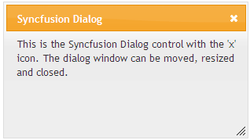

::: {style="DISPLAY: none"}
{#d2h_url_template}{#d2h_package_url style="WIDTH: 0px; DISPLAY: none; HEIGHT: 0px"}
:::

::: {.d2h_secondary_topic style="PADDING-BOTTOM: 10pt; MARGIN: 0pt; PADDING-LEFT: 0pt; PADDING-RIGHT: 0pt; PADDING-TOP: 0pt"}
##### jQuery Theme {#jquery-theme style="tab-stops: 0pt"}

Besides the Syncfusion themes, Date Picker also supports all the default jQuery themes.

 

Properties

+------------------+----------------------------------+------------------------------------------------------------------------------------------------+------------------------------------------------------------------------------------------------------+-------------+
| Name             | Description                      | Type of the property                                                                           | Value it accepts                                                                                     | Dependency  |
+------------------+----------------------------------+------------------------------------------------------------------------------------------------+------------------------------------------------------------------------------------------------------+-------------+
| jQueryAutoFormat | Used to define the jQuery themes | [[enum]{style="COLOR: windowtext; TEXT-DECORATION: none; text-underline: none"}]{.UGHyperlink} | [jQuerySkins]{style="COLOR: #2b91af"}[.Smoothness,]{style="COLOR: black"}                            | NA          |
|                  |                                  |                                                                                                |                                                                                                      |             |
|                  |                                  | []{style="COLOR: #2b91af"}                                                                     | [jQuerySkins]{style="COLOR: #2b91af"}[.UILightness,]{style="COLOR: black"}                           |             |
|                  |                                  |                                                                                                |                                                                                                      |             |
|                  |                                  |                                                                                                | [jQuerySkins]{style="COLOR: #2b91af"}[.UIDarkness,]{style="COLOR: black"}                            |             |
|                  |                                  |                                                                                                |                                                                                                      |             |
|                  |                                  |                                                                                                | [jQuerySkins]{style="COLOR: #2b91af"}[.UIStart,]{style="COLOR: black"}                               |             |
|                  |                                  |                                                                                                |                                                                                                      |             |
|                  |                                  |                                                                                                | [jQuerySkins]{style="COLOR: #2b91af"}[.Redmond,]{style="COLOR: black"}                               |             |
|                  |                                  |                                                                                                |                                                                                                      |             |
|                  |                                  |                                                                                                | [jQuerySkins]{style="COLOR: #2b91af"}[.Cupertino,]{style="COLOR: black"}                             |             |
|                  |                                  |                                                                                                |                                                                                                      |             |
|                  |                                  |                                                                                                | [jQuerySkins]{style="COLOR: #2b91af"}[.SouthStreet,]{style="COLOR: black"}                           |             |
|                  |                                  |                                                                                                |                                                                                                      |             |
|                  |                                  |                                                                                                | [jQuerySkins]{style="COLOR: #2b91af"}[.Blitzer,]{style="COLOR: black"}                               |             |
|                  |                                  |                                                                                                |                                                                                                      |             |
|                  |                                  |                                                                                                | [jQuerySkins]{style="COLOR: #2b91af"}[.Humanity,]{style="COLOR: black"}                              |             |
|                  |                                  |                                                                                                |                                                                                                      |             |
|                  |                                  |                                                                                                | [jQuerySkins]{style="COLOR: #2b91af"}[.HotSneaks,]{style="COLOR: black"}                             |             |
|                  |                                  |                                                                                                |                                                                                                      |             |
|                  |                                  |                                                                                                | [jQuerySkins]{style="COLOR: #2b91af"}[.ExciteBike,]{style="COLOR: black"}                            |             |
|                  |                                  |                                                                                                |                                                                                                      |             |
|                  |                                  |                                                                                                | [jQuerySkins]{style="COLOR: #2b91af"}[.Vader,]{style="COLOR: black"}                                 |             |
|                  |                                  |                                                                                                |                                                                                                      |             |
|                  |                                  |                                                                                                | [jQuerySkins]{style="COLOR: #2b91af"}[.DotLuv,]{style="COLOR: black"}                                |             |
|                  |                                  |                                                                                                |                                                                                                      |             |
|                  |                                  |                                                                                                | [jQuerySkins]{style="COLOR: #2b91af"}[.MintChoc,]{style="COLOR: black"}                              |             |
|                  |                                  |                                                                                                |                                                                                                      |             |
|                  |                                  |                                                                                                | [jQuerySkins]{style="COLOR: #2b91af"}[.BlackTie,]{style="COLOR: black"}                              |             |
|                  |                                  |                                                                                                |                                                                                                      |             |
|                  |                                  |                                                                                                | [jQuerySkins]{style="COLOR: #2b91af"}[.Trontastic,]{style="COLOR: black"}                            |             |
|                  |                                  |                                                                                                |                                                                                                      |             |
|                  |                                  |                                                                                                | [jQuerySkins]{style="COLOR: #2b91af"}[.SwankyPurse,]{style="COLOR: black"}[]{style="COLOR: #2b91af"} |             |
+------------------+----------------------------------+------------------------------------------------------------------------------------------------+------------------------------------------------------------------------------------------------------+-------------+

*[[]{style="TEXT-DECORATION: none"}]{.underline}* 

UsingBuilder

The following steps explain the setting of jQuery themes to the dialog through Builder.

1.   In **View**, create the contents of the dialog and invoke the dialog helper with the Control ID as first argument followed by the **AutoFormat** method with the desired theme as the argument.

[]{style="FONT-FAMILY: 'Calibri','sans-serif'"} 

+-----------------------------------------------------------------------------------------------------------------------------------------------------------------------------------------------------------------------------------------------------------------------------------------------------------------------------------------------------------------------------------------------------------------------------------------------------------+
| **View\[ASPX\]**                                                                                                                                                                                                                                                                                                                                                                                                                                          |
|                                                                                                                                                                                                                                                                                                                                                                                                                                                           |
|                                                                                                                                                                                                                                                                                                                                                                                                                                                           |
|                                                                                                                                                                                                                                                                                                                                                                                                                                                           |
| [\<]{style="FONT-FAMILY: Consolas; COLOR: blue; FONT-SIZE: 9.5pt"}[div]{style="FONT-FAMILY: Consolas; COLOR: maroon; FONT-SIZE: 9.5pt"}[ [id]{style="COLOR: red"}[=\"myDialog\"]{style="COLOR: blue"} [title]{style="COLOR: red"}[=\"Syncfusion Dialog\"]{style="COLOR: blue"} [style]{style="COLOR: red"}[=\"]{style="COLOR: blue"}[visibility]{style="COLOR: red"}[: hidden\"\>]{style="COLOR: blue"}]{style="FONT-FAMILY: Consolas; FONT-SIZE: 9.5pt"} |
|                                                                                                                                                                                                                                                                                                                                                                                                                                                           |
| [This is the Syncfusion Dialog control with the \'x\' icon. The dialog    window can be moved, resized and closed.]{style="FONT-FAMILY: Consolas; FONT-SIZE: 9.5pt"}                                                                                                                                                                                                                                                                                      |
|                                                                                                                                                                                                                                                                                                                                                                                                                                                           |
| [       [\</]{style="COLOR: blue"}[div]{style="COLOR: maroon"}[\>]{style="COLOR: blue"}]{style="FONT-FAMILY: Consolas; FONT-SIZE: 9.5pt"}                                                                                                                                                                                                                                                                                                                 |
|                                                                                                                                                                                                                                                                                                                                                                                                                                                           |
| [       [\<%]{style="BACKGROUND: yellow"}[=]{style="COLOR: blue"}Html.Syncfusion().Dialog([\"myDialog\"]{style="COLOR: #a31515"})]{style="FONT-FAMILY: Consolas; FONT-SIZE: 9.5pt"}                                                                                                                                                                                                                                                                       |
|                                                                                                                                                                                                                                                                                                                                                                                                                                                           |
| [.**jQueryAutoFormat([jQuerySkins]{style="COLOR: #2b91af"}.UILightness)[%\>]{style="BACKGROUND: yellow"}**]{style="FONT-FAMILY: Consolas; FONT-SIZE: 9.5pt"}                                                                                                                                                                                                                                                                                              |
|                                                                                                                                                                                                                                                                                                                                                                                                                                                           |
| []{style="FONT-FAMILY: Consolas; BACKGROUND: yellow; FONT-SIZE: 9.5pt"}                                                                                                                                                                                                                                                                                                                                                                                   |
+-----------------------------------------------------------------------------------------------------------------------------------------------------------------------------------------------------------------------------------------------------------------------------------------------------------------------------------------------------------------------------------------------------------------------------------------------------------+

[]{style="FONT-FAMILY: Consolas; BACKGROUND: yellow; FONT-SIZE: 9.5pt"} 

[]{style="FONT-FAMILY: 'Calibri','sans-serif'"} 

+-----------------------------------------------------------------------------------------------------------------------------------------------------------------------------------------------------------------------------------------------------------------------------------------------------------------------------------------------------------------------------------------------------------------------------------------------------------+
| **View\[cshtml\]**                                                                                                                                                                                                                                                                                                                                                                                                                                        |
|                                                                                                                                                                                                                                                                                                                                                                                                                                                           |
|                                                                                                                                                                                                                                                                                                                                                                                                                                                           |
|                                                                                                                                                                                                                                                                                                                                                                                                                                                           |
| [\<]{style="FONT-FAMILY: Consolas; COLOR: blue; FONT-SIZE: 9.5pt"}[div]{style="FONT-FAMILY: Consolas; COLOR: maroon; FONT-SIZE: 9.5pt"}[ [id]{style="COLOR: red"}[=\"myDialog\"]{style="COLOR: blue"} [title]{style="COLOR: red"}[=\"Syncfusion Dialog\"]{style="COLOR: blue"} [style]{style="COLOR: red"}[=\"]{style="COLOR: blue"}[visibility]{style="COLOR: red"}[: hidden\"\>]{style="COLOR: blue"}]{style="FONT-FAMILY: Consolas; FONT-SIZE: 9.5pt"} |
|                                                                                                                                                                                                                                                                                                                                                                                                                                                           |
| [This is the Syncfusion Dialog control with the \'x\' icon. The dialog    window can be moved, resized and closed.]{style="FONT-FAMILY: Consolas; FONT-SIZE: 9.5pt"}                                                                                                                                                                                                                                                                                      |
|                                                                                                                                                                                                                                                                                                                                                                                                                                                           |
| [       [\</]{style="COLOR: blue"}[div]{style="COLOR: maroon"}[\>]{style="COLOR: blue"}]{style="FONT-FAMILY: Consolas; FONT-SIZE: 9.5pt"}                                                                                                                                                                                                                                                                                                                 |
|                                                                                                                                                                                                                                                                                                                                                                                                                                                           |
| [       [\@{]{style="BACKGROUND: yellow"}[ ]{style="COLOR: blue"}Html.Syncfusion().Dialog([\"myDialog\"]{style="COLOR: #a31515"})]{style="FONT-FAMILY: Consolas; FONT-SIZE: 9.5pt"}                                                                                                                                                                                                                                                                       |
|                                                                                                                                                                                                                                                                                                                                                                                                                                                           |
| [.**jQueryAutoFormat([jQuerySkins]{style="COLOR: #2b91af"}.UILightness).**Render(); **[}]{style="BACKGROUND: yellow"}**]{style="FONT-FAMILY: Consolas; FONT-SIZE: 9.5pt"}                                                                                                                                                                                                                                                                                 |
|                                                                                                                                                                                                                                                                                                                                                                                                                                                           |
| []{style="FONT-FAMILY: Consolas; BACKGROUND: yellow; FONT-SIZE: 9.5pt"}                                                                                                                                                                                                                                                                                                                                                                                   |
+-----------------------------------------------------------------------------------------------------------------------------------------------------------------------------------------------------------------------------------------------------------------------------------------------------------------------------------------------------------------------------------------------------------------------------------------------------------+

[]{style="FONT-FAMILY: Consolas; BACKGROUND: yellow; FONT-SIZE: 9.5pt"} 

2.   Build and run the application.

**[]{style="FONT-FAMILY: 'Calibri','sans-serif'; FONT-SIZE: 12pt"}** 

Using Properties Model

The following steps explain the setting of the jQuery themes to the dialog through the Properties model.

1.   In the **Controller**, create an instance of the DialogModel, define the **TargetControlId** and pass the instance through **view specific data** to **View** as given below.**

*[[[]{style="TEXT-DECORATION: none"}]{style="FONT-FAMILY: 'Calibri','sans-serif'"}]{.underline}* 

+------------------------------------------------------------------------------------------------------------------------------------------------------------------------------------+
| **[]{style="FONT-FAMILY: Consolas; BACKGROUND: yellow; FONT-SIZE: 9.5pt"}**                                                                                                        |
|                                                                                                                                                                                    |
| **\[Controller\]**                                                                                                                                                                 |
|                                                                                                                                                                                    |
|                                                                                                                                                                                    |
|                                                                                                                                                                                    |
| [public]{style="FONT-FAMILY: Consolas; COLOR: blue; FONT-SIZE: 9.5pt"}[ [ActionResult]{style="COLOR: #2b91af"} Index()]{style="FONT-FAMILY: Consolas; FONT-SIZE: 9.5pt"}           |
|                                                                                                                                                                                    |
| [        {]{style="FONT-FAMILY: Consolas; FONT-SIZE: 9.5pt"}                                                                                                                       |
|                                                                                                                                                                                    |
| [            [//create an instance of DialogModel]{style="COLOR: green"}]{style="FONT-FAMILY: Consolas; FONT-SIZE: 9.5pt"}                                                         |
|                                                                                                                                                                                    |
| [            [DialogModel]{style="COLOR: #2b91af"} myModel = [new]{style="COLOR: blue"} [DialogModel]{style="COLOR: #2b91af"}();]{style="FONT-FAMILY: Consolas; FONT-SIZE: 9.5pt"} |
|                                                                                                                                                                                    |
| [            **myModel.jQueryAutoFormat = [jQuerySkins]{style="COLOR: #2b91af"}.UILightness;**]{style="FONT-FAMILY: Consolas; FONT-SIZE: 9.5pt"}                                   |
|                                                                                                                                                                                    |
| []{style="FONT-FAMILY: Consolas; FONT-SIZE: 9.5pt"}                                                                                                                                |
|                                                                                                                                                                                    |
| [            [//pass the instance through view data to the view]{style="COLOR: green"}]{style="FONT-FAMILY: Consolas; FONT-SIZE: 9.5pt"}                                           |
|                                                                                                                                                                                    |
| [            ViewData\[[\"myDialog\"]{style="COLOR: #a31515"}\] = myModel;]{style="FONT-FAMILY: Consolas; FONT-SIZE: 9.5pt"}                                                       |
|                                                                                                                                                                                    |
| [            [return]{style="COLOR: blue"} View();]{style="FONT-FAMILY: Consolas; FONT-SIZE: 9.5pt"}                                                                               |
|                                                                                                                                                                                    |
| [        }]{style="FONT-FAMILY: Consolas; FONT-SIZE: 9.5pt"}                                                                                                                       |
|                                                                                                                                                                                    |
| []{style="FONT-FAMILY: Consolas; BACKGROUND: yellow; FONT-SIZE: 9.5pt"}                                                                                                            |
+------------------------------------------------------------------------------------------------------------------------------------------------------------------------------------+

 

2.   In **View**, create the dialog contents and invoke the dialog helper with the **View Data** key as the first argument.

[]{style="FONT-FAMILY: 'Calibri','sans-serif'"} 

+-----------------------------------------------------------------------------------------------------------------------------------------------------------------------------------------------------------------------------------------------------------------------------------------------------------------------------------------------------------------------------------------------------------------------------------------------------------+
| **View\[ASPX\]**                                                                                                                                                                                                                                                                                                                                                                                                                                          |
|                                                                                                                                                                                                                                                                                                                                                                                                                                                           |
|                                                                                                                                                                                                                                                                                                                                                                                                                                                           |
|                                                                                                                                                                                                                                                                                                                                                                                                                                                           |
| [\<]{style="FONT-FAMILY: Consolas; COLOR: blue; FONT-SIZE: 9.5pt"}[div]{style="FONT-FAMILY: Consolas; COLOR: maroon; FONT-SIZE: 9.5pt"}[ [id]{style="COLOR: red"}[=\"myDialog\"]{style="COLOR: blue"} [title]{style="COLOR: red"}[=\"Syncfusion Dialog\"]{style="COLOR: blue"} [style]{style="COLOR: red"}[=\"]{style="COLOR: blue"}[visibility]{style="COLOR: red"}[: hidden\"\>]{style="COLOR: blue"}]{style="FONT-FAMILY: Consolas; FONT-SIZE: 9.5pt"} |
|                                                                                                                                                                                                                                                                                                                                                                                                                                                           |
| [This is the Syncfusion Dialog control with the \'x\' icon. The dialog    window can be moved, resized and closed.]{style="FONT-FAMILY: Consolas; FONT-SIZE: 9.5pt"}                                                                                                                                                                                                                                                                                      |
|                                                                                                                                                                                                                                                                                                                                                                                                                                                           |
| [       [\</]{style="COLOR: blue"}[div]{style="COLOR: maroon"}[\>]{style="COLOR: blue"}]{style="FONT-FAMILY: Consolas; FONT-SIZE: 9.5pt"}                                                                                                                                                                                                                                                                                                                 |
|                                                                                                                                                                                                                                                                                                                                                                                                                                                           |
| [\<%]{style="FONT-FAMILY: Consolas; BACKGROUND: yellow; FONT-SIZE: 9.5pt"}[=]{style="FONT-FAMILY: Consolas; COLOR: blue; FONT-SIZE: 9.5pt"}[Html.Syncfusion().Dialog([\"myDialog\"]{style="COLOR: #a31515"})[%\>]{style="BACKGROUND: yellow"}]{style="FONT-FAMILY: Consolas; FONT-SIZE: 9.5pt"}                                                                                                                                                           |
+-----------------------------------------------------------------------------------------------------------------------------------------------------------------------------------------------------------------------------------------------------------------------------------------------------------------------------------------------------------------------------------------------------------------------------------------------------------+

[]{style="FONT-FAMILY: Consolas; BACKGROUND: yellow; FONT-SIZE: 9.5pt"} 

[]{style="FONT-FAMILY: 'Calibri','sans-serif'"} 

+-----------------------------------------------------------------------------------------------------------------------------------------------------------------------------------------------------------------------------------------------------------------------------------------------------------------------------------------------------------------------------------------------------------------------------------------------------------+
| **View\[cshtml\]**                                                                                                                                                                                                                                                                                                                                                                                                                                        |
|                                                                                                                                                                                                                                                                                                                                                                                                                                                           |
|                                                                                                                                                                                                                                                                                                                                                                                                                                                           |
|                                                                                                                                                                                                                                                                                                                                                                                                                                                           |
| [\<]{style="FONT-FAMILY: Consolas; COLOR: blue; FONT-SIZE: 9.5pt"}[div]{style="FONT-FAMILY: Consolas; COLOR: maroon; FONT-SIZE: 9.5pt"}[ [id]{style="COLOR: red"}[=\"myDialog\"]{style="COLOR: blue"} [title]{style="COLOR: red"}[=\"Syncfusion Dialog\"]{style="COLOR: blue"} [style]{style="COLOR: red"}[=\"]{style="COLOR: blue"}[visibility]{style="COLOR: red"}[: hidden\"\>]{style="COLOR: blue"}]{style="FONT-FAMILY: Consolas; FONT-SIZE: 9.5pt"} |
|                                                                                                                                                                                                                                                                                                                                                                                                                                                           |
| [This is the Syncfusion Dialog control with the \'x\' icon. The dialog    window can be moved, resized and closed.]{style="FONT-FAMILY: Consolas; FONT-SIZE: 9.5pt"}                                                                                                                                                                                                                                                                                      |
|                                                                                                                                                                                                                                                                                                                                                                                                                                                           |
| [       [\</]{style="COLOR: blue"}[div]{style="COLOR: maroon"}[\>]{style="COLOR: blue"}]{style="FONT-FAMILY: Consolas; FONT-SIZE: 9.5pt"}                                                                                                                                                                                                                                                                                                                 |
|                                                                                                                                                                                                                                                                                                                                                                                                                                                           |
| [\@{]{style="FONT-FAMILY: Consolas; BACKGROUND: yellow; FONT-SIZE: 9.5pt"}[ ]{style="FONT-FAMILY: Consolas; COLOR: blue; FONT-SIZE: 9.5pt"}[Html.Syncfusion().Dialog([\"myDialog\"]{style="COLOR: #a31515"}).Render();[}]{style="BACKGROUND: yellow"}]{style="FONT-FAMILY: Consolas; FONT-SIZE: 9.5pt"}                                                                                                                                                   |
|                                                                                                                                                                                                                                                                                                                                                                                                                                                           |
| []{style="FONT-FAMILY: Consolas; BACKGROUND: yellow; FONT-SIZE: 9.5pt"}                                                                                                                                                                                                                                                                                                                                                                                   |
+-----------------------------------------------------------------------------------------------------------------------------------------------------------------------------------------------------------------------------------------------------------------------------------------------------------------------------------------------------------------------------------------------------------------------------------------------------------+

[]{style="FONT-FAMILY: Consolas; BACKGROUND: yellow; FONT-SIZE: 9.5pt"} 

[]{style="FONT-FAMILY: Consolas; BACKGROUND: yellow; FONT-SIZE: 9.5pt"} 

3.   Build and run the application.

The output is shown in the following screenshot.

 

{border="0"}

Figure 120: Dialog -- jQuery theme

[]{#related-topics}
:::
