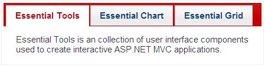

::: {style="DISPLAY: none"}
{#d2h_url_template}{#d2h_package_url style="WIDTH: 0px; DISPLAY: none; HEIGHT: 0px"}
:::

::: {.d2h_secondary_topic style="PADDING-BOTTOM: 10pt; MARGIN: 0pt; PADDING-LEFT: 0pt; PADDING-RIGHT: 0pt; PADDING-TOP: 0pt"}
##### jQuery Themes {#jquery-themes style="tab-stops: 0pt"}

Besides the Syncfusion themes, the tab control also supports all the default jQuery themes.**

Properties

 

 

+------------------+-----------------------------------+------------------+---------------------------------------------------------------+-------------+
| Name             | Description                       | Type of property | Value it accepts                                              | Dependency  |
+------------------+-----------------------------------+------------------+---------------------------------------------------------------+-------------+
| jQueryAutoFormat | Used to define the jQuery themes. | enum             | [·      ]{style="FONT-FAMILY: Symbol"}jQuerySkins.Smoothness  | NA          |
|                  |                                   |                  |                                                               |             |
|                  |                                   |                  | [·      ]{style="FONT-FAMILY: Symbol"}jQuerySkins.UILightness |             |
|                  |                                   |                  |                                                               |             |
|                  |                                   |                  | [·      ]{style="FONT-FAMILY: Symbol"}jQuerySkins.UIDarkness  |             |
|                  |                                   |                  |                                                               |             |
|                  |                                   |                  | [·      ]{style="FONT-FAMILY: Symbol"}jQuerySkins.UIStart     |             |
|                  |                                   |                  |                                                               |             |
|                  |                                   |                  | [·      ]{style="FONT-FAMILY: Symbol"}jQuerySkins.Redmond     |             |
|                  |                                   |                  |                                                               |             |
|                  |                                   |                  | [·      ]{style="FONT-FAMILY: Symbol"}jQuerySkins.Cupertino   |             |
|                  |                                   |                  |                                                               |             |
|                  |                                   |                  | [·      ]{style="FONT-FAMILY: Symbol"}jQuerySkins.SouthStreet |             |
|                  |                                   |                  |                                                               |             |
|                  |                                   |                  | [·      ]{style="FONT-FAMILY: Symbol"}jQuerySkins.Blitzer     |             |
|                  |                                   |                  |                                                               |             |
|                  |                                   |                  | [·      ]{style="FONT-FAMILY: Symbol"}jQuerySkins.Humanity    |             |
|                  |                                   |                  |                                                               |             |
|                  |                                   |                  | [·      ]{style="FONT-FAMILY: Symbol"}jQuerySkins.HotSneaks   |             |
|                  |                                   |                  |                                                               |             |
|                  |                                   |                  | [·      ]{style="FONT-FAMILY: Symbol"}jQuerySkins.ExciteBike  |             |
|                  |                                   |                  |                                                               |             |
|                  |                                   |                  | [·      ]{style="FONT-FAMILY: Symbol"}jQuerySkins.Vader       |             |
|                  |                                   |                  |                                                               |             |
|                  |                                   |                  | [·      ]{style="FONT-FAMILY: Symbol"}jQuerySkins.DotLuv      |             |
|                  |                                   |                  |                                                               |             |
|                  |                                   |                  | [·      ]{style="FONT-FAMILY: Symbol"}jQuerySkins.MintChoc    |             |
|                  |                                   |                  |                                                               |             |
|                  |                                   |                  | [·      ]{style="FONT-FAMILY: Symbol"}jQuerySkins.BlackTie    |             |
|                  |                                   |                  |                                                               |             |
|                  |                                   |                  | [·      ]{style="FONT-FAMILY: Symbol"}jQuerySkins.Trontastic  |             |
|                  |                                   |                  |                                                               |             |
|                  |                                   |                  | [·      ]{style="FONT-FAMILY: Symbol"}jQuerySkins.SwankyPurse |             |
+------------------+-----------------------------------+------------------+---------------------------------------------------------------+-------------+

**[]{style="FONT-FAMILY: 'Calibri','sans-serif'; FONT-SIZE: 12pt"}** 

**[Using Builder]{style="FONT-FAMILY: 'Calibri','sans-serif'; FONT-SIZE: 12pt"}**[]{style="FONT-FAMILY: 'Calibri','sans-serif'"}

The following steps explain how to set jQuery themes through the builder for the tab control.

1.   In **View**, create the contents of the tab with *ul* and *li* (for headers) and *div* tags (for content), and invoke the tab helper with the control ID as the first argument, followed by the **AutoFormat** method with the desired theme as an argument.[]{style="FONT-FAMILY: Consolas; FONT-SIZE: 9.5pt"}

[]{style="FONT-FAMILY: Consolas; BACKGROUND: yellow; FONT-SIZE: 9.5pt"} 

+-----------------------------------------------------------------------------------------------------------------------------------------------------------------------------------------------------------------------------------------------------------------------------------------------------------------------------------------------------------------------------------+
| **View\[ASPX\]**                                                                                                                                                                                                                                                                                                                                                                  |
|                                                                                                                                                                                                                                                                                                                                                                                   |
| [\<]{style="FONT-FAMILY: 'Courier New'; COLOR: blue"}[div]{style="FONT-FAMILY: 'Courier New'; COLOR: maroon"}[ [id]{style="COLOR: red"}[=\"tabContents\"]{style="COLOR: blue"} [style]{style="COLOR: red"}[=\"]{style="COLOR: blue"}[visibility]{style="COLOR: red"}[: hidden\"\>]{style="COLOR: blue"}]{style="FONT-FAMILY: 'Courier New'"}                                      |
|                                                                                                                                                                                                                                                                                                                                                                                   |
| [            [\<]{style="COLOR: blue"}[ul]{style="COLOR: maroon"}[\>]{style="COLOR: blue"}]{style="FONT-FAMILY: 'Courier New'"}                                                                                                                                                                                                                                                   |
|                                                                                                                                                                                                                                                                                                                                                                                   |
| [                [\<]{style="COLOR: blue"}[li]{style="COLOR: maroon"}[\>\<]{style="COLOR: blue"}[a]{style="COLOR: maroon"} [href]{style="COLOR: red"}[=\"#tools\"\>]{style="COLOR: blue"}Essential Tools[\</]{style="COLOR: blue"}[a]{style="COLOR: maroon"}[\>\</]{style="COLOR: blue"}[li]{style="COLOR: maroon"}[\>]{style="COLOR: blue"}]{style="FONT-FAMILY: 'Courier New'"} |
|                                                                                                                                                                                                                                                                                                                                                                                   |
| [                [\<]{style="COLOR: blue"}[li]{style="COLOR: maroon"}[\>\<]{style="COLOR: blue"}[a]{style="COLOR: maroon"} [href]{style="COLOR: red"}[=\"#chart\"\>]{style="COLOR: blue"}Essential Chart[\</]{style="COLOR: blue"}[a]{style="COLOR: maroon"}[\>\</]{style="COLOR: blue"}[li]{style="COLOR: maroon"}[\>]{style="COLOR: blue"}]{style="FONT-FAMILY: 'Courier New'"} |
|                                                                                                                                                                                                                                                                                                                                                                                   |
| [                [\<]{style="COLOR: blue"}[li]{style="COLOR: maroon"}[\>\<]{style="COLOR: blue"}[a]{style="COLOR: maroon"} [href]{style="COLOR: red"}[=\"#grid\"\>]{style="COLOR: blue"}Essential Grid[\</]{style="COLOR: blue"}[a]{style="COLOR: maroon"}[\>\</]{style="COLOR: blue"}[li]{style="COLOR: maroon"}[\>]{style="COLOR: blue"}]{style="FONT-FAMILY: 'Courier New'"}   |
|                                                                                                                                                                                                                                                                                                                                                                                   |
| [            [\</]{style="COLOR: blue"}[ul]{style="COLOR: maroon"}[\>]{style="COLOR: blue"}]{style="FONT-FAMILY: 'Courier New'"}                                                                                                                                                                                                                                                  |
|                                                                                                                                                                                                                                                                                                                                                                                   |
| [            [\<]{style="COLOR: blue"}[div]{style="COLOR: maroon"} [id]{style="COLOR: red"}[=\"tools\"\>]{style="COLOR: blue"}]{style="FONT-FAMILY: 'Courier New'"}                                                                                                                                                                                                               |
|                                                                                                                                                                                                                                                                                                                                                                                   |
| [Essential Tools is a collection of user-interface components used to create interactive ASP.NET MVC applications.]{style="FONT-FAMILY: 'Courier New'"}                                                                                                                                                                                                                           |
|                                                                                                                                                                                                                                                                                                                                                                                   |
| [            [\</]{style="COLOR: blue"}[div]{style="COLOR: maroon"}[\>]{style="COLOR: blue"}]{style="FONT-FAMILY: 'Courier New'"}                                                                                                                                                                                                                                                 |
|                                                                                                                                                                                                                                                                                                                                                                                   |
| [            [\<]{style="COLOR: blue"}[div]{style="COLOR: maroon"} [id]{style="COLOR: red"}[=\"chart\"\>]{style="COLOR: blue"}]{style="FONT-FAMILY: 'Courier New'"}                                                                                                                                                                                                               |
|                                                                                                                                                                                                                                                                                                                                                                                   |
| [Essential Chart is a business-oriented charting component. Essential Chart features an advanced styles architecture that makes complex multi-level formatting very easy.]{style="FONT-FAMILY: 'Courier New'"}                                                                                                                                                                    |
|                                                                                                                                                                                                                                                                                                                                                                                   |
| [            [\</]{style="COLOR: blue"}[div]{style="COLOR: maroon"}[\>]{style="COLOR: blue"}]{style="FONT-FAMILY: 'Courier New'"}                                                                                                                                                                                                                                                 |
|                                                                                                                                                                                                                                                                                                                                                                                   |
| [            [\<]{style="COLOR: blue"}[div]{style="COLOR: maroon"} [id]{style="COLOR: red"}[=\"grid\"\>]{style="COLOR: blue"}]{style="FONT-FAMILY: 'Courier New'"}                                                                                                                                                                                                                |
|                                                                                                                                                                                                                                                                                                                                                                                   |
| [Essential Grid MVC offers a full-featured grid control with extensive support for grouping and displaying hierarchical data.]{style="FONT-FAMILY: 'Courier New'"}                                                                                                                                                                                                                |
|                                                                                                                                                                                                                                                                                                                                                                                   |
| [            [\</]{style="COLOR: blue"}[div]{style="COLOR: maroon"}[\>]{style="COLOR: blue"}]{style="FONT-FAMILY: 'Courier New'"}                                                                                                                                                                                                                                                 |
|                                                                                                                                                                                                                                                                                                                                                                                   |
| [       [\</]{style="COLOR: blue"}[div]{style="COLOR: maroon"}[\>]{style="COLOR: blue"}]{style="FONT-FAMILY: 'Courier New'"}                                                                                                                                                                                                                                                      |
|                                                                                                                                                                                                                                                                                                                                                                                   |
| [\<%]{style="FONT-FAMILY: 'Courier New'; BACKGROUND: yellow"}[=]{style="FONT-FAMILY: 'Courier New'; COLOR: blue"}[Html.Syncfusion().Tab([\"myTab\"]{style="COLOR: #a31515"})]{style="FONT-FAMILY: 'Courier New'"}                                                                                                                                                                 |
|                                                                                                                                                                                                                                                                                                                                                                                   |
| [.TargetControlId([\"tabContents\"]{style="COLOR: #a31515"})]{style="FONT-FAMILY: 'Courier New'"}                                                                                                                                                                                                                                                                                 |
|                                                                                                                                                                                                                                                                                                                                                                                   |
| **[.jQueryAutoFormat([jQuerySkins]{style="COLOR: #2b91af"}.Blitzer)[%\>]{style="BACKGROUND: yellow"}]{style="FONT-FAMILY: 'Courier New'"}**                                                                                                                                                                                                                                       |
|                                                                                                                                                                                                                                                                                                                                                                                   |
| **[]{style="FONT-FAMILY: 'Courier New'; BACKGROUND: yellow"}**                                                                                                                                                                                                                                                                                                                    |
+-----------------------------------------------------------------------------------------------------------------------------------------------------------------------------------------------------------------------------------------------------------------------------------------------------------------------------------------------------------------------------------+

 

[]{style="FONT-FAMILY: Consolas; BACKGROUND: yellow; FONT-SIZE: 9.5pt"} 

+-----------------------------------------------------------------------------------------------------------------------------------------------------------------------------------------------------------------------------------------------------------------------------------------------------------------------------------------------------------------------------------+
| **View\[ASPX\]**                                                                                                                                                                                                                                                                                                                                                                  |
|                                                                                                                                                                                                                                                                                                                                                                                   |
| [\<]{style="FONT-FAMILY: 'Courier New'; COLOR: blue"}[div]{style="FONT-FAMILY: 'Courier New'; COLOR: maroon"}[ [id]{style="COLOR: red"}[=\"tabContents\"]{style="COLOR: blue"} [style]{style="COLOR: red"}[=\"]{style="COLOR: blue"}[visibility]{style="COLOR: red"}[: hidden\"\>]{style="COLOR: blue"}]{style="FONT-FAMILY: 'Courier New'"}                                      |
|                                                                                                                                                                                                                                                                                                                                                                                   |
| [            [\<]{style="COLOR: blue"}[ul]{style="COLOR: maroon"}[\>]{style="COLOR: blue"}]{style="FONT-FAMILY: 'Courier New'"}                                                                                                                                                                                                                                                   |
|                                                                                                                                                                                                                                                                                                                                                                                   |
| [                [\<]{style="COLOR: blue"}[li]{style="COLOR: maroon"}[\>\<]{style="COLOR: blue"}[a]{style="COLOR: maroon"} [href]{style="COLOR: red"}[=\"#tools\"\>]{style="COLOR: blue"}Essential Tools[\</]{style="COLOR: blue"}[a]{style="COLOR: maroon"}[\>\</]{style="COLOR: blue"}[li]{style="COLOR: maroon"}[\>]{style="COLOR: blue"}]{style="FONT-FAMILY: 'Courier New'"} |
|                                                                                                                                                                                                                                                                                                                                                                                   |
| [                [\<]{style="COLOR: blue"}[li]{style="COLOR: maroon"}[\>\<]{style="COLOR: blue"}[a]{style="COLOR: maroon"} [href]{style="COLOR: red"}[=\"#chart\"\>]{style="COLOR: blue"}Essential Chart[\</]{style="COLOR: blue"}[a]{style="COLOR: maroon"}[\>\</]{style="COLOR: blue"}[li]{style="COLOR: maroon"}[\>]{style="COLOR: blue"}]{style="FONT-FAMILY: 'Courier New'"} |
|                                                                                                                                                                                                                                                                                                                                                                                   |
| [                [\<]{style="COLOR: blue"}[li]{style="COLOR: maroon"}[\>\<]{style="COLOR: blue"}[a]{style="COLOR: maroon"} [href]{style="COLOR: red"}[=\"#grid\"\>]{style="COLOR: blue"}Essential Grid[\</]{style="COLOR: blue"}[a]{style="COLOR: maroon"}[\>\</]{style="COLOR: blue"}[li]{style="COLOR: maroon"}[\>]{style="COLOR: blue"}]{style="FONT-FAMILY: 'Courier New'"}   |
|                                                                                                                                                                                                                                                                                                                                                                                   |
| [            [\</]{style="COLOR: blue"}[ul]{style="COLOR: maroon"}[\>]{style="COLOR: blue"}]{style="FONT-FAMILY: 'Courier New'"}                                                                                                                                                                                                                                                  |
|                                                                                                                                                                                                                                                                                                                                                                                   |
| [            [\<]{style="COLOR: blue"}[div]{style="COLOR: maroon"} [id]{style="COLOR: red"}[=\"tools\"\>]{style="COLOR: blue"}]{style="FONT-FAMILY: 'Courier New'"}                                                                                                                                                                                                               |
|                                                                                                                                                                                                                                                                                                                                                                                   |
| [Essential Tools is a collection of user-interface components used to create interactive ASP.NET MVC applications.]{style="FONT-FAMILY: 'Courier New'"}                                                                                                                                                                                                                           |
|                                                                                                                                                                                                                                                                                                                                                                                   |
| [            [\</]{style="COLOR: blue"}[div]{style="COLOR: maroon"}[\>]{style="COLOR: blue"}]{style="FONT-FAMILY: 'Courier New'"}                                                                                                                                                                                                                                                 |
|                                                                                                                                                                                                                                                                                                                                                                                   |
| [            [\<]{style="COLOR: blue"}[div]{style="COLOR: maroon"} [id]{style="COLOR: red"}[=\"chart\"\>]{style="COLOR: blue"}]{style="FONT-FAMILY: 'Courier New'"}                                                                                                                                                                                                               |
|                                                                                                                                                                                                                                                                                                                                                                                   |
| [Essential Chart is a business-oriented charting component. Essential Chart features an advanced styles architecture that makes complex multi-level formatting very easy.]{style="FONT-FAMILY: 'Courier New'"}                                                                                                                                                                    |
|                                                                                                                                                                                                                                                                                                                                                                                   |
| [            [\</]{style="COLOR: blue"}[div]{style="COLOR: maroon"}[\>]{style="COLOR: blue"}]{style="FONT-FAMILY: 'Courier New'"}                                                                                                                                                                                                                                                 |
|                                                                                                                                                                                                                                                                                                                                                                                   |
| [            [\<]{style="COLOR: blue"}[div]{style="COLOR: maroon"} [id]{style="COLOR: red"}[=\"grid\"\>]{style="COLOR: blue"}]{style="FONT-FAMILY: 'Courier New'"}                                                                                                                                                                                                                |
|                                                                                                                                                                                                                                                                                                                                                                                   |
| [Essential Grid MVC offers a full-featured grid control with extensive support for grouping and displaying hierarchical data.]{style="FONT-FAMILY: 'Courier New'"}                                                                                                                                                                                                                |
|                                                                                                                                                                                                                                                                                                                                                                                   |
| [            [\</]{style="COLOR: blue"}[div]{style="COLOR: maroon"}[\>]{style="COLOR: blue"}]{style="FONT-FAMILY: 'Courier New'"}                                                                                                                                                                                                                                                 |
|                                                                                                                                                                                                                                                                                                                                                                                   |
| [       [\</]{style="COLOR: blue"}[div]{style="COLOR: maroon"}[\>]{style="COLOR: blue"}]{style="FONT-FAMILY: 'Courier New'"}                                                                                                                                                                                                                                                      |
|                                                                                                                                                                                                                                                                                                                                                                                   |
| [\@{]{style="FONT-FAMILY: 'Courier New'; BACKGROUND: yellow"}[ Html.Syncfusion().Tab([\"myTab\"]{style="COLOR: #a31515"})]{style="FONT-FAMILY: 'Courier New'"}                                                                                                                                                                                                                    |
|                                                                                                                                                                                                                                                                                                                                                                                   |
| [.TargetControlId([\"tabContents\"]{style="COLOR: #a31515"})]{style="FONT-FAMILY: 'Courier New'"}                                                                                                                                                                                                                                                                                 |
|                                                                                                                                                                                                                                                                                                                                                                                   |
| **[.jQueryAutoFormat([jQuerySkins]{style="COLOR: #2b91af"}.Blitzer)]{style="FONT-FAMILY: 'Courier New'"}**[.Render();[}]{style="BACKGROUND: yellow"}]{style="FONT-FAMILY: 'Courier New'"}                                                                                                                                                                                         |
|                                                                                                                                                                                                                                                                                                                                                                                   |
| **[]{style="FONT-FAMILY: 'Courier New'; BACKGROUND: yellow"}**                                                                                                                                                                                                                                                                                                                    |
+-----------------------------------------------------------------------------------------------------------------------------------------------------------------------------------------------------------------------------------------------------------------------------------------------------------------------------------------------------------------------------------+

 

2.   Build and run the application.

 

Using Properties Model

The following steps explain how to set jQuery themes for the tab control through the properties model.

1.   In the controller, create an instance of **TabModel**.**

2.   Define the **AutoFormat** property and pass the instance through the view-specific data to the view.**

*[[[]{style="TEXT-DECORATION: none"}]{style="FONT-FAMILY: 'Calibri','sans-serif'"}]{.underline}* 

+------------------------------------------------------------------------------------------------------------------------------------------------------------------------------------------------------------------------------------------------------------------------------------------------------------------------------------------------------------------------------------------------------------------------------------------------------------------------------------------------+
| **[\[Controller\]]{style="FONT-FAMILY: 'Courier New'"}**                                                                                                                                                                                                                                                                                                                                                                                                                                       |
|                                                                                                                                                                                                                                                                                                                                                                                                                                                                                                |
| [public]{style="FONT-FAMILY: 'Courier New'; COLOR: blue"}[ [ActionResult]{style="COLOR: #2b91af"} Index()]{style="FONT-FAMILY: 'Courier New'"}                                                                                                                                                                                                                                                                                                                                                 |
|                                                                                                                                                                                                                                                                                                                                                                                                                                                                                                |
| [        {]{style="FONT-FAMILY: 'Courier New'"}                                                                                                                                                                                                                                                                                                                                                                                                                                                |
|                                                                                                                                                                                                                                                                                                                                                                                                                                                                                                |
| [            [//Create an instance]{style="COLOR: green"}]{style="FONT-FAMILY: 'Courier New'"}[ of ]{style="FONT-FAMILY: 'Courier New'; COLOR: green"}[TabModel.]{style="FONT-FAMILY: 'Courier New'; COLOR: green"}[]{style="FONT-FAMILY: 'Courier New'"}                                                                                                                                                                                                                                      |
|                                                                                                                                                                                                                                                                                                                                                                                                                                                                                                |
| [            [TabModel]{style="COLOR: #2b91af"} myModel = [new]{style="COLOR: blue"} [TabModel]{style="COLOR: #2b91af"}();]{style="FONT-FAMILY: 'Courier New'"}                                                                                                                                                                                                                                                                                                                                |
|                                                                                                                                                                                                                                                                                                                                                                                                                                                                                                |
| [            myModel.TargetControlId = [\"tabContents\"]{style="COLOR: #a31515"};]{style="FONT-FAMILY: 'Courier New'"}                                                                                                                                                                                                                                                                                                                                                                         |
|                                                                                                                                                                                                                                                                                                                                                                                                                                                                                                |
| [            **myModel**.**jQueryAutoFormat** = **[jQuerySkins]{style="COLOR: #2b91af"}.Blitzer**;]{style="FONT-FAMILY: 'Courier New'"}                                                                                                                                                                                                                                                                                                                                                        |
|                                                                                                                                                                                                                                                                                                                                                                                                                                                                                                |
| []{style="FONT-FAMILY: 'Courier New'"}                                                                                                                                                                                                                                                                                                                                                                                                                                                         |
|                                                                                                                                                                                                                                                                                                                                                                                                                                                                                                |
| [            [//Pass]{style="COLOR: green"}]{style="FONT-FAMILY: 'Courier New'"}[ the ]{style="FONT-FAMILY: 'Courier New'; COLOR: green"}[instance through]{style="FONT-FAMILY: 'Courier New'; COLOR: green"}[ the ]{style="FONT-FAMILY: 'Courier New'; COLOR: green"}[view data]{style="FONT-FAMILY: 'Courier New'; COLOR: green"}[ to ]{style="FONT-FAMILY: 'Courier New'; COLOR: green"}[the view.]{style="FONT-FAMILY: 'Courier New'; COLOR: green"}[]{style="FONT-FAMILY: 'Courier New'"} |
|                                                                                                                                                                                                                                                                                                                                                                                                                                                                                                |
| [            ViewData\[[\"myTab\"]{style="COLOR: #a31515"}\] = myModel;]{style="FONT-FAMILY: 'Courier New'"}                                                                                                                                                                                                                                                                                                                                                                                   |
|                                                                                                                                                                                                                                                                                                                                                                                                                                                                                                |
| [            [return]{style="COLOR: blue"} View();]{style="FONT-FAMILY: 'Courier New'"}                                                                                                                                                                                                                                                                                                                                                                                                        |
|                                                                                                                                                                                                                                                                                                                                                                                                                                                                                                |
| [        }]{style="FONT-FAMILY: 'Courier New'"}                                                                                                                                                                                                                                                                                                                                                                                                                                                |
|                                                                                                                                                                                                                                                                                                                                                                                                                                                                                                |
| **[[[]{style="TEXT-DECORATION: none"}]{style="FONT-FAMILY: 'Courier New'"}]{.underline}**                                                                                                                                                                                                                                                                                                                                                                                                      |
+------------------------------------------------------------------------------------------------------------------------------------------------------------------------------------------------------------------------------------------------------------------------------------------------------------------------------------------------------------------------------------------------------------------------------------------------------------------------------------------------+

**[[[]{style="TEXT-DECORATION: none"}]{style="FONT-FAMILY: 'Calibri','sans-serif'"}]{.underline}** 

3.   In **View**, create the contents of the tabs with *ul* and *li* (for headers) and *div* tags (for content), and invoke the tab helper with the view data key as the control ID.**

[]{style="FONT-FAMILY: Consolas; BACKGROUND: yellow; FONT-SIZE: 9.5pt"} 

+-----------------------------------------------------------------------------------------------------------------------------------------------------------------------------------------------------------------------------------------------------------------------------------------------------------------------------------------------------------------------------------+
| **View\[ASPX\]**                                                                                                                                                                                                                                                                                                                                                                  |
|                                                                                                                                                                                                                                                                                                                                                                                   |
| [\<]{style="FONT-FAMILY: 'Courier New'; COLOR: blue"}[div]{style="FONT-FAMILY: 'Courier New'; COLOR: maroon"}[ [id]{style="COLOR: red"}[=\"tabContents\"]{style="COLOR: blue"} [style]{style="COLOR: red"}[=\"]{style="COLOR: blue"}[visibility]{style="COLOR: red"}[: hidden\"\>]{style="COLOR: blue"}]{style="FONT-FAMILY: 'Courier New'"}                                      |
|                                                                                                                                                                                                                                                                                                                                                                                   |
| [            [\<]{style="COLOR: blue"}[ul]{style="COLOR: maroon"}[\>]{style="COLOR: blue"}]{style="FONT-FAMILY: 'Courier New'"}                                                                                                                                                                                                                                                   |
|                                                                                                                                                                                                                                                                                                                                                                                   |
| [                [\<]{style="COLOR: blue"}[li]{style="COLOR: maroon"}[\>\<]{style="COLOR: blue"}[a]{style="COLOR: maroon"} [href]{style="COLOR: red"}[=\"#tools\"\>]{style="COLOR: blue"}Essential Tools[\</]{style="COLOR: blue"}[a]{style="COLOR: maroon"}[\>\</]{style="COLOR: blue"}[li]{style="COLOR: maroon"}[\>]{style="COLOR: blue"}]{style="FONT-FAMILY: 'Courier New'"} |
|                                                                                                                                                                                                                                                                                                                                                                                   |
| [                [\<]{style="COLOR: blue"}[li]{style="COLOR: maroon"}[\>\<]{style="COLOR: blue"}[a]{style="COLOR: maroon"} [href]{style="COLOR: red"}[=\"#chart\"\>]{style="COLOR: blue"}Essential Chart[\</]{style="COLOR: blue"}[a]{style="COLOR: maroon"}[\>\</]{style="COLOR: blue"}[li]{style="COLOR: maroon"}[\>]{style="COLOR: blue"}]{style="FONT-FAMILY: 'Courier New'"} |
|                                                                                                                                                                                                                                                                                                                                                                                   |
| [                [\<]{style="COLOR: blue"}[li]{style="COLOR: maroon"}[\>\<]{style="COLOR: blue"}[a]{style="COLOR: maroon"} [href]{style="COLOR: red"}[=\"#grid\"\>]{style="COLOR: blue"}Essential Grid[\</]{style="COLOR: blue"}[a]{style="COLOR: maroon"}[\>\</]{style="COLOR: blue"}[li]{style="COLOR: maroon"}[\>]{style="COLOR: blue"}]{style="FONT-FAMILY: 'Courier New'"}   |
|                                                                                                                                                                                                                                                                                                                                                                                   |
| [            [\</]{style="COLOR: blue"}[ul]{style="COLOR: maroon"}[\>]{style="COLOR: blue"}]{style="FONT-FAMILY: 'Courier New'"}                                                                                                                                                                                                                                                  |
|                                                                                                                                                                                                                                                                                                                                                                                   |
| [            [\<]{style="COLOR: blue"}[div]{style="COLOR: maroon"} [id]{style="COLOR: red"}[=\"tools\"\>]{style="COLOR: blue"}]{style="FONT-FAMILY: 'Courier New'"}                                                                                                                                                                                                               |
|                                                                                                                                                                                                                                                                                                                                                                                   |
| [Essential Tools is a collection of user-interface components used to create interactive ASP.NET MVC applications.]{style="FONT-FAMILY: 'Courier New'"}                                                                                                                                                                                                                           |
|                                                                                                                                                                                                                                                                                                                                                                                   |
| [            [\</]{style="COLOR: blue"}[div]{style="COLOR: maroon"}[\>]{style="COLOR: blue"}]{style="FONT-FAMILY: 'Courier New'"}                                                                                                                                                                                                                                                 |
|                                                                                                                                                                                                                                                                                                                                                                                   |
| [            [\<]{style="COLOR: blue"}[div]{style="COLOR: maroon"} [id]{style="COLOR: red"}[=\"chart\"\>]{style="COLOR: blue"}]{style="FONT-FAMILY: 'Courier New'"}                                                                                                                                                                                                               |
|                                                                                                                                                                                                                                                                                                                                                                                   |
| [Essential Chart is a business-oriented charting component. Essential Chart features an advanced styles architecture that makes complex multi-level formatting very easy.]{style="FONT-FAMILY: 'Courier New'"}                                                                                                                                                                    |
|                                                                                                                                                                                                                                                                                                                                                                                   |
| [            [\</]{style="COLOR: blue"}[div]{style="COLOR: maroon"}[\>]{style="COLOR: blue"}]{style="FONT-FAMILY: 'Courier New'"}                                                                                                                                                                                                                                                 |
|                                                                                                                                                                                                                                                                                                                                                                                   |
| [            [\<]{style="COLOR: blue"}[div]{style="COLOR: maroon"} [id]{style="COLOR: red"}[=\"grid\"\>]{style="COLOR: blue"}]{style="FONT-FAMILY: 'Courier New'"}                                                                                                                                                                                                                |
|                                                                                                                                                                                                                                                                                                                                                                                   |
| [Essential Grid MVC offers a full-featured grid control with extensive support for grouping and displaying hierarchical data.]{style="FONT-FAMILY: 'Courier New'"}                                                                                                                                                                                                                |
|                                                                                                                                                                                                                                                                                                                                                                                   |
| [            [\</]{style="COLOR: blue"}[div]{style="COLOR: maroon"}[\>]{style="COLOR: blue"}]{style="FONT-FAMILY: 'Courier New'"}                                                                                                                                                                                                                                                 |
|                                                                                                                                                                                                                                                                                                                                                                                   |
| [       [\</]{style="COLOR: blue"}[div]{style="COLOR: maroon"}[\>]{style="COLOR: blue"}]{style="FONT-FAMILY: 'Courier New'"}                                                                                                                                                                                                                                                      |
|                                                                                                                                                                                                                                                                                                                                                                                   |
| [\<%]{style="FONT-FAMILY: 'Courier New'; BACKGROUND: yellow"}[=]{style="FONT-FAMILY: 'Courier New'; COLOR: blue"}[Html.Syncfusion().Tab([\"myTab\"]{style="COLOR: #a31515"})[%\>]{style="BACKGROUND: yellow"}]{style="FONT-FAMILY: 'Courier New'"}                                                                                                                                |
|                                                                                                                                                                                                                                                                                                                                                                                   |
| []{style="FONT-FAMILY: 'Courier New'; BACKGROUND: yellow"}                                                                                                                                                                                                                                                                                                                        |
+-----------------------------------------------------------------------------------------------------------------------------------------------------------------------------------------------------------------------------------------------------------------------------------------------------------------------------------------------------------------------------------+

[]{style="FONT-FAMILY: Consolas; FONT-SIZE: 9.5pt"} 

[]{style="FONT-FAMILY: Consolas; BACKGROUND: yellow; FONT-SIZE: 9.5pt"} 

+-----------------------------------------------------------------------------------------------------------------------------------------------------------------------------------------------------------------------------------------------------------------------------------------------------------------------------------------------------------------------------------+
| **View\[cshtml\]**                                                                                                                                                                                                                                                                                                                                                                |
|                                                                                                                                                                                                                                                                                                                                                                                   |
| [\<]{style="FONT-FAMILY: 'Courier New'; COLOR: blue"}[div]{style="FONT-FAMILY: 'Courier New'; COLOR: maroon"}[ [id]{style="COLOR: red"}[=\"tabContents\"]{style="COLOR: blue"} [style]{style="COLOR: red"}[=\"]{style="COLOR: blue"}[visibility]{style="COLOR: red"}[: hidden\"\>]{style="COLOR: blue"}]{style="FONT-FAMILY: 'Courier New'"}                                      |
|                                                                                                                                                                                                                                                                                                                                                                                   |
| [            [\<]{style="COLOR: blue"}[ul]{style="COLOR: maroon"}[\>]{style="COLOR: blue"}]{style="FONT-FAMILY: 'Courier New'"}                                                                                                                                                                                                                                                   |
|                                                                                                                                                                                                                                                                                                                                                                                   |
| [                [\<]{style="COLOR: blue"}[li]{style="COLOR: maroon"}[\>\<]{style="COLOR: blue"}[a]{style="COLOR: maroon"} [href]{style="COLOR: red"}[=\"#tools\"\>]{style="COLOR: blue"}Essential Tools[\</]{style="COLOR: blue"}[a]{style="COLOR: maroon"}[\>\</]{style="COLOR: blue"}[li]{style="COLOR: maroon"}[\>]{style="COLOR: blue"}]{style="FONT-FAMILY: 'Courier New'"} |
|                                                                                                                                                                                                                                                                                                                                                                                   |
| [                [\<]{style="COLOR: blue"}[li]{style="COLOR: maroon"}[\>\<]{style="COLOR: blue"}[a]{style="COLOR: maroon"} [href]{style="COLOR: red"}[=\"#chart\"\>]{style="COLOR: blue"}Essential Chart[\</]{style="COLOR: blue"}[a]{style="COLOR: maroon"}[\>\</]{style="COLOR: blue"}[li]{style="COLOR: maroon"}[\>]{style="COLOR: blue"}]{style="FONT-FAMILY: 'Courier New'"} |
|                                                                                                                                                                                                                                                                                                                                                                                   |
| [                [\<]{style="COLOR: blue"}[li]{style="COLOR: maroon"}[\>\<]{style="COLOR: blue"}[a]{style="COLOR: maroon"} [href]{style="COLOR: red"}[=\"#grid\"\>]{style="COLOR: blue"}Essential Grid[\</]{style="COLOR: blue"}[a]{style="COLOR: maroon"}[\>\</]{style="COLOR: blue"}[li]{style="COLOR: maroon"}[\>]{style="COLOR: blue"}]{style="FONT-FAMILY: 'Courier New'"}   |
|                                                                                                                                                                                                                                                                                                                                                                                   |
| [            [\</]{style="COLOR: blue"}[ul]{style="COLOR: maroon"}[\>]{style="COLOR: blue"}]{style="FONT-FAMILY: 'Courier New'"}                                                                                                                                                                                                                                                  |
|                                                                                                                                                                                                                                                                                                                                                                                   |
| [            [\<]{style="COLOR: blue"}[div]{style="COLOR: maroon"} [id]{style="COLOR: red"}[=\"tools\"\>]{style="COLOR: blue"}]{style="FONT-FAMILY: 'Courier New'"}                                                                                                                                                                                                               |
|                                                                                                                                                                                                                                                                                                                                                                                   |
| [Essential Tools is a collection of user-interface components used to create interactive ASP.NET MVC applications.]{style="FONT-FAMILY: 'Courier New'"}                                                                                                                                                                                                                           |
|                                                                                                                                                                                                                                                                                                                                                                                   |
| [            [\</]{style="COLOR: blue"}[div]{style="COLOR: maroon"}[\>]{style="COLOR: blue"}]{style="FONT-FAMILY: 'Courier New'"}                                                                                                                                                                                                                                                 |
|                                                                                                                                                                                                                                                                                                                                                                                   |
| [            [\<]{style="COLOR: blue"}[div]{style="COLOR: maroon"} [id]{style="COLOR: red"}[=\"chart\"\>]{style="COLOR: blue"}]{style="FONT-FAMILY: 'Courier New'"}                                                                                                                                                                                                               |
|                                                                                                                                                                                                                                                                                                                                                                                   |
| [Essential Chart is a business-oriented charting component. Essential Chart features an advanced styles architecture that makes complex multi-level formatting very easy.]{style="FONT-FAMILY: 'Courier New'"}                                                                                                                                                                    |
|                                                                                                                                                                                                                                                                                                                                                                                   |
| [            [\</]{style="COLOR: blue"}[div]{style="COLOR: maroon"}[\>]{style="COLOR: blue"}]{style="FONT-FAMILY: 'Courier New'"}                                                                                                                                                                                                                                                 |
|                                                                                                                                                                                                                                                                                                                                                                                   |
| [            [\<]{style="COLOR: blue"}[div]{style="COLOR: maroon"} [id]{style="COLOR: red"}[=\"grid\"\>]{style="COLOR: blue"}]{style="FONT-FAMILY: 'Courier New'"}                                                                                                                                                                                                                |
|                                                                                                                                                                                                                                                                                                                                                                                   |
| [Essential Grid MVC offers a full-featured grid control with extensive support for grouping and displaying hierarchical data.]{style="FONT-FAMILY: 'Courier New'"}                                                                                                                                                                                                                |
|                                                                                                                                                                                                                                                                                                                                                                                   |
| [            [\</]{style="COLOR: blue"}[div]{style="COLOR: maroon"}[\>]{style="COLOR: blue"}]{style="FONT-FAMILY: 'Courier New'"}                                                                                                                                                                                                                                                 |
|                                                                                                                                                                                                                                                                                                                                                                                   |
| [       [\</]{style="COLOR: blue"}[div]{style="COLOR: maroon"}[\>]{style="COLOR: blue"}]{style="FONT-FAMILY: 'Courier New'"}                                                                                                                                                                                                                                                      |
|                                                                                                                                                                                                                                                                                                                                                                                   |
| [\@{]{style="FONT-FAMILY: 'Courier New'; BACKGROUND: yellow"}[ Html.Syncfusion().Tab([\"myTab\"]{style="COLOR: #a31515"}).Render();[}]{style="BACKGROUND: yellow"}]{style="FONT-FAMILY: 'Courier New'"}                                                                                                                                                                           |
|                                                                                                                                                                                                                                                                                                                                                                                   |
| []{style="FONT-FAMILY: 'Courier New'; BACKGROUND: yellow"}                                                                                                                                                                                                                                                                                                                        |
+-----------------------------------------------------------------------------------------------------------------------------------------------------------------------------------------------------------------------------------------------------------------------------------------------------------------------------------------------------------------------------------+

[]{style="FONT-FAMILY: Consolas; FONT-SIZE: 9.5pt"} 

4.   Build and run the application.

The following screenshot shows the tab control output with a jQuery theme.

 

{border="0"}

Figure 270: Tab with jQuery Theme

*[]{style="FONT-FAMILY: 'Calibri','sans-serif'"}* 

[]{#related-topics}
:::
