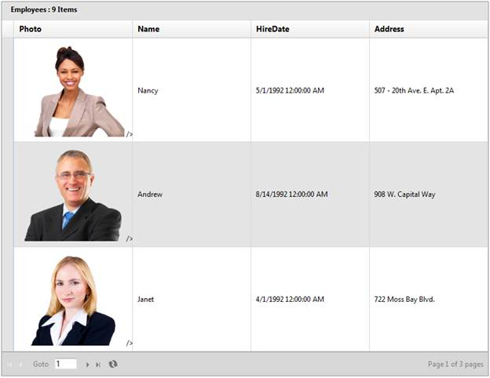

::: {style="DISPLAY: none"}
{#d2h_url_template}{#d2h_package_url style="WIDTH: 0px; DISPLAY: none; HEIGHT: 0px"}
:::

::: {.d2h_secondary_topic style="PADDING-BOTTOM: 10pt; MARGIN: 0pt; PADDING-LEFT: 0pt; PADDING-RIGHT: 0pt; PADDING-TOP: 0pt"}
#### JSON Mode {#json-mode style="tab-stops: 0pt"}

[]{style="LINE-HEIGHT: 115%; FONT-FAMILY: 'Times New Roman','serif'; FONT-SIZE: 12pt"} 

To add templates to the grid column using JSON Mode:

[]{style="FONT-FAMILY: 'Calibri','sans-serif'; FONT-SIZE: 11pt"} 

1.   Create a model in the application (Refer to [[[Getting Started\>Adding a Model to the Application]{style="COLOR: blue"}]{.underline}](http://help.syncfusion.com/ug_91/User%20Interface/ASP.NET%20MVC/Grid/Documents/addingamodeltotheapplication.htm)).

2.   Create a strongly typed view (Refer to [[[How to\>Strongly Typed View]{style="COLOR: blue"}]{.underline}](http://help.syncfusion.com/ug_91/User%20Interface/ASP.NET%20MVC/Grid/Documents/stronglytypedview.htm)).

3.   Create the Grid control in the view and configure its properties.

4.   Set the **JSON ActionMode** using the **ActionMode** method.

5.   To render the template for the particular column, set its **TemplateColumn** property to **True**.

 

+-------------------------------------------------------------------------------------------------------------------------------------------------------------------------------------------------------------------------------------------------------------------------------------+
| **[View \[ASPX\]]{style="FONT-FAMILY: 'Courier New'"}**[ ]{style="FONT-FAMILY: 'Courier New'"}                                                                                                                                                                                      |
|                                                                                                                                                                                                                                                                                     |
| [\<%]{style="FONT-FAMILY: 'Courier New'; BACKGROUND: yellow"}[=]{style="FONT-FAMILY: 'Courier New'; COLOR: blue"}[ Html.Grid\<[Employee]{style="COLOR: #2b91af"}\>([\"Grid1\"]{style="COLOR: #a31515"})]{style="FONT-FAMILY: 'Courier New'"}                                        |
|                                                                                                                                                                                                                                                                                     |
| [                         .ActionMode([ActionMode]{style="COLOR: #2b91af"}.JSON)]{style="FONT-FAMILY: 'Courier New'"}                                                                                                                                                               |
|                                                                                                                                                                                                                                                                                     |
| [                         .Caption([\"Employees\"]{style="COLOR: #a31515"})]{style="FONT-FAMILY: 'Courier New'"}                                                                                                                                                                    |
|                                                                                                                                                                                                                                                                                     |
| [                         .Column(column =\>]{style="FONT-FAMILY: 'Courier New'"}                                                                                                                                                                                                   |
|                                                                                                                                                                                                                                                                                     |
| [                         {]{style="FONT-FAMILY: 'Courier New'"}                                                                                                                                                                                                                    |
|                                                                                                                                                                                                                                                                                     |
| [                             **column.Add([\"Employee\"]{style="COLOR: #a31515"}).HeaderText([\"Photo\"]{style="COLOR: #a31515"}).TemplateColumn([true]{style="COLOR: blue"}).TemplateName([\"EmployeeTemplate\"]{style="COLOR: #a31515"});**]{style="FONT-FAMILY: 'Courier New'"} |
|                                                                                                                                                                                                                                                                                     |
| [                             column.Add(p =\> p.FirstName).HeaderText([\"Name\"]{style="COLOR: #a31515"});]{style="FONT-FAMILY: 'Courier New'"}                                                                                                                                    |
|                                                                                                                                                                                                                                                                                     |
| [                             column.Add(p =\> p.HireDate).HeaderText([\"HireDate\"]{style="COLOR: #a31515"});]{style="FONT-FAMILY: 'Courier New'"}                                                                                                                                 |
|                                                                                                                                                                                                                                                                                     |
| [                             column.Add(p =\> p.Address).HeaderText([\"Address\"]{style="COLOR: #a31515"});]{style="FONT-FAMILY: 'Courier New'"}                                                                                                                                   |
|                                                                                                                                                                                                                                                                                     |
| [                         })]{style="FONT-FAMILY: 'Courier New'"}                                                                                                                                                                                                                   |
|                                                                                                                                                                                                                                                                                     |
| [                        .EnablePaging()]{style="FONT-FAMILY: 'Courier New'"}                                                                                                                                                                                                       |
|                                                                                                                                                                                                                                                                                     |
| [.PageSettings(p=\>p.PageSize(3).PageCount(3).PagerStyle([PagerStyle]{style="COLOR: #2b91af"}.PrevNextAndManual))]{style="FONT-FAMILY: 'Courier New'"}                                                                                                                              |
|                                                                                                                                                                                                                                                                                     |
| [                        .EnableSorting()]{style="FONT-FAMILY: 'Courier New'"}                                                                                                                                                                                                      |
|                                                                                                                                                                                                                                                                                     |
| [                        .AutoFormat([Skins]{style="COLOR: #2b91af"}.Marble)]{style="FONT-FAMILY: 'Courier New'"}                                                                                                                                                                   |
|                                                                                                                                                                                                                                                                                     |
| [                                                  ]{style="FONT-FAMILY: 'Courier New'"}                                                                                                                                                                                            |
|                                                                                                                                                                                                                                                                                     |
| [    [%\>]{style="BACKGROUND: yellow"}]{style="FONT-FAMILY: 'Courier New'"}                                                                                                                                                                                                         |
+-------------------------------------------------------------------------------------------------------------------------------------------------------------------------------------------------------------------------------------------------------------------------------------+

[  ]{style="FONT-FAMILY: 'Times New Roman','serif'; FONT-SIZE: 12pt"}

+-------------------------------------------------------------------------------------------------------------------------------------------------------------------------------------------------------------------------------------------------------------------------------------+
| **[View \[cshtml\]]{style="FONT-FAMILY: 'Courier New'"}**[ ]{style="FONT-FAMILY: 'Courier New'"}                                                                                                                                                                                    |
|                                                                                                                                                                                                                                                                                     |
| [\@{]{style="FONT-FAMILY: 'Courier New'; BACKGROUND: yellow"}[ Html.Grid\<[Employee]{style="COLOR: #2b91af"}\>([\"Grid1\"]{style="COLOR: #a31515"})]{style="FONT-FAMILY: 'Courier New'"}                                                                                            |
|                                                                                                                                                                                                                                                                                     |
| [                         .ActionMode([ActionMode]{style="COLOR: #2b91af"}.JSON)]{style="FONT-FAMILY: 'Courier New'"}                                                                                                                                                               |
|                                                                                                                                                                                                                                                                                     |
| [                         .Caption([\"Employees\"]{style="COLOR: #a31515"})]{style="FONT-FAMILY: 'Courier New'"}                                                                                                                                                                    |
|                                                                                                                                                                                                                                                                                     |
| [                         .Column(column =\>]{style="FONT-FAMILY: 'Courier New'"}                                                                                                                                                                                                   |
|                                                                                                                                                                                                                                                                                     |
| [                         {]{style="FONT-FAMILY: 'Courier New'"}                                                                                                                                                                                                                    |
|                                                                                                                                                                                                                                                                                     |
| [                             **column.Add([\"Employee\"]{style="COLOR: #a31515"}).HeaderText([\"Photo\"]{style="COLOR: #a31515"}).TemplateColumn([true]{style="COLOR: blue"}).TemplateName([\"EmployeeTemplate\"]{style="COLOR: #a31515"});**]{style="FONT-FAMILY: 'Courier New'"} |
|                                                                                                                                                                                                                                                                                     |
| [                             column.Add(p =\> p.FirstName).HeaderText([\"Name\"]{style="COLOR: #a31515"});]{style="FONT-FAMILY: 'Courier New'"}                                                                                                                                    |
|                                                                                                                                                                                                                                                                                     |
| [                             column.Add(p =\> p.HireDate).HeaderText([\"HireDate\"]{style="COLOR: #a31515"});]{style="FONT-FAMILY: 'Courier New'"}                                                                                                                                 |
|                                                                                                                                                                                                                                                                                     |
| [                             column.Add(p =\> p.Address).HeaderText([\"Address\"]{style="COLOR: #a31515"});]{style="FONT-FAMILY: 'Courier New'"}                                                                                                                                   |
|                                                                                                                                                                                                                                                                                     |
| [                         })]{style="FONT-FAMILY: 'Courier New'"}                                                                                                                                                                                                                   |
|                                                                                                                                                                                                                                                                                     |
| [                        .EnablePaging()]{style="FONT-FAMILY: 'Courier New'"}                                                                                                                                                                                                       |
|                                                                                                                                                                                                                                                                                     |
| [.PageSettings(p=\>p.PageSize(3).PageCount(3).PagerStyle([PagerStyle]{style="COLOR: #2b91af"}.PrevNextAndManual))]{style="FONT-FAMILY: 'Courier New'"}                                                                                                                              |
|                                                                                                                                                                                                                                                                                     |
| [                        .EnableSorting()]{style="FONT-FAMILY: 'Courier New'"}                                                                                                                                                                                                      |
|                                                                                                                                                                                                                                                                                     |
| [                        .AutoFormat([Skins]{style="COLOR: #2b91af"}.Marble).Render();]{style="FONT-FAMILY: 'Courier New'"}                                                                                                                                                         |
|                                                                                                                                                                                                                                                                                     |
| [       ]{style="FONT-FAMILY: 'Courier New'"}                                                                                                                                                                                                                                       |
|                                                                                                                                                                                                                                                                                     |
| [   [}]{style="BACKGROUND: yellow"}]{style="FONT-FAMILY: 'Courier New'"}                                                                                                                                                                                                            |
|                                                                                                                                                                                                                                                                                     |
| **[]{style="FONT-FAMILY: 'Courier New'"}**                                                                                                                                                                                                                                          |
|                                                                                                                                                                                                                                                                                     |
| []{style="FONT-FAMILY: 'Courier New'"}                                                                                                                                                                                                                                              |
+-------------------------------------------------------------------------------------------------------------------------------------------------------------------------------------------------------------------------------------------------------------------------------------+

 

6.   Create the template for the "Employee" column.

 

+----------------------------------------------------------------------------------------------------------------------------------------------------------------------------------------------------------------------------------------------------------------------------------------------------------------------------------------------------------------------------------------------------------------------------------------------------------------------------------------------------------------------------------------------------------------------------------------------------------+
| **["EmployeeTemplate.ascx"]{style="FONT-FAMILY: 'Courier New'"}**                                                                                                                                                                                                                                                                                                                                                                                                                                                                                                                                        |
|                                                                                                                                                                                                                                                                                                                                                                                                                                                                                                                                                                                                          |
| [\<]{style="FONT-FAMILY: 'Courier New'; COLOR: blue"}[img]{style="FONT-FAMILY: 'Courier New'; COLOR: maroon"}[ [alt]{style="COLOR: red"}[=\"\${FirstName}\"]{style="COLOR: blue"} [src]{style="COLOR: red"}[=\"]{style="COLOR: blue"}[\<%]{style="BACKGROUND: yellow"}[=]{style="COLOR: blue"} Url.Content(\"\~/Content/Images/Employees/\${EmployeeID}.png\")[%\>]{style="BACKGROUND: yellow"}[\"]{style="COLOR: blue"} [style]{style="COLOR: red"}[=\"]{style="COLOR: blue"}[width]{style="COLOR: red"}[:175px\"]{style="COLOR: blue"} [/\>]{style="COLOR: blue"}]{style="FONT-FAMILY: 'Courier New'"} |
+----------------------------------------------------------------------------------------------------------------------------------------------------------------------------------------------------------------------------------------------------------------------------------------------------------------------------------------------------------------------------------------------------------------------------------------------------------------------------------------------------------------------------------------------------------------------------------------------------------+

 

 

+-----------------------------------------------------------------------------------------------------------------------------------------------------------------------------------------------------------------------------------------------------------------------------------------------------------------------------------------------------------------------------------------------------------------------------------------------------------------------------------------------------------------------------------------------------------------------------------------------------------------+
| **["EmployeeTemplate.cshtml"]{style="FONT-FAMILY: 'Courier New'"}**                                                                                                                                                                                                                                                                                                                                                                                                                                                                                                                                             |
|                                                                                                                                                                                                                                                                                                                                                                                                                                                                                                                                                                                                                 |
| [\<]{style="FONT-FAMILY: 'Courier New'; COLOR: blue"}[img]{style="FONT-FAMILY: 'Courier New'; COLOR: maroon"}[ [alt]{style="COLOR: red"}[=\"]{style="COLOR: blue"}[@]{style="BACKGROUND: yellow"}Model.FirstName[\"]{style="COLOR: blue"} [src]{style="COLOR: red"}[=\"]{style="COLOR: blue"}[@]{style="BACKGROUND: yellow"}Url.Content(\"/Content/Images/Employees/\" + Model.EmployeeID + \".png\")[\"]{style="COLOR: blue"} [style]{style="COLOR: red"}[=\"]{style="COLOR: blue"}[width]{style="COLOR: red"}[:175px\"]{style="COLOR: blue"} [/\>]{style="COLOR: blue"} ]{style="FONT-FAMILY: 'Courier New'"} |
+-----------------------------------------------------------------------------------------------------------------------------------------------------------------------------------------------------------------------------------------------------------------------------------------------------------------------------------------------------------------------------------------------------------------------------------------------------------------------------------------------------------------------------------------------------------------------------------------------------------------+

 

In JSON mode, model binding can be done by using the following syntax.

[]{style="FONT-FAMILY: 'Times New Roman','serif'; FONT-SIZE: 12pt"} 

+---------------------------------------------------------------------------------------------------------+
| **[]{style="FONT-FAMILY: 'Courier New'"}**                                                              |
|                                                                                                         |
| **[Syntax: ]{style="FONT-FAMILY: 'Courier New'"}**[\${ColumnName}]{style="FONT-FAMILY: 'Courier New'"}  |
|                                                                                                         |
| **[Example: ]{style="FONT-FAMILY: 'Courier New'"}**[\${EmployeeID}]{style="FONT-FAMILY: 'Courier New'"} |
+---------------------------------------------------------------------------------------------------------+

 

7.   Render the view.

[]{style="FONT-FAMILY: 'Times New Roman','serif'; FONT-SIZE: 12pt"} 

+-----------------------------------------------------------------------------------------------------------------------------+
| **[Controller]{style="FONT-FAMILY: 'Courier New'"}[]{style="FONT-FAMILY: 'Courier New'"}**                                  |
|                                                                                                                             |
| [         [public]{style="COLOR: blue"} [ActionResult]{style="COLOR: #2b91af"} Index()]{style="FONT-FAMILY: 'Courier New'"} |
|                                                                                                                             |
| [        {]{style="FONT-FAMILY: 'Courier New'"}                                                                             |
|                                                                                                                             |
| [            [return]{style="COLOR: blue"} View();]{style="FONT-FAMILY: 'Courier New'"}                                     |
|                                                                                                                             |
| [        }]{style="FONT-FAMILY: 'Courier New'"}                                                                             |
+-----------------------------------------------------------------------------------------------------------------------------+

 

8.   In order to render the data source for the grid, create a **Post** method for **Index** actions and bind the data source to the grid as given in the following code block.

 

+------------------------------------------------------------------------------------------------------------------------------------------------------------------------------------------------+
| **[Controller]{style="FONT-FAMILY: 'Courier New'"}**[]{style="FONT-FAMILY: 'Courier New'"}                                                                                                     |
|                                                                                                                                                                                                |
| [ [  ]{style="COLOR: gray"}     \[[AcceptVerbs]{style="COLOR: #2b91af"}([HttpVerbs]{style="COLOR: #2b91af"}.Post)\]]{style="FONT-FAMILY: 'Courier New'"}                                       |
|                                                                                                                                                                                                |
| [        [public]{style="COLOR: blue"} [ActionResult]{style="COLOR: #2b91af"} Index([PagingParams]{style="COLOR: #2b91af"} args)]{style="FONT-FAMILY: 'Courier New'"}                          |
|                                                                                                                                                                                                |
| [        {]{style="FONT-FAMILY: 'Courier New'"}                                                                                                                                                |
|                                                                                                                                                                                                |
| [            [IEnumerable]{style="COLOR: #2b91af"} data = [new]{style="COLOR: blue"} [NorthwindDataContext]{style="COLOR: #2b91af"}().Employess.ToList();]{style="FONT-FAMILY: 'Courier New'"} |
|                                                                                                                                                                                                |
| **[            [return]{style="COLOR: blue"} data.GridJSONActions\<[Employee]{style="COLOR: #2b91af"}\>();]{style="FONT-FAMILY: 'Courier New'"}**[]{style="FONT-FAMILY: 'Courier New'"}        |
|                                                                                                                                                                                                |
| [        }]{style="FONT-FAMILY: 'Courier New'"}                                                                                                                                                |
+------------------------------------------------------------------------------------------------------------------------------------------------------------------------------------------------+

 

9.   Run the application. The grid will appear as shown below.

 

{border="0"}

Figure 297: Grid with Column Template

[]{style="LINE-HEIGHT: 115%; FONT-FAMILY: 'Calibri','sans-serif'; FONT-SIZE: 11pt"} 

[]{#related-topics}
:::
