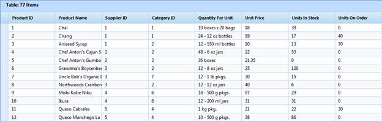

::: {style="DISPLAY: none"}
{#d2h_url_template}{#d2h_package_url style="WIDTH: 0px; DISPLAY: none; HEIGHT: 0px"}
:::

::: {.d2h_secondary_topic style="PADDING-BOTTOM: 10pt; MARGIN: 0pt; PADDING-LEFT: 0pt; PADDING-RIGHT: 0pt; PADDING-TOP: 0pt"}
#### JSON Mode {#json-mode style="tab-stops: 0pt"}

JSON (JavaScript Object Notation) is a lightweight data interchange format for serialization of structured data. It defines a small set of formatting rules for the portable representation of structured data. It is human readable, platform independent, and has a wide availability of implementations. You will use this JSON format to exchange data.

In JSON mode, the only possible operations are paging, sorting, grouping, and filtering. Operation in the JSON mode can be handled by you. The object **GridJsonArgs** (should be same variable) instance holds the essential information about the current request. ASP.NET client-side templates have the responsibility of generating HTML from JSON. This mode gives better performance than the server mode. The initial rendering is done in the server mode only.

 

{border="0"}

Figure 130: Flat Grid

 

[]{#related-topics}
:::
