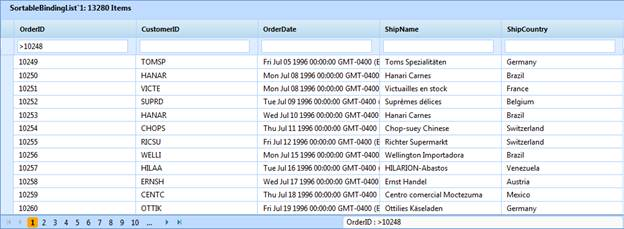

::: {style="DISPLAY: none"}
{#d2h_url_template}{#d2h_package_url style="WIDTH: 0px; DISPLAY: none; HEIGHT: 0px"}
:::

::::: {#nsbanner .d2h_main_nsbanner style="BORDER-BOTTOM: #999999 1px solid; POSITION: relative; PADDING-BOTTOM: 0px; BACKGROUND-COLOR: transparent; PADDING-LEFT: 0px; PADDING-RIGHT: 0px; DISPLAY: none; BORDER-TOP: #999999 1px solid; PADDING-TOP: 0px; LEFT: 0px"}
:::: {#TitleRow .d2h_main_titlerow style="PADDING-BOTTOM: 4px; BACKGROUND-COLOR: transparent; PADDING-LEFT: 22px; WIDTH: 100%; PADDING-RIGHT: 10px; DISPLAY: none; PADDING-TOP: 4px"}
::: {#ienav .d2h_main_ienav style="DISPLAY: none"}
{#D2HPrevious .D2HPreviousEnabled}  {#D2HNext .D2HNextEnabled}
:::
::::
:::::

:::: {#nstext .d2h_main_nstext style="PADDING-BOTTOM: 10px; BACKGROUND-COLOR: transparent; PADDING-LEFT: 22px; PADDING-RIGHT: 10px; HEIGHT: 100%; OVERFLOW: auto; PADDING-TOP: 5px" hasuserbackground="true" valign="bottom"}
::: {#d2h_breadcrumbs .d2h_breadcrumbs}
[Essential Studio User Guide Documentation](ms-xhelp:///?Id=12457748-09e3-4d74-a240-8e049cedf030){.d2h_breadcrumbsNormal}[ \> ]{.d2h_breadcrumbsLinkSeparator}[User Interface Edition](ms-xhelp:///?Id=c29296b7-531c-413b-a0ec-488ca1f7f669){.d2h_breadcrumbsNormal}[ \> ]{.d2h_breadcrumbsLinkSeparator}[Essential ASP.NET](ms-xhelp:///?Id=25c35330-c127-4dad-9a92-ed79dc7261a6){.d2h_breadcrumbsNormal}[ \> ]{.d2h_breadcrumbsLinkSeparator}[Essential Grid]{.d2h_breadcrumbsContentsOnly}[ \> ]{.d2h_breadcrumbsLinkSeparator}[Concepts and Features](ms-xhelp:///?Id=9e489974-524d-457c-9881-e458b1321685){.d2h_breadcrumbsNormal}[ \> ]{.d2h_breadcrumbsLinkSeparator}[AJAX](ms-xhelp:///?Id=bf52d324-77f7-410d-b75f-324b9b7bba76){.d2h_breadcrumbsNormal}
:::

### JSON Mode {#json-mode style="LINE-HEIGHT: 115%; TEXT-INDENT: -36pt; MARGIN: 10pt 0pt 0pt 36pt; tab-stops: 36.0pt"}

JSON mode uses ASP.NET AJAX 4.0 client templates for displaying the grid. The filtering operation in JSON mode should be handled by the user. To enable the JSON mode, set the **AjaxActionMode** property to **Json**. To enable the filtering functionality, set the **AllowFilter** property to **true**. Use the **ShowFilterBar** property to specify whether the filter bar is to be displayed in the grid or not. Use the **ShowFilterStatusMessage** property to specify whether the filter status message is to be displayed in the grid or not. The **AllowActiveFilteringMode** is used to specify whether filtered data will be rendered immediately or on pressing ENTER. Use the **FilterStatusBarWidth** property to define the width of the of filter status bar in the grid. We also need to specify the action for handling the filtering action, and this can be done using **JsonActionMapper**.\
 \
\
[]{style="FONT-FAMILY: Consolas; COLOR: red; FONT-SIZE: 9.5pt"}

+--------------------------------------------------------------------------------------------------------------------------------------------------------------------------------------------------------------------------------------------------------------------------------------------------------------------------------------------------------------------------------------------------------------------------------------------------------------------------------------------------------------------------------------------------------------------------------------------------------------------------------------------------------------------------------------------------------------------------------------------------------+
| **[\[ASPX\]]{style="FONT-FAMILY: 'Courier New'"}**[]{style="FONT-FAMILY: 'Courier New'"}                                                                                                                                                                                                                                                                                                                                                                                                                                                                                                                                                                                                                                                               |
|                                                                                                                                                                                                                                                                                                                                                                                                                                                                                                                                                                                                                                                                                                                                                        |
| [\<]{style="FONT-FAMILY: 'Courier New'; COLOR: blue"}[Syncfusion]{style="FONT-FAMILY: 'Courier New'; COLOR: maroon"}[:]{style="FONT-FAMILY: 'Courier New'; COLOR: blue"}[GridGroupingControl]{style="FONT-FAMILY: 'Courier New'; COLOR: maroon"}[ [ID]{style="COLOR: red"}[=\"GridGroupingControl1\"]{style="COLOR: blue"} [runat]{style="COLOR: red"}[=\"server\"]{style="COLOR: blue"} [AjaxAutoformat]{style="COLOR: red"}[=\"Midnight\" ]{style="COLOR: blue"}[EnableCallbacks]{style="COLOR: red"}[=\"false\"]{style="COLOR: blue"} [ShowGroupDropArea]{style="COLOR: red"}[=\"false\"]{style="COLOR: blue"}  [EnableAjaxMode]{style="COLOR: red"}[=\"true\"]{style="COLOR: blue"} [\>]{style="COLOR: blue"}]{style="FONT-FAMILY: 'Courier New'"} |
|                                                                                                                                                                                                                                                                                                                                                                                                                                                                                                                                                                                                                                                                                                                                                        |
| [\<]{style="FONT-FAMILY: 'Courier New'; COLOR: blue"}[TableDescriptor]{style="FONT-FAMILY: 'Courier New'; COLOR: maroon"}[  [AllowFilter]{style="COLOR: red"}[=\"true\"]{style="COLOR: blue"}  [\>\</]{style="COLOR: blue"}[TableDescriptor]{style="COLOR: maroon"}[\>]{style="COLOR: blue"}]{style="FONT-FAMILY: 'Courier New'"}                                                                                                                                                                                                                                                                                                                                                                                                                      |
|                                                                                                                                                                                                                                                                                                                                                                                                                                                                                                                                                                                                                                                                                                                                                        |
| [\<]{style="FONT-FAMILY: 'Courier New'; COLOR: blue"}[TopLevelGroupOptions]{style="FONT-FAMILY: 'Courier New'; COLOR: maroon"}[  [AllowActiveFilteringMode]{style="COLOR: red"}[=\"true\"]{style="COLOR: blue"} [ShowFilterBar]{style="COLOR: red"}[=\"true\"]{style="COLOR: blue"} [FilterStatusBarWidth]{style="COLOR: red"}[=\"550\"]{style="COLOR: blue"} [ShowFilterStatusMessage]{style="COLOR: red"}[=\"true\"]{style="COLOR: blue"} [/\>]{style="COLOR: blue"}]{style="FONT-FAMILY: 'Courier New'"}                                                                                                                                                                                                                                            |
|                                                                                                                                                                                                                                                                                                                                                                                                                                                                                                                                                                                                                                                                                                                                                        |
| [\</]{style="FONT-FAMILY: 'Courier New'; COLOR: blue"}[Syncfusion]{style="FONT-FAMILY: 'Courier New'; COLOR: maroon"}[:]{style="FONT-FAMILY: 'Courier New'; COLOR: blue"}[GridGroupingControl]{style="FONT-FAMILY: 'Courier New'; COLOR: maroon"}[\>]{style="FONT-FAMILY: 'Courier New'; COLOR: blue"}                                                                                                                                                                                                                                                                                                                                                                                                                                                 |
|                                                                                                                                                                                                                                                                                                                                                                                                                                                                                                                                                                                                                                                                                                                                                        |
| []{style="FONT-FAMILY: 'Courier New'"}                                                                                                                                                                                                                                                                                                                                                                                                                                                                                                                                                                                                                                                                                                                 |
+--------------------------------------------------------------------------------------------------------------------------------------------------------------------------------------------------------------------------------------------------------------------------------------------------------------------------------------------------------------------------------------------------------------------------------------------------------------------------------------------------------------------------------------------------------------------------------------------------------------------------------------------------------------------------------------------------------------------------------------------------------+

[]{style="FONT-FAMILY: 'Courier New'; COLOR: black"} 

+---------------------------------------------------------------------------------------------------------------------------------------------------------------------------------------------------------------------------------------------------------------------------------------------------------------------------------------+
| **[\[C#\]]{style="FONT-FAMILY: 'Courier New'"}**[]{style="FONT-FAMILY: 'Courier New'"}                                                                                                                                                                                                                                                |
|                                                                                                                                                                                                                                                                                                                                       |
| [this]{style="FONT-FAMILY: 'Courier New'; COLOR: blue"}[.GridGroupingControl1.TableDescriptor.AllowFilter = [true]{style="COLOR: blue"};]{style="FONT-FAMILY: 'Courier New'"}                                                                                                                                                         |
|                                                                                                                                                                                                                                                                                                                                       |
| [this]{style="FONT-FAMILY: 'Courier New'; COLOR: blue"}[.GridGroupingControl1.TopLevelGroupOptions.ShowFilterBar = [true]{style="COLOR: blue"};]{style="FONT-FAMILY: 'Courier New'"}                                                                                                                                                  |
|                                                                                                                                                                                                                                                                                                                                       |
| [this]{style="FONT-FAMILY: 'Courier New'; COLOR: blue"}[.GridGroupingControl1.TopLevelGroupOptions.ShowFilterStatusMessage = [true]{style="COLOR: blue"};]{style="FONT-FAMILY: 'Courier New'"}                                                                                                                                        |
|                                                                                                                                                                                                                                                                                                                                       |
| [this]{style="FONT-FAMILY: 'Courier New'; COLOR: blue"}[.GridGroupingControl1.TopLevelGroupOptions.FilterStatusBarWidth = 550;]{style="FONT-FAMILY: 'Courier New'"}                                                                                                                                                                   |
|                                                                                                                                                                                                                                                                                                                                       |
| [this]{style="FONT-FAMILY: 'Courier New'; COLOR: blue"}[.GridGroupingControl1.TopLevelGroupOptions.AllowActiveFilteringMode = [true]{style="COLOR: blue"};]{style="FONT-FAMILY: 'Courier New'"}                                                                                                                                       |
|                                                                                                                                                                                                                                                                                                                                       |
| [ [//Json Action]{style="COLOR: green"}]{style="FONT-FAMILY: 'Courier New'"}                                                                                                                                                                                                                                                          |
|                                                                                                                                                                                                                                                                                                                                       |
| [\[[WebMethod]{style="COLOR: #2b91af"}()\]]{style="FONT-FAMILY: 'Courier New'"}                                                                                                                                                                                                                                                       |
|                                                                                                                                                                                                                                                                                                                                       |
| [public]{style="FONT-FAMILY: 'Courier New'; COLOR: blue"}[ [static]{style="COLOR: blue"} [IEnumerable]{style="COLOR: #2b91af"} Sort([object]{style="COLOR: blue"} GridJsonArgs)]{style="FONT-FAMILY: 'Courier New'"}                                                                                                                  |
|                                                                                                                                                                                                                                                                                                                                       |
| [{        [//To allow ASP.NET to use SQL Compact Server 3.5]{style="COLOR: green"}]{style="FONT-FAMILY: 'Courier New'"}                                                                                                                                                                                                               |
|                                                                                                                                                                                                                                                                                                                                       |
| [AppDomain]{style="FONT-FAMILY: 'Courier New'; COLOR: #2b91af"}[.CurrentDomain.SetData([\"SQLServerCompactEditionUnderWebHosting\"]{style="COLOR: #a31515"}, [true]{style="COLOR: blue"});]{style="FONT-FAMILY: 'Courier New'"}                                                                                                       |
|                                                                                                                                                                                                                                                                                                                                       |
| [string]{style="FONT-FAMILY: 'Courier New'; COLOR: blue"}[ ConnectionString = [@\"Data Source=\|DataDirectory\|\\Northwind.sdf\"]{style="COLOR: #a31515"};]{style="FONT-FAMILY: 'Courier New'"}                                                                                                                                       |
|                                                                                                                                                                                                                                                                                                                                       |
| [Northwind]{style="FONT-FAMILY: 'Courier New'; COLOR: #2b91af"}[ NorthwindDB = [new]{style="COLOR: blue"} [Northwind]{style="COLOR: #2b91af"}(ConnectionString);]{style="FONT-FAMILY: 'Courier New'"}                                                                                                                                 |
|                                                                                                                                                                                                                                                                                                                                       |
| [var]{style="FONT-FAMILY: 'Courier New'; COLOR: blue"}[ ProductsData = [from]{style="COLOR: blue"} p [in]{style="COLOR: blue"} NorthwindDB.Products]{style="FONT-FAMILY: 'Courier New'"}                                                                                                                                              |
|                                                                                                                                                                                                                                                                                                                                       |
| [select]{style="FONT-FAMILY: 'Courier New'; COLOR: blue"}[ [new]{style="COLOR: blue"}]{style="FONT-FAMILY: 'Courier New'"}                                                                                                                                                                                                            |
|                                                                                                                                                                                                                                                                                                                                       |
| [{]{style="FONT-FAMILY: 'Courier New'"}                                                                                                                                                                                                                                                                                               |
|                                                                                                                                                                                                                                                                                                                                       |
| [ProductID = p.ProductID,]{style="FONT-FAMILY: 'Courier New'"}                                                                                                                                                                                                                                                                        |
|                                                                                                                                                                                                                                                                                                                                       |
| [ProductName = p.ProductName,]{style="FONT-FAMILY: 'Courier New'"}                                                                                                                                                                                                                                                                    |
|                                                                                                                                                                                                                                                                                                                                       |
| [QuantityPerUnit = p.QuantityPerUnit,]{style="FONT-FAMILY: 'Courier New'"}                                                                                                                                                                                                                                                            |
|                                                                                                                                                                                                                                                                                                                                       |
| [UnitPrice = p.UnitPrice,]{style="FONT-FAMILY: 'Courier New'"}                                                                                                                                                                                                                                                                        |
|                                                                                                                                                                                                                                                                                                                                       |
| [UnitsInStock = p.UnitsInStock,]{style="FONT-FAMILY: 'Courier New'"}                                                                                                                                                                                                                                                                  |
|                                                                                                                                                                                                                                                                                                                                       |
| [};]{style="FONT-FAMILY: 'Courier New'"}                                                                                                                                                                                                                                                                                              |
|                                                                                                                                                                                                                                                                                                                                       |
| [GridJSONAction]{style="FONT-FAMILY: 'Courier New'; COLOR: #2b91af"}[ obj = [new]{style="COLOR: blue"} [GridJSONAction]{style="COLOR: #2b91af"}();]{style="FONT-FAMILY: 'Courier New'"}                                                                                                                                               |
|                                                                                                                                                                                                                                                                                                                                       |
| [IEnumerable]{style="FONT-FAMILY: 'Courier New'; COLOR: #2b91af"}[ data = obj.GridActionResult(GridJsonArgs, ProductsData);]{style="FONT-FAMILY: 'Courier New'"}                                                                                                                                                                      |
|                                                                                                                                                                                                                                                                                                                                       |
| [return]{style="FONT-FAMILY: 'Courier New'; COLOR: blue"}[ data;]{style="FONT-FAMILY: 'Courier New'"}                                                                                                                                                                                                                                 |
|                                                                                                                                                                                                                                                                                                                                       |
| [}]{style="FONT-FAMILY: 'Courier New'"}                                                                                                                                                                                                                                                                                               |
+---------------------------------------------------------------------------------------------------------------------------------------------------------------------------------------------------------------------------------------------------------------------------------------------------------------------------------------+
| **[]{style="FONT-FAMILY: 'Courier New'"}**                                                                                                                                                                                                                                                                                            |
|                                                                                                                                                                                                                                                                                                                                       |
| **[\[VB\]]{style="FONT-FAMILY: 'Courier New'"}**[]{style="FONT-FAMILY: 'Courier New'"}                                                                                                                                                                                                                                                |
|                                                                                                                                                                                                                                                                                                                                       |
| [Me]{style="FONT-FAMILY: 'Courier New'; COLOR: blue"}[.GridGroupingControl1.TableDescriptor.AllowFilter = [True]{style="COLOR: blue"}]{style="FONT-FAMILY: 'Courier New'"}                                                                                                                                                            |
|                                                                                                                                                                                                                                                                                                                                       |
| [Me]{style="FONT-FAMILY: 'Courier New'; COLOR: blue"}[.GridGroupingControl1.TopLevelGroupOptions.ShowFilterBar = [True]{style="COLOR: blue"}]{style="FONT-FAMILY: 'Courier New'"}                                                                                                                                                     |
|                                                                                                                                                                                                                                                                                                                                       |
| [Me]{style="FONT-FAMILY: 'Courier New'; COLOR: blue"}[.GridGroupingControl1.TopLevelGroupOptions.ShowFilterStatusMessage = [True]{style="COLOR: blue"}]{style="FONT-FAMILY: 'Courier New'"}                                                                                                                                           |
|                                                                                                                                                                                                                                                                                                                                       |
| [Me]{style="FONT-FAMILY: 'Courier New'; COLOR: blue"}[.GridGroupingControl1.TopLevelGroupOptions.FilterStatusBarWidth = 550]{style="FONT-FAMILY: 'Courier New'"}                                                                                                                                                                      |
|                                                                                                                                                                                                                                                                                                                                       |
| [Me]{style="FONT-FAMILY: 'Courier New'; COLOR: blue"}[.GridGroupingControl1.TopLevelGroupOptions.AllowActiveFilteringMode = [True]{style="COLOR: blue"}]{style="FONT-FAMILY: 'Courier New'"}                                                                                                                                          |
|                                                                                                                                                                                                                                                                                                                                       |
| [//Json Action]{style="FONT-FAMILY: 'Courier New'; COLOR: green"}                                                                                                                                                                                                                                                                     |
|                                                                                                                                                                                                                                                                                                                                       |
| [\<[WebMethod]{style="COLOR: #2b91af"}()\> \_]{style="FONT-FAMILY: 'Courier New'"}                                                                                                                                                                                                                                                    |
|                                                                                                                                                                                                                                                                                                                                       |
| [Public]{style="FONT-FAMILY: 'Courier New'; COLOR: blue"}[ [Shared]{style="COLOR: blue"} [Function]{style="COLOR: blue"} Sort([ByVal]{style="COLOR: blue"} GridJsonArgs [As]{style="COLOR: blue"} [Object]{style="COLOR: blue"}) [As]{style="COLOR: blue"} [IEnumerable]{style="COLOR: #2b91af"}]{style="FONT-FAMILY: 'Courier New'"} |
|                                                                                                                                                                                                                                                                                                                                       |
| [\'To allow ASP.NET to use SQL Compact Server 3.5]{style="FONT-FAMILY: 'Courier New'; COLOR: green"}[]{style="FONT-FAMILY: 'Courier New'"}                                                                                                                                                                                            |
|                                                                                                                                                                                                                                                                                                                                       |
| [AppDomain]{style="FONT-FAMILY: 'Courier New'; COLOR: #2b91af"}[.CurrentDomain.SetData([\"SQLServerCompactEditionUnderWebHosting\"]{style="COLOR: #a31515"}, [True]{style="COLOR: blue"})]{style="FONT-FAMILY: 'Courier New'"}                                                                                                        |
|                                                                                                                                                                                                                                                                                                                                       |
| [Dim]{style="FONT-FAMILY: 'Courier New'; COLOR: blue"}[ ConnectionString [As]{style="COLOR: blue"} [String]{style="COLOR: blue"} = [\"Data Source=\|DataDirectory\|\\Northwind.sdf\"]{style="COLOR: #a31515"}]{style="FONT-FAMILY: 'Courier New'"}                                                                                    |
|                                                                                                                                                                                                                                                                                                                                       |
| [Dim]{style="FONT-FAMILY: 'Courier New'; COLOR: blue"}[ NorthwindDB [As]{style="COLOR: blue"} [New]{style="COLOR: blue"} [Northwind]{style="COLOR: #2b91af"}(ConnectionString)]{style="FONT-FAMILY: 'Courier New'"}                                                                                                                   |
|                                                                                                                                                                                                                                                                                                                                       |
| [Dim]{style="FONT-FAMILY: 'Courier New'; COLOR: blue"}[ ProductsData = [From]{style="COLOR: blue"} prod [In]{style="COLOR: blue"} NorthwindDB.Products]{style="FONT-FAMILY: 'Courier New'"}                                                                                                                                           |
|                                                                                                                                                                                                                                                                                                                                       |
| [Select]{style="FONT-FAMILY: 'Courier New'; COLOR: blue"}[ prod.ProductID, prod.ProductName, prod.QuantityPerUnit, prod.UnitPrice, prod.UnitsInStock]{style="FONT-FAMILY: 'Courier New'"}                                                                                                                                             |
|                                                                                                                                                                                                                                                                                                                                       |
| [Dim]{style="FONT-FAMILY: 'Courier New'; COLOR: blue"}[ obj [As]{style="COLOR: blue"} [New]{style="COLOR: blue"} [GridJSONAction]{style="COLOR: #2b91af"}()]{style="FONT-FAMILY: 'Courier New'"}                                                                                                                                      |
|                                                                                                                                                                                                                                                                                                                                       |
| [Dim]{style="FONT-FAMILY: 'Courier New'; COLOR: blue"}[ data [As]{style="COLOR: blue"} [IEnumerable]{style="COLOR: #2b91af"} = obj.GridActionResult(GridJsonArgs, ProductsData)]{style="FONT-FAMILY: 'Courier New'"}                                                                                                                  |
|                                                                                                                                                                                                                                                                                                                                       |
| [Return]{style="FONT-FAMILY: 'Courier New'; COLOR: blue"}[ data]{style="FONT-FAMILY: 'Courier New'"}                                                                                                                                                                                                                                  |
|                                                                                                                                                                                                                                                                                                                                       |
| [End]{style="FONT-FAMILY: 'Courier New'; COLOR: blue"}[ [Function]{style="COLOR: blue"}]{style="FONT-FAMILY: 'Courier New'"}                                                                                                                                                                                                          |
+---------------------------------------------------------------------------------------------------------------------------------------------------------------------------------------------------------------------------------------------------------------------------------------------------------------------------------------+

**[]{style="COLOR: #e36c0a"}** 

The following figure is obtained using the code snippet above.

{border="0"}

Figure 138: Filtering

More:

[ ]{#related-topics}

[{border="0" align="absMiddle"}Events](ms-xhelp:///?Id=dcf2838f-89d6-45c0-947f-7029151179f8){style="TEXT-DECORATION: none"}
::::
