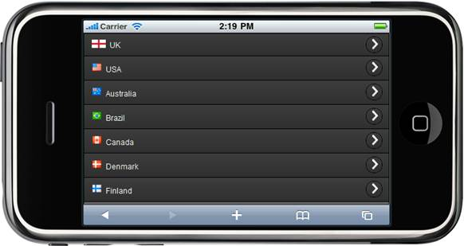

::: {style="DISPLAY: none"}
{#d2h_url_template} {#d2h_package_url style="WIDTH: 0px; DISPLAY: none; HEIGHT: 0px"}
:::

::: {.d2h_secondary_topic style="PADDING-BOTTOM: 10pt; MARGIN: 0pt; PADDING-LEFT: 0pt; PADDING-RIGHT: 0pt; PADDING-TOP: 0pt"}
##### JSON Mode {#json-mode style="tab-stops: 0pt"}

The following steps explain how you can bind the data source to the listbox control in the JSON mode:

1.   In **View**, invoke the Listbox Helper with the control ID as the first argument and use the Items() for column mapping.[]{style="FONT-FAMILY: 'Calibri','sans-serif'"}

[]{style="FONT-FAMILY: 'Calibri','sans-serif'"} 

+--------------------------------------------------------------------------------------------------------------------------------------------------------------------------------+
| [\[ASPX\]    ]{style="FONT-FAMILY: 'Courier New'"}                                                                                                                             |
|                                                                                                                                                                                |
| [\<%]{style="FONT-FAMILY: 'Courier New'; BACKGROUND: yellow"} [ Html.MobSyncfusion().ListBox([\"lbDatabinding\"]{style="COLOR: #a31515"})]{style="FONT-FAMILY: 'Courier New'"} |
|                                                                                                                                                                                |
| **[              .ActionMode([ActionMode]{style="COLOR: #2b91af"}.Json)]{style="FONT-FAMILY: 'Courier New'"}**                                                                 |
|                                                                                                                                                                                |
| [              .Items(item =\>]{style="FONT-FAMILY: 'Courier New'"}                                                                                                            |
|                                                                                                                                                                                |
| [              {]{style="FONT-FAMILY: 'Courier New'"}                                                                                                                          |
|                                                                                                                                                                                |
| [                  **item.Add()**]{style="FONT-FAMILY: 'Courier New'"}                                                                                                         |
|                                                                                                                                                                                |
| **[                      .Text([\"\${Text}\"]{style="COLOR: #a31515"}).ImageUrl([\"\${ImageUrl}\"]{style="COLOR: #a31515"})]{style="FONT-FAMILY: 'Courier New'"}**             |
|                                                                                                                                                                                |
| **[                      .Children([\"Children\"]{style="COLOR: #a31515"}, ch =\>]{style="FONT-FAMILY: 'Courier New'"}**                                                       |
|                                                                                                                                                                                |
| **[                      {]{style="FONT-FAMILY: 'Courier New'"}**                                                                                                              |
|                                                                                                                                                                                |
| **[                          ch.Add().Text([\"\${Text}\"]{style="COLOR: #a31515"})]{style="FONT-FAMILY: 'Courier New'"}**                                                      |
|                                                                                                                                                                                |
| **[                              .Children([\"Street\"]{style="COLOR: #a31515"}, ch1 =\>]{style="FONT-FAMILY: 'Courier New'"}**                                                |
|                                                                                                                                                                                |
| **[                                {]{style="FONT-FAMILY: 'Courier New'"}**                                                                                                    |
|                                                                                                                                                                                |
| **[                                    ch1.Add().Text([\"\${Text}\"]{style="COLOR: #a31515"});]{style="FONT-FAMILY: 'Courier New'"}**                                          |
|                                                                                                                                                                                |
| **[                                 });]{style="FONT-FAMILY: 'Courier New'"}**                                                                                                 |
|                                                                                                                                                                                |
| **[                       });]{style="FONT-FAMILY: 'Courier New'"}**                                                                                                           |
|                                                                                                                                                                                |
| [               })]{style="FONT-FAMILY: 'Courier New'"}                                                                                                                        |
|                                                                                                                                                                                |
| [               .Render();]{style="FONT-FAMILY: 'Courier New'"}                                                                                                                |
|                                                                                                                                                                                |
| [    [%\>]{style="BACKGROUND: yellow"}]{style="FONT-FAMILY: 'Courier New'"}                                                                                                    |
|                                                                                                                                                                                |
| []{style="FONT-FAMILY: 'Courier New'"}                                                                                                                                         |
|                                                                                                                                                                                |
| []{style="FONT-FAMILY: 'Courier New'"}                                                                                                                                         |
+--------------------------------------------------------------------------------------------------------------------------------------------------------------------------------+

 

+---------------------------------------------------------------------------------------------------------------------------------------------------------------------------------------------------------------------------+
| **[\[Razor\]]{style="FONT-FAMILY: 'Courier New'"}**                                                                                                                                                                       |
|                                                                                                                                                                                                                           |
| **[]{style="FONT-FAMILY: 'Courier New'"}**                                                                                                                                                                                |
|                                                                                                                                                                                                                           |
| [    ]{style="FONT-FAMILY: 'Courier New'"} [\@{]{style="FONT-FAMILY: 'Courier New'; BACKGROUND: yellow"} [ Html.MobSyncfusion().ListBox([\"lbDatabinding\"]{style="COLOR: #a31515"})]{style="FONT-FAMILY: 'Courier New'"} |
|                                                                                                                                                                                                                           |
| **[              .ActionMode([ActionMode]{style="COLOR: #2b91af"}.Json)]{style="FONT-FAMILY: 'Courier New'"}**                                                                                                            |
|                                                                                                                                                                                                                           |
| [              .Items(item =\>]{style="FONT-FAMILY: 'Courier New'"}                                                                                                                                                       |
|                                                                                                                                                                                                                           |
| [              {]{style="FONT-FAMILY: 'Courier New'"}                                                                                                                                                                     |
|                                                                                                                                                                                                                           |
| [                  **item.Add()**]{style="FONT-FAMILY: 'Courier New'"}                                                                                                                                                    |
|                                                                                                                                                                                                                           |
| **[                      .Text([\"\${Text}\"]{style="COLOR: #a31515"}).ImageUrl([\"\${ImageUrl}\"]{style="COLOR: #a31515"})]{style="FONT-FAMILY: 'Courier New'"}**                                                        |
|                                                                                                                                                                                                                           |
| **[                      .Children([\"Children\"]{style="COLOR: #a31515"}, ch =\>]{style="FONT-FAMILY: 'Courier New'"}**                                                                                                  |
|                                                                                                                                                                                                                           |
| **[                      {]{style="FONT-FAMILY: 'Courier New'"}**                                                                                                                                                         |
|                                                                                                                                                                                                                           |
| **[                          ch.Add().Text([\"\${Text}\"]{style="COLOR: #a31515"})]{style="FONT-FAMILY: 'Courier New'"}**                                                                                                 |
|                                                                                                                                                                                                                           |
| **[                              .Children([\"Street\"]{style="COLOR: #a31515"}, ch1 =\>]{style="FONT-FAMILY: 'Courier New'"}**                                                                                           |
|                                                                                                                                                                                                                           |
| **[                                {]{style="FONT-FAMILY: 'Courier New'"}**                                                                                                                                               |
|                                                                                                                                                                                                                           |
| **[                                    ch1.Add().Text([\"\${Text}\"]{style="COLOR: #a31515"});]{style="FONT-FAMILY: 'Courier New'"}**                                                                                     |
|                                                                                                                                                                                                                           |
| **[                                 });]{style="FONT-FAMILY: 'Courier New'"}**                                                                                                                                            |
|                                                                                                                                                                                                                           |
| **[                       });]{style="FONT-FAMILY: 'Courier New'"}**                                                                                                                                                      |
|                                                                                                                                                                                                                           |
| [               })]{style="FONT-FAMILY: 'Courier New'"}                                                                                                                                                                   |
|                                                                                                                                                                                                                           |
| [               .Render();]{style="FONT-FAMILY: 'Courier New'"}                                                                                                                                                           |
|                                                                                                                                                                                                                           |
| [}]{style="FONT-FAMILY: 'Courier New'; BACKGROUND: yellow"}                                                                                                                                                               |
|                                                                                                                                                                                                                           |
| []{style="FONT-FAMILY: 'Courier New'"}                                                                                                                                                                                    |
+---------------------------------------------------------------------------------------------------------------------------------------------------------------------------------------------------------------------------+

 

2.   [In the post action, pass the data source to the listbox control.]{style="FONT-FAMILY: 'Calibri','sans-serif'"}

 

[]{style="FONT-FAMILY: 'Calibri','sans-serif'"} 

+--------------------------------------------------------------------------------------------------------------------------------------------------------------------------------+
| [    ]{style="FONT-FAMILY: 'Courier New'"} []{style="FONT-FAMILY: 'Courier New'"}                                                                                              |
|                                                                                                                                                                                |
| **[\[Controller\]]{style="FONT-FAMILY: 'Courier New'"}**                                                                                                                       |
|                                                                                                                                                                                |
| **[]{style="FONT-FAMILY: 'Courier New'"}**                                                                                                                                     |
|                                                                                                                                                                                |
| [\[[AcceptVerbs]{style="COLOR: #2b91af"}([HttpVerbs]{style="COLOR: #2b91af"}.Post)\]]{style="FONT-FAMILY: 'Courier New'"}                                                      |
|                                                                                                                                                                                |
| [        [public]{style="COLOR: blue"}[ActionResult]{style="COLOR: #2b91af"} LBDatabinding([ListBoxParams]{style="COLOR: #2b91af"} param)]{style="FONT-FAMILY: 'Courier New'"} |
|                                                                                                                                                                                |
| [        {]{style="FONT-FAMILY: 'Courier New'"}                                                                                                                                |
|                                                                                                                                                                                |
| [            [IEnumerable]{style="COLOR: #2b91af"} data = [this]{style="COLOR: blue"}.RenderDataSource().ToList();]{style="FONT-FAMILY: 'Courier New'"}                        |
|                                                                                                                                                                                |
| [            param.CollectionSize = 20;]{style="FONT-FAMILY: 'Courier New'"}                                                                                                   |
|                                                                                                                                                                                |
| [            [return]{style="COLOR: blue"} data.ListBoxJsonAction\<[Countries]{style="COLOR: #2b91af"}\>(param);]{style="FONT-FAMILY: 'Courier New'"}                          |
|                                                                                                                                                                                |
| [        }]{style="FONT-FAMILY: 'Courier New'"}                                                                                                                                |
|                                                                                                                                                                                |
| []{style="FONT-FAMILY: 'Courier New'; BACKGROUND: yellow"}                                                                                                                     |
|                                                                                                                                                                                |
| []{style="FONT-FAMILY: 'Courier New'"}                                                                                                                                         |
+--------------------------------------------------------------------------------------------------------------------------------------------------------------------------------+

**[]{style="FONT-FAMILY: 'Calibri','sans-serif'"}**  

3.   Build and run the application.

 

 

[ {border="0"} ]{style="LINE-HEIGHT: 115%; FONT-FAMILY: 'Calibri','sans-serif'; FONT-SIZE: 11pt"}

Figure 66: Listbox - Jsonbinding[]{style="FONT-FAMILY: 'Calibri','sans-serif'; FONT-SIZE: 11pt"}

[]{style="LINE-HEIGHT: 115%; FONT-FAMILY: 'Calibri','sans-serif'; FONT-SIZE: 11pt"} 

 

[]{#related-topics}
:::
