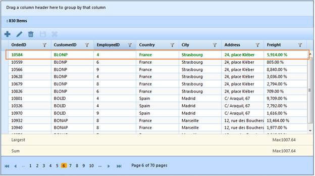

::: {style="DISPLAY: none"}
{#d2h_url_template}{#d2h_package_url style="WIDTH: 0px; DISPLAY: none; HEIGHT: 0px"}
:::

:::::::::: {.d2h_secondary_topic style="PADDING-BOTTOM: 10pt; MARGIN: 0pt; PADDING-LEFT: 0pt; PADDING-RIGHT: 0pt; PADDING-TOP: 0pt"}
##### JSON Mode {#json-mode style="tab-stops: 0pt"}

 

###### 5.9.2.2.2.1 Through GridBuilder {#through-gridbuilder style="tab-stops: 0pt"}

 

1.   Create a model in the application (Refer to [[Getting Started\>Adding a Model to the Application]{style="COLOR: blue"}]{.underline}).

2.   Create a strongly typed view (Refer to [[How to\>Strongly Typed View]{style="COLOR: blue"}]{.underline}).

3.   Create the Grid control in the view and configure its properties.

4.   Set the JSON action mode using the **ActionMode** method.

5.   Set the **RowDataBound** handler name using the **RowDataBound** method.

[]{style="FONT-FAMILY: 'Myriad Pro','sans-serif'"} 

::: {align="center"}
+-----------------------------------------------------------------------------------------------------------------------------------------------------------------------------------------------------------------------------------------------------+
| **[View \[ASPX\]]{style="FONT-FAMILY: 'Courier New'"}**                                                                                                                                                                                             |
|                                                                                                                                                                                                                                                     |
| **[]{style="FONT-FAMILY: 'Courier New'"}**                                                                                                                                                                                                          |
|                                                                                                                                                                                                                                                     |
| [ ]{style="FONT-FAMILY: Consolas"}[\<%]{style="FONT-FAMILY: 'Courier New'; BACKGROUND: yellow"}[=]{style="FONT-FAMILY: 'Courier New'; COLOR: blue"}[Html.Syncfusion().Grid\<[Order]{style="COLOR: #2b91af"}\>([\"Grid1\"]{style="COLOR: #a31515"})\ |
|        .Caption([\"Orders\"]{style="COLOR: #a31515"})\                                                                                                                                                                                              |
|        .AutoFormat([Skins]{style="COLOR: #2b91af"}.Sandune)]{style="FONT-FAMILY: 'Courier New'"}                                                                                                                                                    |
|                                                                                                                                                                                                                                                     |
| **[       .ActionMode(ActionMode.JSON)]{style="FONT-FAMILY: 'Courier New'"}**                                                                                                                                                                       |
|                                                                                                                                                                                                                                                     |
| [       **.ClientSideEvents(events =\> {**]{style="FONT-FAMILY: 'Courier New'"}                                                                                                                                                                     |
|                                                                                                                                                                                                                                                     |
| **[               events.RowDataBound([\"RowDataBoundHandler\"]{style="COLOR: #a31515"});]{style="FONT-FAMILY: 'Courier New'"}**                                                                                                                    |
|                                                                                                                                                                                                                                                     |
| **[       })]{style="FONT-FAMILY: 'Courier New'"}**                                                                                                                                                                                                 |
|                                                                                                                                                                                                                                                     |
| [\                                                                                                                                                                                                                                                  |
|        [%\>]{style="BACKGROUND: yellow"}]{style="FONT-FAMILY: 'Courier New'"}                                                                                                                                                                       |
|                                                                                                                                                                                                                                                     |
| [   ]{style="FONT-FAMILY: 'Courier New'"}                                                                                                                                                                                                           |
+-----------------------------------------------------------------------------------------------------------------------------------------------------------------------------------------------------------------------------------------------------+
:::

[]{style="FONT-FAMILY: 'Myriad Pro','sans-serif'"} 

::: {align="center"}
+-----------------------------------------------------------------------------------------------------------------------------------------------------------------------------------------------------------------------------------------------------+
| **[View \[cshtml\]]{style="FONT-FAMILY: 'Courier New'"}**                                                                                                                                                                                           |
|                                                                                                                                                                                                                                                     |
| **[]{style="FONT-FAMILY: 'Courier New'"}**                                                                                                                                                                                                          |
|                                                                                                                                                                                                                                                     |
| [ ]{style="FONT-FAMILY: Consolas"}[\@{]{style="FONT-FAMILY: 'Courier New'; BACKGROUND: yellow"}[ ]{style="FONT-FAMILY: 'Courier New'; COLOR: blue"}[Html.Syncfusion().Grid\<[Order]{style="COLOR: #2b91af"}\>([\"Grid1\"]{style="COLOR: #a31515"})\ |
|        .Caption([\"Orders\"]{style="COLOR: #a31515"})\                                                                                                                                                                                              |
|        .AutoFormat([Skins]{style="COLOR: #2b91af"}.Sandune)]{style="FONT-FAMILY: 'Courier New'"}                                                                                                                                                    |
|                                                                                                                                                                                                                                                     |
| **[       .ActionMode(ActionMode.JSON)]{style="FONT-FAMILY: 'Courier New'"}**                                                                                                                                                                       |
|                                                                                                                                                                                                                                                     |
| [       **.ClientSideEvents(events =\> {**]{style="FONT-FAMILY: 'Courier New'"}                                                                                                                                                                     |
|                                                                                                                                                                                                                                                     |
| **[               events.RowDataBound([\"RowDataBoundHandler\"]{style="COLOR: #a31515"});]{style="FONT-FAMILY: 'Courier New'"}**                                                                                                                    |
|                                                                                                                                                                                                                                                     |
| **[       }).]{style="FONT-FAMILY: 'Courier New'"}**[Render();]{style="FONT-FAMILY: 'Courier New'"}                                                                                                                                                 |
|                                                                                                                                                                                                                                                     |
| [\                                                                                                                                                                                                                                                  |
|        [}]{style="BACKGROUND: yellow"}]{style="FONT-FAMILY: 'Courier New'"}                                                                                                                                                                         |
|                                                                                                                                                                                                                                                     |
| [   ]{style="FONT-FAMILY: 'Courier New'"}                                                                                                                                                                                                           |
+-----------------------------------------------------------------------------------------------------------------------------------------------------------------------------------------------------------------------------------------------------+
:::

[]{style="FONT-FAMILY: 'Myriad Pro','sans-serif'"} 

6.   Render the view.

+--------------------------------------------------------------------------------------------------------------------------------------------------------------------------------------------------------------------------------------------------------------------------------+
| **[Controller]{style="FONT-FAMILY: 'Courier New'"}**[]{style="FONT-FAMILY: 'Courier New'"}                                                                                                                                                                                     |
|                                                                                                                                                                                                                                                                                |
| [ ]{style="FONT-FAMILY: 'Times New Roman','serif'; FONT-SIZE: 12pt"}[        [public]{style="COLOR: blue"} [ActionResult]{style="COLOR: #2b91af"} Index()]{style="FONT-FAMILY: Consolas; FONT-SIZE: 9.5pt"}[]{style="FONT-FAMILY: 'Times New Roman','serif'; FONT-SIZE: 12pt"} |
|                                                                                                                                                                                                                                                                                |
| [        {]{style="FONT-FAMILY: Consolas; FONT-SIZE: 9.5pt"}[]{style="FONT-FAMILY: 'Times New Roman','serif'; FONT-SIZE: 12pt"}                                                                                                                                                |
|                                                                                                                                                                                                                                                                                |
| [            [return]{style="COLOR: blue"} View();]{style="FONT-FAMILY: Consolas; FONT-SIZE: 9.5pt"}[]{style="FONT-FAMILY: 'Times New Roman','serif'; FONT-SIZE: 12pt"}                                                                                                        |
|                                                                                                                                                                                                                                                                                |
| [        }]{style="FONT-FAMILY: Consolas; FONT-SIZE: 9.5pt"}[]{style="FONT-FAMILY: 'Times New Roman','serif'; FONT-SIZE: 12pt"}                                                                                                                                                |
+--------------------------------------------------------------------------------------------------------------------------------------------------------------------------------------------------------------------------------------------------------------------------------+

[]{style="FONT-FAMILY: 'Times New Roman','serif'; FONT-SIZE: 12pt"} 

7.   In order to work with JSON mode actions, create a **Post** method for **Index** actions and bind the data source to the grid as given in the following code sample.[]{style="FONT-FAMILY: 'Times New Roman','serif'"}

[]{style="FONT-FAMILY: 'Times New Roman','serif'"} 

+---------------------------------------------------------------------------------------------------------------------------------------------------------------------------------------------------------------------------------------------------------+
| **[Controller]{style="FONT-FAMILY: 'Courier New'"}**[]{style="FONT-FAMILY: 'Courier New'"}                                                                                                                                                              |
|                                                                                                                                                                                                                                                         |
| [ ]{style="FONT-FAMILY: 'Times New Roman','serif'; FONT-SIZE: 12pt"}[  ]{style="FONT-FAMILY: 'Courier New'; COLOR: gray"}[     \[[AcceptVerbs]{style="COLOR: #2b91af"}([HttpVerbs]{style="COLOR: #2b91af"}.Post)\]]{style="FONT-FAMILY: 'Courier New'"} |
|                                                                                                                                                                                                                                                         |
| [        [public]{style="COLOR: blue"} [ActionResult]{style="COLOR: #2b91af"} Index([PagingParams]{style="COLOR: #2b91af"} args)]{style="FONT-FAMILY: 'Courier New'"}                                                                                   |
|                                                                                                                                                                                                                                                         |
| [        {]{style="FONT-FAMILY: 'Courier New'"}                                                                                                                                                                                                         |
|                                                                                                                                                                                                                                                         |
| [            [IEnumerable]{style="COLOR: #2b91af"} data = [new]{style="COLOR: blue"} [NorthwindDataContext]{style="COLOR: #2b91af"}().Orders.ToList();]{style="FONT-FAMILY: 'Courier New'"}                                                             |
|                                                                                                                                                                                                                                                         |
| **[            [return]{style="COLOR: blue"} data.GridJSONActions\<[Order]{style="COLOR: #2b91af"}\>();]{style="FONT-FAMILY: 'Courier New'"}**                                                                                                          |
|                                                                                                                                                                                                                                                         |
| [        }]{style="FONT-FAMILY: 'Courier New'"}[]{style="FONT-FAMILY: 'Times New Roman','serif'; FONT-SIZE: 12pt"}                                                                                                                                      |
+---------------------------------------------------------------------------------------------------------------------------------------------------------------------------------------------------------------------------------------------------------+

[]{style="FONT-FAMILY: 'Times New Roman','serif'; FONT-SIZE: 12pt"} 

8.   Format the Grid cell using QueryCellInfoHandler.[ ]{style="FONT-FAMILY: 'Times New Roman','serif'; FONT-SIZE: 12pt"}

[]{style="FONT-FAMILY: 'Times New Roman','serif'; FONT-SIZE: 12pt"} 

+-------------------------------------------------------------------------------------------------------------------------------------------------------------------------------------------------------------------------------------------------+
| **[JavaScript]{style="FONT-FAMILY: 'Courier New'"}**[]{style="FONT-FAMILY: 'Courier New'"}                                                                                                                                                      |
|                                                                                                                                                                                                                                                 |
| [function]{style="FONT-FAMILY: Consolas; COLOR: blue; FONT-SIZE: 9.5pt"}[ RowDataBoundHAndler(sender, args) {]{style="FONT-FAMILY: Consolas; FONT-SIZE: 9.5pt"}                                                                                 |
|                                                                                                                                                                                                                                                 |
| [    [if]{style="COLOR: blue"} (args.Data != [null]{style="COLOR: blue"}) {]{style="FONT-FAMILY: Consolas; FONT-SIZE: 9.5pt"}                                                                                                                   |
|                                                                                                                                                                                                                                                 |
| [        [if]{style="COLOR: blue"} (args.Data.OrderID == ["10584")]{style="COLOR: maroon"}]{style="FONT-FAMILY: Consolas; FONT-SIZE: 9.5pt"}                                                                                                    |
|                                                                                                                                                                                                                                                 |
| [            \$(args.Element).css([\'color\']{style="COLOR: maroon"}, [\'green\']{style="COLOR: maroon"}).css([\'font-weight\']{style="COLOR: maroon"}, [\'bolder\']{style="COLOR: maroon"});]{style="FONT-FAMILY: Consolas; FONT-SIZE: 9.5pt"} |
|                                                                                                                                                                                                                                                 |
| [    }]{style="FONT-FAMILY: Consolas; FONT-SIZE: 9.5pt"}                                                                                                                                                                                        |
|                                                                                                                                                                                                                                                 |
| [ }]{style="FONT-FAMILY: Consolas; FONT-SIZE: 9.5pt"}                                                                                                                                                                                           |
+-------------------------------------------------------------------------------------------------------------------------------------------------------------------------------------------------------------------------------------------------+

 

9.   Run the application. The grid will appear as shown below.

 

{border="0"}

*[Figure ]{style="FONT-SIZE: 9pt"}[213]{style="FONT-SIZE: 9pt"}[: Grid with OrderID 10584 Row Formatted]{style="FONT-SIZE: 9pt"}*

*[]{style="FONT-SIZE: 9pt"}* 

###### 5.9.2.2.2.2 Through GridPropertiesModel {#through-gridpropertiesmodel style="tab-stops: 0pt"}

 

1.   Create a model in the application (Refer to [[Getting Started\>Adding a Model to the Application]{style="COLOR: blue"}]{.underline}).

2.   Add the following code in the **Index.aspx** file to create the Grid control in the view.

[]{style="FONT-FAMILY: 'Myriad Pro','sans-serif'"} 

::: {align="center"}
+-----------------------------------------------------------------------------------------------------------------------------------------------------------------------------------------------------------------------------------------------------------------------------------------------+
| **[View \[ASPX\]]{style="FONT-FAMILY: 'Courier New'"}**                                                                                                                                                                                                                                       |
|                                                                                                                                                                                                                                                                                               |
| [        ]{style="FONT-FAMILY: Consolas; COLOR: gray"}[ ]{style="FONT-FAMILY: Consolas"}[   [\<%]{style="BACKGROUND: yellow"}[=]{style="COLOR: blue"}Html.Grid\<[Order]{style="COLOR: #2b91af"}\>([\"Grid1\"]{style="COLOR: #a31515"},[\"GridModel\"]{style="COLOR: #a31515"}, columns =\> {\ |
|             columns.Add(p =\> p.OrderID)\                                                                                                                                                                                                                                                     |
|             columns.Add(p =\> p.CustomerID)\                                                                                                                                                                                                                                                  |
|             columns.Add(p =\> p.EmployeeID);  \                                                                                                                                                                                                                                               |
|             columns.Add(P =\> P.ShipCountry);]{style="FONT-FAMILY: 'Courier New'"}                                                                                                                                                                                                            |
|                                                                                                                                                                                                                                                                                               |
| [            columns.Add(p =\> p.OrderDate).Format([\"{0:dd-MM-yyyy}\"]{style="COLOR: #a31515"});]{style="FONT-FAMILY: 'Courier New'"}                                                                                                                                                        |
|                                                                                                                                                                                                                                                                                               |
| [           })[%\>]{style="BACKGROUND: yellow"}]{style="FONT-FAMILY: 'Courier New'"}                                                                                                                                                                                                          |
|                                                                                                                                                                                                                                                                                               |
| [   ]{style="FONT-FAMILY: 'Courier New'"}                                                                                                                                                                                                                                                     |
+-----------------------------------------------------------------------------------------------------------------------------------------------------------------------------------------------------------------------------------------------------------------------------------------------+
:::

[]{style="FONT-FAMILY: 'Myriad Pro','sans-serif'"} 

[]{style="FONT-FAMILY: Consolas; FONT-SIZE: 9.5pt"} 

::: {align="center"}
+-----------------------------------------------------------------------------------------------------------------------------------------------------------------------------------------------------------------------------------------------------------------------------------------------------------------------------------------------------------------------------------------------------------------------+
| **[View \[cshtml\]]{style="FONT-FAMILY: 'Courier New'"}**                                                                                                                                                                                                                                                                                                                                                             |
|                                                                                                                                                                                                                                                                                                                                                                                                                       |
| [ ]{style="FONT-FAMILY: 'Courier New'"}[@(]{style="FONT-FAMILY: Consolas; BACKGROUND: yellow; FONT-SIZE: 9.5pt"}[new]{style="FONT-FAMILY: Consolas; COLOR: blue; FONT-SIZE: 9.5pt"}[ [HtmlString]{style="COLOR: #2b91af"}(]{style="FONT-FAMILY: Consolas; FONT-SIZE: 9.5pt"}[Html.Grid\<[Order]{style="COLOR: #2b91af"}\>([\"Grid1\"]{style="COLOR: #a31515"},[\"GridModel\"]{style="COLOR: #a31515"}, columns =\> {\ |
|             columns.Add(p =\> p.OrderID)\                                                                                                                                                                                                                                                                                                                                                                             |
|             columns.Add(p =\> p.CustomerID)\                                                                                                                                                                                                                                                                                                                                                                          |
|             columns.Add(p =\> p.EmployeeID);  \                                                                                                                                                                                                                                                                                                                                                                       |
|             columns.Add(P =\> P.ShipCountry);]{style="FONT-FAMILY: 'Courier New'"}                                                                                                                                                                                                                                                                                                                                    |
|                                                                                                                                                                                                                                                                                                                                                                                                                       |
| [            columns.Add(p =\> p.OrderDate).Format([\"{0:dd-MM-yyyy}\"]{style="COLOR: #a31515"});]{style="FONT-FAMILY: 'Courier New'"}                                                                                                                                                                                                                                                                                |
|                                                                                                                                                                                                                                                                                                                                                                                                                       |
| [           })]{style="FONT-FAMILY: 'Courier New'"}                                                                                                                                                                                                                                                                                                                                                                   |
|                                                                                                                                                                                                                                                                                                                                                                                                                       |
| [.]{style="FONT-FAMILY: 'Courier New'"}[ToString())[)]{style="BACKGROUND: yellow"} ]{style="FONT-FAMILY: Consolas; FONT-SIZE: 9.5pt"}[]{style="FONT-FAMILY: 'Courier New'"}                                                                                                                                                                                                                                           |
+-----------------------------------------------------------------------------------------------------------------------------------------------------------------------------------------------------------------------------------------------------------------------------------------------------------------------------------------------------------------------------------------------------------------------+
:::

[]{style="FONT-FAMILY: 'Myriad Pro','sans-serif'"} 

3.   Create a **GridPropertiesModel** in the **Index** method. Use the **ActionMode** property to set the JSON mode.

4.   Set the **RowDataBound** handler name using the **QueryCellInfo** property.

[]{style="FONT-FAMILY: 'Myriad Pro','sans-serif'"} 

::: {align="center"}
+------------------------------------------------------------------------------------------------------------------------------------------------------------------------------------------------------------------------------------------------------------------------------------------------+
| **[\[C#\]]{style="FONT-FAMILY: 'Courier New'"}**                                                                                                                                                                                                                                               |
|                                                                                                                                                                                                                                                                                                |
| [   [public]{style="COLOR: blue"} [ActionResult]{style="COLOR: #2b91af"} Index()\                                                                                                                                                                                                              |
|    {]{style="FONT-FAMILY: 'Courier New'"}                                                                                                                                                                                                                                                      |
|                                                                                                                                                                                                                                                                                                |
| [            [ClientSideEvents]{style="COLOR: #2b91af"} eve = [new]{style="COLOR: blue"} [ClientSideEvents]{style="COLOR: #2b91af"}();]{style="FONT-FAMILY: Consolas"}                                                                                                                         |
|                                                                                                                                                                                                                                                                                                |
| [            eve.RowDataBound = [\"RowDataBoundHandler\"]{style="COLOR: #a31515"};]{style="FONT-FAMILY: Consolas"}                                                                                                                                                                             |
|                                                                                                                                                                                                                                                                                                |
| [\                                                                                                                                                                                                                                                                                             |
|       ]{style="FONT-FAMILY: 'Courier New'"}[   [GridPropertiesModel]{style="COLOR: #2b91af"}\<[Order]{style="COLOR: #2b91af"}\> gridModel = [new]{style="COLOR: blue"} [GridPropertiesModel]{style="COLOR: #2b91af"}\<[Order]{style="COLOR: #2b91af"}\>()]{style="FONT-FAMILY: 'Courier New'"} |
|                                                                                                                                                                                                                                                                                                |
| [      {]{style="FONT-FAMILY: 'Courier New'"}                                                                                                                                                                                                                                                  |
|                                                                                                                                                                                                                                                                                                |
| [               Caption = [\"Orders\"]{style="COLOR: #a31515"},]{style="FONT-FAMILY: 'Courier New'"}                                                                                                                                                                                           |
|                                                                                                                                                                                                                                                                                                |
| [               AutoFormat = Syncfusion.Mvc.Shared.[Skins]{style="COLOR: #2b91af"}.Sandune,]{style="FONT-FAMILY: 'Courier New'"}                                                                                                                                                               |
|                                                                                                                                                                                                                                                                                                |
| **[               ActionMode = ActionMode.JSON,]{style="FONT-FAMILY: 'Courier New'"}**                                                                                                                                                                                                         |
|                                                                                                                                                                                                                                                                                                |
| **[               ClientSideEvents = eve]{style="FONT-FAMILY: 'Courier New'"}**                                                                                                                                                                                                                |
|                                                                                                                                                                                                                                                                                                |
| **[]{style="FONT-FAMILY: 'Courier New'"}**                                                                                                                                                                                                                                                     |
|                                                                                                                                                                                                                                                                                                |
| **[                ]{style="FONT-FAMILY: 'Courier New'"}**                                                                                                                                                                                                                                     |
|                                                                                                                                                                                                                                                                                                |
| [      };]{style="FONT-FAMILY: 'Courier New'"}                                                                                                                                                                                                                                                 |
|                                                                                                                                                                                                                                                                                                |
| [\                                                                                                                                                                                                                                                                                             |
|         ViewData\[[\"GridModel\"]{style="COLOR: #a31515"}\] = gridModel;\                                                                                                                                                                                                                      |
|         [return]{style="COLOR: blue"} View();\                                                                                                                                                                                                                                                 |
|    }]{style="FONT-FAMILY: 'Courier New'"}[   ]{style="FONT-FAMILY: 'Courier New'"}                                                                                                                                                                                                             |
+------------------------------------------------------------------------------------------------------------------------------------------------------------------------------------------------------------------------------------------------------------------------------------------------+
:::

[]{style="FONT-FAMILY: 'Myriad Pro','sans-serif'"} 

5.   Format the grid cell using **QueryCellInfoHandler**.[ ]{style="FONT-FAMILY: 'Times New Roman','serif'; FONT-SIZE: 12pt"}

[]{style="FONT-FAMILY: 'Times New Roman','serif'; FONT-SIZE: 12pt"} 

+-------------------------------------------------------------------------------------------------------------------------------------------------------------------------------------------------------------------------------------------------+
| **[JavaScript]{style="FONT-FAMILY: 'Courier New'"}**[]{style="FONT-FAMILY: 'Courier New'"}                                                                                                                                                      |
|                                                                                                                                                                                                                                                 |
| [function]{style="FONT-FAMILY: Consolas; COLOR: blue; FONT-SIZE: 9.5pt"}[ RowDataBoundHAndler(sender, args) {]{style="FONT-FAMILY: Consolas; FONT-SIZE: 9.5pt"}                                                                                 |
|                                                                                                                                                                                                                                                 |
| [    [if]{style="COLOR: blue"} (args.Data != [null]{style="COLOR: blue"}) {]{style="FONT-FAMILY: Consolas; FONT-SIZE: 9.5pt"}                                                                                                                   |
|                                                                                                                                                                                                                                                 |
| [        [if]{style="COLOR: blue"} (args.Data.OrderID == ["10584")]{style="COLOR: maroon"}]{style="FONT-FAMILY: Consolas; FONT-SIZE: 9.5pt"}                                                                                                    |
|                                                                                                                                                                                                                                                 |
| [            \$(args.Element).css([\'color\']{style="COLOR: maroon"}, [\'green\']{style="COLOR: maroon"}).css([\'font-weight\']{style="COLOR: maroon"}, [\'bolder\']{style="COLOR: maroon"});]{style="FONT-FAMILY: Consolas; FONT-SIZE: 9.5pt"} |
|                                                                                                                                                                                                                                                 |
| [    }]{style="FONT-FAMILY: Consolas; FONT-SIZE: 9.5pt"}                                                                                                                                                                                        |
|                                                                                                                                                                                                                                                 |
| [ }]{style="FONT-FAMILY: Consolas; FONT-SIZE: 9.5pt"}                                                                                                                                                                                           |
+-------------------------------------------------------------------------------------------------------------------------------------------------------------------------------------------------------------------------------------------------+

[]{style="FONT-FAMILY: 'Times New Roman','serif'"} 

6.   In order to work with JSON mode, create a **Post** method for **Index** actions and bind the data source to the grid as given in the following code.[ ]{style="FONT-FAMILY: 'Times New Roman','serif'"}

[]{style="FONT-FAMILY: 'Times New Roman','serif'"} 

+---------------------------------------------------------------------------------------------------------------------------------------------------------------------------------------------------------------------------------------------------------+
| **[Controller]{style="FONT-FAMILY: 'Courier New'"}**[]{style="FONT-FAMILY: 'Courier New'"}                                                                                                                                                              |
|                                                                                                                                                                                                                                                         |
| [ ]{style="FONT-FAMILY: 'Times New Roman','serif'; FONT-SIZE: 12pt"}[  ]{style="FONT-FAMILY: 'Courier New'; COLOR: gray"}[     \[[AcceptVerbs]{style="COLOR: #2b91af"}([HttpVerbs]{style="COLOR: #2b91af"}.Post)\]]{style="FONT-FAMILY: 'Courier New'"} |
|                                                                                                                                                                                                                                                         |
| [        [public]{style="COLOR: blue"} [ActionResult]{style="COLOR: #2b91af"} Index([PagingParams]{style="COLOR: #2b91af"} args)]{style="FONT-FAMILY: 'Courier New'"}                                                                                   |
|                                                                                                                                                                                                                                                         |
| [        {]{style="FONT-FAMILY: 'Courier New'"}                                                                                                                                                                                                         |
|                                                                                                                                                                                                                                                         |
| [            [IEnumerable]{style="COLOR: #2b91af"} data = [new]{style="COLOR: blue"} [NorthwindDataContext]{style="COLOR: #2b91af"}().Orders.ToList();]{style="FONT-FAMILY: 'Courier New'"}                                                             |
|                                                                                                                                                                                                                                                         |
| **[            [return]{style="COLOR: blue"} data.GridJSONActions\<[Order]{style="COLOR: #2b91af"}\>();]{style="FONT-FAMILY: 'Courier New'"}**                                                                                                          |
|                                                                                                                                                                                                                                                         |
| [        }]{style="FONT-FAMILY: 'Courier New'"}[]{style="FONT-FAMILY: 'Times New Roman','serif'; FONT-SIZE: 12pt"}                                                                                                                                      |
+---------------------------------------------------------------------------------------------------------------------------------------------------------------------------------------------------------------------------------------------------------+

[]{style="FONT-FAMILY: 'Myriad Pro','sans-serif'"} 

7.   Run the application. The Grid will appear as shown below.[]{style="FONT-FAMILY: 'Myriad Pro','sans-serif'"}

{border="0"}

*[Figure ]{style="FONT-SIZE: 9pt"}[214]{style="FONT-SIZE: 9pt"}[: Grid with OrderID 10584 Row Formatted]{style="FONT-SIZE: 9pt"}*

*[]{style="FONT-SIZE: 9pt"}* 

###### 5.9.2.2.2.3 Tables for properties, methods, and events {#tables-for-properties-methods-and-events style="tab-stops: 0pt"}

Properties

*[]{style="LINE-HEIGHT: 115%; FONT-SIZE: 9pt"}* 

::: {align="center"}
+--------------------------------------------------------------+--------------------------------------------+-----------------+--------------------------------------+
| **Property**                                                 | **Description**                            | **Type**        | **Data type**                        |
+--------------------------------------------------------------+--------------------------------------------+-----------------+--------------------------------------+
| [ActionMode]{style="COLOR: black"}[]{style="COLOR: #c00000"} | Gets or sets the ActionMode for the Grid.\ | **Server side** | ActionMode[]{style="COLOR: #c00000"} |
|                                                              | **Possible Values:**                       |                 |                                      |
|                                                              |                                            |                 |                                      |
|                                                              | ActionMode.JSON                            |                 |                                      |
|                                                              |                                            |                 |                                      |
|                                                              | ActionMode.Server                          |                 |                                      |
|                                                              |                                            |                 |                                      |
|                                                              |                                            |                 |                                      |
|                                                              |                                            |                 |                                      |
|                                                              | **Default value:**                         |                 |                                      |
|                                                              |                                            |                 |                                      |
|                                                              | ActionMode.Server                          |                 |                                      |
+--------------------------------------------------------------+--------------------------------------------+-----------------+--------------------------------------+
:::

*[]{style="LINE-HEIGHT: 115%; FONT-FAMILY: 'Calibri','sans-serif'; COLOR: black; FONT-SIZE: 9pt"}* 

Methods

*[]{style="LINE-HEIGHT: 115%; FONT-SIZE: 9pt"}* 

::: {align="center"}
+-------------------------------------------------------------+------------------------------------------------------------------+-----------------------------------------------------------------+-----------------------------------------------------------+------------------------------------------------------------------+
| **[Method ]{style="COLOR: black"}**[]{style="COLOR: black"} | **[Description ]{style="COLOR: black"}**[]{style="COLOR: black"} | **[Parameters ]{style="COLOR: black"}**[]{style="COLOR: black"} | **[Type ]{style="COLOR: black"}**[]{style="COLOR: black"} | **[Return type ]{style="COLOR: black"}**[]{style="COLOR: black"} |
+-------------------------------------------------------------+------------------------------------------------------------------+-----------------------------------------------------------------+-----------------------------------------------------------+------------------------------------------------------------------+
| [ActionMode]{style="COLOR: black"}                          | Gets the ActionMode for the Grid.                                | (ActionMode mode)                                               | **Server-side**                                           | Void                                                             |
|                                                             |                                                                  |                                                                 |                                                           |                                                                  |
|                                                             |                                                                  | **Possible Values:**                                            |                                                           |                                                                  |
|                                                             |                                                                  |                                                                 |                                                           |                                                                  |
|                                                             |                                                                  | ActionMode.JSON                                                 |                                                           |                                                                  |
|                                                             |                                                                  |                                                                 |                                                           |                                                                  |
|                                                             |                                                                  | ActionMode.Server                                               |                                                           |                                                                  |
|                                                             |                                                                  |                                                                 |                                                           |                                                                  |
|                                                             |                                                                  |                                                                 |                                                           |                                                                  |
|                                                             |                                                                  |                                                                 |                                                           |                                                                  |
|                                                             |                                                                  | **Default value:**                                              |                                                           |                                                                  |
|                                                             |                                                                  |                                                                 |                                                           |                                                                  |
|                                                             |                                                                  | ActionMode.Server                                               |                                                           |                                                                  |
+=============================================================+==================================================================+=================================================================+===========================================================+==================================================================+
:::

[]{style="FONT-FAMILY: 'Calibri','sans-serif'; COLOR: black"} 

[]{#related-topics}
::::::::::
