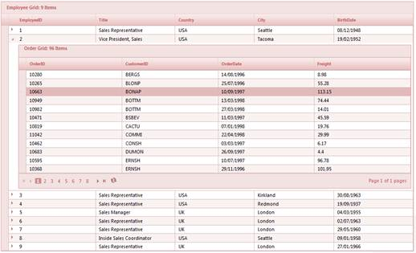
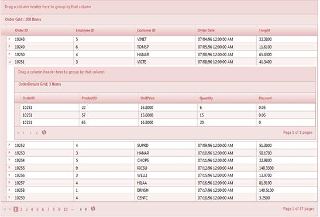

::: {style="DISPLAY: none"}
{#d2h_url_template}{#d2h_package_url style="WIDTH: 0px; DISPLAY: none; HEIGHT: 0px"}
:::

::::: {#nsbanner .d2h_main_nsbanner style="BORDER-BOTTOM: #999999 1px solid; POSITION: relative; PADDING-BOTTOM: 0px; BACKGROUND-COLOR: transparent; PADDING-LEFT: 0px; PADDING-RIGHT: 0px; DISPLAY: none; BORDER-TOP: #999999 1px solid; PADDING-TOP: 0px; LEFT: 0px"}
:::: {#TitleRow .d2h_main_titlerow style="PADDING-BOTTOM: 4px; BACKGROUND-COLOR: transparent; PADDING-LEFT: 22px; WIDTH: 100%; PADDING-RIGHT: 10px; DISPLAY: none; PADDING-TOP: 4px"}
::: {#ienav .d2h_main_ienav style="DISPLAY: none"}
{#D2HPrevious .D2HPreviousEnabled}  {#D2HNext .D2HNextEnabled}
:::
::::
:::::

:::::::::: {#nstext .d2h_main_nstext style="PADDING-BOTTOM: 10px; BACKGROUND-COLOR: transparent; PADDING-LEFT: 22px; PADDING-RIGHT: 10px; HEIGHT: 100%; OVERFLOW: auto; PADDING-TOP: 5px" hasuserbackground="true" valign="bottom"}
::: {#d2h_breadcrumbs .d2h_breadcrumbs}
[Essential Studio User Guide Documentation](ms-xhelp:///?Id=12457748-09e3-4d74-a240-8e049cedf030){.d2h_breadcrumbsNormal}[ \> ]{.d2h_breadcrumbsLinkSeparator}[User Interface Edition](ms-xhelp:///?Id=c29296b7-531c-413b-a0ec-488ca1f7f669){.d2h_breadcrumbsNormal}[ \> ]{.d2h_breadcrumbsLinkSeparator}[Essential ASP.NET MVC](ms-xhelp:///?Id=4b14e7d1-65c4-4f67-b1aa-2c37709905a5){.d2h_breadcrumbsNormal}[ \> ]{.d2h_breadcrumbsLinkSeparator}[Essential Grid]{.d2h_breadcrumbsContentsOnly}[ \> ]{.d2h_breadcrumbsLinkSeparator}[Getting Started](ms-xhelp:///?Id=c7ed3902-b25b-4170-be58-1d3d0b57748a){.d2h_breadcrumbsNormal}[ \> ]{.d2h_breadcrumbsLinkSeparator}[Feature Summary](ms-xhelp:///?Id=1923e679-441a-44e0-9bca-e0e50988a857){.d2h_breadcrumbsNormal}[ \> ]{.d2h_breadcrumbsLinkSeparator}[Concepts and Features](ms-xhelp:///?Id=4a1657fa-4756-42b9-9153-aebf5dcfc503){.d2h_breadcrumbsNormal}[ \> ]{.d2h_breadcrumbsLinkSeparator}[Hierarchical Grid](ms-xhelp:///?Id=dac9050f-9492-45d0-9911-f65e5eeed1ff){.d2h_breadcrumbsNormal}
:::

### JSON Mode {#json-mode style="TEXT-ALIGN: justify; tab-stops: 0pt"}

Through GridBuilder

 

Perform the followings steps to implement a hierarchical grid through **GridBuilder** in JSON mode:

 

1.   Create a model in the application (Refer to [Getting Started\>Adding a Model to the Application](http://help.syncfusion.com/ug_91/User%20Interface/ASP.NET%20MVC/Grid/Documents/addingamodeltotheapplication.htm)).

2.   Create the grid control in the view and configure the properties.

3.   Use the **ChildGrid** method as shown in the following code.

4.   **ParentRelationKey** should contain the **Foreign Key**.

5.   It should end with the method **ToChildGridTemplate**.

 

::: {align="center"}
+--------------------------------------------------------------------------------------------------------------------------------------------------------------------------------------------------------------------------------------------+
| **[\[ASPX\]]{style="FONT-FAMILY: 'Courier New'"}**                                                                                                                                                                                         |
|                                                                                                                                                                                                                                            |
| [           [\<%]{style="BACKGROUND: yellow"}[=]{style="COLOR: blue"}Html.Syncfusion().Grid\<[EmployeeView]{style="COLOR: #2b91af"}\>([\"GridSrc\"]{style="COLOR: #a31515"})                         ]{style="FONT-FAMILY: 'Courier New'"} |
|                                                                                                                                                                                                                                            |
| [                         .Caption([\"Employee Grid\"]{style="COLOR: #a31515"})]{style="FONT-FAMILY: 'Courier New'"}                                                                                                                       |
|                                                                                                                                                                                                                                            |
| [                         .AutoFormat([Skins]{style="COLOR: #2b91af"}.Almond)]{style="FONT-FAMILY: 'Courier New'"}                                                                                                                         |
|                                                                                                                                                                                                                                            |
| [                         .ActionMode([ActionMode]{style="COLOR: #2b91af"}.JSON)]{style="FONT-FAMILY: 'Courier New'"}                                                                                                                      |
|                                                                                                                                                                                                                                            |
| [                         .ChildGrid(child =\>]{style="FONT-FAMILY: 'Courier New'"}                                                                                                                                                        |
|                                                                                                                                                                                                                                            |
| [                         {]{style="FONT-FAMILY: 'Courier New'"}                                                                                                                                                                           |
|                                                                                                                                                                                                                                            |
| [       child.ChildGridTemplate(Html.Syncfusion().Grid\<[OrdersView]{style="COLOR: #2b91af"}\>([\"ChildGrid\_\${EmployeeID}\"]{style="COLOR: #a31515"})]{style="FONT-FAMILY: 'Courier New'"}                                               |
|                                                                                                                                                                                                                                            |
| [                            .ParentRelationKey([new]{style="COLOR: blue"} [string]{style="COLOR: blue"}\[\] { [\"EmployeeID\"]{style="COLOR: #a31515"} })]{style="FONT-FAMILY: 'Courier New'"}                                            |
|                                                                                                                                                                                                                                            |
| [                            .ActionMode([ActionMode]{style="COLOR: #2b91af"}.JSON)]{style="FONT-FAMILY: 'Courier New'"}                                                                                                                   |
|                                                                                                                                                                                                                                            |
| [                            .ToChildGridTemplate());]{style="FONT-FAMILY: 'Courier New'"}                                                                                                                                                 |
|                                                                                                                                                                                                                                            |
| [                        })]{style="FONT-FAMILY: 'Courier New'"}                                                                                                                                                                           |
|                                                                                                                                                                                                                                            |
| [            [%\>]{style="BACKGROUND: yellow"}]{style="FONT-FAMILY: 'Courier New'"}[ ]{style="FONT-FAMILY: 'Courier New'"}[]{style="FONT-FAMILY: 'Courier New'; BACKGROUND: yellow"}                                                       |
|                                                                                                                                                                                                                                            |
| []{style="FONT-FAMILY: 'Courier New'"}                                                                                                                                                                                                     |
+--------------------------------------------------------------------------------------------------------------------------------------------------------------------------------------------------------------------------------------------+
:::

 

6.   For Razor, the code is given below:

 

::: {align="center"}
+-------------------------------------------------------------------------------------------------------------------------------------------------------------------------------------------------+
| **[\[cshtml\]]{style="FONT-FAMILY: 'Courier New'"}**                                                                                                                                            |
|                                                                                                                                                                                                 |
| [          [\@{]{style="BACKGROUND: yellow"}]{style="FONT-FAMILY: 'Courier New'"}                                                                                                               |
|                                                                                                                                                                                                 |
| [              Html.Syncfusion().Grid\<[EmployeeView]{style="COLOR: #2b91af"}\>([\"GridSrc\"]{style="COLOR: #a31515"})]{style="FONT-FAMILY: 'Courier New'"}                                     |
|                                                                                                                                                                                                 |
| [                         .Datasource(Model)]{style="FONT-FAMILY: 'Courier New'"}                                                                                                               |
|                                                                                                                                                                                                 |
| [                         .Caption([\"Employee Grid\"]{style="COLOR: #a31515"})]{style="FONT-FAMILY: 'Courier New'"}                                                                            |
|                                                                                                                                                                                                 |
| [                         .AutoFormat([Skins]{style="COLOR: #2b91af"}.Almond)]{style="FONT-FAMILY: 'Courier New'"}                                                                              |
|                                                                                                                                                                                                 |
| [                         .ActionMode([ActionMode]{style="COLOR: #2b91af"}.JSON)]{style="FONT-FAMILY: 'Courier New'"}                                                                           |
|                                                                                                                                                                                                 |
| [                         .ChildGrid(child =\>]{style="FONT-FAMILY: 'Courier New'"}                                                                                                             |
|                                                                                                                                                                                                 |
| [                         {]{style="FONT-FAMILY: 'Courier New'"}                                                                                                                                |
|                                                                                                                                                                                                 |
| [        child.ChildGridTemplate(Html.Syncfusion().Grid\<[OrdersView]{style="COLOR: #2b91af"}\>([\"ChildGrid\_\${EmployeeID}\"]{style="COLOR: #a31515"}).]{style="FONT-FAMILY: 'Courier New'"}  |
|                                                                                                                                                                                                 |
| [                            .ParentRelationKey([new]{style="COLOR: blue"} [string]{style="COLOR: blue"}\[\] { [\"EmployeeID\"]{style="COLOR: #a31515"} })]{style="FONT-FAMILY: 'Courier New'"} |
|                                                                                                                                                                                                 |
| [                            .ActionMode([ActionMode]{style="COLOR: #2b91af"}.JSON)]{style="FONT-FAMILY: 'Courier New'"}                                                                        |
|                                                                                                                                                                                                 |
| [                            .ToChildGridTemplate());]{style="FONT-FAMILY: 'Courier New'"}                                                                                                      |
|                                                                                                                                                                                                 |
| [                        })]{style="FONT-FAMILY: 'Courier New'"}                                                                                                                                |
|                                                                                                                                                                                                 |
| [             .Render();]{style="FONT-FAMILY: 'Courier New'"}                                                                                                                                   |
|                                                                                                                                                                                                 |
| [             [}]{style="BACKGROUND: yellow"}    ]{style="FONT-FAMILY: 'Courier New'"}                                                                                                          |
|                                                                                                                                                                                                 |
| **[]{style="FONT-FAMILY: 'Courier New'"}**                                                                                                                                                      |
|                                                                                                                                                                                                 |
| []{style="FONT-FAMILY: Consolas"}                                                                                                                                                               |
|                                                                                                                                                                                                 |
| []{style="FONT-FAMILY: 'Courier New'"}                                                                                                                                                          |
+-------------------------------------------------------------------------------------------------------------------------------------------------------------------------------------------------+
:::

 

7.   Set its data source and render the view.

 

::: {align="center"}
+------------------------------------------------------------------------------------------------------------------------------------------------------------------------------+
| **[\[C#\]]{style="FONT-FAMILY: 'Courier New'"}**                                                                                                                             |
|                                                                                                                                                                              |
| [        [public]{style="COLOR: blue"} ActionResult ]{style="FONT-FAMILY: 'Courier New'"}[Index]{style="FONT-FAMILY: 'Courier New'"}[()]{style="FONT-FAMILY: 'Courier New'"} |
|                                                                                                                                                                              |
| [        {            ]{style="FONT-FAMILY: 'Courier New'"}                                                                                                                  |
|                                                                                                                                                                              |
| [            [return]{style="COLOR: blue"} View();]{style="FONT-FAMILY: 'Courier New'"}                                                                                      |
|                                                                                                                                                                              |
| []{style="FONT-FAMILY: 'Courier New'"}                                                                                                                                       |
|                                                                                                                                                                              |
| [        }]{style="FONT-FAMILY: 'Courier New'"}                                                                                                                              |
|                                                                                                                                                                              |
| []{style="FONT-FAMILY: 'Courier New'"}                                                                                                                                       |
+------------------------------------------------------------------------------------------------------------------------------------------------------------------------------+
:::

 

8.   In order to work with paging actions, create a **Post** method for **Index** actions and bind the data source to the grid as given in the following code snippet.

 

::: {align="center"}
+-------------------------------------------------------------------------------------------------------------------------------------------------------------------------------------------------------------------------------------------------------------------+
| **[\[C#\]]{style="FONT-FAMILY: 'Courier New'"}**                                                                                                                                                                                                                  |
|                                                                                                                                                                                                                                                                   |
| [        [///]{style="COLOR: gray"}[ ]{style="COLOR: green"}[\<summary\>]{style="COLOR: gray"}]{style="FONT-FAMILY: 'Courier New'"}                                                                                                                               |
|                                                                                                                                                                                                                                                                   |
| [        [///]{style="COLOR: gray"}[ Used to bind the grid. ]{style="COLOR: green"}]{style="FONT-FAMILY: 'Courier New'"}                                                                                                                                          |
|                                                                                                                                                                                                                                                                   |
| [        [///]{style="COLOR: gray"}[ ]{style="COLOR: green"}[\</summary\>]{style="COLOR: gray"}]{style="FONT-FAMILY: 'Courier New'"}                                                                                                                              |
|                                                                                                                                                                                                                                                                   |
| [        [///]{style="COLOR: gray"}[ ]{style="COLOR: green"}[\<returns\>]{style="COLOR: gray"}[View page; it displays the grid.]{style="COLOR: green"}[\</returns\>]{style="COLOR: gray"}]{style="FONT-FAMILY: 'Courier New'"}                                    |
|                                                                                                                                                                                                                                                                   |
| [        \[AcceptVerbs(HttpVerbs.Post)\]]{style="FONT-FAMILY: 'Courier New'"}                                                                                                                                                                                     |
|                                                                                                                                                                                                                                                                   |
| [        [public]{style="COLOR: blue"} ActionResult ]{style="FONT-FAMILY: 'Courier New'"}[Index]{style="FONT-FAMILY: 'Courier New'"}[([PagingParams]{style="COLOR: #2b91af"} args, [string]{style="COLOR: blue"} EmployeeID)]{style="FONT-FAMILY: 'Courier New'"} |
|                                                                                                                                                                                                                                                                   |
| [        {]{style="FONT-FAMILY: 'Courier New'"}                                                                                                                                                                                                                   |
|                                                                                                                                                                                                                                                                   |
| [        [if]{style="COLOR: blue"} (args.ID.Contains([\"ChildGrid\"]{style="COLOR: #a31515"}))]{style="FONT-FAMILY: 'Courier New'"}                                                                                                                               |
|                                                                                                                                                                                                                                                                   |
| [            {                ]{style="FONT-FAMILY: 'Courier New'"}                                                                                                                                                                                               |
|                                                                                                                                                                                                                                                                   |
| [                [IEnumerable]{style="COLOR: #2b91af"} data = [new]{style="COLOR: blue"} [NorthwindDataContext]{style="COLOR: #2b91af"}().OrdersViews.Where(c =\> c.EmployeeID == EmployeeID).ToList();]{style="FONT-FAMILY: 'Courier New'"}                      |
|                                                                                                                                                                                                                                                                   |
| [                [return]{style="COLOR: blue"} data.GridJSONActions\<[OrdersView]{style="COLOR: #2b91af"}\>();                ]{style="FONT-FAMILY: 'Courier New'"}                                                                                               |
|                                                                                                                                                                                                                                                                   |
| [            }]{style="FONT-FAMILY: 'Courier New'"}                                                                                                                                                                                                               |
|                                                                                                                                                                                                                                                                   |
| [            [else]{style="COLOR: blue"}]{style="FONT-FAMILY: 'Courier New'"}                                                                                                                                                                                     |
|                                                                                                                                                                                                                                                                   |
| [            {]{style="FONT-FAMILY: 'Courier New'"}                                                                                                                                                                                                               |
|                                                                                                                                                                                                                                                                   |
| [                [var]{style="COLOR: blue"} ordersData = [new]{style="COLOR: blue"} [NorthwindDataContext]{style="COLOR: #2b91af"}().EmployeeViews.ToList();]{style="FONT-FAMILY: 'Courier New'"}                                                                 |
|                                                                                                                                                                                                                                                                   |
| [                [return]{style="COLOR: blue"} ordersData.GridJSONActions\<[EmployeeView]{style="COLOR: #2b91af"}\>();]{style="FONT-FAMILY: 'Courier New'"}                                                                                                       |
|                                                                                                                                                                                                                                                                   |
| [            }]{style="FONT-FAMILY: 'Courier New'"}                                                                                                                                                                                                               |
|                                                                                                                                                                                                                                                                   |
| []{style="FONT-FAMILY: 'Courier New'"}                                                                                                                                                                                                                            |
|                                                                                                                                                                                                                                                                   |
| [        }]{style="FONT-FAMILY: 'Courier New'"}[]{style="FONT-FAMILY: Consolas; FONT-SIZE: 9.5pt"}                                                                                                                                                                |
+-------------------------------------------------------------------------------------------------------------------------------------------------------------------------------------------------------------------------------------------------------------------+
:::

 

 

9.   Run the application. The grid will appear as shown below:

 

[   ]{style="FONT-FAMILY: 'Courier New'"}{border="0"}

Figure 271: Hierarchical Grid in JSON Mode through GridBuilder

 

Tables for Properties, Methods, and Events

 

Properties

 

+-----------------------------------------------------------------------------------+-------------------------------------------------------------------------------+-------------------------------------+--------------------------------+
| Property                                                                          | Description                                                                   | Type                                | Data type                      |
+-----------------------------------------------------------------------------------+-------------------------------------------------------------------------------+-------------------------------------+--------------------------------+
| [ChildGrid]{style="COLOR: black"}                                                 | Set the Child grid if you need the hierarchical grid.[]{style="COLOR: black"} | [Server Side]{style="COLOR: black"} | [String]{style="COLOR: black"} |
+-----------------------------------------------------------------------------------+-------------------------------------------------------------------------------+-------------------------------------+--------------------------------+
| [ParentRelationKey]{style="FONT-FAMILY: 'Calibri','sans-serif'; FONT-SIZE: 11pt"} | Gets or sets the relation Key property, which relates to its parent Grid      | [Server Side]{style="COLOR: black"} | String array                   |
|                                                                                   |                                                                               |                                     |                                |
| []{style="COLOR: black"}                                                          |                                                                               |                                     |                                |
+===================================================================================+===============================================================================+=====================================+================================+

[]{style="FONT-FAMILY: 'Calibri','sans-serif'; COLOR: black"} 

Methods

 

+------------------------------------------------------+--------------------------------------------------------------------------+-------------+-------------------------------------------------------------------------------------------+--------------------------+
| Method                                               | Description                                                              | Parameters  | Type                                                                                      | Return type              |
+------------------------------------------------------+--------------------------------------------------------------------------+-------------+-------------------------------------------------------------------------------------------+--------------------------+
| ChildGrid                                            | Set the Child grid if you need hierarchical grid.                        |             | string                                                                                    | IGridBuilder             |
|                                                      |                                                                          |             |                                                                                           |                          |
| []{style="FONT-FAMILY: Consolas; FONT-SIZE: 9.5pt"}  |                                                                          |             |                                                                                           |                          |
+------------------------------------------------------+--------------------------------------------------------------------------+-------------+-------------------------------------------------------------------------------------------+--------------------------+
| ParentRelationKey                                    | Gets or sets the relation Key property, which relates to its parent Grid | String      | String array                                                                              | ChildGridTemplateBuilder |
|                                                      |                                                                          |             |                                                                                           |                          |
| []{style="FONT-FAMILY: Consolas; FONT-SIZE: 9.5pt"}  |                                                                          |             |                                                                                           |                          |
+------------------------------------------------------+--------------------------------------------------------------------------+-------------+-------------------------------------------------------------------------------------------+--------------------------+
| ToChildGridTemplate                                  | Renders the Grid in ChildGrid template format                            |             | ChildGridTemplate (to render the Chidgrid, the  user has to render the grid as this type) | ChildGridTemplate        |
|                                                      |                                                                          |             |                                                                                           |                          |
|                                                      |                                                                          |             |                                                                                           |                          |
+======================================================+==========================================================================+=============+===========================================================================================+==========================+

[]{style="FONT-FAMILY: 'Calibri','sans-serif'; COLOR: black"} 

Events

 

+--------------------+-------------------------------------------------------+-----------------+-----------------+
| Event              | Description                                           | Arguments       | Type            |
+--------------------+-------------------------------------------------------+-----------------+-----------------+
| OnRecordExpanded   | This event  rises in every Master row expanded event. | String handler  | Client-Side     |
|                    |                                                       |                 |                 |
|                    |                                                       |                 |                 |
+--------------------+-------------------------------------------------------+-----------------+-----------------+
| OnRecordCollapsed  | This event rises in every Master row Collapsed event. | String  handler | Client-Side     |
|                    |                                                       |                 |                 |
|                    |                                                       |                 |                 |
+--------------------+-------------------------------------------------------+-----------------+-----------------+
| OnRecordExpanding  | This event rises before every Master row Expand.      | String handler  | Client-Side     |
|                    |                                                       |                 |                 |
|                    |                                                       |                 |                 |
+--------------------+-------------------------------------------------------+-----------------+-----------------+
| OnRecordCollapsing | This event rises before every Master row Collapse.    | String handler  | Client-Side     |
|                    |                                                       |                 |                 |
|                    |                                                       |                 |                 |
+====================+=======================================================+=================+=================+

[]{style="FONT-FAMILY: 'Calibri','sans-serif'; COLOR: black"} 

[]{style="FONT-FAMILY: 'Calibri','sans-serif'; COLOR: black"} 

Using Client-Side Events

 

Using the **OnRecordCollapsing** event, we can avoid the **Collapse** event. Using the **OnRecordExpanding** event, we can avoid the **Expand** event.

 

The client-side events are used in ASPX as shown below in the server mode through **GridBuilder**.

 

::: {align="center"}
+------------------------------------------------------------------------------------------------------------------------------------------------------------------------------------------------------------------------------------------------------------------------------------------------------------------------------------------------------------------+
| **[\[ASPX\]]{style="FONT-FAMILY: 'Courier New'"}**                                                                                                                                                                                                                                                                                                               |
|                                                                                                                                                                                                                                                                                                                                                                  |
| [\<%]{style="FONT-FAMILY: Consolas; BACKGROUND: yellow; FONT-SIZE: 9.5pt"}[=]{style="FONT-FAMILY: Consolas; COLOR: blue; FONT-SIZE: 9.5pt"}[Html.Syncfusion().Grid\<]{style="FONT-FAMILY: 'Courier New'"}[Order]{style="FONT-FAMILY: Consolas; COLOR: #2b91af; FONT-SIZE: 9.5pt"}[\>(\"[GridSrc]{style="COLOR: #c0504d"}\")]{style="FONT-FAMILY: 'Courier New'"} |
|                                                                                                                                                                                                                                                                                                                                                                  |
| [                         .Datasource(Model)]{style="FONT-FAMILY: 'Courier New'"}                                                                                                                                                                                                                                                                                |
|                                                                                                                                                                                                                                                                                                                                                                  |
| [                         .Caption(\"[Order Grid]{style="COLOR: #c0504d"}\")]{style="FONT-FAMILY: 'Courier New'"}                                                                                                                                                                                                                                                |
|                                                                                                                                                                                                                                                                                                                                                                  |
| [                         .AutoFormat(]{style="FONT-FAMILY: 'Courier New'"}[Skins]{style="FONT-FAMILY: Consolas; COLOR: #2b91af; FONT-SIZE: 9.5pt"}[.Almond)]{style="FONT-FAMILY: 'Courier New'"}                                                                                                                                                                |
|                                                                                                                                                                                                                                                                                                                                                                  |
| [                         .ClientSideEvents(eve =\>]{style="FONT-FAMILY: 'Courier New'"}                                                                                                                                                                                                                                                                         |
|                                                                                                                                                                                                                                                                                                                                                                  |
| [                         {]{style="FONT-FAMILY: 'Courier New'"}                                                                                                                                                                                                                                                                                                 |
|                                                                                                                                                                                                                                                                                                                                                                  |
| [                            eve.OnRecordCollapsing(\"OnRecordCollapsing\");]{style="FONT-FAMILY: 'Courier New'"}                                                                                                                                                                                                                                                |
|                                                                                                                                                                                                                                                                                                                                                                  |
| [                            eve.OnRecordExpanding(\"OnRecordExpanding\");]{style="FONT-FAMILY: 'Courier New'"}                                                                                                                                                                                                                                                  |
|                                                                                                                                                                                                                                                                                                                                                                  |
| [                            eve.OnRecordCollapsed(\"OnRecordCollapsed\");]{style="FONT-FAMILY: 'Courier New'"}                                                                                                                                                                                                                                                  |
|                                                                                                                                                                                                                                                                                                                                                                  |
| [                            eve.OnRecordExpanded(\"OnRecordExpanded\");]{style="FONT-FAMILY: 'Courier New'"}                                                                                                                                                                                                                                                    |
|                                                                                                                                                                                                                                                                                                                                                                  |
| [                         })]{style="FONT-FAMILY: 'Courier New'"}[]{style="FONT-FAMILY: Consolas; FONT-SIZE: 9.5pt"}                                                                                                                                                                                                                                             |
|                                                                                                                                                                                                                                                                                                                                                                  |
| [                        ]{style="FONT-FAMILY: 'Courier New'"}                                                                                                                                                                                                                                                                                                   |
|                                                                                                                                                                                                                                                                                                                                                                  |
| [                         .ChildGrid(child =\>]{style="FONT-FAMILY: 'Courier New'"}                                                                                                                                                                                                                                                                              |
|                                                                                                                                                                                                                                                                                                                                                                  |
| [                         {                            child.ChildGridTemplate(Html.Syncfusion().Grid\<[Order_Detail]{style="COLOR: #4bacc6"}\>(\"[ChildGrid\_\${OrderID]{style="COLOR: #c0504d"}}\")]{style="FONT-FAMILY: 'Courier New'"}                                                                                                                       |
|                                                                                                                                                                                                                                                                                                                                                                  |
| [                            .Caption(\"[OrderDetails Grid]{style="COLOR: #c0504d"}\")                            ]{style="FONT-FAMILY: 'Courier New'"}                                                                                                                                                                                                          |
|                                                                                                                                                                                                                                                                                                                                                                  |
| [                            .ParentRelationKey(]{style="FONT-FAMILY: 'Courier New'"}[new]{style="FONT-FAMILY: Consolas; COLOR: blue; FONT-SIZE: 9.5pt"}[ [string]{style="COLOR: blue"}]{style="FONT-FAMILY: Consolas; FONT-SIZE: 9.5pt"}[\[\] { \"[OrderID]{style="COLOR: #c0504d"}\" })]{style="FONT-FAMILY: 'Courier New'"}                                   |
|                                                                                                                                                                                                                                                                                                                                                                  |
| [                            .ToChildGridTemplate());]{style="FONT-FAMILY: 'Courier New'"}                                                                                                                                                                                                                                                                       |
|                                                                                                                                                                                                                                                                                                                                                                  |
| [                         })                       ]{style="FONT-FAMILY: 'Courier New'"}                                                                                                                                                                                                                                                                         |
|                                                                                                                                                                                                                                                                                                                                                                  |
| [%\>]{style="FONT-FAMILY: 'Courier New'; BACKGROUND: yellow"}[     ]{style="FONT-FAMILY: 'Courier New'"}[]{style="FONT-FAMILY: 'Courier New'"}                                                                                                                                                                                                                   |
|                                                                                                                                                                                                                                                                                                                                                                  |
| []{style="FONT-FAMILY: 'Courier New'"}                                                                                                                                                                                                                                                                                                                           |
+------------------------------------------------------------------------------------------------------------------------------------------------------------------------------------------------------------------------------------------------------------------------------------------------------------------------------------------------------------------+
:::

 

For Razor, use the code shown below in server mode through **GridBuilder**.

 

 

::: {align="center"}
+--------------------------------------------------------------------------------------------------------------------------------------------------------------------------------------------------------------------------------------------------------------------------------------------------------------------------------+
| **[\[cshtml\]]{style="FONT-FAMILY: 'Courier New'"}**                                                                                                                                                                                                                                                                           |
|                                                                                                                                                                                                                                                                                                                                |
| [\@{]{style="FONT-FAMILY: 'Courier New'; BACKGROUND: yellow"}[]{style="FONT-FAMILY: 'Courier New'"}                                                                                                                                                                                                                            |
|                                                                                                                                                                                                                                                                                                                                |
| [      Html.Syncfusion().Grid\<]{style="FONT-FAMILY: 'Courier New'"}[Order]{style="FONT-FAMILY: Consolas; COLOR: #2b91af; FONT-SIZE: 9.5pt"}[\>(\"[GridSrc]{style="COLOR: #c0504d"}\")]{style="FONT-FAMILY: 'Courier New'"}                                                                                                    |
|                                                                                                                                                                                                                                                                                                                                |
| [                         .Datasource(Model)]{style="FONT-FAMILY: 'Courier New'"}                                                                                                                                                                                                                                              |
|                                                                                                                                                                                                                                                                                                                                |
| [                         .Caption(\"[Order Grid]{style="COLOR: #c0504d"}\")                      ]{style="FONT-FAMILY: 'Courier New'"}                                                                                                                                                                                        |
|                                                                                                                                                                                                                                                                                                                                |
| [                         .AutoFormat(]{style="FONT-FAMILY: 'Courier New'"}[Skins]{style="FONT-FAMILY: Consolas; COLOR: #2b91af; FONT-SIZE: 9.5pt"}[.Almond)]{style="FONT-FAMILY: 'Courier New'"}                                                                                                                              |
|                                                                                                                                                                                                                                                                                                                                |
| [                         .ClientSideEvents(eve =\>]{style="FONT-FAMILY: 'Courier New'"}                                                                                                                                                                                                                                       |
|                                                                                                                                                                                                                                                                                                                                |
| [                        {]{style="FONT-FAMILY: 'Courier New'"}                                                                                                                                                                                                                                                                |
|                                                                                                                                                                                                                                                                                                                                |
| [                            eve.OnRecordCollapsing(\"OnRecordCollapsing\");]{style="FONT-FAMILY: 'Courier New'"}                                                                                                                                                                                                              |
|                                                                                                                                                                                                                                                                                                                                |
| [                            eve.OnRecordExpanding(\"OnRecordExpanding\");]{style="FONT-FAMILY: 'Courier New'"}                                                                                                                                                                                                                |
|                                                                                                                                                                                                                                                                                                                                |
| [                            eve.OnRecordCollapsed(\"OnRecordCollapsed\");]{style="FONT-FAMILY: 'Courier New'"}                                                                                                                                                                                                                |
|                                                                                                                                                                                                                                                                                                                                |
| [                            eve.OnRecordExpanded(\"OnRecordExpanded\");]{style="FONT-FAMILY: 'Courier New'"}                                                                                                                                                                                                                  |
|                                                                                                                                                                                                                                                                                                                                |
| [                        })]{style="FONT-FAMILY: 'Courier New'"}[]{style="FONT-FAMILY: Consolas; FONT-SIZE: 9.5pt"}                                                                                                                                                                                                            |
|                                                                                                                                                                                                                                                                                                                                |
| []{style="FONT-FAMILY: 'Courier New'"}                                                                                                                                                                                                                                                                                         |
|                                                                                                                                                                                                                                                                                                                                |
| [                         .ChildGrid(child =\>]{style="FONT-FAMILY: 'Courier New'"}                                                                                                                                                                                                                                            |
|                                                                                                                                                                                                                                                                                                                                |
| [                         {]{style="FONT-FAMILY: 'Courier New'"}                                                                                                                                                                                                                                                               |
|                                                                                                                                                                                                                                                                                                                                |
| [                            child.ChildGridTemplate(Html.Syncfusion().Grid\<]{style="FONT-FAMILY: 'Courier New'"}[ Order_Detail]{style="FONT-FAMILY: Consolas; COLOR: #2b91af; FONT-SIZE: 9.5pt"}[\>(\"[ChildGrid\_\${OrderID]{style="COLOR: #c0504d"}}\")]{style="FONT-FAMILY: 'Courier New'"}                               |
|                                                                                                                                                                                                                                                                                                                                |
| [                            .Caption(\"[OrderDetails Grid]{style="COLOR: #c0504d"}\")                                                       ]{style="FONT-FAMILY: 'Courier New'"}                                                                                                                                             |
|                                                                                                                                                                                                                                                                                                                                |
| [                            .ParentRelationKey(]{style="FONT-FAMILY: 'Courier New'"}[new]{style="FONT-FAMILY: Consolas; COLOR: blue; FONT-SIZE: 9.5pt"}[ [string]{style="COLOR: blue"}]{style="FONT-FAMILY: Consolas; FONT-SIZE: 9.5pt"}[\[\] { \"[OrderID]{style="COLOR: #c0504d"}\" })]{style="FONT-FAMILY: 'Courier New'"} |
|                                                                                                                                                                                                                                                                                                                                |
| [                            .ToChildGridTemplate());]{style="FONT-FAMILY: 'Courier New'"}                                                                                                                                                                                                                                     |
|                                                                                                                                                                                                                                                                                                                                |
| [                         })]{style="FONT-FAMILY: 'Courier New'"}                                                                                                                                                                                                                                                              |
|                                                                                                                                                                                                                                                                                                                                |
| [                         .Render();]{style="FONT-FAMILY: 'Courier New'"}                                                                                                                                                                                                                                                      |
|                                                                                                                                                                                                                                                                                                                                |
| [    [}]{style="BACKGROUND: yellow"}    ]{style="FONT-FAMILY: 'Courier New'"}                                                                                                                                                                                                                                                  |
|                                                                                                                                                                                                                                                                                                                                |
| []{style="FONT-FAMILY: 'Courier New'"}                                                                                                                                                                                                                                                                                         |
|                                                                                                                                                                                                                                                                                                                                |
| []{style="FONT-FAMILY: 'Courier New'"}                                                                                                                                                                                                                                                                                         |
|                                                                                                                                                                                                                                                                                                                                |
| []{style="FONT-FAMILY: 'Courier New'"}                                                                                                                                                                                                                                                                                         |
|                                                                                                                                                                                                                                                                                                                                |
| [ ]{style="FONT-FAMILY: Consolas"}[      ]{style="FONT-FAMILY: Consolas; FONT-SIZE: 9.5pt"}                                                                                                                                                                                                                                    |
|                                                                                                                                                                                                                                                                                                                                |
| []{style="FONT-FAMILY: Consolas"}                                                                                                                                                                                                                                                                                              |
+--------------------------------------------------------------------------------------------------------------------------------------------------------------------------------------------------------------------------------------------------------------------------------------------------------------------------------+
:::

 

 

Appearance

{border="0"}

Figure 272: Hierarchical Grid

 

Sample Link

 

To view samples:

1.   Open the **ASP.NET MVC** **Sample Browser** from the dashboard (Refer to the Samples and Location chapter).

2.   Navigate to **Grid**\>**Hierarchy** to check out the different hierarchical grid demos.

[]{style="FONT-FAMILY: 'Myriad Pro','sans-serif'"} 

[]{#related-topics}
::::::::::
