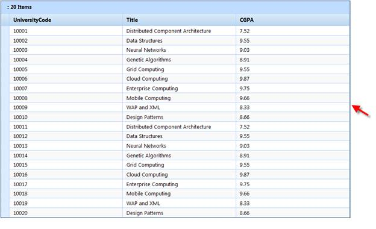

::: {style="DISPLAY: none"}
{#d2h_url_template}{#d2h_package_url style="WIDTH: 0px; DISPLAY: none; HEIGHT: 0px"}
:::

::::: {#nsbanner .d2h_main_nsbanner style="BORDER-BOTTOM: #999999 1px solid; POSITION: relative; PADDING-BOTTOM: 0px; BACKGROUND-COLOR: transparent; PADDING-LEFT: 0px; PADDING-RIGHT: 0px; DISPLAY: none; BORDER-TOP: #999999 1px solid; PADDING-TOP: 0px; LEFT: 0px"}
:::: {#TitleRow .d2h_main_titlerow style="PADDING-BOTTOM: 4px; BACKGROUND-COLOR: transparent; PADDING-LEFT: 22px; WIDTH: 100%; PADDING-RIGHT: 10px; DISPLAY: none; PADDING-TOP: 4px"}
::: {#ienav .d2h_main_ienav style="DISPLAY: none"}
{#D2HPrevious .D2HPreviousEnabled}  {#D2HNext .D2HNextEnabled}
:::
::::
:::::

:::::: {#nstext .d2h_main_nstext style="PADDING-BOTTOM: 10px; BACKGROUND-COLOR: transparent; PADDING-LEFT: 22px; PADDING-RIGHT: 10px; HEIGHT: 100%; OVERFLOW: auto; PADDING-TOP: 5px" hasuserbackground="true" valign="bottom"}
::: {#d2h_breadcrumbs .d2h_breadcrumbs}
[Essential Studio User Guide Documentation](ms-xhelp:///?Id=12457748-09e3-4d74-a240-8e049cedf030){.d2h_breadcrumbsNormal}[ \> ]{.d2h_breadcrumbsLinkSeparator}[User Interface Edition](ms-xhelp:///?Id=c29296b7-531c-413b-a0ec-488ca1f7f669){.d2h_breadcrumbsNormal}[ \> ]{.d2h_breadcrumbsLinkSeparator}[Essential ASP.NET MVC](ms-xhelp:///?Id=4b14e7d1-65c4-4f67-b1aa-2c37709905a5){.d2h_breadcrumbsNormal}[ \> ]{.d2h_breadcrumbsLinkSeparator}[Essential Grid]{.d2h_breadcrumbsContentsOnly}[ \> ]{.d2h_breadcrumbsLinkSeparator}[Getting Started](ms-xhelp:///?Id=c7ed3902-b25b-4170-be58-1d3d0b57748a){.d2h_breadcrumbsNormal}[ \> ]{.d2h_breadcrumbsLinkSeparator}[Feature Summary](ms-xhelp:///?Id=1923e679-441a-44e0-9bca-e0e50988a857){.d2h_breadcrumbsNormal}[ \> ]{.d2h_breadcrumbsLinkSeparator}[Concepts and Features](ms-xhelp:///?Id=4a1657fa-4756-42b9-9153-aebf5dcfc503){.d2h_breadcrumbsNormal}
:::

## Keyboard Interface  {#keyboard-interface style="tab-stops: 0pt"}

Essential Grid for MVC provides extensive support for keyboard handling. The following table gives the default keys for performing various key actions.

         

::: {align="center"}
  ------------------------------------------------------------------------------------------------------------------------------------------------------ --------------------------------------------------------------------------------------------------------------------------------------
  **[Action]{style="FONT-FAMILY: 'Calibri','sans-serif'; FONT-SIZE: 11pt"}**                                                                             **[Default Keys]{style="FONT-FAMILY: 'Calibri','sans-serif'; FONT-SIZE: 11pt"}**
  [Focus Key]{style="FONT-FAMILY: 'Calibri','sans-serif'; FONT-SIZE: 11pt"}                                                                              [CTRL+ALT+F]{style="FONT-FAMILY: 'Calibri','sans-serif'; FONT-SIZE: 11pt"}
  [First Cell Selection]{style="FONT-FAMILY: 'Calibri','sans-serif'; FONT-SIZE: 11pt"}[]{style="FONT-FAMILY: 'Calibri','sans-serif'; FONT-SIZE: 11pt"}   [HOME]{style="FONT-FAMILY: 'Calibri','sans-serif'; FONT-SIZE: 11pt"}[]{style="FONT-FAMILY: 'Calibri','sans-serif'; FONT-SIZE: 11pt"}
  [Last Cell Selection]{style="FONT-FAMILY: 'Calibri','sans-serif'; FONT-SIZE: 11pt"}                                                                    [END[]{style="COLOR: #2b91af"}]{style="FONT-FAMILY: 'Calibri','sans-serif'; FONT-SIZE: 11pt"}
  [First Row Selection]{style="FONT-FAMILY: 'Calibri','sans-serif'; FONT-SIZE: 11pt"}                                                                    [CTRL+HOME[]{style="COLOR: #2b91af"}]{style="FONT-FAMILY: 'Calibri','sans-serif'; FONT-SIZE: 11pt"}
  [Last Row Selection]{style="FONT-FAMILY: 'Calibri','sans-serif'; FONT-SIZE: 11pt"}                                                                     [CTRL+END[]{style="COLOR: #2b91af"}]{style="FONT-FAMILY: 'Calibri','sans-serif'; FONT-SIZE: 11pt"}
  [Insert Record]{style="FONT-FAMILY: 'Calibri','sans-serif'; FONT-SIZE: 11pt"}                                                                          [INSERT[]{style="COLOR: #2b91af"}]{style="FONT-FAMILY: 'Calibri','sans-serif'; FONT-SIZE: 11pt"}
  [Delete Record]{style="FONT-FAMILY: 'Calibri','sans-serif'; FONT-SIZE: 11pt"}                                                                          [DELETE[]{style="COLOR: #2b91af"}]{style="FONT-FAMILY: 'Calibri','sans-serif'; FONT-SIZE: 11pt"}
  [Edit Record]{style="FONT-FAMILY: 'Calibri','sans-serif'; FONT-SIZE: 11pt"}                                                                            [F2[]{style="COLOR: #2b91af"}]{style="FONT-FAMILY: 'Calibri','sans-serif'; FONT-SIZE: 11pt"}
  [Save Request]{style="FONT-FAMILY: 'Calibri','sans-serif'; FONT-SIZE: 11pt"}                                                                           [ENTER[]{style="COLOR: #2b91af"}]{style="FONT-FAMILY: 'Calibri','sans-serif'; FONT-SIZE: 11pt"}
  [Cancel Request]{style="FONT-FAMILY: 'Calibri','sans-serif'; FONT-SIZE: 11pt"}                                                                         [ESC[]{style="COLOR: #2b91af"}]{style="FONT-FAMILY: 'Calibri','sans-serif'; FONT-SIZE: 11pt"}
  [Export to Excel]{style="FONT-FAMILY: 'Calibri','sans-serif'; FONT-SIZE: 11pt"}                                                                        [ALT+X[]{style="COLOR: #2b91af"}]{style="FONT-FAMILY: 'Calibri','sans-serif'; FONT-SIZE: 11pt"}
  [Next Page]{style="FONT-FAMILY: 'Calibri','sans-serif'; FONT-SIZE: 11pt"}                                                                              [PAGE DOWN[]{style="COLOR: #2b91af"}]{style="FONT-FAMILY: 'Calibri','sans-serif'; FONT-SIZE: 11pt"}
  [Previous Page]{style="FONT-FAMILY: 'Calibri','sans-serif'; FONT-SIZE: 11pt"}                                                                          [PAGE UP[]{style="COLOR: #2b91af"}]{style="FONT-FAMILY: 'Calibri','sans-serif'; FONT-SIZE: 11pt"}
  [Next Pager]{style="FONT-FAMILY: 'Calibri','sans-serif'; FONT-SIZE: 11pt"}                                                                             [ALT+PAGE DOWN[]{style="COLOR: #2b91af"}]{style="FONT-FAMILY: 'Calibri','sans-serif'; FONT-SIZE: 11pt"}
  [Previous Pager]{style="FONT-FAMILY: 'Calibri','sans-serif'; FONT-SIZE: 11pt"}                                                                         [ALT+PAGE UP[]{style="COLOR: #2b91af"}]{style="FONT-FAMILY: 'Calibri','sans-serif'; FONT-SIZE: 11pt"}
  [Last Page]{style="FONT-FAMILY: 'Calibri','sans-serif'; FONT-SIZE: 11pt"}                                                                              [CTRL+ALT+PAGE DOWN[]{style="COLOR: #2b91af"}]{style="FONT-FAMILY: 'Calibri','sans-serif'; FONT-SIZE: 11pt"}
  [First Page]{style="FONT-FAMILY: 'Calibri','sans-serif'; FONT-SIZE: 11pt"}                                                                             [CTRL+ALT+PAGE UP[]{style="COLOR: #2b91af"}]{style="FONT-FAMILY: 'Calibri','sans-serif'; FONT-SIZE: 11pt"}
  [Selected Group Expand]{style="FONT-FAMILY: 'Calibri','sans-serif'; FONT-SIZE: 11pt"}                                                                  [ALT+DOWN AROW[]{style="COLOR: #2b91af"}]{style="FONT-FAMILY: 'Calibri','sans-serif'; FONT-SIZE: 11pt"}
  [Total Group Expand]{style="FONT-FAMILY: 'Calibri','sans-serif'; FONT-SIZE: 11pt"}                                                                     [CTRL+ALT+DOWN ARROW[]{style="COLOR: #2b91af"}]{style="FONT-FAMILY: 'Calibri','sans-serif'; FONT-SIZE: 11pt"}
  [Selected Group Collapse]{style="FONT-FAMILY: 'Calibri','sans-serif'; FONT-SIZE: 11pt"}                                                                [ALT+UP ARROW[]{style="COLOR: #2b91af"}]{style="FONT-FAMILY: 'Calibri','sans-serif'; FONT-SIZE: 11pt"}
  [Total Group Collapse]{style="FONT-FAMILY: 'Calibri','sans-serif'; FONT-SIZE: 11pt"}                                                                   [CTRL+ALT+UP ARROW[]{style="COLOR: #2b91af"}]{style="FONT-FAMILY: 'Calibri','sans-serif'; FONT-SIZE: 11pt"}
  ------------------------------------------------------------------------------------------------------------------------------------------------------ --------------------------------------------------------------------------------------------------------------------------------------
:::

**[]{style="FONT-FAMILY: 'Times New Roman','serif'; FONT-SIZE: 12pt"}** 

**Key Configuration**: All keyboard shortcuts can be configured using the **KeyConfigurator** property in the **GridPropertiesModel**.

::: {style="BORDER-BOTTOM: windowtext 1pt solid; BORDER-LEFT: medium none; PADDING-BOTTOM: 1pt; MARGIN-TOP: 9pt; PADDING-LEFT: 0pt; PADDING-RIGHT: 0pt; MARGIN-BOTTOM: 9pt; BORDER-TOP: windowtext 1pt solid; BORDER-RIGHT: medium none; PADDING-TOP: 1pt"}
{border="0"}Note: Keyboard shortcuts work only when the grid is in focus. Focus can be set by clicking on any part of the grid or by using the shortcut of the Focus Key action.
:::

In the Mozilla Firefox browser, focus can be identified by the dotted lines around the Grid object.

{border="0"}

Figure 247: Focussed Grid in Mozillla Firefox

 

Use Case Scenarios

Keyboard navigation is useful when the user does not want to be dependent on mouse clicks when interacting with the control.

More:

[ ]{#related-topics}

[{border="0" align="absMiddle"}Adding Keyboard Interface Support to an Application](ms-xhelp:///?Id=58ce6d1c-6a34-47ba-a6a1-0ee2e9dec92f){style="TEXT-DECORATION: none"}

[{border="0" align="absMiddle"}Tables for Properties, Methods, and Events](ms-xhelp:///?Id=0806ac3a-d16c-470e-b3f2-1bf633e6e2bb){style="TEXT-DECORATION: none"}
::::::
