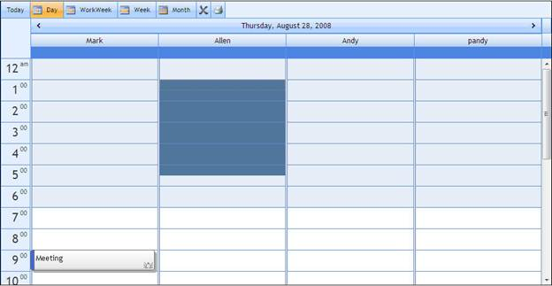
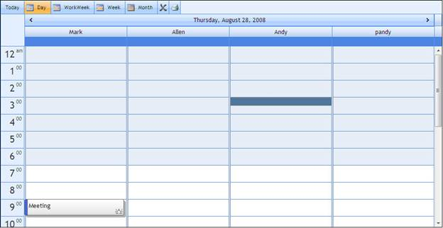

::: {style="DISPLAY: none"}
{#d2h_url_template}{#d2h_package_url style="WIDTH: 0px; DISPLAY: none; HEIGHT: 0px"}
:::

::::: {#nsbanner .d2h_main_nsbanner style="BORDER-BOTTOM: #999999 1px solid; POSITION: relative; PADDING-BOTTOM: 0px; BACKGROUND-COLOR: transparent; PADDING-LEFT: 0px; PADDING-RIGHT: 0px; DISPLAY: none; BORDER-TOP: #999999 1px solid; PADDING-TOP: 0px; LEFT: 0px"}
:::: {#TitleRow .d2h_main_titlerow style="PADDING-BOTTOM: 4px; BACKGROUND-COLOR: transparent; PADDING-LEFT: 22px; WIDTH: 100%; PADDING-RIGHT: 10px; DISPLAY: none; PADDING-TOP: 4px"}
::: {#ienav .d2h_main_ienav style="DISPLAY: none"}
{#D2HPrevious .D2HPreviousEnabled}  {#D2HNext .D2HNextEnabled}
:::
::::
:::::

::::::::: {#nstext .d2h_main_nstext style="PADDING-BOTTOM: 10px; BACKGROUND-COLOR: transparent; PADDING-LEFT: 22px; PADDING-RIGHT: 10px; HEIGHT: 100%; OVERFLOW: auto; PADDING-TOP: 5px" hasuserbackground="true" valign="bottom"}
::: {#d2h_breadcrumbs .d2h_breadcrumbs}
[Essential Studio User Guide Documentation](ms-xhelp:///?Id=12457748-09e3-4d74-a240-8e049cedf030){.d2h_breadcrumbsNormal}[ \> ]{.d2h_breadcrumbsLinkSeparator}[User Interface Edition](ms-xhelp:///?Id=c29296b7-531c-413b-a0ec-488ca1f7f669){.d2h_breadcrumbsNormal}[ \> ]{.d2h_breadcrumbsLinkSeparator}[Essential ASP.NET](ms-xhelp:///?Id=25c35330-c127-4dad-9a92-ed79dc7261a6){.d2h_breadcrumbsNormal}[ \> ]{.d2h_breadcrumbsLinkSeparator}[Essential Schedule]{.d2h_breadcrumbsContentsOnly}[ \> ]{.d2h_breadcrumbsLinkSeparator}[Concepts and Features](ms-xhelp:///?Id=64869483-f57f-4838-b322-b1a3d1ce8e40){.d2h_breadcrumbsNormal}
:::

## Keyboard Navigation {#keyboard-navigation style="tab-stops: 0pt"}

Essential Schedule Asp.net provides extensive support for keyboard navigation. This feature helps to access Schedule components and operations through your keyboard. This keyboard interface feature is similar to Microsoft Outlook's Calendar.

 

Use Case Scenarios

The keyboard navigation is useful when the user does not want to depend on the mouse for interaction with the controls.

 

Keyboard Navigation Support to an Application

Keyboard Interface can be done in two methods namely:

 

[·      ]{style="FONT-FAMILY: Symbol"}Default Keys and

[·      ]{style="FONT-FAMILY: Symbol"}Configured Keys

 

 

Keyboard Navigation with Default Keys

You can perform the core operations of Schedule using a keyboard. The default keys for certain specific actions are tabulated below.

[]{style="LINE-HEIGHT: 115%; FONT-FAMILY: 'Calibri','sans-serif'; FONT-SIZE: 11pt"} 

Table 6: Action Keys Table

::: {align="center"}
  ------------------------------------------------------------------------------------- -------------------------------------------------------------------------------------------------
  Action[]{style="FONT-FAMILY: 'Calibri','sans-serif'; FONT-SIZE: 11pt"}                Default Keys[]{style="FONT-FAMILY: 'Calibri','sans-serif'; FONT-SIZE: 11pt"}
  FocusKey[]{style="FONT-FAMILY: 'Calibri','sans-serif'; FONT-SIZE: 11pt"}              Ctrl+Alt+F[]{style="FONT-FAMILY: 'Calibri','sans-serif'; FONT-SIZE: 11pt"}
  NavigateAppointment[]{style="FONT-FAMILY: 'Calibri','sans-serif'; FONT-SIZE: 11pt"}   Tab[]{style="FONT-FAMILY: 'Calibri','sans-serif'; FONT-SIZE: 11pt"}
  Moving Front[]{style="FONT-FAMILY: 'Calibri','sans-serif'; FONT-SIZE: 11pt"}          Shift+Tab[]{style="FONT-FAMILY: 'Calibri','sans-serif'; COLOR: #2b91af; FONT-SIZE: 11pt"}
  InsertAppointment[]{style="FONT-FAMILY: 'Calibri','sans-serif'; FONT-SIZE: 11pt"}     Insert[]{style="FONT-FAMILY: 'Calibri','sans-serif'; COLOR: #2b91af; FONT-SIZE: 11pt"}
  Edit Appointment[]{style="FONT-FAMILY: 'Calibri','sans-serif'; FONT-SIZE: 11pt"}      Enter[]{style="FONT-FAMILY: 'Calibri','sans-serif'; COLOR: #2b91af; FONT-SIZE: 11pt"}
  Copy Appointment[]{style="FONT-FAMILY: 'Calibri','sans-serif'; FONT-SIZE: 11pt"}      Ctrl+C[]{style="FONT-FAMILY: 'Calibri','sans-serif'; COLOR: #2b91af; FONT-SIZE: 11pt"}
  Cut Appointment[]{style="FONT-FAMILY: 'Calibri','sans-serif'; FONT-SIZE: 11pt"}       Ctrl+X[]{style="FONT-FAMILY: 'Calibri','sans-serif'; COLOR: #2b91af; FONT-SIZE: 11pt"}
  Paste Appointment[]{style="FONT-FAMILY: 'Calibri','sans-serif'; FONT-SIZE: 11pt"}     Ctrl+V[]{style="FONT-FAMILY: 'Calibri','sans-serif'; COLOR: #2b91af; FONT-SIZE: 11pt"}
  Export Appointment[]{style="FONT-FAMILY: 'Calibri','sans-serif'; FONT-SIZE: 11pt"}    Shift+E[]{style="FONT-FAMILY: 'Calibri','sans-serif'; COLOR: #2b91af; FONT-SIZE: 11pt"}
  MoveTimeCellUp[]{style="FONT-FAMILY: 'Calibri','sans-serif'; FONT-SIZE: 11pt"}        UpArrow[]{style="FONT-FAMILY: 'Calibri','sans-serif'; COLOR: #2b91af; FONT-SIZE: 11pt"}
  MoveTimeCellDown[]{style="FONT-FAMILY: 'Calibri','sans-serif'; FONT-SIZE: 11pt"}      DownArrow[]{style="FONT-FAMILY: 'Calibri','sans-serif'; COLOR: #2b91af; FONT-SIZE: 11pt"}
  MoveTimeCellLeft[]{style="FONT-FAMILY: 'Calibri','sans-serif'; FONT-SIZE: 11pt"}      LeftArrow[]{style="FONT-FAMILY: 'Calibri','sans-serif'; COLOR: #2b91af; FONT-SIZE: 11pt"}
  MoveTimeCellRight[]{style="FONT-FAMILY: 'Calibri','sans-serif'; FONT-SIZE: 11pt"}     RightArrow[]{style="FONT-FAMILY: 'Calibri','sans-serif'; COLOR: #2b91af; FONT-SIZE: 11pt"}
  ShowCalendarLeft[]{style="FONT-FAMILY: 'Calibri','sans-serif'; FONT-SIZE: 11pt"}      Shift+L[]{style="FONT-FAMILY: 'Calibri','sans-serif'; COLOR: #2b91af; FONT-SIZE: 11pt"}
  ShowCalendarRight[]{style="FONT-FAMILY: 'Calibri','sans-serif'; FONT-SIZE: 11pt"}     Shift+R[]{style="FONT-FAMILY: 'Calibri','sans-serif'; COLOR: #2b91af; FONT-SIZE: 11pt"}
  HideCalendar[]{style="FONT-FAMILY: 'Calibri','sans-serif'; FONT-SIZE: 11pt"}          Shift+N[]{style="FONT-FAMILY: 'Calibri','sans-serif'; COLOR: #2b91af; FONT-SIZE: 11pt"}
  SaveAppointment[]{style="FONT-FAMILY: 'Calibri','sans-serif'; FONT-SIZE: 11pt"}       Ctrl+S[]{style="FONT-FAMILY: 'Calibri','sans-serif'; COLOR: #2b91af; FONT-SIZE: 11pt"}
  MultiSelectionUp[]{style="FONT-FAMILY: 'Calibri','sans-serif'; FONT-SIZE: 11pt"}      Shift+UpArrow[]{style="FONT-FAMILY: 'Calibri','sans-serif'; COLOR: #2b91af; FONT-SIZE: 11pt"}
  MultiSelectionDown[]{style="FONT-FAMILY: 'Calibri','sans-serif'; FONT-SIZE: 11pt"}    Shift+DownArrow[]{style="FONT-FAMILY: 'Calibri','sans-serif'; COLOR: #2b91af; FONT-SIZE: 11pt"}
  FocusOut[]{style="FONT-FAMILY: 'Calibri','sans-serif'; FONT-SIZE: 11pt"}              Esc[]{style="FONT-FAMILY: 'Calibri','sans-serif'; COLOR: #2b91af; FONT-SIZE: 11pt"}
  DeleteAppointment[]{style="FONT-FAMILY: 'Calibri','sans-serif'; FONT-SIZE: 11pt"}     Delete[]{style="FONT-FAMILY: 'Calibri','sans-serif'; COLOR: #2b91af; FONT-SIZE: 11pt"}
  Today[]{style="FONT-FAMILY: 'Calibri','sans-serif'; FONT-SIZE: 11pt"}                 Ctrl+Alt+0[]{style="FONT-FAMILY: 'Calibri','sans-serif'; FONT-SIZE: 11pt"}
  Day[]{style="FONT-FAMILY: 'Calibri','sans-serif'; FONT-SIZE: 11pt"}                   Ctrl+Alt+1[]{style="FONT-FAMILY: 'Calibri','sans-serif'; FONT-SIZE: 11pt"}
  WorkWeek[]{style="FONT-FAMILY: 'Calibri','sans-serif'; FONT-SIZE: 11pt"}              Ctrl+Alt+2[]{style="FONT-FAMILY: 'Calibri','sans-serif'; FONT-SIZE: 11pt"}
  Week[]{style="FONT-FAMILY: 'Calibri','sans-serif'; FONT-SIZE: 11pt"}                  Ctrl+Alt+3[]{style="FONT-FAMILY: 'Calibri','sans-serif'; FONT-SIZE: 11pt"}
  Month[]{style="FONT-FAMILY: 'Calibri','sans-serif'; FONT-SIZE: 11pt"}                 Ctrl+Alt+4[]{style="FONT-FAMILY: 'Calibri','sans-serif'; FONT-SIZE: 11pt"}
  Print[]{style="FONT-FAMILY: 'Calibri','sans-serif'; FONT-SIZE: 11pt"}                 Ctrl+P[]{style="FONT-FAMILY: 'Calibri','sans-serif'; FONT-SIZE: 11pt"}
  ------------------------------------------------------------------------------------- -------------------------------------------------------------------------------------------------
:::

 

Key Configuration: All keyboard shortcuts can be optimized and personalized using the KeyConfigurator property in Schedule.

::: {style="BORDER-BOTTOM: windowtext 1pt solid; BORDER-LEFT: medium none; PADDING-BOTTOM: 1pt; MARGIN-TOP: 9pt; PADDING-LEFT: 0pt; PADDING-RIGHT: 0pt; MARGIN-BOTTOM: 9pt; BORDER-TOP: windowtext 1pt solid; BORDER-RIGHT: medium none; PADDING-TOP: 1pt"}
Note: Keyboard Shortcuts work only when Schedule is in focus. Focus can be set by clicking on any part of the Schedule or by using the shortcut of the Focus Action Key.
:::

 

**** 

Keyboard Navigation with Configured Keys

 

KeyConfigurator property is used for customizing keys. You can configure keys to perform the operations you want to.

 

The following code illustrates the use of KeyConfigurator property in design time.

 

+-----------------------------------------------------------------------------------------------------------------------------------------------------------------------------------------------------------------------------------------------------------------------------------------------------------------------------------------------------------------------------------------------------------------------------------------------------------------------------------------------------------------------------------------------------------------------------------------------------------------------------------------------------------------------------------------------------------------------------------------------------------------------------------------------------------------------------------------------------------------------------------------------------------------------------------------------------------------------------------------------------------------------------------------------------------------------------------------------------------------------------------------------------------------------------------+
| **[ \[Aspx\]]{style="FONT-FAMILY: 'Courier New'"}**                                                                                                                                                                                                                                                                                                                                                                                                                                                                                                                                                                                                                                                                                                                                                                                                                                                                                                                                                                                                                                                                                                                               |
|                                                                                                                                                                                                                                                                                                                                                                                                                                                                                                                                                                                                                                                                                                                                                                                                                                                                                                                                                                                                                                                                                                                                                                                   |
| [ \<]{style="FONT-FAMILY: 'Courier New'; COLOR: blue"}[syncfusion]{style="FONT-FAMILY: 'Courier New'; COLOR: #a31515"}[:]{style="FONT-FAMILY: 'Courier New'; COLOR: blue"}[Schedule]{style="FONT-FAMILY: 'Courier New'; COLOR: #a31515"}[ [ID]{style="COLOR: red"}[=\"Schedule1\"]{style="COLOR: blue"} [runat]{style="COLOR: red"}[=\"server\"]{style="COLOR: blue"}  [ViewStrip]{style="COLOR: red"}[=\"True\"]{style="COLOR: blue"} [AppointmentDataSourceID]{style="COLOR: red"}[=\"\"]{style="COLOR: blue"}  [CategoryDataSourceID]{style="COLOR: red"}[=\"\"]{style="COLOR: blue"} [EnableXHTML]{style="COLOR: red"}[=\"False\"]{style="COLOR: blue"} [ResourceDataSourceID]{style="COLOR: red"}[=\"\"]{style="COLOR: blue"} [StartDate]{style="COLOR: red"}[=\"2008-08-28\"]{style="COLOR: blue"} [UserOverrideCulture]{style="COLOR: red"}[=\"English (United States)\"]{style="COLOR: blue"} [ViewMode]{style="COLOR: red"}[=\"Vertical\"]{style="COLOR: blue"} [Width]{style="COLOR: red"}[=\"100%\"]{style="COLOR: blue"} [Height]{style="COLOR: red"}[=\"50%\"\>]{style="COLOR: blue"}]{style="FONT-FAMILY: 'Courier New'"}**[]{style="FONT-FAMILY: 'Courier New'"}** |
|                                                                                                                                                                                                                                                                                                                                                                                                                                                                                                                                                                                                                                                                                                                                                                                                                                                                                                                                                                                                                                                                                                                                                                                   |
| [\<]{style="FONT-FAMILY: 'Courier New'; COLOR: blue"}[KeyConfigurator]{style="FONT-FAMILY: 'Courier New'; COLOR: #a31515"}[ [CopyAppointment]{style="COLOR: red"}[=\"AltPlus0\"]{style="COLOR: blue"} [CutAppointment]{style="COLOR: red"}[=\"AltPlus1\"]{style="COLOR: blue"} [PasteAppointment]{style="COLOR: red"}[=\"AltPlusC\"]{style="COLOR: blue"} [NavigateAppointment]{style="COLOR: red"}[=\"AltPlus2\"]{style="COLOR: blue"} [MoveTimeCellUp]{style="COLOR: red"}[=\"AltPlus4\"]{style="COLOR: blue"}  [ExportAppointment]{style="COLOR: red"}[=\"AltPlus3\"]{style="COLOR: blue"} [DeleteAppointment]{style="COLOR: red"}[=\"AltPlusDelete\"]{style="COLOR: blue"} [InsertAppointment]{style="COLOR: red"}[=\"AltPlusI\"/\>]{style="COLOR: blue"}]{style="FONT-FAMILY: 'Courier New'"}**[]{style="FONT-FAMILY: 'Courier New'"}**                                                                                                                                                                                                                                                                                                                                      |
+-----------------------------------------------------------------------------------------------------------------------------------------------------------------------------------------------------------------------------------------------------------------------------------------------------------------------------------------------------------------------------------------------------------------------------------------------------------------------------------------------------------------------------------------------------------------------------------------------------------------------------------------------------------------------------------------------------------------------------------------------------------------------------------------------------------------------------------------------------------------------------------------------------------------------------------------------------------------------------------------------------------------------------------------------------------------------------------------------------------------------------------------------------------------------------------+

[]{style="LINE-HEIGHT: 115%; FONT-FAMILY: 'Calibri','sans-serif'; FONT-SIZE: 11pt"} 

Multi Selection of Time Cells

 

Multiple selection of time cells works similar to the multi-selection feature in Microsoft Outlook's Calendar.

 

Multi Selection of Time Cells Using Keyboard

 

You can select multiple time cells by using the following two operations of schedule, by either using default or customized keys, to select multiple time cells.

[·      ]{style="FONT-FAMILY: Symbol"}MultiSelectionUp

[·      ]{style="FONT-FAMILY: Symbol"}MultiSelectionDown

[]{style="LINE-HEIGHT: 115%; FONT-FAMILY: 'Calibri','sans-serif'; FONT-SIZE: 11pt"} 

{border="0"}

Figure 95: Multiple Time Cell Focus.

 

Properties

[]{style="LINE-HEIGHT: 115%; FONT-SIZE: 11pt"} 

Table 7: Property Table

::: {align="center"}
+-----------------+-------------------------------------------+----------------------+------------------+------------------------+
| Name            | Description                               | Type of the property | Data Type        | Value it accepts       |
+-----------------+-------------------------------------------+----------------------+------------------+------------------------+
| KeyConfigurator | Used to customize all keyboard shortcuts. | Server side          | KeyConfiguration | KeyConfigurator object |
|                 |                                           |                      |                  |                        |
|                 |                                           |                      |                  |                        |
+-----------------+-------------------------------------------+----------------------+------------------+------------------------+
:::

[]{style="LINE-HEIGHT: 115%; FONT-FAMILY: 'Calibri','sans-serif'; FONT-SIZE: 11pt"} 

[]{style="LINE-HEIGHT: 115%; FONT-FAMILY: 'Calibri','sans-serif'; FONT-SIZE: 11pt"} 

Table 8: KeyConfigurator Table

::: {align="center"}
+----------------------------------------------------------+---------------------------------------------------------------------------------------------------+----------------------------------------------------------------------------------+-------------------------------------------------------+--------------------------------------------------------------------------+
| Name []{style="COLOR: #4e84c4; FONT-SIZE: 16pt"}         | Description []{style="COLOR: #4e84c4; FONT-SIZE: 16pt"}                                           | Type of the property[]{style="COLOR: #4e84c4; FONT-SIZE: 16pt"}                  | Data Type []{style="COLOR: #4e84c4; FONT-SIZE: 16pt"} | Value it accepts []{style="COLOR: #4e84c4; FONT-SIZE: 16pt"}             |
+----------------------------------------------------------+---------------------------------------------------------------------------------------------------+----------------------------------------------------------------------------------+-------------------------------------------------------+--------------------------------------------------------------------------+
| Focus Key**[]{style="COLOR: #4e84c4; FONT-SIZE: 16pt"}** | Used to set the keyboard shortcut for Focus key**[]{style="COLOR: black; FONT-SIZE: 16pt"}**      | [Server side]{style="COLOR: black"}**[]{style="COLOR: black; FONT-SIZE: 16pt"}** | Keys                                                  | [Keys options]{style="COLOR: blue"}[[]{style="COLOR: blue"}]{.underline} |
+----------------------------------------------------------+---------------------------------------------------------------------------------------------------+----------------------------------------------------------------------------------+-------------------------------------------------------+--------------------------------------------------------------------------+
| NavigateAppointment                                      | Used to set the keyboard shortcut for navigating appointments                                     | [Server side]{style="COLOR: black"}                                              | Keys                                                  | [Keys options]{style="COLOR: blue"}                                      |
+----------------------------------------------------------+---------------------------------------------------------------------------------------------------+----------------------------------------------------------------------------------+-------------------------------------------------------+--------------------------------------------------------------------------+
| MovingFront                                              | Used to set the keyboard shortcut for moving backward to front                                    | [Server side]{style="COLOR: black"}                                              | Keys                                                  | [Keys options]{style="COLOR: blue"}                                      |
+----------------------------------------------------------+---------------------------------------------------------------------------------------------------+----------------------------------------------------------------------------------+-------------------------------------------------------+--------------------------------------------------------------------------+
| InsertAppointment                                        | Used to set the keyboard shortcut for adding appointment                                          | [Server side]{style="COLOR: black"}                                              | Keys                                                  | [Keys options]{style="COLOR: blue"}                                      |
+----------------------------------------------------------+---------------------------------------------------------------------------------------------------+----------------------------------------------------------------------------------+-------------------------------------------------------+--------------------------------------------------------------------------+
| Delete Appointment                                       | Used to set the keyboard shortcut for deleting appointment                                        | [Server side]{style="COLOR: black"}                                              | Keys                                                  | [Keys options]{style="COLOR: blue"}                                      |
+----------------------------------------------------------+---------------------------------------------------------------------------------------------------+----------------------------------------------------------------------------------+-------------------------------------------------------+--------------------------------------------------------------------------+
| Edit Appointment                                         | Used to set the keyboard shortcut for editing an appointment                                      | Server side                                                                      | Keys                                                  | [Keys options]{style="COLOR: blue"}                                      |
+----------------------------------------------------------+---------------------------------------------------------------------------------------------------+----------------------------------------------------------------------------------+-------------------------------------------------------+--------------------------------------------------------------------------+
| Export Appointment                                       | Used to set the keyboard shortcut for  exporting appointments from Schedule to Outlook(.ics )     | [Server side]{style="COLOR: black"}                                              | Keys                                                  | [Keys options]{style="COLOR: blue"}                                      |
+----------------------------------------------------------+---------------------------------------------------------------------------------------------------+----------------------------------------------------------------------------------+-------------------------------------------------------+--------------------------------------------------------------------------+
| ShowCalendarLeft                                         | Used to set the keyboard shortcut for displaying the calendar on the left side of Schedule        | [Server side]{style="COLOR: black"}                                              | Keys                                                  | [Keys options]{style="COLOR: blue"}                                      |
+----------------------------------------------------------+---------------------------------------------------------------------------------------------------+----------------------------------------------------------------------------------+-------------------------------------------------------+--------------------------------------------------------------------------+
| ShowCalendarRight                                        | Used to set the keyboard shortcut for displaying the calendar on the  right side of Schedule      | Server side                                                                      | Keys                                                  | [Keys options]{style="COLOR: blue"}                                      |
+----------------------------------------------------------+---------------------------------------------------------------------------------------------------+----------------------------------------------------------------------------------+-------------------------------------------------------+--------------------------------------------------------------------------+
| Hide Calendar                                            | Used to set the keyboard shortcut for hiding the calendar                                         | Server side                                                                      | Keys                                                  | [Keys options]{style="COLOR: blue"}                                      |
+----------------------------------------------------------+---------------------------------------------------------------------------------------------------+----------------------------------------------------------------------------------+-------------------------------------------------------+--------------------------------------------------------------------------+
| CutAppointment                                           | Used to set the keyboard shortcut for cut appointment                                             | Server side                                                                      | Keys                                                  | [Keys options]{style="COLOR: blue"}                                      |
+----------------------------------------------------------+---------------------------------------------------------------------------------------------------+----------------------------------------------------------------------------------+-------------------------------------------------------+--------------------------------------------------------------------------+
| CopyAppointment                                          | Used to set the keyboard shortcut for copy appointment                                            | Server side                                                                      | Keys                                                  | [Keys options]{style="COLOR: blue"}                                      |
+----------------------------------------------------------+---------------------------------------------------------------------------------------------------+----------------------------------------------------------------------------------+-------------------------------------------------------+--------------------------------------------------------------------------+
| Paste Appointment                                        | Used to set the keyboard shortcut for pasting an appointment in the new location.                 | Server side                                                                      | Keys                                                  | [Keys options]{style="COLOR: blue"}                                      |
+----------------------------------------------------------+---------------------------------------------------------------------------------------------------+----------------------------------------------------------------------------------+-------------------------------------------------------+--------------------------------------------------------------------------+
| MoveTimeCellUp                                           | Used to set the keyboard shortcut for moving the time cell focus up.                              | Server side                                                                      | Keys                                                  | [Keys options]{style="COLOR: blue"}                                      |
+----------------------------------------------------------+---------------------------------------------------------------------------------------------------+----------------------------------------------------------------------------------+-------------------------------------------------------+--------------------------------------------------------------------------+
| MoveTimeCellDown                                         | Used to set the keyboard shortcut for moving the time cell focus down.                            | Server side                                                                      | Keys                                                  | [Keys options]{style="COLOR: blue"}                                      |
+----------------------------------------------------------+---------------------------------------------------------------------------------------------------+----------------------------------------------------------------------------------+-------------------------------------------------------+--------------------------------------------------------------------------+
| MoveTimeCellLeft                                         | Used to set the keyboard shortcut for moving the time cell focus left.                            | Server side                                                                      | Keys                                                  | [Keys options]{style="COLOR: blue"}                                      |
+----------------------------------------------------------+---------------------------------------------------------------------------------------------------+----------------------------------------------------------------------------------+-------------------------------------------------------+--------------------------------------------------------------------------+
| MoveTimeCellRight                                        | Used to set the keyboard shortcut for moving the time cell focus right.                           | Server side                                                                      | Keys                                                  | [Keys options]{style="COLOR: blue"}                                      |
|                                                          |                                                                                                   |                                                                                  |                                                       |                                                                          |
|                                                          |                                                                                                   |                                                                                  |                                                       |                                                                          |
+----------------------------------------------------------+---------------------------------------------------------------------------------------------------+----------------------------------------------------------------------------------+-------------------------------------------------------+--------------------------------------------------------------------------+
| MultiSelectionUp                                         | Used to set the keyboard shortcut for selecting multiple time cells in the upward direction.      | [Server side]{style="COLOR: black"}                                              | Keys                                                  | [Keys options]{style="COLOR: blue"}                                      |
+----------------------------------------------------------+---------------------------------------------------------------------------------------------------+----------------------------------------------------------------------------------+-------------------------------------------------------+--------------------------------------------------------------------------+
| MultiSelectionDown                                       | Used to set the keyboard shortcut for selecting multiple time cells in the downward direction.    | [Server side]{style="COLOR: black"}                                              | Keys                                                  | [Keys options]{style="COLOR: blue"}                                      |
+----------------------------------------------------------+---------------------------------------------------------------------------------------------------+----------------------------------------------------------------------------------+-------------------------------------------------------+--------------------------------------------------------------------------+
| SaveAppointment                                          | Used to set the keyboard shortcut for saving the appointment in Schedule through add/edit dialog. | [Server side]{style="COLOR: black"}                                              | Keys                                                  | [Keys options]{style="COLOR: blue"}                                      |
+----------------------------------------------------------+---------------------------------------------------------------------------------------------------+----------------------------------------------------------------------------------+-------------------------------------------------------+--------------------------------------------------------------------------+
| FocuOut                                                  | Used to set the keyboard shortcut for focus out.                                                  | [Server side]{style="COLOR: black"}                                              | Keys                                                  | [Keys options]{style="COLOR: blue"}                                      |
+----------------------------------------------------------+---------------------------------------------------------------------------------------------------+----------------------------------------------------------------------------------+-------------------------------------------------------+--------------------------------------------------------------------------+
| Today                                                    | Used to set the keyboard shortcut for moving to 'Today view".                                     | Server side                                                                      | Keys                                                  | [Keys options]{style="COLOR: blue"}                                      |
+----------------------------------------------------------+---------------------------------------------------------------------------------------------------+----------------------------------------------------------------------------------+-------------------------------------------------------+--------------------------------------------------------------------------+
| Day                                                      | Used to set the Keyboard shortcut for moving to "Day view".                                       | Server side                                                                      | Keys                                                  | [Keys options]{style="COLOR: blue"}                                      |
+----------------------------------------------------------+---------------------------------------------------------------------------------------------------+----------------------------------------------------------------------------------+-------------------------------------------------------+--------------------------------------------------------------------------+
| WorkWeek                                                 | Used to set the Keyboard shortcut for moving to "Workweek view".                                  | Server side                                                                      | Keys                                                  | [Keys options]{style="COLOR: blue"}                                      |
+----------------------------------------------------------+---------------------------------------------------------------------------------------------------+----------------------------------------------------------------------------------+-------------------------------------------------------+--------------------------------------------------------------------------+
| Week                                                     | Used to set the keyboard shortcut for moving to "Week view".                                      | Server side                                                                      | Keys                                                  | [Keys options]{style="COLOR: blue"}                                      |
+----------------------------------------------------------+---------------------------------------------------------------------------------------------------+----------------------------------------------------------------------------------+-------------------------------------------------------+--------------------------------------------------------------------------+
| Month                                                    | Used to set the Keyboard shortcut for moving to "Month view".                                     | Server side                                                                      | Keys                                                  | [Keys options]{style="COLOR: blue"}                                      |
+----------------------------------------------------------+---------------------------------------------------------------------------------------------------+----------------------------------------------------------------------------------+-------------------------------------------------------+--------------------------------------------------------------------------+
| Print                                                    | Used to set the keyboard shortcut for print in Schedule.                                          | Server side                                                                      | Keys                                                  | [Keys options]{style="COLOR: blue"}                                      |
+==========================================================+===================================================================================================+==================================================================================+=======================================================+==========================================================================+
:::

[]{style="LINE-HEIGHT: 115%; FONT-FAMILY: 'Calibri','sans-serif'; FONT-SIZE: 11pt"} 

[]{#KeysEnumerableOptions}[]{#_1.6_Keys_Enumerable}Keys Enumerable Options

Keys Enumerable contains the list of all possible keys used to perform key customization,which enables the user to choose specific keys to perform the required operations in Schedule.

 

The following list of keys that are used to customize the keys, is listed in KeyConfigurator property .

[]{style="FONT-FAMILY: 'Courier New'"} 

[]{style="FONT-FAMILY: 'Courier New'"} 

[·      ]{style="FONT-FAMILY: Symbol"}Keys.CtrlPlusAltPlusF

[·      ]{style="FONT-FAMILY: Symbol"}Keys.Tab

[·      ]{style="FONT-FAMILY: Symbol"}Keys.ShiftPlusTab

[·      ]{style="FONT-FAMILY: Symbol"}Keys.UpArrow;

[·      ]{style="FONT-FAMILY: Symbol"}Keys.DownArrow

[·      ]{style="FONT-FAMILY: Symbol"}Keys.LeftArrow

[·      ]{style="FONT-FAMILY: Symbol"}Keys.RightArrow

[·      ]{style="FONT-FAMILY: Symbol"}Keys.Insert

[·      ]{style="FONT-FAMILY: Symbol"}Keys.Delete

[·      ]{style="FONT-FAMILY: Symbol"}Keys.Enter

[·      ]{style="FONT-FAMILY: Symbol"}Keys.CtrlPlusS

[·      ]{style="FONT-FAMILY: Symbol"}Keys.ShiftPlusE

[·      ]{style="FONT-FAMILY: Symbol"}Keys.ShiftPlusL

[·      ]{style="FONT-FAMILY: Symbol"}Keys.ShiftPlusR

[·      ]{style="FONT-FAMILY: Symbol"}Keys.ShiftPlusN

[·      ]{style="FONT-FAMILY: Symbol"}Keys.CtrlPlusAltPlus0

[·      ]{style="FONT-FAMILY: Symbol"}Keys.CtrlPlusAltPlus1

[·      ]{style="FONT-FAMILY: Symbol"}Keys.CtrlPlusAltPlus2

[·      ]{style="FONT-FAMILY: Symbol"}Keys.CtrlPlusAltPlus3

[·      ]{style="FONT-FAMILY: Symbol"}Keys.CtrlPlusAltPlus4

[·      ]{style="FONT-FAMILY: Symbol"}Keys.CtrlPlusP

[·      ]{style="FONT-FAMILY: Symbol"}Keys.ShiftPlusDownArrow

[·      ]{style="FONT-FAMILY: Symbol"}Keys.ShiftPlusUpArrow

[·      ]{style="FONT-FAMILY: Symbol"}Keys.CtrlPlusC

[·      ]{style="FONT-FAMILY: Symbol"}Keys.CtrlPlus

[·      ]{style="FONT-FAMILY: Symbol"}Keys.CtrlPlusV

[·    ]{style="FONT-FAMILY: Symbol; FONT-SIZE: 11pt"}Keys.Esc[]{style="FONT-FAMILY: 'Calibri','sans-serif'; FONT-SIZE: 11pt"}

[·    ]{style="FONT-FAMILY: Symbol; FONT-SIZE: 11pt"}Keys.AltPlusTab[]{style="FONT-FAMILY: 'Calibri','sans-serif'; FONT-SIZE: 11pt"}

[·    ]{style="FONT-FAMILY: Symbol; FONT-SIZE: 11pt"}Keys.AltPlusShiftPlusTab[]{style="FONT-FAMILY: 'Calibri','sans-serif'; FONT-SIZE: 11pt"}

[·    ]{style="FONT-FAMILY: Symbol; FONT-SIZE: 11pt"}Keys.AltPlusUpArrow[]{style="FONT-FAMILY: 'Calibri','sans-serif'; FONT-SIZE: 11pt"}

[·    ]{style="FONT-FAMILY: Symbol; FONT-SIZE: 11pt"}Keys.AltPlusEsc[]{style="FONT-FAMILY: 'Calibri','sans-serif'; FONT-SIZE: 11pt"}

[·    ]{style="FONT-FAMILY: Symbol; FONT-SIZE: 11pt"}Keys.CtrlPlusAltPlusTab[]{style="FONT-FAMILY: 'Calibri','sans-serif'; FONT-SIZE: 11pt"}

[·    ]{style="FONT-FAMILY: Symbol; FONT-SIZE: 11pt"}Keys.CtrlPlusAltPlusShiftPlusTab[]{style="FONT-FAMILY: 'Calibri','sans-serif'; FONT-SIZE: 11pt"}

[·    ]{style="FONT-FAMILY: Symbol; FONT-SIZE: 11pt"}Keys.CtrlPlusAltPlusUpArrow[]{style="FONT-FAMILY: 'Calibri','sans-serif'; FONT-SIZE: 11pt"}

[·    ]{style="FONT-FAMILY: Symbol; FONT-SIZE: 11pt"}Keys.CtrlPlusAltPlusEsc[]{style="FONT-FAMILY: 'Calibri','sans-serif'; FONT-SIZE: 11pt"}

[·    ]{style="FONT-FAMILY: Symbol; FONT-SIZE: 11pt"}Keys.AltPlusB[]{style="FONT-FAMILY: 'Calibri','sans-serif'; FONT-SIZE: 11pt"}

[·    ]{style="FONT-FAMILY: Symbol; FONT-SIZE: 11pt"}Keys.AltPlusC[]{style="FONT-FAMILY: 'Calibri','sans-serif'; FONT-SIZE: 11pt"}

[·    ]{style="FONT-FAMILY: Symbol; FONT-SIZE: 11pt"}Keys.AltPlusD[]{style="FONT-FAMILY: 'Calibri','sans-serif'; FONT-SIZE: 11pt"}

[·    ]{style="FONT-FAMILY: Symbol; FONT-SIZE: 11pt"}Keys.AltPlusZ[]{style="FONT-FAMILY: 'Calibri','sans-serif'; FONT-SIZE: 11pt"}

[·    ]{style="FONT-FAMILY: Symbol; FONT-SIZE: 11pt"}Keys.CtrlPlusAltPlusB[]{style="FONT-FAMILY: 'Calibri','sans-serif'; FONT-SIZE: 11pt"}

[·    ]{style="FONT-FAMILY: Symbol; FONT-SIZE: 11pt"}Keys.CtrlPlusAltPlusC[]{style="FONT-FAMILY: 'Calibri','sans-serif'; FONT-SIZE: 11pt"}

[·    ]{style="FONT-FAMILY: Symbol; FONT-SIZE: 11pt"}Keys.CtrlPlusAltPlusD[]{style="FONT-FAMILY: 'Calibri','sans-serif'; FONT-SIZE: 11pt"}

[·    ]{style="FONT-FAMILY: Symbol; FONT-SIZE: 11pt"}Keys.CtrlPlusAltPlusZ[]{style="FONT-FAMILY: 'Calibri','sans-serif'; FONT-SIZE: 11pt"}

[]{style="LINE-HEIGHT: 115%; FONT-FAMILY: 'Calibri','sans-serif'; FONT-SIZE: 11pt"} 

Keyboard--Mouse Interaction

 

You can select appointments using your mouse and perform the cut/copy/edit operations in an appointment using keyboard, in the same way that Essential Schedule supports time cell focus using the keyboard as well as mouse.

 

Multiple Time Cells Selection Using Mouse

The selection of multiple time cells through keyboard keys as well as mouse clicks is similar to Microsoft Outlook-calendar.

 

::: {align="center"}
  ---------------------------------------------------------------------------------------- ----------------------------------------------------------------------------------------------
  Function[]{style="FONT-FAMILY: 'Calibri','sans-serif'; FONT-SIZE: 11pt"}                 How you perform the function[]{style="FONT-FAMILY: 'Calibri','sans-serif'; FONT-SIZE: 11pt"}
  TimeCellFocus[]{style="FONT-FAMILY: 'Calibri','sans-serif'; FONT-SIZE: 11pt"}            Click onTime Cell[]{style="FONT-FAMILY: 'Calibri','sans-serif'; FONT-SIZE: 11pt"}
  MultipleTimeCell Focus[]{style="FONT-FAMILY: 'Calibri','sans-serif'; FONT-SIZE: 11pt"}   Shift +Click   onTimeCell[]{style="FONT-FAMILY: 'Calibri','sans-serif'; FONT-SIZE: 11pt"}
  ---------------------------------------------------------------------------------------- ----------------------------------------------------------------------------------------------
:::

[]{style="LINE-HEIGHT: 115%; FONT-FAMILY: 'Calibri','sans-serif'; FONT-SIZE: 11pt"} 

 {border="0"}

Figure 96: Time Cell Focus --When Clicking on Time Cell

 

Sample Link

To view the samples:

1.      Open the ASP.NET Schedule sample browser from the dashboard. (Refer to Samples and Location chapter)

2.      Navigate to **ASP.NET**-\> **User Interface** -\> **Keyboard Navigation**.

[]{style="LINE-HEIGHT: 115%; FONT-FAMILY: 'Calibri','sans-serif'; FONT-SIZE: 11pt"} 

 

 

[]{#related-topics}
:::::::::
