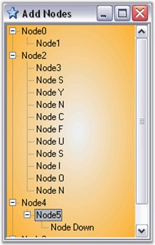

::: {style="DISPLAY: none"}
{#d2h_url_template}{#d2h_package_url style="WIDTH: 0px; DISPLAY: none; HEIGHT: 0px"}
:::

:::: {.d2h_secondary_topic style="PADDING-BOTTOM: 10pt; MARGIN: 0pt; PADDING-LEFT: 0pt; PADDING-RIGHT: 0pt; PADDING-TOP: 0pt"}
##### KeyDown Event {#keydown-event style="MARGIN-LEFT: 18pt; tab-stops: 18.0pt"}

[]{style="COLOR: #15428b"} 

This event is triggered when the key is first pressed. An example which uses the KeyDown event is as follows.

 

**Event Data**

 

The KeyEventHandler receives an argument of type KeyEventArgs containing data related to this event. The following KeyEventArgs members provide information specific to this event.

[]{style="COLOR: #15428b"} 

::: {align="center"}
  ------------------ --------------------------------------------------------------------------------------------------------------------------------------
  Members            Description
  Alt                Gets a value indicating whether the ALT key was pressed.
  Control            Gets a value indicating whether the CTRL key was pressed.
  Handled            Gets or sets a value indicating whether the event was handled.
  KeyCode            Gets the keyboard code for a KeyDown or KeyUp event.
  KeyData            Gets the key data for a KeyDown or KeyUp event.
  KeyValue           Gets the keyboard value for a KeyDown or KeyUp event.
  Modifiers          Gets the modifier flags for a KeyDown or KeyUp event. The flags indicate which combination of CTRL, SHIFT, and ALT keys was pressed.
  Shift              Gets a value indicating whether the SHIFT key was pressed.
  SuppressKeyPress   Gets or sets a value indicating whether the key event should be passed on to the underlying control.
  ------------------ --------------------------------------------------------------------------------------------------------------------------------------
:::

[]{style="COLOR: #15428b"} 

Adding nodes into the TreeViewAdv using KeyBoard

[]{style="FONT-FAMILY: 'Verdana','sans-serif'; COLOR: navy; FONT-SIZE: 8pt"} 

The nodes can be added to the TreeViewAdv when any key is pressed, whereby the text of the node reflects the key that has been used for adding the node, by using the following code in the TreeViewAdv KeyDown event handler.[]{#p990}

[]{style="COLOR: #15428b"} 

+--------------------------------------------------------------------------------------------------------------------------------------------------------------------------------------------------------------------------------------------------------------------------------------------+
| **[Border Settings]{style="FONT-FAMILY: 'Courier New'; COLOR: #15428b"}[\[C#\]]{style="FONT-FAMILY: 'Courier New'; COLOR: black"}**                                                                                                                                                        |
|                                                                                                                                                                                                                                                                                            |
| []{style="FONT-FAMILY: 'Courier New'; COLOR: #15428b"}                                                                                                                                                                                                                                     |
|                                                                                                                                                                                                                                                                                            |
| [// Setting the keydata to the newly added node.]{style="FONT-FAMILY: 'Courier New'; COLOR: green"}                                                                                                                                                                                        |
|                                                                                                                                                                                                                                                                                            |
| [// Add the nodes to the selected node.]{style="FONT-FAMILY: 'Courier New'; COLOR: green"}                                                                                                                                                                                                 |
|                                                                                                                                                                                                                                                                                            |
| [private void]{style="FONT-FAMILY: 'Courier New'; COLOR: blue"}[ treeViewAdv1_KeyDown(]{style="FONT-FAMILY: 'Courier New'; COLOR: black"}[object]{style="FONT-FAMILY: 'Courier New'; COLOR: blue"}[ sender, System.Windows.Forms.KeyEventArgs e)\                                          |
| { ]{style="FONT-FAMILY: 'Courier New'; COLOR: black"}                                                                                                                                                                                                                                      |
|                                                                                                                                                                                                                                                                                            |
| [     // Setting the keydata to the newly added node.\                                                                                                                                                                                                                                     |
| ]{style="FONT-FAMILY: 'Courier New'; COLOR: green"}[     TreeNodeAdv node=]{style="FONT-FAMILY: 'Courier New'; COLOR: black"}[new]{style="FONT-FAMILY: 'Courier New'; COLOR: blue"}[ TreeNodeAdv(\"Node\"+\" \"+e.KeyData.ToString()); ]{style="FONT-FAMILY: 'Courier New'; COLOR: black"} |
|                                                                                                                                                                                                                                                                                            |
| []{style="FONT-FAMILY: 'Courier New'; COLOR: black"}                                                                                                                                                                                                                                       |
|                                                                                                                                                                                                                                                                                            |
| [     // Add the nodes to the selected node.\                                                                                                                                                                                                                                              |
| ]{style="FONT-FAMILY: 'Courier New'; COLOR: green"}[     this]{style="FONT-FAMILY: 'Courier New'; COLOR: blue"}[.treeViewAdv1.SelectedNode.Nodes.Add(node);\                                                                                                                               |
|      Console.WriteLine(\"The \"+node.Text+\" \"+\"is added\");\                                                                                                                                                                                                                            |
| } ]{style="FONT-FAMILY: 'Courier New'; COLOR: black"}                                                                                                                                                                                                                                      |
+--------------------------------------------------------------------------------------------------------------------------------------------------------------------------------------------------------------------------------------------------------------------------------------------+

[]{style="COLOR: #15428b"} 

+-------------------------------------------------------------------------------------------------------------------------------------------------------------------------------------------------------------------------------------------------------------------------------------------------------------------------------------------------------------------------------------------------------------------------------------------------------------------------------------------------------------------------------------------------------------------------------------------------------------------------------------------+
| **[\[VB.NET\]]{style="FONT-FAMILY: 'Courier New'; COLOR: black"}**                                                                                                                                                                                                                                                                                                                                                                                                                                                                                                                                                                        |
|                                                                                                                                                                                                                                                                                                                                                                                                                                                                                                                                                                                                                                           |
| []{style="COLOR: #15428b"}                                                                                                                                                                                                                                                                                                                                                                                                                                                                                                                                                                                                                |
|                                                                                                                                                                                                                                                                                                                                                                                                                                                                                                                                                                                                                                           |
| [Private Sub]{style="FONT-FAMILY: 'Courier New'; COLOR: blue"}[ treeViewAdv1_KeyDown(]{style="FONT-FAMILY: 'Courier New'; COLOR: black"}[ByVal]{style="FONT-FAMILY: 'Courier New'; COLOR: blue"}[ sender ]{style="FONT-FAMILY: 'Courier New'; COLOR: black"}[As Object]{style="FONT-FAMILY: 'Courier New'; COLOR: blue"}[, ]{style="FONT-FAMILY: 'Courier New'; COLOR: black"}[ByVal]{style="FONT-FAMILY: 'Courier New'; COLOR: blue"}[ e ]{style="FONT-FAMILY: 'Courier New'; COLOR: black"}[As]{style="FONT-FAMILY: 'Courier New'; COLOR: blue"}[ System.Windows.Forms.KeyEventArgs)]{style="FONT-FAMILY: 'Courier New'; COLOR: black"} |
|                                                                                                                                                                                                                                                                                                                                                                                                                                                                                                                                                                                                                                           |
| []{style="FONT-FAMILY: 'Courier New'; COLOR: black"}                                                                                                                                                                                                                                                                                                                                                                                                                                                                                                                                                                                      |
|                                                                                                                                                                                                                                                                                                                                                                                                                                                                                                                                                                                                                                           |
| [     \' Setting]{style="FONT-FAMILY: 'Courier New'; COLOR: green"}[ the ]{style="FONT-FAMILY: 'Courier New'; COLOR: green"}[keydata to ]{style="FONT-FAMILY: 'Courier New'; COLOR: green"}[the ]{style="FONT-FAMILY: 'Courier New'; COLOR: green"}[newly added node.]{style="FONT-FAMILY: 'Courier New'; COLOR: green"}                                                                                                                                                                                                                                                                                                                  |
|                                                                                                                                                                                                                                                                                                                                                                                                                                                                                                                                                                                                                                           |
| [     Dim]{style="FONT-FAMILY: 'Courier New'; COLOR: blue"}[ node ]{style="FONT-FAMILY: 'Courier New'; COLOR: black"}[As]{style="FONT-FAMILY: 'Courier New'; COLOR: blue"}[ TreeNodeAdv = ]{style="FONT-FAMILY: 'Courier New'; COLOR: black"}[New]{style="FONT-FAMILY: 'Courier New'; COLOR: blue"}[ TreeNodeAdv(\"Node\" & \" \" & e.KeyData.ToString())]{style="FONT-FAMILY: 'Courier New'; COLOR: black"}                                                                                                                                                                                                                              |
|                                                                                                                                                                                                                                                                                                                                                                                                                                                                                                                                                                                                                                           |
| []{style="FONT-FAMILY: 'Courier New'; COLOR: black"}                                                                                                                                                                                                                                                                                                                                                                                                                                                                                                                                                                                      |
|                                                                                                                                                                                                                                                                                                                                                                                                                                                                                                                                                                                                                                           |
| [     \' Add the nodes to the selected node.]{style="FONT-FAMILY: 'Courier New'; COLOR: green"}                                                                                                                                                                                                                                                                                                                                                                                                                                                                                                                                           |
|                                                                                                                                                                                                                                                                                                                                                                                                                                                                                                                                                                                                                                           |
| [     ]{style="FONT-FAMILY: 'Courier New'; COLOR: black"}[Me]{style="FONT-FAMILY: 'Courier New'; COLOR: blue"}[.treeViewAdv1.SelectedNode.Nodes.Add(node)]{style="FONT-FAMILY: 'Courier New'; COLOR: black"}                                                                                                                                                                                                                                                                                                                                                                                                                              |
|                                                                                                                                                                                                                                                                                                                                                                                                                                                                                                                                                                                                                                           |
| [     Console.WriteLine(\"The \" & node.Text & \" \" & \"]{style="FONT-FAMILY: 'Courier New'; COLOR: black"}[is ]{style="FONT-FAMILY: 'Courier New'; COLOR: black"}[added\")]{style="FONT-FAMILY: 'Courier New'; COLOR: black"}[]{style="FONT-FAMILY: 'Courier New'; COLOR: black"}                                                                                                                                                                                                                                                                                                                                                       |
|                                                                                                                                                                                                                                                                                                                                                                                                                                                                                                                                                                                                                                           |
| [End Sub]{style="FONT-FAMILY: 'Courier New'; COLOR: blue"}[]{style="FONT-FAMILY: 'Courier New'; COLOR: blue"}                                                                                                                                                                                                                                                                                                                                                                                                                                                                                                                             |
+-------------------------------------------------------------------------------------------------------------------------------------------------------------------------------------------------------------------------------------------------------------------------------------------------------------------------------------------------------------------------------------------------------------------------------------------------------------------------------------------------------------------------------------------------------------------------------------------------------------------------------------------+

[]{style="COLOR: #15428b"} 

{border="0"}

[]{style="COLOR: #15428b"} 

Figure 1168: Nodes added using Keyboard

 

 

 

 

[]{#related-topics}
::::
