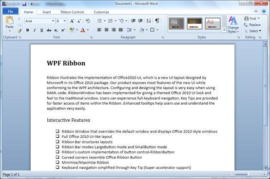
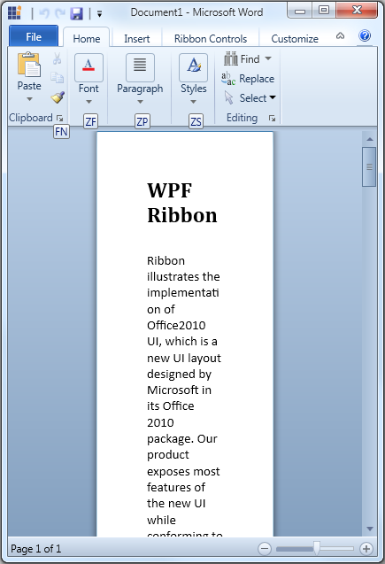
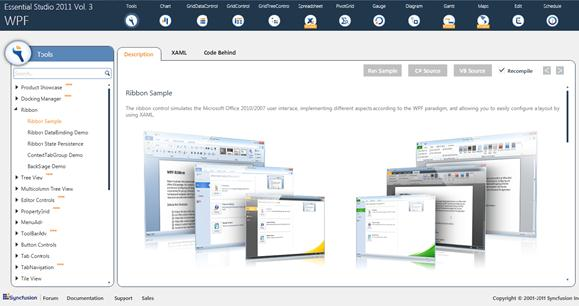

::: {style="DISPLAY: none"}
{#d2h_url_template}{#d2h_package_url style="WIDTH: 0px; DISPLAY: none; HEIGHT: 0px"}
:::

::: {.d2h_secondary_topic style="PADDING-BOTTOM: 10pt; MARGIN: 0pt; PADDING-LEFT: 0pt; PADDING-RIGHT: 0pt; PADDING-TOP: 0pt"}
#### KeyTip for Collapsed Ribbon bars {#keytip-for-collapsed-ribbon-bars style="tab-stops: 0pt"}

 

Ribbon control provides KeyTip support that will help to display key tips when you press the Alt key. However, the key tips will not be displayed when the ribbon bars are in a collapsed state. Only one keytip will be displayed for each ribbon bar and the expansion of which will display the entire set of keytip for that particular ribbon bar.

 

To display KeyTip for Collapsed Ribbon Bars

The KeyTips are displayed for the Collapsed RibbonBar.

 

+-------------------------------------------------------------------------------------------------------------------------------------------------------------------------------------------------------------------------------------------------------------------------------------------------------------------------------------------------------------------------------------------------------------------------------------------------------------------------------------------------+
| [\<]{style="FONT-FAMILY: 'Courier New'; COLOR: blue"}[syncfusion]{style="FONT-FAMILY: 'Courier New'; COLOR: #a31515"}[:]{style="FONT-FAMILY: 'Courier New'; COLOR: blue"}[RibbonBar]{style="FONT-FAMILY: 'Courier New'; COLOR: #a31515"}[ KeyTipOnCollapsed]{style="FONT-FAMILY: 'Courier New'; COLOR: red"}[=\"FS\"]{style="FONT-FAMILY: 'Courier New'; COLOR: blue"}[ Header]{style="FONT-FAMILY: 'Courier New'; COLOR: red"}[=\"Font\"\>]{style="FONT-FAMILY: 'Courier New'; COLOR: blue"}[\ |
| [                                                                             ]{style="COLOR: #a31515"}[\<]{style="COLOR: blue"}[syncfusion]{style="COLOR: #a31515"}[:]{style="COLOR: blue"}[RibbonButton]{style="COLOR: #a31515"}[ ]{style="COLOR: red"}[ /\>]{style="COLOR: blue"}[                  ]{style="COLOR: #a31515"}]{style="FONT-FAMILY: 'Courier New'"}                                                                                                                           |
|                                                                                                                                                                                                                                                                                                                                                                                                                                                                                                 |
| []{style="FONT-FAMILY: 'Courier New'; COLOR: #a31515"}                                                                                                                                                                                                                                                                                                                                                                                                                                          |
|                                                                                                                                                                                                                                                                                                                                                                                                                                                                                                 |
| [\<]{style="FONT-FAMILY: 'Courier New'; COLOR: #a31515"}[/]{style="FONT-FAMILY: 'Courier New'; COLOR: blue"}[syncfusion]{style="FONT-FAMILY: 'Courier New'; COLOR: #a31515"}[:]{style="FONT-FAMILY: 'Courier New'; COLOR: blue"}[RibbonBar]{style="FONT-FAMILY: 'Courier New'; COLOR: #a31515"}[\>]{style="FONT-FAMILY: 'Courier New'; COLOR: blue"}                                                                                                                                            |
|                                                                                                                                                                                                                                                                                                                                                                                                                                                                                                 |
| []{style="FONT-FAMILY: 'Courier New'"}                                                                                                                                                                                                                                                                                                                                                                                                                                                          |
+-------------------------------------------------------------------------------------------------------------------------------------------------------------------------------------------------------------------------------------------------------------------------------------------------------------------------------------------------------------------------------------------------------------------------------------------------------------------------------------------------+

 

[]{style="FONT-FAMILY: Consolas; COLOR: blue"} 

[]{style="FONT-FAMILY: Consolas"} 

{border="0"}

Figure 873: [Ribbonbar Before Collapsed]{style="COLOR: black"}

 

 

 

{border="0"}

Figure 874: RibbonBar after Collapsed State

 

Samples Link

To view samples:

1.   Click **Start**\--\>**All Programs**\--\>**Syncfusion**\--\>**Essential Studio** \<version number\> \--\>**Dashboard**. (Refer section 2.2)

2.    In the Dashboard window, click Run Locally Installed Samples for WPF under User Interface Edition panel.

 

 

{border="0"}

The WPF Sample Browser window is displayed.

 

Properties, Methods and Events tables

Properties

  --------------------------------------------- ---------------------------------------------------------------------------------------------- --------------------------------------- ----------- -----------------
  Property                                      Description                                                                                    Type                                    Data Type   Reference links
  KeyTipOnCollapsed[]{style="COLOR: #c00000"}   It will display the customized string in the collapsed RibbonBars.[]{style="COLOR: #c00000"}   Dependency []{style="COLOR: #c00000"}   String      NA
  --------------------------------------------- ---------------------------------------------------------------------------------------------- --------------------------------------- ----------- -----------------

 

***[]{style="FONT-FAMILY: 'Trebuchet MS','sans-serif'; COLOR: #15428b; FONT-SIZE: 9pt"}*** 

[]{#related-topics}
:::
