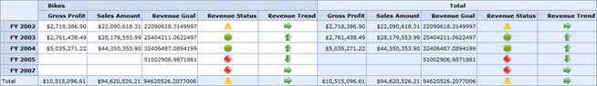

::: {style="DISPLAY: none"}
{#d2h_url_template}{#d2h_package_url style="WIDTH: 0px; DISPLAY: none; HEIGHT: 0px"}
:::

::::: {#nsbanner .d2h_main_nsbanner style="BORDER-BOTTOM: #999999 1px solid; POSITION: relative; PADDING-BOTTOM: 0px; BACKGROUND-COLOR: transparent; PADDING-LEFT: 0px; PADDING-RIGHT: 0px; DISPLAY: none; BORDER-TOP: #999999 1px solid; PADDING-TOP: 0px; LEFT: 0px"}
:::: {#TitleRow .d2h_main_titlerow style="PADDING-BOTTOM: 4px; BACKGROUND-COLOR: transparent; PADDING-LEFT: 22px; WIDTH: 100%; PADDING-RIGHT: 10px; DISPLAY: none; PADDING-TOP: 4px"}
::: {#ienav .d2h_main_ienav style="DISPLAY: none"}
{#D2HPrevious .D2HPreviousEnabled}  {#D2HNext .D2HNextEnabled}
:::
::::
:::::

:::: {#nstext .d2h_main_nstext style="PADDING-BOTTOM: 10px; BACKGROUND-COLOR: transparent; PADDING-LEFT: 22px; PADDING-RIGHT: 10px; HEIGHT: 100%; OVERFLOW: auto; PADDING-TOP: 5px" hasuserbackground="true" valign="bottom"}
### KPI {#kpi style="tab-stops: 0pt"}

Definition

Key Performance Indicators are a collection of calculations that are associated with a measure group in a cube that are used to evaluate business success. Typically, these calculations are a combination of Multidimensional Expressions (MDX) expressions or calculated members. KPIs also have additional metadata that provides information about how grid applications should display the results of the KPI\'s calculations.

KPI Indicators

The different types of indicators are as follows:

[·      ]{style="FONT-FAMILY: Symbol"}KPI Goal

[·      ]{style="FONT-FAMILY: Symbol"}KPI Status

[·      ]{style="FONT-FAMILY: Symbol"}KPI Trend

[·      ]{style="FONT-FAMILY: Symbol"}KPI Value

 

[[Click here for Sample KPI Report]{.UGHyperlink}](http://help.syncfusion.com/UG/Business%20Intelligence/OLAP%20Common/Common/default.htm#!documents/434keyperformanceind.htm)[]{.UGHyperlink}

[[]{style="TEXT-DECORATION: none"}]{.UGHyperlink} 

{border="0"}

Figure 16: OLAP Grid with Key Performance Indicators

 

Table 7: KpiElements Property

::: {align="center"}
  ------------------------------------- ------------------------------------------------------------------------------------------------------------------------------------- ------------------------------------- -------------------------------------
  Property                              Description                                                                                                                           Type                                  [Data Type]{style="COLOR: black"}
  KpiElements[]{style="COLOR: black"}   [Provides information on goal, trend, status and value of the KPI report and render the control accordingly.]{style="COLOR: black"}   [Server side]{style="COLOR: black"}   KpiElements[]{style="COLOR: black"}
  ------------------------------------- ------------------------------------------------------------------------------------------------------------------------------------- ------------------------------------- -------------------------------------
:::

 

Sample Location

A sample demo is available in the following location:

**..\\Syncfusion\\EssentialStudio\\\<VersionNumber\>\\BI\\Web\\OlapGrid.Web\\Samples\\3.5\\Application Scenario\\Key Performance Indicators Demo[]{#_Data_Source}**

[]{#related-topics}
::::
